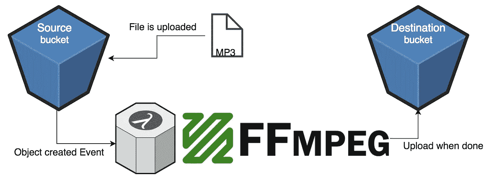

# 无服务器——超越过于简单的 todo 应用程序，进入现实世界(第 1 部分)

> 原文：<https://medium.com/hackernoon/serverless-part-1-e75b4a5e59e6>

除了为所有新技术如此方便地演示的低劣的 todo 应用程序，我想知道**的无服务器**世界真的**会是什么样子。**

**这是使用[无服务器框架](https://serverless.com/)构建真实世界示例的第 1 部分和第 3 部分中的第 1 部分**以及如何将您新的无限可扩展解决方案货币化。****

**在这一部分，我将讨论如何使用[无服务器](https://hackernoon.com/tagged/serverless)(框架)来构建一个基于桶事件的 ffmpeg 包装器。我的[开源无服务器 ffmpeg 的代码可以在这里找到](https://github.com/kvaggelakos/serverless-ffmpeg)。**

# **介绍**

****我们想要做的:**
每当一个媒体文件被上传到 s3 存储桶时，我们想要使用 ffmpeg 将它后处理成各种格式。**

****

****为什么是无服务器:** 无服务器允许我们在一个文件被添加/删除到一个桶中时触发一个函数，非常适合我们的后处理动作。我们也为我们处理的时间付费，不多也不少。最后但同样重要的是，我们可以批处理，不用担心一次上传多少文件。**

# **代码**

## **1.无服务器. yml**

**这是一个文件，它把所有的东西都捆绑在一起，如果你曾经构建过比 todo 应用更大的东西，你知道这将是一个瓶颈——确实如此。然而！您可以做一些有趣的事情来使它变得更好，比如引用另一个文件(见下面的注释)或者使用 [javascript 来生成 yml](https://serverless.com/framework/docs/providers/aws/guide/variables/#reference-variables-in-javascript-files) 的部分。**

**几个注意事项:**

1.  **如你所见，我使用了类似于:`${file(./config.yml):source_bucket}`的东西从另一个 yaml 文件中获取值。这是将 serverless.yml 的复杂性抽象化的一种方式，并专注于对部署可能很重要的几个参数。**
2.  **第 29 行，我们定义了将传递给 ffmpeg 二进制文件的参数。它们在 lambda 函数中作为 env 变量传递！(您将在接下来的章节中看到)**
3.  **第 30–60 行用于访问应用程序所需的存储桶。**
4.  **第 67 行定义了事件处理程序，有趣的是它还创建了桶**

**serverless.yml for serverless-ffmpeg**

## **2.webpack 配置**

**我们需要 webpack 很好地捆绑我们的 javascript，并使用 es6/7 特性来编写一些现代的 JS(而不是绑定到 lambda 允许我们使用的节点 6.10)。让我们看一下 webpack config + babelrc 文件来实现这一点。**

1.  **在第 8 行，我们使用`slsw.lib.entries`来根据我们在无服务器中的函数自动生成条目。感谢无服务器 webpack 库的智能。**
2.  **在第 23–24 行，我们复制了将在我们的应用程序中使用的二进制文件。我们在这里这样做的原因是因为我们需要二进制文件具有可执行权限(+x)。**

## **3.处理程序代码**

**这就是无服务器的起点！正如我们在`serverless.yml`中所指定的，我们想要一个名为`main`的函数从我们的`handler.js`文件中运行，只要在我们的源桶中有一个对象创建事件。**

1.  **第 7 行调用一个函数来提取新上传的文件在 source bucket 中的位置。**
2.  **多亏了我们漂亮的 webpack 配置，我们现在可以使用 await/async，这就是我们在将最近上传的文件从源桶下载到 lambda 进程时所做的。**
3.  **第 14 行我们运行 ffmpeg 函数，依次调用二进制文件(见下一节)。**
4.  **第 15 行我们将结果上传到目标桶中。**
5.  **第 23 行展示了我们如何使用预定义的参数作为环境变量。**

## **4.ffmpeg 应用程序代码**

**让我们来看看应用程序代码中一些有趣的部分，看看这些是如何联系在一起的。**

1.  **第 4 行确保我们的 lambda 根在路径 env 变量中，这样我们就可以用直接位于项目根中的`spawn`调用二进制文件！**
2.  **第 21 行我们正在合并传递给 ffmpeg 进程的参数。**
3.  **第 29 行我们用我们的参数调用 spawn 并连接一些事件处理程序**
4.  **第 34–35 行我们确保捕获 stdout 和 stderr，如果没有它们，我们真的不知道会发生什么，如果有什么出错的话。**

## **4.当然是单元测试！**

**作为任何真实应用程序的一部分，单元测试都很重要。但是我们如何测试无服务器功能呢？我们可以对它们的一部分进行单元测试！但是我们如何对调用二进制代码做事情进行单元测试呢？我们设置了测试基础设施来支持这一点！**

**为了实现这一目标，我们需要 [ava](https://github.com/avajs/ava) (ava 太棒了！)，它可以让我们快速入门一个极简的配置(如何正确配置见这个 [package.json](https://github.com/kvaggelakos/serverless-ffmpeg/blob/master/package.json#L43) )。**

1.  **导入 ava 和一些助手处理文件。**
2.  **第 8 行运行我们的 ffprobe 函数，该函数返回一个 json 结果([参见它的代码以了解如何](https://github.com/kvaggelakos/serverless-ffmpeg/blob/master/src/ffmpeg.js#L9))**
3.  **第 16 行对一个测试文件运行 ffmpeg，并期望一个文件在测试结束时存在**
4.  **第 26 行测试后清理**

## **部署**

**无服务器的一大优点是部署和拆卸非常容易。由于无服务器框架在云模板中完成所有工作，因此既快速又简单。不再问“我在哪里运行了什么命令”。**

**为了部署整个堆栈，我们运行:`sls deploy -v`。这将显示 cloudformation 状态的输出，以便我们可以确保所有资源都是按照它们应该的方式创建的。**

**就是这样！**

## **结果呢**

**你可以看看这个小视频，看看它最终是如何工作的。**

** [## 无服务器-ffmpeg

### 由 kvaggelakos 录制

asciinema.org](https://asciinema.org/a/154418) 

## 结论

我希望您喜欢这个快速深入了解无服务器和真实世界的例子！在接下来的部分中，我们将会看到更多有趣的真实世界场景，以及如何将它们货币化，所以不要走开！

**我们在这部分遇到的几个现实生活中的问题:**

1.  我们希望添加 webpack，让我们的时间物有所值
2.  我们需要使用一个 webpack 插件，并保持这个二进制文件的权限，以实际工作(连同无服务器框架)
3.  如果我们将事件附加到一个桶上，就会创建一个桶！我知道这看起来很随意。但规则不是我定的。

在接下来的部分，我将揭示更多的生活场景和解决的问题。

如果你有任何问题或意见，请在这里发表，我会尽力帮助你。

# 附录

## [无服务器插件](https://github.com/serverless/plugins)——找到它们，使用它们

当我开始的时候，有一件事对我来说并不明显，那就是插件对于无服务器框架有多重要。我们将在这一部分使用的两个插件是(更多插件在第 2 部分和第 3 部分):

[**server less-web pack**](https://github.com/serverless-heaven/serverless-webpack)因为截至今日 [aws](https://hackernoon.com/tagged/aws) lambda 支持 node 6.10，不完全支持 es6。我们想要那种花哨的 es6/7 和其他一些不错的包装功能。

[**server less-S3-remover**](https://github.com/sinofseven/serverless-s3-remover)您会很快意识到，在测试过程中，您会多次使用无服务器框架部署和拆除堆栈。如果您正在使用存储桶，这可以帮助我们在销毁堆栈时删除存储桶和其中的内容。(**警告:你会对这个**失去满足感)**