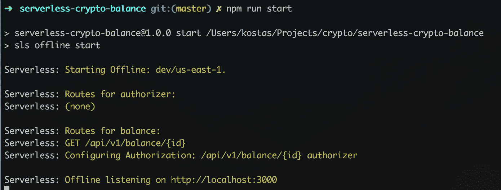

# 无服务器——构建一个加密钱包余额 API 以用于 google 电子表格(第 2 部分)

> 原文：<https://medium.com/hackernoon/serverless-part-2-61ad3986371f>

在本系列的这一部分中，我们将构建一个[无服务器](https://hackernoon.com/tagged/serverless) API 端点来服务于我们的 [google](https://hackernoon.com/tagged/google) 电子表格来跟踪加密钱包！你可以在这里找到回购

如果你错过了我的无服务器系列的其他帖子:
**第 1 部分** : [超越过于简单的 todo 应用程序，进入现实世界](https://hackernoon.com/serverless-part-1-e75b4a5e59e6)(构建一个无服务器函数，在文件上传到 bucket 时运行 FFMPEG)
**第 2 部分:**本文

# 介绍

**我们想做的:** 每当我们打开谷歌电子表格时，我们都希望它能实时查看我们的钱包，看看我们的余额。

结果将如下所示:

**为什么无服务器:** 在这种情况下，我们可以使用无服务器来快速部署一个可扩展的 API，为各种钱包运行任意数量的查找。此外，我们只在浏览电子表格时才调用端点，所以不必为电子表格关闭的那些日子付费是件好事。

# 代码

幸运的是，这不像第 1 部分那么高级。我知道我承诺过超越简单化的 todo 应用，但我认为这是一个有效的无服务器用例，简单、小巧，但非常强大。

## 1.无服务器. yml

这是一个非常简单的无服务器配置，我们有一个处理器，它将是一个提供平衡的处理器。正如您在 http 路径中看到的，我们接受一个参数`id`，它将是钱包地址。

需要注意的一点是(正如我们在第 1 部分中看到的)，这个插件允许我们在部署之前在本地运行。我们在这里介绍的另一件事是这个 lambda 的**授权者的概念。我们不希望任何人滥用我们的系统！我们还定义了用户名和密码 env 变量，以便在部署后进行检查。**

旁注:无服务器框架的类型`request`允许我们检查正常的`basic auth`。你可以在这里阅读更多关于[不同授权人类型的信息](https://serverless.com/framework/docs/providers/aws/events/apigateway/#http-endpoints-with-custom-authorizers)。

## 2.汉德勒·⚡⚡

在我认真尝试不重新发明轮子的过程中，我找到了 [crypto-balances](https://github.com/litvintech/crypto-balances) 一个节点模块来查询各种加密后端/节点，以找出一个地址的平衡！太好了！

对于那些对其工作原理感兴趣的人，请查看其源代码。真正让我感兴趣的一段代码是我们如何传入任何地址，以及它如何计算出查询哪个服务/节点来获得平衡。现在我很快意识到这个模块已经 2 年没有更新了，因为我们已经有了叉子等等，这有点搞砸了这个自动检测！(总有进步的空间)。

您还会注意到，我们从未在这段代码中添加任何用于检查 auth 的内容，这个决定是由 API 网关为您做出的，这是一个非常好的分离。

正如你在下面看到的，我们只是简单地将`crypto-balances`调用的结果包装成一个无服务器喜欢的响应，然后就可以开始了🚀

在本地运行它应该如下所示:

这篇来自 news.bitcoin.com 的文章声称 ETH 起源地址(0x00…0)有超过 7k 的 ETH。让我们看看我们是否能证实这一点！

我们的 api 管用！此外，我们已经确认了索赔。genesis 地址确实有超过 7k ETH:)需要注意的一点是，在这种情况下，我们的依赖项选择使用[http://API . ethers can . io](http://api.etherscan.io)来查找余额，这将因我们试图查找的钱包地址而异。

## 3.作家（author 的简写）

好了，现在我们有了一个奇特的 api。酷，但是如果我们想保护它呢？也许我们不想让别人给我们可怜的小拉姆达发垃圾邮件！

如果你仔细检查上面的截图，你会看到为了通过 auth，curl 有一个`--user test:test`参数。如果我们传递了错误的信息，看起来会是这样:

我们得到了一个美好的 401 回来！那么如何才能做到这一点呢？让我们深入研究授权代码！

我们之前在`serverless.yml`中定义了一个授权器，这使得我们的 API 网关在允许任何人访问我们的 lambda 之前运行我们的授权器。

在第 9 行，我们基于环境变量(在`serverless.yml)`中再次定义)构造了基本的 auth 字符串

在第 11 行，我们将`authString`与调用者在头中传递的内容进行匹配。如果匹配，我们返回一个精心制作的策略文档，包括动作(调用 lambda)和效果“allow”。

如果不匹配，我们抛出一个 401。

## 4.部署

让我们在继续之前部署它，这样我们就可以在我们的 google 电子表格脚本中使用它。

使用无服务器框架，我们需要做的就是运行:`sls deploy -v` 确保它正常工作:

## 5.谷歌电子表格代码

一旦我们部署了无服务器，就该让从我们的表单中查询它变得简单了。

下面是完整的电子表格代码，我们需要粘贴到我们的谷歌电子表格脚本编辑器。

要添加脚本，请打开脚本编辑器，如下图所示:

然后粘贴进去保存！

## 结论

我希望你喜欢这个系列的**第 2 部分**中超越表面的无服务器部分！

**这部分遇到的几个现实生活中的问题:**

1.  我们学习了如何在无服务器中使用**授权器。我们传入一个基本的 auth 头，并通过处理环境变量将它与计算出的字符串进行匹配。**
2.  我们还看了如何将一个电子表格与我们的无服务器功能连接起来，以实际使用它来做一些有趣的事情。

感谢阅读！请用掌声和星星来传播❤！