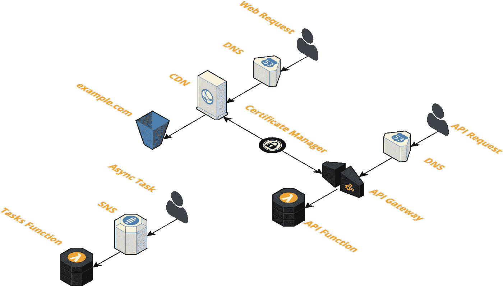
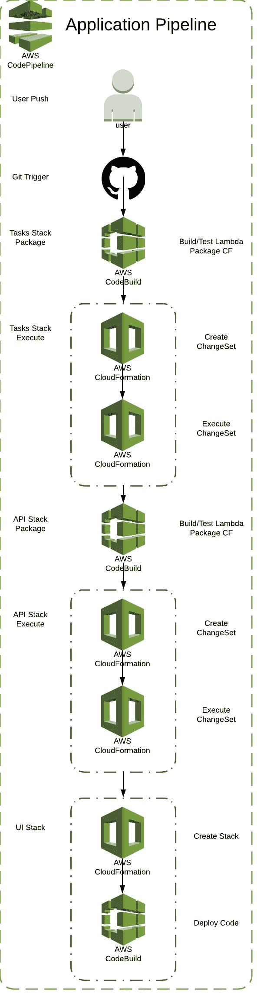

# 无服务器堆栈— CI/CD —蓝绿色部署

> 原文：<https://medium.com/hackernoon/serverless-stack-ci-cd-blue-green-deployments-a6de63142094>

## 查看这款内置 CI/CD 和蓝绿色部署的无服务器堆栈

我喜欢构建 CloudFormation 堆栈，我知道这很疯狂…我也喜欢无服务器的事件驱动架构，谁不喜欢呢…

我想创建一个可重用的堆栈，可以轻松地用来构建 web 应用程序。

堆栈由一个 **API** 、 **UI** 和**异步任务**组成。这不是最酷的部分。

酷的部分是通过代码管道和 Lambda 的蓝绿色部署的内置 CI/CD。

CI/CD 和蓝绿色部署对于应用程序的稳定性和健康非常重要。经常交付和快速失败是很重要的。

# 密码

密码。检查它，运行它，并让我知道你的想法…

[](https://github.com/thestackshack/serverless-stack-cicd) [## 堆栈/无服务器堆栈-cicd

### 无服务器堆栈-cicd -带 CI/CD 和蓝绿色部署的无服务器堆栈- API +静态 UI +异步任务

github.com](https://github.com/thestackshack/serverless-stack-cicd) 

# 体系结构

在讨论 CI/CD 和蓝绿部署之前，让我们先看一下体系结构。



# CI/CD

当您将代码或基础结构更改推送到该应用程序时，CodePipeline 会构建并更新所有内容。您的基础架构堆栈已更新。您的代码被构建、测试和部署。

你可以做出改变，并且整天都在努力。发展将是快速和可预测的。快乐的日子。

哦，还有一个**沙盒**和一个**生产**环境，所以你可以在把它们推向生产之前在沙盒中测试你的改变。在与您的团队一起生活之前，能够在沙盒环境中测试变更是一件好事。

下面是管道的样子:



让我们仔细看看每个管道阶段和行动。管道由多个阶段组成。每个阶段都由行动组成。

你如何组织你的阶段和行动取决于两件事。您希望处理阶段和操作的顺序，以及阶段输入和输出依赖关系。

阶段可以串联或并联或串联和并联组织。这是由阶段输入和输出工件定义的。

动作也可以以串行或并行方式组织，或者以串行和并行方式组织。这是由 action `order`属性以及输入和输出工件定义的。

如果每个阶段的输入工件是前一阶段的输出工件，那么它们将是串联的。如果一个阶段的输入工件是前几个阶段的输出工件，并且这些前几个阶段互不依赖，那么这些前几个阶段将是并行的。

关于 CodePipeline 已经说得够多了，让我们了解一下我们的管道:

## 源阶段— GitHub 推送

每次 GitHub 推送都会触发源阶段。

```
- **Name:** Source
  **Actions:** - **Name:** CloneRepository
      **ActionTypeId:
        Category:** Source
        **Owner:** ThirdParty
        **Version:** 1
        **Provider:** GitHub
      **OutputArtifacts:** - **Name:** GitSource
      **Configuration:
        Owner:** !Ref GitHubOwner
        **Branch:** 'master'
        **Repo:** !Ref GitHubRepo
        **OAuthToken:** !Ref GitHubToken
      **RunOrder:** 1
```

`prod`管道使用`master` GitHub 分支，`sandbox`管道使用`develop` GitHub 分支。

## 任务包阶段

这个阶段使用 CodeBuild 来构建和测试 Lambda，然后**打包**cloud formation 模板。

```
- **Name:** TasksPackage
  **Actions:** - **Name:** Package
      **ActionTypeId:
        Category:** Build
        **Owner:** AWS
        **Provider:** CodeBuild
        **Version:** 1
      **Configuration:
        ProjectName:** !Ref TasksCodeBuildProd
      **InputArtifacts:** - **Name:** GitSource
      **OutputArtifacts:** - **Name:** TasksOutput
      **RunOrder:** 1
```

CloudFormation 模板中的 Lambda 使用了一个相对的`CodeUri`属性。当使用`CodeUri`属性时，您必须使用 CloudFormation 包(`aws cloudformation package`)。CloudFormation 包做两件事。首先，它将位于`CodeUri`位置的 Lambda 作为 zip 文件上传到 S3，然后它导出模板，将`CodeUri`替换为 S3 的 zip 文件位置。

这是完整的代码构建`buildspec.yml`。

```
**version:** 0.2
**phases:
  install:
    commands:
  pre_build:
    commands:** - echo Installing source NPM dependencies...
      - cd ./stacks/tasks && npm install
  **build:
    commands:** - echo Testing the code
      - npm test
      - echo Removing dev dependencies
      - rm -Rf node_modules
      - npm install --production
  **post_build:
    commands:** - aws cloudformation package --template-file tasks.stack.yml --s3-bucket ${Bucket} --output-template-file tasks.stack.output.yml
**artifacts:
  base-directory:** 'stacks/tasks'
  **type:** zip
  **files:** - tasks.stack.output.yml
```

该代码构建导出打包的 CloudFormation 模板。这将在下一阶段使用。

## 任务堆栈阶段

这个阶段改变(创建/更新)任务堆栈。

```
- **Name:** TasksStack
  **Actions:** - **Name:** CreateChangeSet
      **InputArtifacts:** - **Name:** TasksOutput
      **ActionTypeId:
        Category:** Deploy
        **Owner:** AWS
        **Version:** 1
        **Provider:** CloudFormation
      **Configuration:
        TemplatePath:** "TasksOutput::tasks.stack.output.yml"
        **ActionMode:** CHANGE_SET_REPLACE
        **Capabilities:** CAPABILITY_NAMED_IAM
        **RoleArn:** !GetAtt CloudFormationRole.Arn
        **StackName:** !Sub "${AWS::StackName}-tasks-prod"
        **ChangeSetName:** !Sub "${AWS::StackName}-tasks-prod-cs"
      **RunOrder:** 1
    - **Name:** ExecuteChangeSet
      **InputArtifacts:** - **Name:** TasksOutput
      **ActionTypeId:
        Category:** Deploy
        **Owner:** AWS
        **Version:** 1
        **Provider:** CloudFormation
      **Configuration:
        ActionMode:** CHANGE_SET_EXECUTE
        **Capabilities:** CAPABILITY_NAMED_IAM
        **RoleArn:** !GetAtt CloudFormationRole.Arn
        **StackName:** !Sub "${AWS::StackName}-tasks-prod"
        **ChangeSetName:** !Sub "${AWS::StackName}-tasks-prod-cs"
      **RunOrder:** 2
```

这个舞台有两个动作。

第一个操作创建 CloudFormation 变更集。您可以看到输入工件是任务包阶段的输出工件。看一下`TemplatePath`，它来自 CodeBuild 包命令。

第二个动作执行变更堆栈的 CloudFormation 变更集。

## API 包和 API 堆栈阶段

这些阶段与任务阶段完全相同。他们打包 Lambda & CloudFormation 模板，然后创建 CloudFormation 变更集，最后变更该变更集。

## UI 堆栈阶段

UI 堆栈阶段以相反的顺序做事情。而不是构建、测试和上传代码，然后改变堆栈。它改变堆栈，然后构建、测试和上传代码。

```
- **Name:** UI
  **Actions:** - **Name:** Stack
      **InputArtifacts:** - **Name:** GitSource
      **ActionTypeId:
        Category:** Deploy
        **Owner:** AWS
        **Version:** 1
        **Provider:** CloudFormation
      **Configuration:
        TemplatePath:** "GitSource::stacks/ui/ui.stack.yml"
        **ActionMode:** CREATE_UPDATE
        **Capabilities:** CAPABILITY_NAMED_IAM
        **RoleArn:** !GetAtt CloudFormationRole.Arn
        **StackName:** !Sub "${AWS::StackName}-ui-prod"
        **ParameterOverrides:** !Sub |
          {
            "Domain": "${Domain}",
            "TLD" : "${TLD}"
          }
      **RunOrder:** 1
    - **Name:** Deploy
      **ActionTypeId:
        Category:** Build
        **Owner:** AWS
        **Provider:** CodeBuild
        **Version:** 1
      **Configuration:
        ProjectName:** !Ref UICodeBuildProd
      **InputArtifacts:** - **Name:** GitSource
      **RunOrder:** 2
```

第一个操作改变了 CloudFormation 堆栈，并创建了我们在下一个操作中需要的 S3 桶。

第二个动作执行将代码上传到 S3 桶的代码构建，从而部署静态网站。

下面是代码构建`buildspec.yml`。

```
**version:** 0.1
**phases:
  install:
    commands:
  pre_build:
    commands:
  build:
    commands:** - aws s3 sync stacks/ui/www "s3://$(aws cloudformation describe-stacks --stack-name ${StackName} --query "Stacks[0].Outputs[0].OutputValue" --output text)" --acl bucket-owner-full-control --acl public-read --delete --cache-control "max-age=1" --exclude stacks/ui/www/assets
      - aws s3 sync stacks/ui/www/assets "s3://$(aws cloudformation describe-stacks --stack-name ${StackName} --query "Stacks[0].Outputs[0].OutputValue" --output text)/assets" --acl bucket-owner-full-control --acl public-read --delete --cache-control "max-age=31536000"
  **post_build:
    commands:**
```

这很有意思。我们通过从堆栈中获取输出参数来获得上一步中的 S3 存储桶名称。以下是命令:

```
$(
  aws cloudformation describe-stacks 
    --stack-name ${StackName} 
    --query "Stacks[0].Outputs[0].OutputValue" 
    --output text
)
```

就是这样。这就是管道为我们的基础设施和代码执行 CI/CD 的方式。

现在让我们来看看蓝绿色的部署。

# 蓝绿色部署

在我们的 api CloudFormation 模板中，我们有一个 Lambda。

```
**LambdaFunction:
  Type:** AWS::Serverless::Function
  **Properties:
    Handler:** index.handler
    **Timeout:** 5
    **Role:** !GetAtt IamRoleLambdaExecution.Arn
    **CodeUri:** ./
    **Runtime:** nodejs6.10
    **AutoPublishAlias:** live
    **DeploymentPreference:
      Type:** Canary10Percent5Minutes
      **Alarms:** - !Ref 5xxAlarm
        - !Ref 4xxAlarm
        - !Ref LatencyAlarm
    **Environment:
      Variables:
        TasksSnsTopic:
          Fn::ImportValue:** !Sub "${TasksStack}-SNSTopic"
```

这个 Lambda 使用了[无服务器应用模型](https://github.com/awslabs/serverless-application-model) (SAM)，这是一个 CloudFormation 转换器。

当在 CloudFormation 模板中使用 SAM 类型时，您需要添加转换定义。`**Transform**: AWS::Serverless-2016–10–31`。

我不知道为什么山姆会存在。为什么 CloudFormation 没有扩展到包括这些新的 SAM 特性？我在哪里读到过萨姆不那么啰嗦。这是唯一的原因吗？如果是这样，那也不能弥补山姆带来的分裂和混乱。只是我的 2 美分…

看一下`DeploymentPreference`属性。这就是我们定义[安全交通转移](https://github.com/awslabs/serverless-application-model/blob/master/docs/safe_lambda_deployments.rst)的地方。

我们使用`Canary10Percent5Minutes`,它将 10%的流量路由到新的 Lambda，然后等待 5 分钟，如果一切正常(没有警报响起),剩余的流量将被路由，部署完成。有 3 种类型的流量转换。

*   **linearxpercentyments**:新版本的流量将每隔 Y 分钟线性增加 X 个百分点。例:`Linear10PercentEvery10Minutes`每 10 分钟增加 10%的流量，在 100 分钟内完成。
*   **canaryx percenty minutes**:X %的流量将被路由到新版本一次，在此状态下等待 Y 分钟，然后将 100%的流量发送到新版本。有人称之为蓝/绿部署。例如:`Canary10Percent15Minutes`将向新版本发送 10%的流量，15 分钟后通过向新版本发送所有流量来完成部署。
*   **AllAtOnce** :这是将 100%的流量即时转移到新版本。如果您希望运行运行前/后挂钩，但不希望逐步部署，这将非常有用。如果你有一个管道，你可以设置 Beta/Gamma 阶段来立即部署，因为在这里部署的速度比安全更重要。

在`alarms`属性中，您可以定义 CloudWatch 警报，以便在流量转移时进行监控。如果这些警报中的任何一个响起，部署将被恢复。

```
**Alarms:** - !Ref 5xxAlarm
  - !Ref 4xxAlarm
  - !Ref LatencyAlarm
```

我们的警报基于 API 网关流量。我们是不是遇到了太多的 5xx 或 4xx 错误，还是延迟激增？如果是这样，我们的新版本有问题，我们不想部署它。

这是警报。

```
**5xxAlarm:
  Type:** AWS::CloudWatch::Alarm
  **DependsOn:** RestApi
  **Properties:
    AlarmDescription:** 5xx alarm for api gateway
    **Namespace:** 'AWS/ApiGateway'
    **MetricName:** 5XXError
    **Dimensions:** - **Name:** ApiName
        **Value:** !Ref RestApi
    **Statistic:** Sum
    **Period:** '60'
    **EvaluationPeriods:** '3'
    **Threshold:** '10'
    **ComparisonOperator:** GreaterThanOrEqualToThreshold
**4xxAlarm:
  Type:** AWS::CloudWatch::Alarm
  **DependsOn:** RestApi
  **Properties:
    AlarmDescription:** 4xx alarm for api gateway
    **Namespace:** 'AWS/ApiGateway'
    **MetricName:** 4XXError
    **Dimensions:** - **Name:** ApiName
        **Value:** !Ref RestApi
    **Statistic:** Sum
    **Period:** '60'
    **EvaluationPeriods:** '3'
    **Threshold:** '10'
    **ComparisonOperator:** GreaterThanOrEqualToThreshold
**LatencyAlarm:
  Type:** AWS::CloudWatch::Alarm
  **DependsOn:** RestApi
  **Properties:
    AlarmDescription:** latency alarm for api gateway
    **Namespace:** 'AWS/ApiGateway'
    **MetricName:** Latency
    **Dimensions:** - **Name:** ApiName
        **Value:** !Ref RestApi
    **Statistic:** Average
    **Period:** '60'
    **EvaluationPeriods:** '3'
    **Threshold:** '25000'
    **ComparisonOperator:** GreaterThanOrEqualToThreshold
```

就是这样。我希望你喜欢这篇文章，并从中获得一些有用的东西。

如果你喜欢这篇文章，请**鼓掌**。