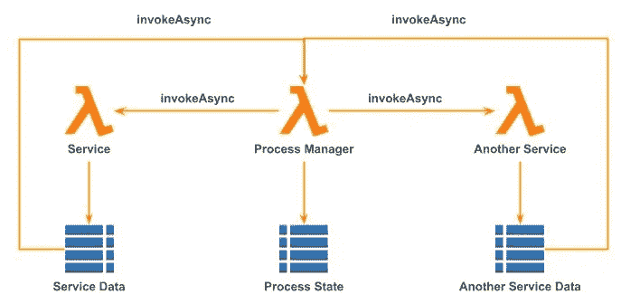

# 无服务器步骤

> 原文：<https://medium.com/hackernoon/serverless-steps-8a43eac354e1>

## 有没有更好的方式来讲述无服务器传奇？

# 搭建舞台

我之前的帖子是关于[无服务器长期运行后台任务](https://hackernoon.com/consistent-modelling-of-serverless-long-running-background-tasks-2f686c872f8c)的一致建模。在那里，展示了一个社交[网络](https://hackernoon.com/tagged/network)爬虫的如下流程模型图:

MakirOto Crawler: Process Model

在这样的体系结构中，收集关于特定 MakirOto 系统用户的数据的整个过程是由 AWS Step 函数来编排的。这种类型的功能有许多名称，例如分布式事务、工作流、Saga 或流程管理器等等。

[崔琰](https://medium.com/u/d00f1e6b06a2?source=post_page-----8a43eac354e1--------------------------------)发表了一篇非常好的[文章](https://read.acloud.guru/how-the-saga-pattern-manages-failures-with-aws-lambda-and-step-functions-bc8f7129f900)关于使用 AWS Step 函数和 AWS Lambda 实现 Saga 模式。强烈推荐阅读，以便理解这三个概念是如何结合在一起的。

然而，我的追求是寻找一种[无服务器架构语言](https://hackernoon.com/documenting-serverless-architectures-69bf63fc67b0)，在这篇文章中，我将探索一致建模[无服务器](https://hackernoon.com/tagged/serverless)传奇的可能方式。

## 缩小焦点

以下是 MakirOto 数据收集器组件的流程模型:

MakirOto Data Collector: Process Model

这个图表很好地说明了这样一个事实，即任何一致的图形符号的表达能力都是非常有限的:我们想说的越清楚，我们能够/应该说的就越少。

和前面所有的例子一样，这个图非常精确地描述了计算进程和资源之间的引用指针和访问权限。然而，它没有解释这里到底发生了什么，特别是哪些计算是并行的，哪些是顺序的。因为后者是流程模型的主要目标，所以我们有一个问题。

让我们试着理解问题从何而来，我们能做些什么。

# 有什么问题？

主要问题源于人类解释图形表示的方式。例如，通过查看下图，几乎所有人都会自动假设所有 Lambda 函数都是并行运行的:

Lambda Function — level Concurrency

因此，除了访问指针和权限之外，我们还可以直观地了解系统并发性——每个 API 端点请求都将被并行处理。

这反过来意味着所有的 Lambda 函数都需要某种形式的同步，大概是由 Neptune 图 DB 提供的。

这个图没有提到单个 Lambda 函数的内部并发性。因为我们知道 Lambda 函数遵循“每个请求一个实例”的策略，所以我们可以假设内部线程根本不存在。

甚至，如果一些 Lambda 函数调用另一个 Lambda 函数，我们将很好地理解顺序处理在哪里。到目前为止，一切顺利。

再次强调这一点很重要:这种直观的解释深深植根于人类大脑处理视觉的方式，无法轻易避免。

现在，如果我们再看一看，由一个阶跃函数编排的多个 Lambda 函数，我们有一个问题:

What runs in parallel and what sequentially?

在这里，我们不能自动说出什么并行运行，什么顺序运行。

事实上，所有的 Lambda 函数都是并行运行的，但是在某种意义上与我们直觉上的假设不同。

Service vs Resource Class vs Resource Instance

在当前的符号中，我们在服务(例如 [AWS](https://hackernoon.com/tagged/aws) Step Functions 服务)和由该服务管理的单个资源(例如特定的 Step Function)之间有一个清晰的分离。然而，我们仍然不区分资源类和单个资源实例。UML 类图和对象图之间也存在类似的模糊性。

我们可以断言，只要关注同一个阶跃函数的所有实例，由这些阶跃函数实例调用的所有 Lambda 函数都将并行运行。通过查看上面的流程模型图，我们无法确定在阶跃函数的单个实例中会发生什么。换句话说，我们对系统中真正的并发性的理解是不完整的。

人们可以理直气壮地说，单个阶跃函数的内部并发性直接反映在它的图中。例如:

AWS Step Functions Parallelism

这并不完全错误，但是诉诸 AWS 步骤功能图打开了一个新的蠕虫罐，充满了语义一致性问题。

## 术语混乱

先说一个简单的——术语。AWS Step Functions 服务所称的“状态机”根本不是状态机，它是一个活动流，通常由 UML 活动图建模。

雪上加霜的是，AWS Step Functions 服务将活动步骤称为“states ”,而它拥有的唯一真实状态被称为，猜猜看……对了—“activity”。

为什么 AWS Step Functions 架构师懒得看一下 UML 规范，而是决定引入他们自己的术语，从而搞乱了整个业务，这超出了我的理解范围。

## 有了合适的建模工具，它变得更加清晰

因此，为了理解 Step 函数的内部并发性，我们需要用 UML 活动图对它进行建模。给你:

MakirOto Data Collection Workflow

在这种情况下，所有分支都遵循相同的模式:

MakirOto Data Collection Workflow Branch Structure

现在，我们可以有把握地断言，脸书个人资料、脸书照片和 LinkedIn 个人资料是并行处理的，而在每个分支机构内部，其步骤是按顺序进行的。

抛开这是否是最佳解决方案以及什么是替代方案的问题，让我们注意到 UML 活动图属于逻辑模型而不是过程模型。

因此，为了真正理解系统并发性，我们需要查看两个模型，并在头脑中协调它们。经过一点训练，这并不难做到。主要问题是从业人员缺乏认识。

## 阶跃函数对传奇好吗？

回到用 AWS 步骤函数实现分布式事务。正如我最近在 2018 年 Pycon IL 上的演讲中所说

在作为 Lambda 函数实现的单独计算和作为 Step 函数实现的处理并发性和错误处理的编排层之间的明确分离有一定的优势。

作为我研究的一部分，我采用了一种相当极端的方法来否认所有单个 Lambda 函数的复合行为:

Extreme approach to separation between computation and orchestration

有一种观点认为，选择特定形式的并发应该由基础设施而不是开发人员来完成。也许有一天，我们会到达这个无线天堂。

我想在这篇文章的最后探讨的问题是，AWS 步骤函数和 UML 活动图是否是建模分布式事务(Sagas)的合适工具？

答案是“可惜，没有大规模”。主要问题是，虽然 AWS Step 函数可能并行运行多个分支，但各个 Lambda 函数是同步调用的，除非有人想搞乱“活动”。另一方面，真正的传奇是异步实现的，并用 UML 状态图建模。为什么？因为可伸缩性。

在一定范围内，AWS Lambda 服务是可伸缩的。一般来说，对于托管服务来说，这是不正确的。

例如，AWS Dynamo DB 对读写活动设置了限制。当超过这一限制时，就要支付罚金，要么拒绝请求，要么增加成本。完全无限的计算与其说是现实，不如说是梦想。

DynamoDB I/O 容量(非原因)可以正确测量、调整和保留。然而，这一切把我们带回到旧的 IT 世界，只不过是换了一件花哨的现代服装。特别是，这种方法不能很好地处理时间峰值。

另一方面，如果 Lambda 函数被异步调用，这些峰值可以被 Lambda 函数收件箱内部队列拉平。这反过来将允许降低预留容量水平。但是，为了继续进行，Saga 需要在特定操作完成时获取一个事件。换句话说，它必须表现得像一个真正的状态机。

例如，著名的旅行预订传奇可以建模如下:

Travel Booking State Machine (for illustration purposes only)

这是一个过于简单化的犯罪模型，只是为了说明这一点。真实的状态转换模型要复杂得多。但是，即使在这种过于简化的水平上，我们也可以发现一些重要的差异:

*   在本地执行的本地操作和异步发送给外部服务的消息之间有明确的区分
*   由事件触发的状态和转换，作为基本构件

# 评估备选方案

具有讽刺意味的是，虽然[无服务器](https://hackernoon.com/tagged/serverless)架构宣称自己是事件驱动的，但目前还没有好的基础设施支持事件驱动的面向状态的编程。以下是一些可用的选项:

1.  仍然使用 AWS 阶跃函数并用“活动”对每个状态建模。
2.  Lambda 函数之间的异步通信，模拟 actor 计算风格。
3.  Lambda 函数之间的异步通信以及处理来自受影响资源的事件。
4.  使用一个功能完整的事件存储库，正如事件源支持者所提倡的，并据此设计整个系统。

让我们简单分析一下最后三个选项。

## 具有演员式计算的异步 Saga 实现

该选项可以按如下方式实现:

Actor-like Serverless Computing

这里，负责实现某个特定 Saga 的流程管理器 Lambda 函数将流程状态保存在持久性存储中，比如说 Dynamo DB 表，并调用相关服务，异步传递其 ARN 和流程标识作为参数。

另一组 Lambda 函数负责实现特定的服务，比如酒店预订、机票预订等。通常，但不总是，这会导致封装一些托管服务资源，比如另一个 DynamoDB 表。当服务 Lambda 函数完成处理服务请求时，它使用函数 ARN 和作为参数获得的进程 ID 将成功/失败消息发送回进程管理器。这在概念上非常类似于典型的演员计算系统，如 Erlang 或 Akka 的工作方式。

这种做法还不错。即使引入了一些影响性能的开销，它也能很好地扩展。后者不是一个大问题——传奇很少被要求以接近实时的速度执行。还有两个更严重的问题。

首先，管理访问权限并不简单。根据定义，服务 Lambda 函数不知道调用 Sagas，因此无法提前建立相应的策略。使用命名约定和通配符会打开另一个安全漏洞。当一个新的传奇被部署时，它可以自动完成，但是有点棘手。

第二个问题是，当服务 Lambda 函数认为数据更新完成时，而不是当它真正发生时，它将发送一个成功/失败消息。在 DynamoDB 调用中增加一致性要求会损害吞吐量。这留下了资源更新仍未完成的小概率，而流程管理器会有不同的想法。

## 具有资源事件处理的异步 Saga

第二个选项如下所示:

Asynchronous Saga with Resource Event Handling

在这种情况下，流程管理器仍然异步发送服务请求，但是 Service Lambda 函数不发回任何东西。它只是处理请求，这导致相应的资源更新(例如，在 DynamoDB 表中放置一条新记录)。

此外，进程管理器 Lambda 函数监听资源更新流，并相应地在其自身的状态中反映这一点。这种方法的最大优点是，当资源更新真正发生时，它会更新 Saga 状态。然而，它也有自己的局限性。

首先，现在将特定资源中的更新与流程相关联已经不是小事了。事实上，我怎么知道哪个 Saga 正在等待 DynamodDB 记录被创建或更新呢？虽然有些惯例可以适用，但它总是临时拼凑的。

第二个问题是，流程经理现在需要了解服务的内部结构。它突然需要知道一个 DynamoDB 表正在运行，以及它拥有哪个模式。

第三个问题是，对于纯粹的计算服务，第一种机制仍然是必需的。

## 带有事件存储的异步 Saga

目前，AWS 云上没有托管事件存储服务。然而，有许多开源服务和框架，原则上可以这样打包。在不涉及选择哪一个的细节的情况下，让我们假设我们已经有了它，然后看看异步 Saga 实现会是什么样子:

Asynchronous Saga with Event Store

这种设计展示了许多微妙而本质的区别。

首先，服务 Lambda 不再更新状态资源，而是将事件发布到特定的事件流中。

第二，这个事件流具有定义良好且稳定的接口。流程经理知道这一点没有问题。

第三，流程管理器可以预先订阅这个事件流。这可能是最干净的解决方案。

一些问题仍然存在。AWS 上还没有无服务器的本地事件存储解决方案。所有可用的框架都会招致一定的妥协。

此外，事件源和命令-查询-请求分离(CQRS)是固执己见的设计模式。不是每个人都接受这些模式。最后，只有少数人真正理解这些模式，并能够正确地应用它们。

在任何情况下，拥有一个 100%事件源系统传统上被认为是一个过度工程。但是，也许，真正可歌可泣的传奇故事不能以其他方式实现。

总之，我们现在可以肯定的是，无服务器本地架构仍在出现，在这一领域需要一些实验和探索。