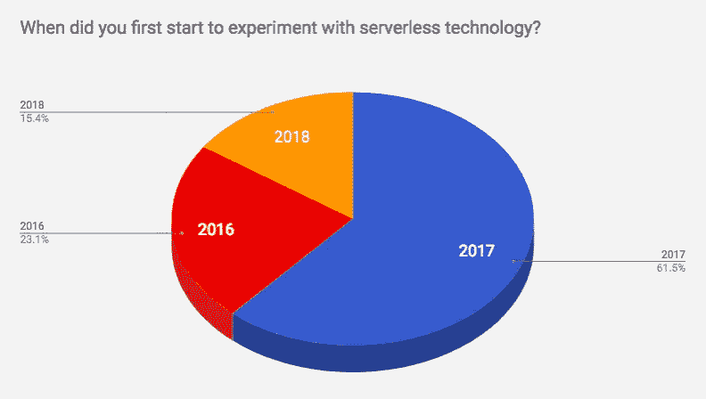
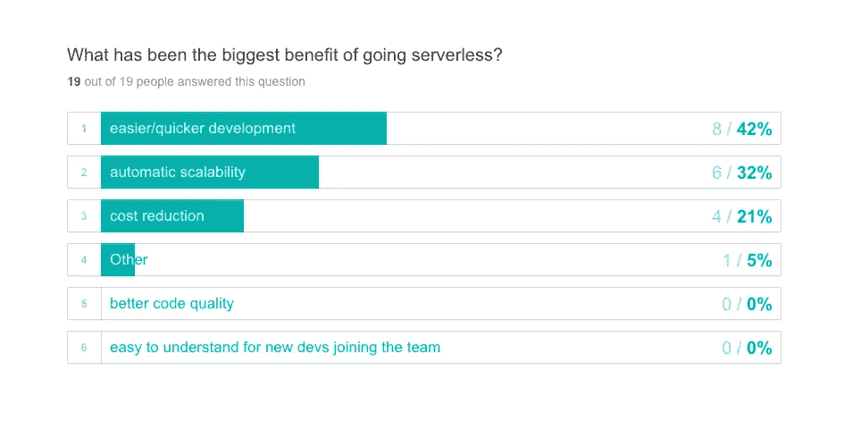
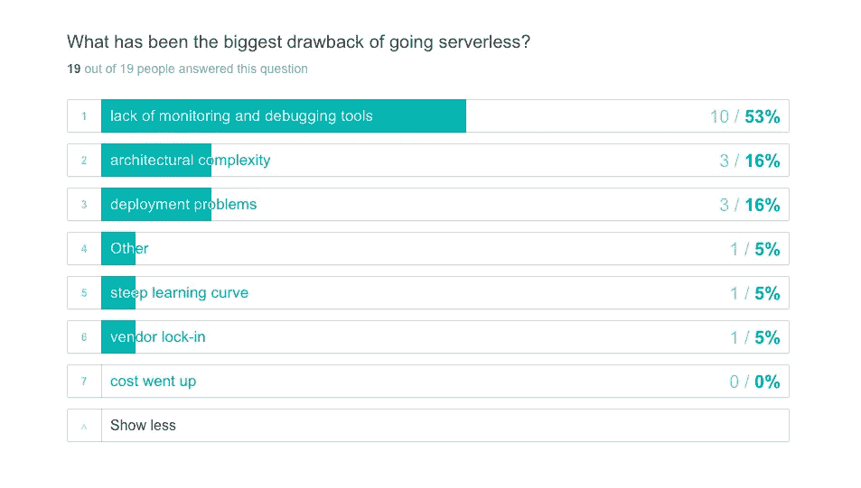

# 无服务器调查:交付速度提高 77%，每月节省 4 个开发工作日，每月 AWS 费用降低 26%

> 原文：<https://medium.com/hackernoon/serverless-survey-77-delivery-speed-4-dev-workdays-mo-saved-26-aws-monthly-bill-d99174f70663>

Photo by [Vince Fleming](https://unsplash.com/photos/FoSenMwgyr8?utm_source=unsplash&utm_medium=referral&utm_content=creditCopyText) on [Unsplash](https://unsplash.com/search/photos/programmer-conference?utm_source=unsplash&utm_medium=referral&utm_content=creditCopyText)

无服务器技术现在非常流行。它自 2014 年 [AWS Lambda](https://en.wikipedia.org/wiki/AWS_Lambda) 首次发布以来就一直存在，并且**已经像野火一样接管了软件开发世界。**但是没有太多关于无服务器技术用户及其使用案例的数据。我们决定亲自动手，了解更多情况。

我们进行了一项调查，以了解是什么让这些公司转向[无服务器](https://hackernoon.com/tagged/serverless)，他们试图用它来解决什么问题，以及他们见证的最大好处/缺点是什么。

*所有受访者都是无服务器技术的早期采用者，大多是中小型科技公司(共有 19 家公司参加)，他们都是活跃的*[***dash bird***](https://dashbird.io)*和*[*AWS*](https://hackernoon.com/tagged/aws)*Lambda 用户。*

# 到目前为止，2017 年是无服务器采用年

我们了解到，所有参与调查**的公司都在 2016 年至 2018 年期间开始尝试无服务器技术，其中大多数(61.5%)始于 2017 年。这显示了整个技术仍然是多么新，市场仍然在增长。**

> 此外，这些公司报告称，其当前堆栈中平均有 57%**(中值为 75%)** 可被视为无服务器。

# 主要优势-更快的开发、自动可伸缩性和成本降低

42%的公司认为更容易/更快的开发是主要优势。自动可扩展性(32%)和成本降低(21%)紧随其后。见下图。

一家公司报告说，对他们来说，最大的好处是 ***更容易的产能规划*。他们评论说:“我们现在可以选择运行愚蠢的、不太优化的代码，而不用担心应用服务器负担过重。”**

有趣的是，尽管**降低成本**似乎是人们谈论的主要优势，**一直在使用无服务器的公司实际上报告了其他更重要、影响更大的优势。**

> 凭借快速开发、自动可伸缩性和低成本的明显优势，我们很可能会看到下一个网飞在某个地方从另一个车库中被建造出来。

# 主要缺点-缺乏监控和调试

那么坏的方面呢？**53%的公司表示，无服务器技术的主要问题是**缺乏调试和监控工具。****

****

****部署问题和架构复杂性**(均为 16%)也被认为是无服务器的最大缺点。**

**很明显，无服务器技术需要良好的监控和调试工具，幸运的是，市场上已经有了新的[选项](https://serverless.com/blog/best-tools-serverless-observability/)。**

**有趣的是，尽管它被广泛报道为无服务器的最大缺点之一，**公司并没有将供应商锁定作为主要问题。****

# **AWS 每月账单成本降低 26%**

**虽然有一些[公司转向无服务器节省了大量(70-90 %)成本的已知案例](https://dashbird.io/blog/saving-money-switching-serverless/),但调查结果显示，平均而言，您每月的 AWS 账单预计会减少 26%(中位数为 20%)。**

****

**Photo by [Niels Steeman](https://unsplash.com/photos/9oHlADjtBTQ?utm_source=unsplash&utm_medium=referral&utm_content=creditCopyText) on [Unsplash](https://unsplash.com/search/photos/cash?utm_source=unsplash&utm_medium=referral&utm_content=creditCopyText)**

# **每月节省 4 个开发人员工作日**

**因为更快更容易的开发是无服务器的最大好处之一，我们想知道这些公司报告节省了多少“开发人员工作日”。**平均而言(也是中位数),每月节省 4 个工作日。****

**这意味着仅仅通过在无服务器技术上移动你的堆栈，你就可以每个月为你的开发者节省将近一周的时间。**

> **想象一下，当一个高绩效的开发人员每个月有 4 天额外的时间花在新项目上时，他们可以为企业增加多少额外的价值！**

**忘记 AWS 法案的减少，因为，考虑到硅谷的工资，这可能是您的企业转向无服务器时最大的潜在好处。**

# **无服务器交付速度提高 77%**

**这些公司报告称，在开始使用无服务器技术后，**平均交付速度提高了 77%** (中位数为 50%)。**

**这是一个巨大的好处，非常明显地导致**商业价值的增加和潜在的更多创新产品的推出**，因为更容易试验新的想法并在创纪录的时间内将它们推向市场。**

****

**Photo by [Noah Silliman](https://unsplash.com/photos/fxAo3DiMICI?utm_source=unsplash&utm_medium=referral&utm_content=creditCopyText) on [Unsplash](https://unsplash.com/search/photos/speed-developer?utm_source=unsplash&utm_medium=referral&utm_content=creditCopyText)**

# **额外收获:试用无服务器的用例**

**我们还想知道**促使这些公司尝试无服务器**的确切用例是什么。他们是这样说的:**

*   ***数据科学家轻松部署 API。***
*   **我们试图处理来自信号流的原始数据。**
*   **尽快构建可扩展的公共 API。**
*   **试图将一个整体 API 转移到一系列通过连接池实例连接到我们数据库的 lambdas 上。**
*   ***将 cron 作业从弹性的 Beanstalk 环境转移到 lambda 函数中(然后减少 devops 的开销)。***
*   ***构建一个基于事件的系统，具有弹性、高性能和可伸缩性。***
*   **我的博客需要一个 API。CORS 是最初的问题。**
*   ***简单的“拍摄图像、调整大小、返回客户端”工作流程。***
*   ***我们的目标是创建一家安全的云存储公司，采用按需付费的计费模式。***
*   ***开始为 Alexa 技能探索。***
*   ***尝试用自动缩放解决问题。随着使用成本的增加，这是一个很大的好处。***
*   ***以低启动成本解决上市时间问题。***

# **结论**

**我们 Dashbird 相信，无服务器技术是软件开发的下一个重大范式转变，将在未来几年带来巨大的商业利益和重大的技术进步。**

**本次调查的结果也支持这一愿景，交付速度提高了 **77%，每个月节省了 4 个开发人员工作日，AWS 每月账单减少了 26%** ，很容易理解为什么无服务器越来越受欢迎，而且这一趋势可能不会很快放缓。**

***免责声明:该调查于 2018 年 4 月进行，基于 19 家积极使用 AWS Lambda 和*[*dash bird . io*](https://dashbird.io)*进行监控和调试的公司的数据。***