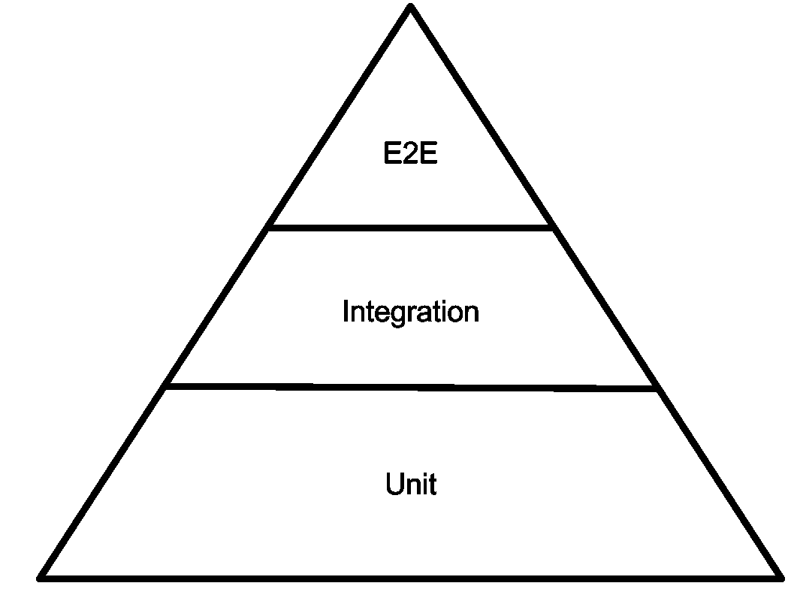
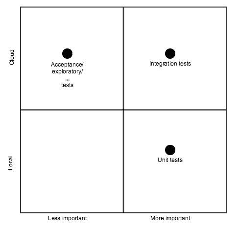

# 无服务器测试

> 原文：<https://medium.com/hackernoon/serverless-testing-from-the-trenches-790e77301c74>

## 从战壕里

# 来自战壕系列

*   战壕中的无服务器测试
*   [来自战壕的无服务器多云](https://hackernoon.com/serverless-multi-cloud-from-the-trenches-50a615ba234c)
*   [战壕中无服务器环境下的开发流程](https://hackernoon.com/development-flow-in-serverless-environment-from-the-trenches-d42021b7aef0)

# 我们需要测试

好家伙，在[无服务器](https://hackernoon.com/tagged/serverless)环境中测试是艰难的，但是在我们深入研究[技术](https://hackernoon.com/tagged/technical)细节之前，我想根据我的经验和其他人的经验(见底部的列表)快速回顾一下[无服务器](https://hackernoon.com/tagged/serverless)应用程序中的测试范例，为什么它不同，以及为什么你需要改变你对测试的想法。我们开始吧。

对于那些不熟悉的人，有一个著名的测试三角形:

This is a famous triangle

这个三角形背后的思想是，你应该把大部分精力集中在编写单元测试上，少放在集成测试上，甚至更少放在 even 手册上，等等。

当更多地转向微服务时，就会转向集成测试，但是为什么呢？答案是因为这一次大量的交互不仅发生在代码中，也发生在服务之间的配置和接口中。

无服务器是一种类固醇微服务，但与微服务不同的是，**你的代码**在你的微服务中运行，**你控制接口**；无服务器通常意味着**外包**任何与你的主要业务不直接相关的东西，从 CI、源代码管理到数据库、计算引擎到机器学习模型、数据湖等“基本”东西。当您无法控制另一端时，您的代码就有可能无法与另一端正常通信，或者另一端已经决定更改它的规则。

在微服务世界中，甚至在传统的单片世界中，您可以编写模拟程序，使您能够以高度的确定性在本地测试一切。记住你拥有代码的事实，这给了你很大的权力。但是在无服务器的世界里，模仿还不够好——这并不是因为没有官方和不太官方的模仿，比如[无服务器离线](https://www.npmjs.com/package/serverless-offline)、 [AWS SAM](https://docs.aws.amazon.com/lambda/latest/dg/test-sam-cli.html) 或 [localstack](https://github.com/localstack/localstack) 。问题是双重的:

*   你不需要模仿你将要使用的所有服务。请记住，还有其他服务提供商，如 Firebase、auth0(这个列表还可以继续下去)。
*   即使对那些有模仿的人来说，他们也永远不会支持云提供商发布的最新最棒的特性。我记得我在 S3 使用一个叫做 [POST pre-sign](https://docs.aws.amazon.com/AmazonS3/latest/dev/PresignedUrlUploadObject.html) 的特性，当我最初使用它的时候，没有 mock 为我提供接口。

对我来说，无服务器测试意味着不同的形式。

单元测试很重要——非常重要。实际上，您可能应该首先编写它们，但是在无服务器环境中，它们不是唯一重要的，因为您还需要在云环境中运行的测试和评估云环境质量的测试，这是只有集成测试才能提供的。注意这样一个事实，你的单元测试可能会比集成测试多一个数量级，但是你不能跳过集成测试。

但是事情并没有到此结束:我认为，作为一名开发人员，为了在无服务器环境中开发出优秀的代码，你必须在真实的云环境中运行和使用你的代码，而不是作为 CI 的一部分，而是常规周期的一部分。这里有另一个范式的转变:作为开发人员，我们习惯于在本地计算机上`coding → test`，但是**我相信无服务器将会推动我们在本地编码和远程测试。**

# 我们如何测试我们的服务

老实说，我打算跳过单元测试部分。我相信这个领域在其他的文章中已经被很好的覆盖了，总的来说，它和你到目前为止所做的没有什么不同。让我们转到有趣的部分，即整合。

## 我们的堆栈

为了更好地理解我们的方法，您需要知道我们使用了哪些服务。

1.  使用 Python + [Zappa](https://www.zappa.io/)
2.  AWS API GW
3.  自动气象站λ
4.  AWS S3
5.  AWS RDS
6.  [AWS ES](https://aws.amazon.com/elasticsearch-service/)
7.  [AWS 重新识别](https://aws.amazon.com/rekognition/)
8.  [Firebase 认证服务](https://firebase.google.com/docs/auth/)
9.  [Firebase Firestore](https://firebase.google.com/docs/firestore/) 作为我们的移动设备数据存储
10.  Firebase 上的各种移动相关工具，如崩溃、分析等。

事实上，我们使用两家云提供商使我们的开发变得复杂，但对我们来说，Firebase 是移动相关开发的赢家，我们更愿意努力集成它。

## 先决条件

正如我所写的，无服务器测试是思维方式的改变，每个开发人员需要在编写一行代码之前准备好这些先决条件。

*   每个开发者在云中都有自己的环境，比如 AWS 和 Firebase。
*   虽然每个开发人员都有自己的专业知识，但是我们希望每个开发人员都有能力部署和运行集成测试。他们不必部署所有的组件(系统可能很庞大)，但是至少要部署受变更影响的组件。

每个开发人员部署整个环境的能力是相当新的东西；在传统世界中，你在本地运行所有的东西，有时你不能运行所有的东西(太复杂，没有足够的计算资源。等等。)，但是在这个勇敢的新世界里，我们接受了这种能力。

这并不容易。

1.  我们创建了多个云形成文件，每个文件对应一个需要配置的组件，如网络(VPC、SG 等)、数据库、es、S3。注意，对于 Lambda 和 API GW，我们使用 Zappa 的内置功能来自行创建它们。
2.  有一个受欢迎的 wiki，开发人员可以遵循它并通过 AWS CLI 创建相关资源。
3.  Firebase 比较复杂，那里有大量的手工，主要是没有容易的 CLI 和配置工具。
4.  调配相关服务是不够的，在运行云形成后，用户必须进入每个无服务器应用并更新相关配置，如数据库凭据、子网、SG 和正确的 S3 存储桶。我们使用开发人员使用的模板，并填充相关的缺失部分。

上述过程虽然是高度自动化的，但有几个问题:

*   它非常昂贵，并且为每个开发人员提供 RDS、ES 和 NatGateway 需要花费大量资金。虽然我们能够通过在每个地方选择*微*实例来降低成本，但是每个工作环境每月仍然需要几十美元(乘以开发人员的数量，成本会变得很高)。过了一段时间，我们决定从 micro 转移到一个更好的实例类型；等待我们的测试环境是一件痛苦的事情。
*   虽然 AWS 有[组织](https://aws.amazon.com/organizations/)的支持，但是 Firebase 没有，这很容易出错，而且管理起来很麻烦。有些事情不能完全自动化，比如在 AWS 和 Firebase 上创建开发者账户(比如开发者必须手动创建)。

## 集成测试流程

现在好戏开始了。让我们快速回顾一下集成测试中的主要流程

*   安装客户端。
*   **注册。**
*   在设备上创建测试数据并**上传**进行分析。
*   使用测试数据，**运行基本 ML 算法，**并通过 Firebase 通知发送结果**通知客户端。**
*   更新设备属性，并验证客户端是否通过 Firestore 接收到内容正确的更新**。**

我在作弊

This is not a client ! by [Braydon Anderson](https://unsplash.com/@braydona?utm_source=medium&utm_medium=referral) on [Unsplash](https://unsplash.com?utm_source=medium&utm_medium=referral)

将真实的移动设备添加到我们的集成测试中会使它变得太复杂，所以我们使用了一个模拟设备:我们有调用设备应该调用的相同 API 的代码。测试一个真实的设备，有时被称为 E2E 测试(端到端)，是由开发人员在提交代码之前手工完成的。不涉及质量保证。实际上我们没有任何 QA，开发者是整个过程的完全所有者(无服务器模式转变的另一部分，但那是另一篇文章)。

我们使用 [DRF](http://www.django-rest-framework.org/) 来展示在生产环境中不可见的功能。该功能仅用于仪表目的，在生产中通过配置被严格监控和禁用。

为了验证 Firebase 是否正常运行，我们使用它的[管理 SDK](https://firebase.google.com/docs/admin/setup) 来查询相关服务。

## 运行该死的测试

在无服务器的世界中，编写测试和运行测试完全是两码事。在您的本地开发环境中，您所要做的就是单击 play，但是 AWS 没有 play 按钮:-(

That would be nice

因此，运行我们的集成测试包含两个阶段:

*   发现系统中所有的 lambda 函数，获取最新的 git 变化，并部署到 AWS。对于那些有兴趣查看部署脚本的人，可以在 [github](https://gist.github.com/efi-mk/f5d41cd302ebf5c81eca9b8e76d72ffe) 上查看。
*   通过 Zappa 部署的结果是实际的 API GW 地址；地址是给`pytest`的参数。

最后但同样重要的是，我们实际上已经创建了自己的播放按钮，万岁！有时事情会出问题，它们在集成测试中被发现，不幸的是，我们在这方面做得不够。我所说的循环在云中并不太好，对我们来说，修复一小段代码通常意味着等待 30 到 60 秒的云更新。

# **后记**

这是一个漫长而繁琐的过程。更新要花很多时间，这里在工装上确实有差距。我发现了一个有趣的解决方案，叫做[种子](https://seed.run/)。我没有尝试过，但是我们使用 python + zappa，这是不支持的。

非常欢迎您分享您在无服务器环境中测试和开发环境供应的经验。

# 文献学

*   [Yubl 的无服务器之路——第二部分，测试和 CI/CD](https://hackernoon.com/yubls-road-to-serverless-part-2-testing-and-ci-cd-72b2e583fe64)
*   [使用 Skaffold 和 LocalStack 在本地开发云应用](https://nemethgergely.com/skaffold-and-localstack-to-develop-aws-locally)
*   [测试无服务器应用的最佳方式](https://medium.freecodecamp.org/the-best-ways-to-test-your-serverless-applications-40b88d6ee31e)
*   [无服务器测试方法不同，实际上可能更容易](https://read.acloud.guru/testing-and-the-serverless-approach-495cef7495ea)
*   [无服务器最佳实践:测试-思考 FaaS 播客](https://www.trek10.com/blog/think-faas-podcast-serverless-best-practices-testing/)
*   [无服务器架构](https://martinfowler.com/articles/serverless.html#Testing)