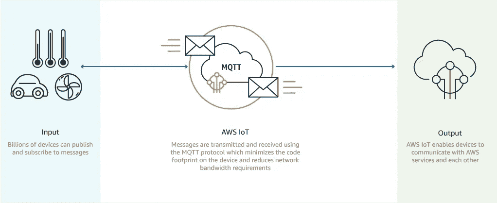

# 带 AWS Lambda 和扇出的无服务器 WebSockets

> 原文：<https://medium.com/hackernoon/serverless-websockets-with-aws-lambda-fanout-15384bd30354>

## 向无服务器后端添加实时数据推送的基础


[JVSystems](http://www.jvsystems.co.nz/?lightbox=dataItem-imvyifat)

# 无服务器

**无服务器**是开发人员世界中最常见的误称之一。与其名字相反，无服务器计算实际上使用服务器，但好处是你可以少担心*的维护、规模和配置。这是因为无服务器是一种云计算执行模型，其中云提供商动态管理机器和计算资源的分配。您基本上是将代码部署到一个没有可见进程、操作系统、服务器或虚拟机的环境中。从定价的角度来看，通常会根据实际消耗的资源量向您收费，而不是根据预先购买的容量。*

***优点***

*   *降低架构复杂性*
*   *简化的打包和部署*
*   *降低规模成本*
*   *消除对系统管理员的需求*
*   *适用于微服务架构*
*   *降低运营成本*
*   *通常通过更快的发布缩短上市时间*

***缺点***

*   *性能问题—由于通勤资源的分配方式，延迟通常会更高*
*   *供应商锁定(难以转移到新的供应商)*
*   *对于长期运行的应用程序效率不高*
*   *多租户问题，服务提供商可能在同一台服务器上为几个不同的客户运行软件*
*   *难以在本地测试功能*
*   *不同的 FaaS 实现提供了不同的登录函数的方法*

# *自动气象站λ*

*亚马逊采用 AWS Lambda 的形式来应对无服务器。AWS Lambda 让您无需供应或管理服务器即可运行代码，而您只需为实际使用付费。使用 Lambda，您可以为几乎任何类型的应用程序或后端服务运行代码——Lambda 会自动运行和扩展您的应用程序代码。此外，您可以将代码设置为从其他 AWS 服务自动触发，或者直接从任何 web 或移动应用程序调用它。*

# *Websockets*

*WebSocket 为客户机和服务器之间的消息交换提供了一个长期的连接。对于全双工通信，消息可以向任一方向流动。客户端使用 WebSocket 客户端库创建到服务器的 WebSocket 连接。WebSocket 库通常在每种语言中都可用，当然浏览器使用 WebSocket JavaScript 对象来支持它。连接协商使用类似 HTTP 的交换，成功的协商用状态代码 101 表示。发送协商响应后，连接保持打开，用于交换二进制或 unicode 字符串格式的消息帧。对等体也可以交换关闭帧来执行干净关闭。*

# *构建 AWS 物联网 Websockets*

*功能即服务后端，如 [AWS Lambda](https://aws.amazon.com/lambda/) ，并不是为自己处理长期连接而设计的。这是因为函数调用是短暂的。Lambda 旨在与 [AWS IoT](https://aws.amazon.com/iot/) 等服务集成，以处理这些类型的连接。AWS 物联网核心支持 MQTT(本机或通过 WebSockets)，这是一种轻量级通信协议，专门设计用于容忍间歇性连接。*

**

*[AWS IoT Core Site](https://aws.amazon.com/iot-core/)*

*然而，这种方法本身并不能让您访问原始的协议元素——也不能让您构建一个纯 Lambda 驱动的 API(如果这是您想要的用例的话)。如果您想要这种访问，那么您需要采取不同的方法。*

# *用扇出构建 Lambda 驱动的 WebSockets*

*你也可以通过集成像 [Fanout](https://fanout.io/) 这样的服务来构建定制的基于 Lambda 的 WebSockets，这是一种介于消息代理和反向代理之间的服务，能够为应用和 API 提供实时数据推送。有了这些服务，我们可以构建一个支持普通 WebSockets 的 Lambda 驱动的 API。*

*这种方法使用了通用实时中介协议 [GRIP](https://docs.fanout.io/docs/grip) ，使得 web 服务能够将实时推送行为委托给代理组件。*

*这个 FaaS GRIP 库使得将长期连接管理委托给 Fanout 变得很容易，这样后端功能只需要在有连接活动时被调用。另一个好处是后端功能不必在每次连接期间都运行。*

*以下逐步分解旨在作为快速配置参考。您可以检查 Github 库的[节点](https://github.com/fanout/node-faas-grip)和 [Python](https://github.com/fanout/python-faas-grip) 集成。*

## *1.初始配置*

*您将首先配置您的[扇出云](http://docs.fanout.io)域/环境，并在 [AWS API 网关](https://aws.amazon.com/api-gateway/)中设置一个 API 和资源，以使用 Lambda 代理集成指向您的 Lambda 函数。*

## *2.使用 Websockets*

*每当一个 HTTP 请求或 WebSocket 连接到您的 Fanout 云域时，您的 Lambda 函数将能够控制它。为此，Fanout 将传入的 WebSocket 连接活动转换成一系列对后端的 HTTP 请求。*

## *3.你有实时*

*你现在有了一个由 Lambda 函数驱动的实时 WebSockets！*

# *一个例子*

*这个 Node.js 代码实现了一个 WebSocket echo 服务。我建议查看完整的 [FaaS GRIP 库](https://github.com/fanout/node-faas-grip)以获得一步一步的分解，以及关于实现 [HTTP 长轮询](https://github.com/fanout/node-faas-grip#http-long-polling)和 [HTTP 流](https://github.com/fanout/node-faas-grip#http-streaming)的说明。*

```
***var** grip **=** require('grip');
**var** faas_grip **=** require('faas-grip');

exports.handler **=** **function** (event, context, callback) {
    **var** ws;
    **try** {
        ws **=** faas_grip.lambdaGetWebSocket(event);
    } **catch** (err) {
        callback(**null**, {
            statusCode: 400,
            headers: {'Content-Type': 'text/plain'},
            body: 'Not a WebSocket-over-HTTP request\n'
        });
        **return**;
    }

    *// if this is a new connection, accept it*
    **if** (ws.isOpening()) {
        ws.accept();
    }

    *// here we loop over any messages*
    **while** (ws.canRecv()) {
        **var** message **=** ws.recv();

        *// if return value is null, then the connection is closed*
        **if** (message **==** **null**) {
            ws.close();
            **break**;
        }

        *// echo the message*
        ws.send(message);
    }

    callback(**null**, ws.toResponse());
};*
```

*总体而言，如果您不希望完全控制原始协议元素，那么您可能会发现尝试 Lambda/AWS 物联网配置会更容易。如果您需要更多的 WebSocket 可见性和控制，那么 Lambda+Fanout 集成可能是您的最佳选择。*