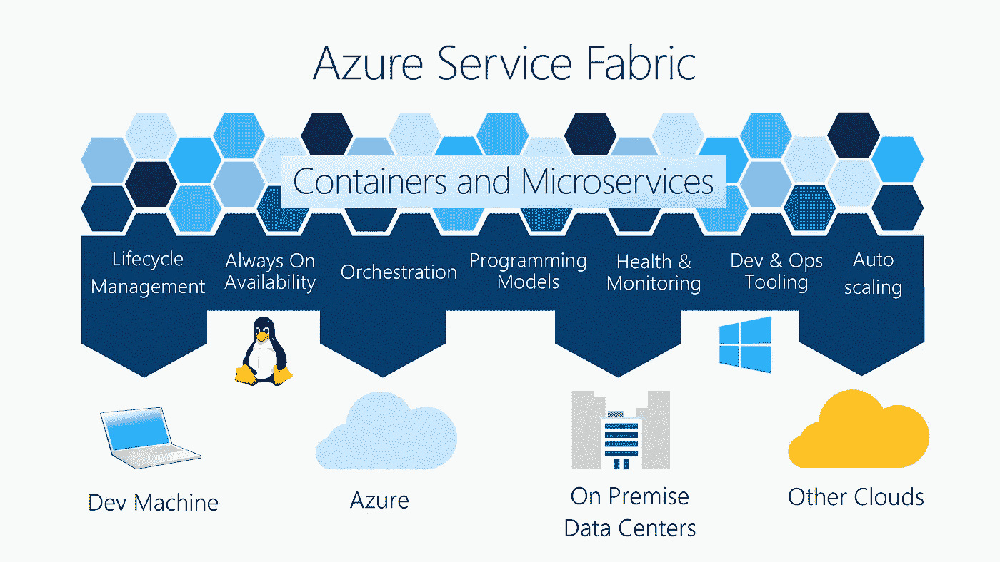

# 服务结构，微软的容器编制器

> 原文：<https://medium.com/hackernoon/service-fabric-the-microsofts-container-orchestrator-6cd035028cb6>

当我开始使用 Microsoft Service Fabric(通常称为 Azure Service Fabric)时，我认为它是另一个容器编排平台，如 Kubernetes、Swarm 等。然而，在浏览 Azure Service Fabric 的[概述时，事情变得相当不清楚，因为它结合了特定的编程模型和容器生命周期管理。](https://docs.microsoft.com/en-us/azure/service-fabric/service-fabric-overview)

> 我首先想知道，如果服务结构支持容器，为什么他们要谈论编程模型，因为容器中有什么不关他们的事。

Azure Service Fabric (Credits: [https://docs.microsoft.com/en-us/azure/service-fabric/service-fabric-overview](https://docs.microsoft.com/en-us/azure/service-fabric/service-fabric-overview))

# 那么什么是微软服务结构呢？

深入挖掘之后，我意识到 Service Fabric 不仅是一个支持 Docker 容器的容器编排平台，它还提供了一个特定于 Service Fabric 的本机编程模型，您可以在其中编写可以在 Service Fabric 平台上运行的服务。

假设您已经了解了容器(Docker)，让我们快速地看一下这个编程模型到底是关于什么的，它对于服务结构是独一无二的。

# 服务结构编程模型

[服务架构编程模型](https://docs.microsoft.com/en-us/azure/service-fabric/service-fabric-choose-framework)更像是服务架构提供的代码框架(支持服务架构 SDK APIs)，您可以在其中填充业务逻辑。这个框架代码不仅作为服务开发的起点，还包含关于如何在服务结构中放置这些服务的元数据。

> 看起来微软发明了这个模型来简化微服务的设计和开发。

编排平台中的其余功能，如服务可发现性、容器(或本例中的服务)生命周期管理、健康检查、负载平衡等都由服务结构平台提供。

# Service Fabric 编程模型如何帮助微服务开发？

服务结构编程模型目前支持几种类型的服务(例如；无状态、有状态、参与者等等。).假设您正在构建一个微服务团队来提供多种业务功能。这需要设计每个单独的微服务，并查看它们如何相互通信。

我说的通信，不仅仅是普通的 HTTP(S)通信。例如，我们需要确保这些服务需要在数据一致性方面进行协调(例如；一旦微服务的数据库上的数据集被更新，可能会有其他服务需要获得该更新，这通常是使用 PubSub 消息中间件或在单独的容器上运行的队列来完成的)。如果不使用 Apache Kafka 之类的共享中间件容器来执行这些操作，这些功能可以使用 Service Fabric 有状态服务编程模型来构建。

> 这使得使用已知构建模块的事情变得统一，我认为这对于微服务的设计和开发都是一个明显的生产力提高。

# 我应该使用服务结构吗？

从技术上讲，任何人都可以使用服务结构作为容器编排平台。但是我看不到一个明确的价值，除非你开始采用服务结构编程模型并用。网芯。这就是该平台在开发和开发运维方面的优势所在。

> 我会说如果你只是计划运行容器(例如；Docker)去找 Kubernetees 之类的其他东西。

此外，如果您构建的应用程序中的大多数服务都是用除。NET，但我仍然觉得使用其他平台更好(尽管这些编程语言大多数都受 Service Fabric 支持)。

然而，如果您计划在 Azure 和内部运行应用程序，Service Fabric 是微软推荐的首选平台。