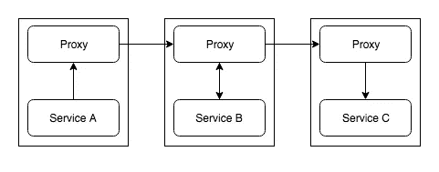
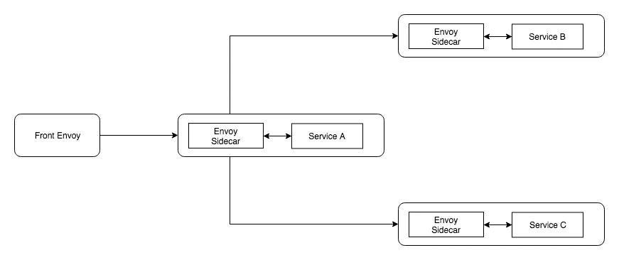
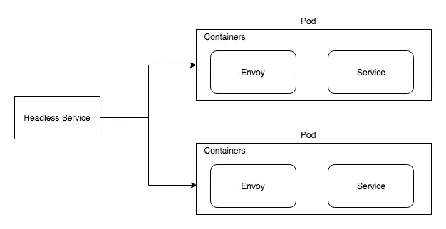

# 代理 101 的服务网格

> 原文：<https://medium.com/hackernoon/service-mesh-with-envoy-101-e6b2131ee30b>

在本文中，我们将简要讨论“服务网格”到底是什么，以及我们如何使用“特使”来构建一个服务网格

## WTH 是一个服务网？

服务网格是微服务设置中的通信层。所有往来于每个服务的请求都将通过网格。每个服务都有自己的代理服务，所有这些代理服务一起构成了“服务网格”。因此，如果一个服务想要调用另一个服务，它不会直接调用目标服务，而是首先将请求路由到本地代理，然后代理再将请求路由到目标服务。本质上，您的服务实例对外部世界没有任何概念，只知道本地代理。

services with local proxies

当您谈到“服务网格”时，您肯定会听到术语“边车”，一个“边车”是可用于您的服务的每个实例的代理，每个“边车”负责一个服务的一个实例。

sidecar pattern

## 服务网格提供什么？

1.  服务发现
2.  可观察性(度量)
3.  限速
4.  断路
5.  交通转移
6.  负载平衡
7.  认证和授权
8.  分布式跟踪

## 使者

Envoy 是一个用 C++编写的高性能代理。使用 Envoy 来构建你的“服务网格”并不是强制性的，你可以使用其他的代理，比如 Nginx，Traefik 等等…但是在这篇文章中，我们将继续使用 Envoy。

好的，让我们建立一个包含 3 个服务的“服务网格”设置。这就是我们正在努力建设的

services setup with sidecar proxies

## 前线特使

“前端特使”是我们设置中的边缘代理，您通常会在其中执行 TLS 终止、身份验证、生成请求头等操作

让我们看看“前线特使”的配置

Front Envoy configuration

特使配置主要包括

1.  听众
2.  路线
3.  簇
4.  端点

让我们逐一看一下

## 听众

您可以在单个特使实例中运行一个或多个侦听器。第 9–36 行，您提到了当前监听器的地址和端口，每个监听器也可以有一个或多个网络过滤器。有了这些过滤器，您可以实现大多数事情，如路由、tls 终止、流量转移等……“envoy . http _ connection _ manager”是我们在这里使用的内置过滤器之一，除此之外，envoy 还有其他几个[过滤器](https://www.envoyproxy.io/docs/envoy/latest/configuration/network_filters/network_filters#config-network-filters)。

## 路线

第 22–34 行为我们的过滤器配置路由规范，您应该从哪些域接受请求，以及一个路由匹配器，它匹配每个请求并将请求发送到适当的集群。

## 簇

集群是 Envoy 将流量路由到的上游服务的规范。

第 41-50 行定义了“服务 A ”,它是“前线特使”将与之对话的唯一上游。

“connect_timeout”是在返回 503 之前连接到上游服务的时间限制。

通常“服务 A”会有多个实例，envoy 支持[多负载平衡算法](https://www.envoyproxy.io/docs/envoy/latest/intro/arch_overview/load_balancing#supported-load-balancers)来路由流量。这里我们使用一个简单的循环赛。

## 端点

“主机”指定了我们希望将流量路由到的服务 A 的实例，在我们的例子中，我们只有一个实例。

如果你注意到，第 48 行，正如我们所讨论的，我们不直接与“服务 A”对话，我们与服务 A 的特使代理的实例对话，然后将它路由到本地服务 A 实例。

您还可以提到一个服务名，它将返回服务 A 的所有实例，比如 kubernetes 中的一个无头服务。

是的，我们正在做客户端负载平衡。Envoy 缓存“服务 A”的所有主机，每 5 秒钟刷新一次主机列表。

Envoy 支持主动和被动健康检查。如果要将其激活，可以在集群配置中配置运行状况检查。

## 其他人

第 2–7 行配置管理服务器，该服务器可用于查看配置、更改日志级别、查看统计数据等

第 8 行，“static_resources”，意思是我们手动加载所有的配置，我们也可以动态加载，我们将在这篇文章的后面讨论如何加载。

配置比我们看到的要多得多，我们的目标是不要经历所有可能的配置，而是要有最少的配置来开始。

## 服务 A

下面是“服务 A”的特使配置

Service A Envoy configuration

第 11–39 行定义了一个侦听器，用于将流量路由到实际的“服务 A”实例，您可以在第 103–111 行找到 service_a 实例各自的集群定义。

“服务 A”与“服务 B”和“服务 C”对话，所以我们分别多了两个监听器和集群。这里，我们为每个上游(本地主机、服务 B &服务 C)设置了单独的侦听器，另一种方法是设置一个侦听器，并基于 url 或报头路由到任何上游。

## 服务 B &服务 C

服务 B 和服务 C 位于叶级别，不与本地主机服务实例之外的任何其他上游进行对话。所以配置会很简单

Service B & Service C Envoy configuration

这里没有什么特别的，只有一个监听器和一个集群。

我们已经完成了所有的配置，我们可以将这个设置部署到 kubernetes 或者使用 docker-compose 来测试它。运行`docker-compose build and docker-compose up`并点击`localhost:8080`，您应该看到请求成功地通过了所有服务和特使代理。您可以使用日志来验证。

## 特使 xDS

我们通过为每个侧车提供配置来实现所有这些，根据服务的不同，配置会有所不同。最初用 2 或 3 个服务手工制作和手动管理这些侧车配置似乎没问题，但是当服务数量增加时，就变得困难了。此外，当侧车配置更改时，您必须重新启动特使实例，以使更改生效。

如前所述，我们可以完全避免手动配置，并使用 api 服务器加载所有组件、集群(CD)、端点(ed)、监听器(LD)和路由(RDS)。因此，每台侧车将与 api 服务器通信以获取配置，当 api 服务器中的新配置更新时，它会自动反映在 envoy 实例中，从而避免重新启动。

更多关于动态配置的信息[这里](https://www.envoyproxy.io/docs/envoy/latest/configuration/overview/v2_overview#dynamic)和[这里](https://github.com/tak2siva/Envoy-Pilot)是一个你可以使用的 xDS 服务器的例子。

## 库伯内特斯

在本节中，让我们看看，如果我们在 Kubernetes 中实现这个设置，它会是什么样子

single service with envoy side car

所以我们需要改变

1.  豆荚
2.  服务

## 豆荚

通常 Pod 规范中只定义了一个容器。但是根据定义，一个容器可以容纳一个或多个容器。因为我们希望为每个服务实例运行一个侧车代理，所以我们将把 Envoy 容器添加到每个 pod 中。因此，为了与外界通信，服务容器将通过本地主机与特使容器对话。这是部署文件的样子

如果您看到集装箱部分，我们已经在那里添加了我们的特使侧车。我们从 configmap 的第 33–39 行安装我们的特使配置文件。

## 服务

Kubernetes 服务负责维护它可以将流量路由到的 Pod 端点列表。通常 kube-proxy 会在这些 pod 端点之间进行负载平衡。但是在我们的例子中，如果你还记得，我们正在进行客户端负载平衡，所以我们不希望 kube-proxy 进行负载平衡，我们希望获得 Pod 端点的列表并自己进行负载平衡。为此，我们可以使用“无头服务”，它将返回端点列表。这是它看起来的样子

headless service in k8s

第 6 行使服务无头化。您还应该注意到，我们没有将 kubernetes 服务端口映射到 app 的服务端口，但是我们映射了它的 Envoy listeners 端口。交通先去特使。

有了它，你也可以和 kubernetes 搭配。

就是这样。期待您的评论。

这篇文章是从使节[跟随使节&格拉法纳](/@dnivra26/microservices-monitoring-with-envoy-service-mesh-prometheus-grafana-a1c26a8595fc) & [迁移到伊斯蒂奥](https://hackernoon.com/service-mesh-moving-from-bare-bones-envoy-to-istio-e0fef88fc1e3)的文章[的先决条件。如果你感兴趣，请浏览它们。](/@dnivra26/distributed-tracing-with-envoy-service-mesh-jaeger-c365b6191592)

你可以在这里找到所有的配置和代码。

 [## dnivra26/envoy_servicemesh

### 在 GitHub 上创建一个帐户，为 dnivra26/envoy_servicemesh 开发做出贡献。

github.com](https://github.com/dnivra26/envoy_servicemesh)