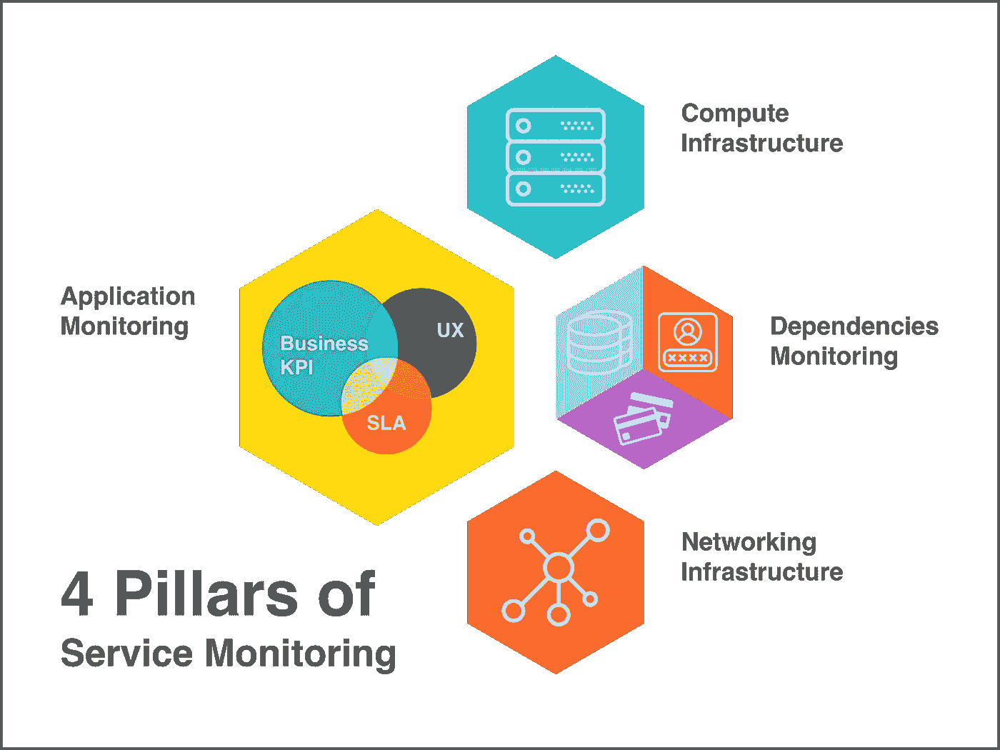
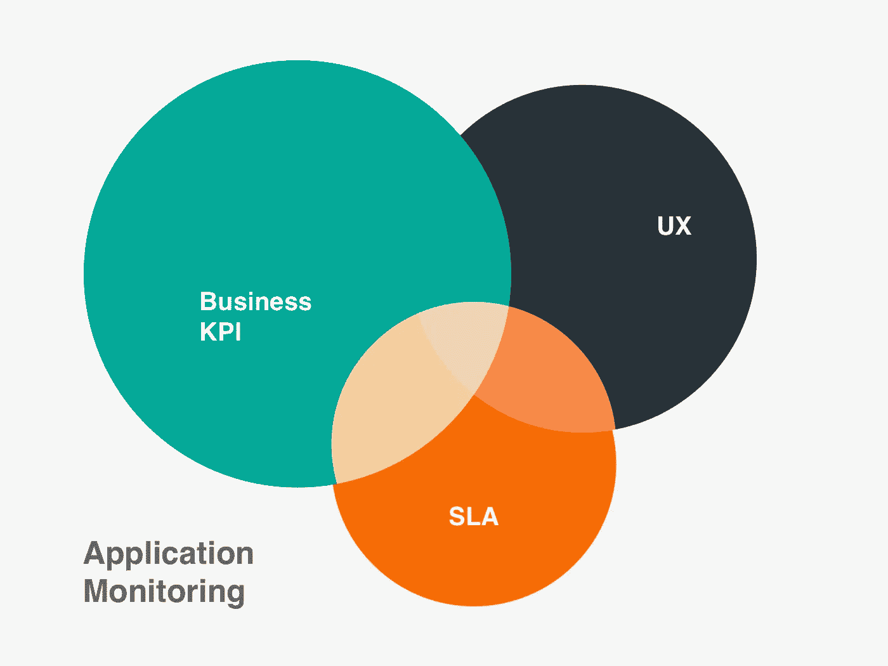
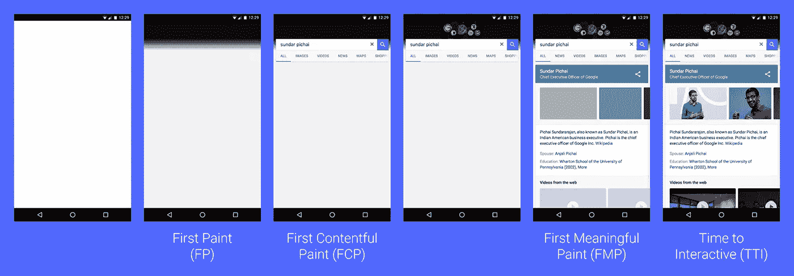
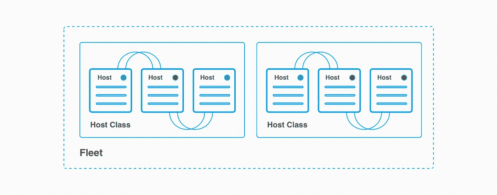

# 如何监控服务:基本框架

> 原文：<https://medium.com/hackernoon/service-monitoring-the-conceptual-framework-2ebffebb362d>

Icons made by Freepik from [www.flaticon.com](http://www.flaticon.com), used under [CC BY](https://creativecommons.org/licenses/by/3.0/)

## 规划新服务的监控时的起点，或重新访问现有服务时的清单。

# 动机

虽然设计良好的系统具有容错能力，并且在其某些组件发生故障时可以继续正常运行，但是持续故障是非常不可取的，并且会导致性能下降甚至系统崩溃。但是，通过精心计划的监控，您应该能够:

*   预见中断
*   快速识别问题的根源
*   触发自动恢复过程
*   触发警报

# 方法

服务[监控](https://hackernoon.com/tagged/moitoring)是一个宽泛的主题，有无数的子主题可供选择。然而，在我们推出服务之前，它是我们需要的系统设计的核心部分。因此，我们需要一种有原则的、结构化的方法来推理和评估我们的监控策略。

虽然每个服务都不相同，但可以由其他较小的服务(例如微服务)组成，并且需要一组不同的指标。几乎所有的原子服务都会包含一个编码业务逻辑的[应用](https://hackernoon.com/tagged/application)，一个运行它的计算基础设施，一些依赖项和一个与依赖项和用户交换数据的网络基础设施。这样的基本构建块为监控分析提供了一个优秀的顶层结构。

在本文中，我想提供一个概念性的监控框架，它可以应用于各种不同的服务架构，从类似初创企业的平均堆栈到云中的企业微服务。此外，在规划新服务的新监控时，应该作为一个良好的起点，或者在重新访问现有服务时作为一个检查清单。

# 应用

首先，我们从应用程序级监控开始。这是最难做到的，也是监测的最关键的支柱。回答最重要的问题“我的服务正在运行吗？”，而所有其他监控级别只能帮助我们查明问题的原因。

实际上,“运行”意味着许多不同的指标和仪表板。因此，进一步分解复杂性的最佳方法如下:

*   业务关键绩效指标(KPI)
*   最终用户体验(EUE)
*   服务水平协议

然而，在实践中，这些子集从来不是完全不相交的。

**业务关键绩效指标**

您的业务度量是确定您的服务是否按预期运行的最佳代理。例如，对于一个电子商务网站，你的 KPI 会包括“弃卡率”、“平均订单价值”、“每订单产品”等等。然而，这组指标是不同服务中最有特色的。因此，您应该尽早与您的产品团队合作，以了解最小的度量集是什么。

## **最终用户体验(EUE)**

在适用的情况下，使用真实用户监控(RUM)可以在浏览器级别最好地跟踪用户体验。它主要使用注入到应用程序页面中的 JavaScript 来提供来自浏览器的反馈。至少你应该监视:

*   第一幅画或第一幅内容丰富的画
*   第一幅有意义的画
*   互动时间到了

此外，按不同的浏览器、平台和地区对这些数据进行分组。查看来自 Google I/O 2017 的[“以用户为中心的绩效指标”](https://developers.google.com/web/fundamentals/performance/user-centric-performance-metrics)，了解具体如何实施。

“[User-centric Performance Metrics](https://developers.google.com/web/fundamentals/performance/user-centric-performance-metrics)” by Philip Walton, used under [CC BY](https://creativecommons.org/licenses/by/3.0/)

服务器端性能监控还能洞察最终用户的性能。但是，我们将其作为服务 SLA 的一部分来讨论。

收集客户端和服务器端最终用户体验监控的另一项技术是“合成事务监控”。其中包括运行一个外部代理，该代理定期执行预先记录的用户案例，并模拟真实的用户行为。

## **服务水平协议**

SLA(服务水平协议)是发行方对客户的承诺或合同，通常包括:

*   可用性。
    监控请求率:总量、API 和可选的客户端。此外，还要测量失败与总请求之间的比率。例如，如果您依赖 HTTP(S) monitor 5xx 错误代码，并留意 4xx 错误。
*   潜伏。
    通过 API 方法测量客户端和服务器端的延迟。如果您的客户端来自不同的地区，请确保按地区对客户端延迟进行分组。如果您的最终用户通过浏览器访问您的服务，您可以使用[资源计时 API](https://developer.mozilla.org/en-US/docs/Web/API/Resource_Timing_API/Using_the_Resource_Timing_API) 获得客户端延迟。否则，您应该依靠您的“合成事务监控”或金丝雀测试报告的延迟。你可以在这里阅读更多关于金丝雀的文章。
*   耐用性。耐久性是数据持久性的一个微妙的衡量标准，它回答了“我的数据将来还会在那里吗？”。实际上，此类 SLA 是基于以前的数据丢失统计数据。监控内部应用程序错误是一个很好的开始代理。您应该让日志观察者在日志中报告“错误”或“异常”。在适用的情况下，您可以监控浏览器端的 javascript 错误。
*   一致性。
    在数据库和分布式系统社区中，“一致性”有不同的定义。我们指的是后者。因此，一致性有两个维度:陈旧和有序。以经济有效的方式监控一致性是很困难的。然而，从陈旧性监控开始更容易。例如，您可能有一个单独的场景作为“合成事务监控”的一部分，该场景创建和删除对象，并检查多快可以观察到效果。

# 计算基础设施

无论你是依赖 AWS Lambda 和 Google Cloud Functions 这样的无服务器计算，还是在 Hetzner 租用专用服务器，都没有关系。在某个时候，它会失败。由于物理故障、数据中心中断或资源耗尽。而资源耗尽可能是由应用程序内存泄漏、日志轮换中断、设备容量配置错误或 DoS 攻击造成的。

为了更好地区分不同的故障并帮助确定原因，我们将进一步将计算基础架构监控分为三个部分:CPU、内存和磁盘使用。此外，对于每个指标，您应该监控每个主机类别、设备群和地区的聚合统计数据(平均值，p99)。

以下是您在监控计算基础架构时应该考虑的一些指标。

## **CPU 使用率**

*   CPU 利用率和 [CPU 负载](https://en.wikipedia.org/wiki/Load_(computing)#CPU_load_vs_CPU_utilization)
*   工作负载与 CPU 利用率(成本效益)
*   进程和线程计数

## **内存使用量**

*   使用的系统内存(总内存和百分比)
*   交换空间
*   使用的应用程序堆(总数和百分比)
*   垃圾收集计数和花费的时间(如果适用)

## 磁盘使用

*   使用的磁盘空间(总空间和每个分区/本地/tmp 等的百分比)
*   打开文件描述符的数量
*   信息节点使用百分比

## *供应*

*   主机类别/设备群中的活动主机与主机总数之比
*   主机总数与可用主机数(例如，AWS EC2 对每个帐户有限制)

# **依赖关系**

现代服务器端应用程序很大程度上依赖于外部服务。想想您的支付处理系统、单点登录(SSO)认证或广告 API。然而，即使是老式的单一服务通常也是由一个单独的数据库组成的。

虽然特定的依赖项可能有一组独特的特定于领域的指标，但请确保开始监控最小公分母:

*   可用性(例如，错误、超时)
*   潜伏期(平均值，p99)
*   读写吞吐量(平均值，p99)

绝大多数服务依赖于外部数据存储，无论是持久性还是缓存。因此，根据数据存储的类型(例如，托管 NoSQL、自托管 SQL 数据库)，在实施监控时，请考虑以下一组指标:

*   调配和使用的容量
*   节流率
*   每秒输入/输出操作数(IOPs)
*   CPU 利用率
*   已用内存和存储(总量和百分比)
*   数据库连接数
*   复制延迟时间或大小

此外，对于云服务，您的云平台提供商本身也是一个重要的依赖因素。请确保您正密切关注它的健康仪表盘:

*   [AWS 服务健康仪表板](https://status.aws.amazon.com/)
*   [谷歌云平台状态](https://status.cloud.google.com)
*   [微软 Azure 状态](https://azure.microsoft.com/en-us/status/)

# **网络基础设施**

最后，服务监控的最后一个支柱—网络监控。

从服务监控的角度来看，我们主要感兴趣的是是否达到了带宽限制或打开连接的最大数量。这两种瓶颈可能有不同的特点，来自网络基础设施的不同部分:主机级、负载平衡器或 NAT 网关。因此，请确保您了解您的硬件或 IaaS 提供商的限制，并在适用时考虑每个网络设备的以下指标:

*   操作系统中的打开文件描述符
*   每秒输入/输出位数
*   活动连接数
*   负载平衡器溢出
*   负载平衡器浪涌队列

此外，考虑集成内部或云 DDoS 检测和缓解服务，如 [AWS Shield](http://AWS Shield) 或 [Azure DDoS 保护](https://azure.microsoft.com/en-us/services/ddos-protection/)。这将在多个 OSI 层监视和保护您的网络，防止泛滥、反射攻击和资源耗尽。

# 结论

我们最后讨论了成功的服务监控的 4 个支柱。所提供的框架只是一组最基本的建议，并提供了一个良好的基础，但绝不是详尽无遗的。例如，它没有解决实时安全策略监控或分布式应用程序调试和分析( [AWS X-Ray](https://aws.amazon.com/xray/) )等高级主题。您的下一步应该是围绕您的指标实现实时仪表板，并基于阈值和异常检测自动发出警报。

如果你觉得这篇文章有趣，别忘了鼓掌分享。你也可以通过 [Linkedin](https://www.linkedin.com/in/dmytrii) 和 [Twitter](https://twitter.com/MeTroFuN) 联系我。