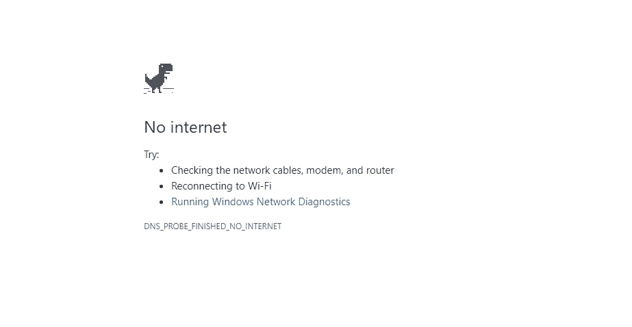

# 服务人员

> 原文：<https://medium.com/hackernoon/service-workers-62a7b14aa63a>

在我回家的火车旅途中，我对我手机里的应用程序数量感到惊讶，我有不同的应用程序来满足我不同的需求。生活在互联网时代的我，作为一名网络开发人员，对我标题中的“网络”一词非常着迷，感到有点失望，并立即切换回我的浏览器导航到网站，阅读我在原生应用程序上平静阅读的博客，然后一种奇怪的感觉突然出现。令我惊讶的是，已经过了 50 秒，我只能看到加载图标，慢慢地一些内容开始出现在页面上。当我看着火车外面的树木，耐心地等待网站的呼吸时，图像开始一个接一个地出现，感觉好像过了很久，我可以感觉到，我的浏览器在做了大量艰苦的工作后叹了口气，与服务器来回通信以获得所有需要的资源。我可以很容易地感受到用户在网上浏览他们喜欢的内容时所经历的痛苦，并且完全理解切换回原生应用程序体验的冲动。

原生应用利用操作系统的力量。除了性能之外，这些应用还有许多令人难以置信的功能，如后台同步、离线优先、推送通知。我们是一个强大的 JavaScript 开发者社区，我们不能让这种体验困扰我们，因为我们无法设计出一个解决方案——至少像原生应用程序一样强大。看来，有人已经认真对待它，我们有，*服务人员*！服务人员提供丰富的离线优先用户体验、后台同步、无缝处理网络连接问题——没有互联网或信号弱，以及推送通知。

**让我们试着理解一下什么是服务工作者**
服务工作者，简单来说，就是一个在后台运行的脚本文件，不会干扰用户交互。服务工作器充当代理服务器，拦截由 web 应用程序发送到服务器的网络请求。在这种意义上，获取 Javascript 或 CSS 文件、图像的请求通过服务工作者到达服务器。服务人员能够修改该请求或将自定义响应发送回客户端。它最大限度地利用缓存来缓存一些资源，这样对这些资源的后续请求就可以通过缓存命中快速得到满足，而不是一路回到服务器去获取资源(稍后将详细介绍缓存)。服务工作者作为事件驱动的系统运行。

**事件驱动**

当不需要内存时，服务人员会进入睡眠状态以节省内存。所以数据不会保存在`onfetch` & `onmessage`处理程序的全局状态中。要在重启后持久化数据，可以使用 IndexedDb API。

让我们看一个简单的例子来证明上面的陈述

用例——我们必须根据用户查看特定产品的次数来保存产品 id。我们可以把它存储在一个散列表中，比如-

Products Map

因为我们不能依赖全局变量，所以我们会将这些信息存储在 IndexedDb 中，以便保存下来。

下面是一个截取网络请求的获取处理程序。如果请求 URL 包含“*产品*”，我们从 IndexedDb 中获取针对*产品 Id* 存储的现有产品计数，并将*产品计数*增加 1，并将其存储回 IndexedDb 中。

**与其他网页的通信**

服务人员无法直接访问 DOM。它在不同的上下文中工作，可以使用`postmessages`与客户端通信。

用例—当服务工作者被激活时，我们必须向客户机发送一条消息。

下面是服务工作者激活事件的处理程序。服务人员在激活时向客户端发送 post 消息。

下面是客户端 javascript 上的监听器，它监听消息，并在消息来自服务人员时执行相应的操作。

**维修工人仅在 HTTPS 工厂工作**

服务工作者的`onfetch`事件处理程序可以改变或伪造网络请求的响应。因此，确保服务人员在网络传输过程中没有被篡改是非常重要的。此外，应该从同一个域为服务人员提供服务。

这难道不令人兴奋吗？让我们深入了解如何在我们的 web 应用程序中包含服务人员。

**1。注册**

要让服务人员控制您的 web 页面，我们首先必须在一个范围内注册它。

在您的客户端 JavaScript 中包含以下代码片段，以注册服务工作者脚本' *service-worker.js*

Service Worker Registration

有一些旧的浏览器不支持服务工作者，因此，在注册它之前，我们首先检查服务工作者 API 在浏览器中是否受支持。服务工作者注册函数异步下载脚本。如果服务人员注册成功，它将开始安装步骤。

刷新页面时，不会再次执行服务人员注册码。你不必担心阻止你的注册码多次执行，浏览器会处理好的。只有当服务工作器的 URL 不同或者在注册的服务工作器和它的新实例之间存在字节差异时，才会再次注册服务工作器。

如果注册失败，浏览器会在您下次重新加载页面时尝试注册。

**服务人员的范围**

默认情况下，服务工作器的作用域是“/”，这意味着它可以拦截来自根的所有网络请求。要在不同的范围内注册一个服务工作器，或者限制它只能拦截来自几个选定页面的请求，我们可以这样做

register 函数接受 object 类型的第二个可选参数，该参数的作用域是一个键。因此，服务人员的范围现在被限制为“*/产品/时尚/{…}* ”。它不能拦截任何超出其范围的请求。

**2。安装**

一旦服务工作者在客户机上成功注册，所有后续步骤都是服务工作者脚本的一部分。您可以在这里执行初始化任务，比如设置浏览器缓存或在 IndexedDB 中创建对象存储

下面是将 URL 添加到缓存的代码片段

如果所有的 URLs 文件都被成功缓存，则服务人员准备进入下一步。但是，即使其中一个文件失败，它也会在安装步骤中抛出一个错误，并会在下次页面刷新时被安装。

**3。激活**

成功安装后，服务人员进入就绪状态。如果没有活动的服务工作者，则安装的服务工作者进入激活阶段。在这里，我们可以管理旧的缓存资源或清理 IndexedDb 中的陈旧数据。

在上面的激活事件处理程序中，我们删除了除'*产品-v2* '之外的所有缓存。即使激活步骤成功完成，服务人员仍然不能控制页面。激活后发出的网络请求仍然不会通过服务人员的`onfetch`处理程序。当网站没有在任何其他标签中打开并且当前页面被刷新时，服务工作者将统治该网站。只有当网页本身是通过服务人员获取的，服务人员才会监听网页上的网络请求。这确实有意义，因为网页可能正在使用缓存中的一些资源，并且服务工作人员已经在激活事件中修改了缓存的资源。如果您仍然希望您的服务人员拦截后续的网络请求，您可以使用`clients.claim()`。它允许您覆盖此默认行为，并允许服务人员在成功激活后立即拦截网络请求。

但是，如果网站上已经有一个活跃的服务工作者，新的服务工作者不会进入激活阶段，除非这个旧的服务工作者未注册。

如果你想摆脱活跃的服务工作者，让新的接管，你可以这样做—

*self.skipWaiting()* 防止等待状态，并在安装后立即激活服务人员。

**让我们试着理解我们在代码中使用的术语**

“*自我*关键词是怎么回事？

*self* 用作服务工作者引用，就像我们在 JavaScript 中使用' *this* '来引用任何实例一样。

而`event.waitUntil()`呢？我们为什么要用它？

到目前为止，我们知道 service worker 是作为一个事件驱动的系统运行的。不需要时，它会进入休眠状态。在执行 install 或 activate 事件中编写的代码之前，我们希望我们的服务工作人员能够活着工作。 *event.waitUntil()* 就是这么做的。服务工作者保持活动状态，直到执行了 *event.waitUntil* 中的代码。

我如何知道我的网页是否由任何服务人员控制？

我开发了一个口袋妖怪应用程序来展示服务人员的力量。你可以点击查看