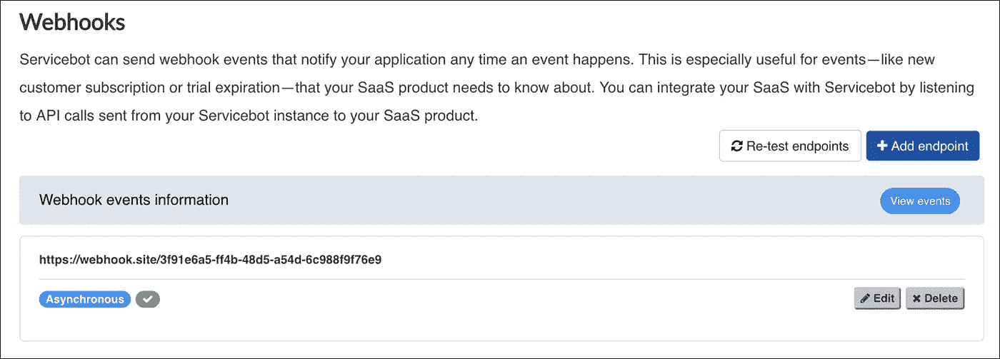
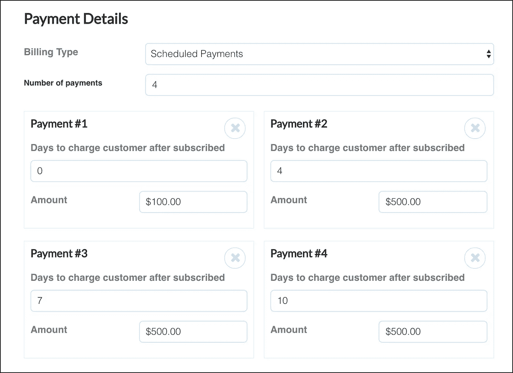
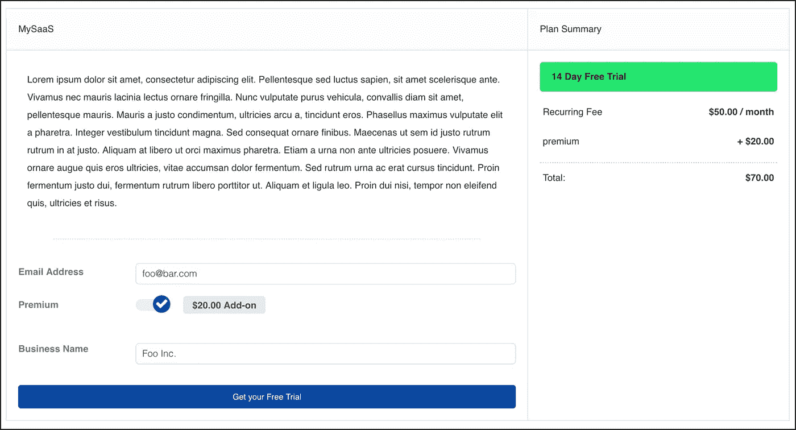
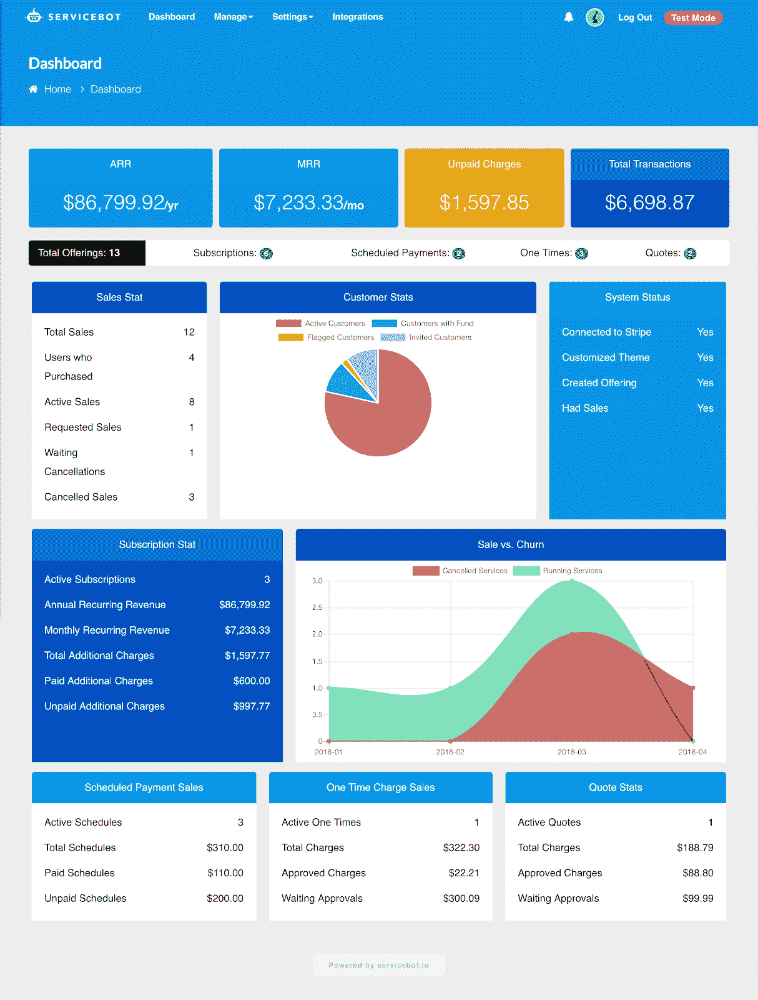

# Servicebot 开源 v0.9: Webhooks，支付调度程序，主要的 UI 变化

> 原文：<https://medium.com/hackernoon/servicebot-open-source-v0-9-webhooks-payment-scheduler-major-ui-changes-6104453bbfdb>

我们很高兴地宣布我们为[服务机器人](http://servicebot.io)发布的 v0.9 版本，这是一个 [**开源**](https://github.com/service-bot/servicebot) 订阅管理[平台](https://hackernoon.com/tagged/platform)。本文将向您展示该平台的最新功能，以及如何从您的[服务机器人](https://hackernoon.com/tagged/servicebot)中获得最大价值。

自从我们去年启动 Servicebot 以来，我们的目标一直是创建一个开源平台，采用面向服务的方法进行订阅管理。这种方法允许完全控制订阅生命周期的[不同步骤](/@ben_sears/understanding-the-lifecycle-of-a-saas-subscription-5169307fd0c8)。

在这个版本中，我们已经完成了我们的定制支付计划，并对 UI 和 Servicebot 的内部进行了重大更改。

如需完整的发行说明，请查看我们的 [GitHub](https://github.com/service-bot/servicebot/releases/tag/v0.9.0) 。

# 平台内部

## 更多的功能被转移到插件中

Photo by [Steve Johnson](https://unsplash.com/@steve_j?utm_source=medium&utm_medium=referral) on [Unsplash](https://unsplash.com?utm_source=medium&utm_medium=referral)

自从我们在 2017 年 9 月向 Servicebot 添加了 [pluginbot](https://github.com/service-bot/pluginbot) 以来，我们一直在慢慢地将功能从单一架构迁移到更加面向服务的插件架构。我们计划最终将所有代码从 monolith 移植到插件上，并允许插件系统从前端被控制，就像在 Wordpress 或 Drupal 这样的 CMS 中常见的那样。

在这个版本中，我们添加了一个文件管理器插件，我们在生产中使用它来将诸如徽标或用户头像等上传到 S3，而不是文件系统。

# Webhooks

现在可以选择将事件数据发送到集成点，如 Jenkins、Zapier 或您自己的应用程序。这些事件将允许您进入 Servicebot 的**服务生命周期**。

## Webhook 用例示例:SaaS 计费自动化

一家 SaaS 企业在他们的网站上有一个免费的试用注册表，当被请求时，将在他们的应用程序中创建一个帐户，并在响应中附加一个访问令牌，以便他们可以登录。

使用 Servicebot 来管理他们的订阅，他们可以轻松地将 webhook 连接到他们的应用程序，或者构建自动化服务，如 Jenkins。这将允许服务生命周期事件，在这种情况下，每当请求新的订阅时，都会触发“请求”事件。更进一步，“取消”和“试用到期”事件可以触发应用程序访问被限制，直到它们添加资金来源。

# 自定义付款计划

在这个最新版本中，我们增加了一个新功能，允许更多的定制付款计划。它是这样工作的——首先，您将服务的计费类型设置为“定期付款”，然后您可以设置所需的付款次数、每次付款的时间以及每次付款的金额。

Payment schedules allow you to customize how many payments and the cost of each

构建该功能有两个要点:将一次性付款拆分为多次付款的能力，以及拥有更灵活的付款结构的能力。

## 付款计划用例示例:咨询服务

假设你是一家公司，在三个月内提供 6000 美元的咨询服务。显而易见的选择是将这笔付款分成三个月每月 2000 美元。但有了 Servicebot，你可以调整每笔付款的金额。对潜在客户来说，更容易的销售方式是以 1000 美元的价格支付第一笔款项，让他们有机会“试用”你的服务一个月，然后再支付更昂贵的第二个月和第三个月的 2500 美元。

# UI 重新设计

0.9 版中有三个主要的 UI 更改。每个变化都是基于反馈和分析而开发的。

## 请求表单用户界面

我们改进了客户与请求表单的交互方式，使其更具可嵌入性，更符合发票的外观，并使请求表单易于嵌入任何现有网站，从而实现无缝的客户体验。

The new request form — also can be embedded easily in any site

## 管理仪表板 UI

我们最初的管理员仪表板页面非常简单，没有任何实际的数据计算。在我们的 v0.9 版本中，我们添加了一组全新的分析计算，并设计了一个直观的仪表板页面来查看这些数据。图表也包括在内。这是 v0.9 版本中的一个主要变化，但是，在未来的版本中，我们还希望对仪表板进行更多的更改。

The new dashboard with more analytics

## 新主题

根据我们的托管解决方案使用情况，我们意识到大多数人没有改变 Servicebot 附带的初始黑色主题。自 2017 年 8 月发布以来，该主题一直可以使用系统设置页面上的系统选项进行自定义。为了使这一变化更加明显，我们添加了一个新的蓝色主题，附带一些使用指南。例如，仪表板将引导管理员通过三个步骤来设置他们的服务机器人。我们希望开发更多预定义的主题，管理员可以选择而无需手动选择系统颜色。

# 下一步是什么？

我们 2018 年及以后的主要里程碑是:

*   支持除 Stripe 之外的支付网关
*   提高现有应用程序中请求表单的可嵌入性(正在进行中)
*   基于使用的计费
*   改进自动化测试

我们的目标是让企业通过我们的开源自动化平台向客户销售订阅变得更加容易。

## 需要解决订阅计费的挑战？你可以在 [https://servicebot.io](https://servicebot.io) 免费试用 Servicebot