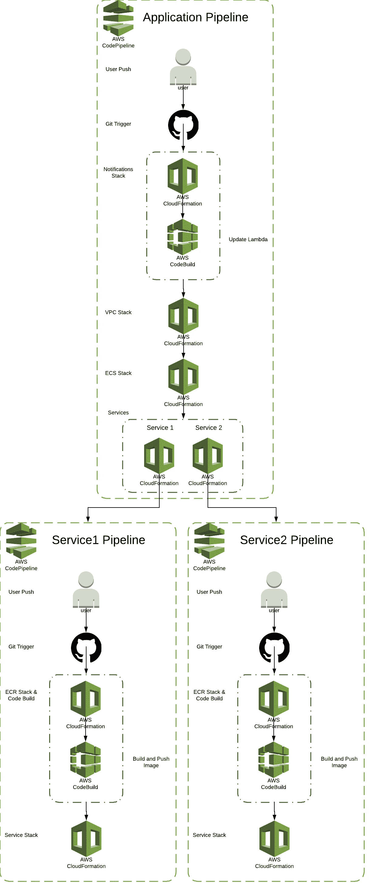

# 服务堆栈—为您的基础架构和代码提供 CI/CD

> 原文：<https://medium.com/hackernoon/services-stack-with-ci-cd-for-your-infrastructure-and-code-ede3e2919afa>

## 只需签入您的基础架构和代码更改，它们就会自动部署，这不是很好吗？

早在十月份，我就发布了[服务栈](https://hackernoon.com/the-services-stack-235cca4a15f7)。[服务栈](https://hackernoon.com/the-services-stack-235cca4a15f7)是 CloudFormation 模板的集合，用于在 AWS 上创建微服务应用。如果你还没看过，请去看看。

在发布了[服务栈](https://hackernoon.com/the-services-stack-235cca4a15f7)之后，我得到了很多很好的反馈，大部分都是好的；).原来缺少的是持续集成和持续部署(CI/CD)。

我已经回去添加了这些功能，今天很高兴与大家分享。没有进一步的延迟，这里是代码…

 [## 堆栈/服务-堆栈-cicd

### 服务-堆栈-cicd - ECS 内置 CI/CD 的微服务堆栈

github.com](https://github.com/thestackshack/services-stack-cicd) 

# 管道

> 一切都是管道

我使用 CodePipeline 不断更新所有 CloudFormation 栈，构建代码，部署代码。对于`application`有一个流水线，对于每个`service`有一个流水线。

请看这张图表，然后我们将在下面讨论更多细节:

## 应用程序管道

应用程序管道创建应用程序特定的堆栈(即，与服务无关)，然后引导每个服务管道。

应用程序管道最初是通过命令行创建的。然后它在每次提交时执行。

应用程序管道由以下阶段组成:

1.  通知阶段
2.  VPC 阶段
3.  ECS 阶段
4.  服务阶段

**通知阶段**

通知阶段包含两个操作。第一个操作创建一个 CloudFormation 堆栈，其中包含通知用户有关 DevOps 事件(如构建状态、部署状态等)的资源。第二个操作执行一个代码构建，以测试和部署前一个堆栈中的 Lambda 函数，并始终保持其新鲜。

**VPC 舞台**

VPC 阶段包含一个动作。为我们的应用程序建立 VPC 的 CloudFormation 堆栈。

**ECS 阶段**

ECS 阶段包含一个操作。一个 CloudFormation 堆栈，使用 EC2 和 ALB 设置 ECS 集群。

**服务阶段**

服务阶段包含每个微服务的一个操作。每个动作都是一个 CloudFormation 堆栈，为该服务创建管道。

## 服务管道

服务管道创建特定于服务的堆栈，执行代码构建，最后是代码部署。

每个服务管道在每个推送到特定服务的代码上执行。

服务管道由以下阶段组成:

1.  ECR 和代码构建阶段
2.  服务阶段

**ECR &代码构建阶段**

ECR & CodeBuild 阶段有两个动作。

ECR 操作只是为我们的 Docker 图像创建一个 ECR 存储库。

CodeBuild 操作首先构建代码，然后将图像推送到 ECR。

**服务阶段**

服务阶段有一个单一的动作，它是所有服务相关资源的云形成栈。创建 ECR 任务时，将使用前一阶段新创建的 ECR 映像，从而部署最新的更改。如果希望手动部署，可以使用特定的版本。

## 环境

支持两种环境，沙盒和生产。沙盒从“开发”分支触发，生产从“主”分支触发。

# 结论

基础设施和代码一样重要。让两者都通过 CI/CD 是最佳做法。我希望你喜欢这一叠。**如果有(或者没有)请鼓掌**。