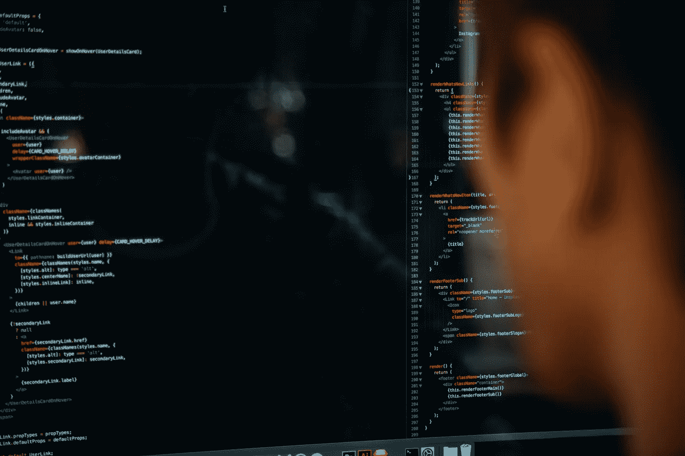

# 会话:没有人谈论的 Vim 特性！

> 原文：<https://medium.com/hackernoon/sessions-the-vim-feature-no-one-talks-about-1c9cfa4d52d7>

## Vim 是一个很棒的编辑器。就在那里，我说了！

但话虽如此，在使用它一段时间后，我们总是会到达那个点，在几天甚至几周的连续工作后，无数的标签打开，无数的设置就位，我们需要重启计算机。

重启后不得不重新配置一切总是一件非常痛苦的事情。

当然，这种情况在大多数现代文本/代码编辑器中不会发生。这也不一定发生在 Vim。这就是 Vim 有会话的原因！

Courtesy of Unsplash

会话允许我们在 Vim、工作目录、您的窗口、分割和缓冲区中保存我们的当前状态，并且您用 *:set* 设置的任何选项都会被保存。会话基于 Vim**T3:MK sessionT5 命令。如果我们查看 *mksession* 命令的帮助文件，我们可以看到以下内容:**

***:MKS【ession】【！][文件]***
编写一个恢复当前编辑会话的 Vim 脚本。当[！]时，现有文件将被覆盖。当省略[file]时，使用“Session.vim”。

所以基本上我们的当前状态保存在一个文件中。我个人喜欢用 *~/。vim/sessions* 文件夹，然后有一个我总是覆盖的通用会话文件或一个用于特定角色的特定文件。比如 *~/。vim/sessions/article.vim* 为我正在写的一篇文章或者 *~/。javascript 工作流的 vim/sessions/Javascript . vim*。

Vim 还允许保存几个状态文件，所以如果我们愿意，可以保存多个工作流。

Courtesy of Unsplash

所以，为了保存状态我们可以使用 ***:mks ~/。vim/sessions/article . vim*。( *:mks* 是 *:mksession* 的缩写，两者都可以使用)。**

当我们准备好恢复该状态时，我们可以使用:

***:来源~/。vim/sessions/article . vim***

或者我们可以用已经加载的状态开始我们的 Vim 会话。为此，我们可以使用

***vim -S ~/。vim/sessions/article . vim***

非常简单！简单地说，会话不存储命令历史，也不存储我们可能有的标记。注册内容也不会被保存。虽然这通常不是一件重要的事情，但有时可能是相关的。

还有一些插件可以帮助管理会话，比如 [vim-session](https://github.com/xolox/vim-session) 。但总的来说，管理会话是一个无害的功能，有时会被忽略，但非常有用，使用起来非常简单。维姆绝对让我们在这方面得到了保障。

Vim 有问题吗？不知道该放什么进去。vimrc 文件？想用来编程？看看我的新书《一个叫做 Vim 的 IDE》。它介绍了 Vim 的所有基础知识，从安装到作为 IDE 使用。

