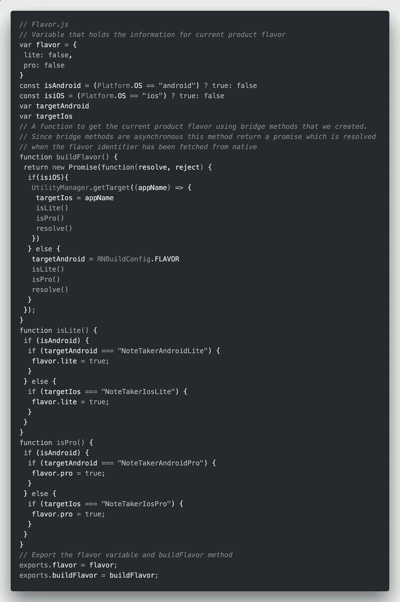

# 在 React Native 中设置 Android 产品风格和 XCode 目标

> 原文：<https://medium.com/hackernoon/setting-up-android-like-product-flavors-in-react-native-39b6c011061b>

## Android 开发人员应对原生问题的路线图——第 4 部分

Photo by [Edgar Chaparro](https://unsplash.com/@echaparro?utm_source=medium&utm_medium=referral) on [Unsplash](https://unsplash.com?utm_source=medium&utm_medium=referral)

如果您来自原生开发背景，您可能知道 Android Studio 和 XCode 都提供了一个功能，可以从相同的代码创建不同的应用程序。这些在 Android Studio 中被称为风味，在 XCode 中被称为目标。这个想法是创建不同的包，它们具有相同的核心功能，但是在特性上有微小的不同。这可以包括不同的配色方案，品牌或一些功能独特的包装。一个常见的例子是创建同一应用程序的免费和付费版本，其中付费版本具有与免费版本相同的核心功能，并添加了一些功能和特性。由于主要功能是相同的，所以不需要创建不同的项目，而是在运行时处理特定于风格/目标的更改。我希望你明白我的意思。如果没有，请点击这些链接了解更多信息。

 [## 高级 Android 风格第 1 部分——在 Android 上构建白标应用

### 开始使用 Android 风格，轻松在您的应用中创建变体

proandroiddev.com](https://proandroiddev.com/advanced-android-flavors-part-1-building-white-label-apps-on-android-ade16af23bcf)  [## 具有多个构建配置的 Xcode“目标”

### 如何创建区分和共享部分源代码的多个应用程序

medium.com](/@andersongusmao/xcode-targets-with-multiples-build-configuration-90a575ddc687) 

*为了简单起见，我将使用 Android 术语* `*flavors*` *来表示 React Native 中的不同产品版本。*

## 现在，让我们转到手头的问题上来

我从事的项目严重依赖于构建风格，而 React Native 没有内置的功能来处理同样的问题。当然，您可以从`react-native-cli`中创建不同的风格，但这只是决定了构建过程，而不是需要进行的实际运行时更改。这是我想出来的，来弥补 native 和 React Native 之间的差距。

# 设置

## 步骤 1:配置(本机)

第一步是在 Android Studio 中设置产品风格，并在 XCode 中构建目标。出于本教程的目的，我们的应用程序将被称为`NoteTaker`。这个应用程序有两种风格:`lite`和`pro`。你可以阅读上面提到的文章来帮助你在 Android Studio 和 Xcode 上设置配置。

## 步骤 2:本机模块

一旦我们在本机端设置了风味，我们需要一种方法在运行时将产品风味标识符从本机传递到 react-native。这无疑要求我们为 Android 和 iOS 创建本地模块或桥接方法。为了简单起见，我们将保持我们的风格标识符为字符串。在安卓系统中，味道存储在`BuildConfig`中，而在 iOS 系统中，你可以从`info.plist`中使用`TargetName`

如果您不知道 React Native 中的本机模块是什么，请查看以下文档。

 [## 本机模块反应本机

### 有时一个应用程序需要访问一个平台 API，而 React Native 还没有相应的模块。也许…

facebook.github.io](https://facebook.github.io/react-native/docs/native-modules-android) 

## 步骤 3: Flavor.js

接下来，我们创建一个 JavaScript 文件，作为 React Native 中风味的实用程序类。该文件公开了一个从本机获取当前产品风味的方法和一个在从本机获取该信息后存储该信息的变量。

## 第四步:Colors.js

由于我们的`lite`和`pro`版本有不同的配色方案，我们创建了一个`Colors.js`文件，其中包含了特定风味的颜色。此外，该文件还导出了一个方法来根据产品味道获取相关的颜色。

我们的设置现在差不多完成了。我们只需要在 react 本机应用程序开始时调用 build flavor 方法。但是有一个问题。因为构建风格是异步的，所以我们需要确保只有当风格已经从本地获取时才挂载第一个组件。为此，我们最初在组件的 render 方法中传递 null，在收到来自`buildFlavor`方法的回调时，我们使用`setState`重新呈现组件

# 履行

## 实现风味特定的功能

既然我们的风味已经从 native 中获取，并且可以在任何组件中访问我们的产品风味，那么编写特定于风味的代码就是小菜一碟。事实上，我们已经在`getThemeColors`方法中看到了这样的实现。考虑一个只有在`pro`版本中才有的向便笺添加图像的特性

## 实施配色方案

当定义一个组件的样式时，你可以使用两种方法。使用样式属性
2 直接应用样式。使用样式表

第一种方法没有任何问题，因为样式是在安装特定组件时在运行时评估和应用的。因此`getThemeColors`方法被正确评估，我们得到了所需的颜色。

但是，使用样式表时，会在文件加载到 JavaScript 运行时环境中时评估样式。这意味着即使组件没有被安装，它的样式也已经被评估了。因此，在我们的例子中，在风格被获取之后，组件在`App.js`中的延迟呈现不能达到它的目的，因为即使组件没有被挂载，它的样式已经被评估了。因此，`getThemeColors`返回一组错误的颜色。为了克服这个问题，我们只需要在将要安装组件时为组件创建样式表。我们通过用`componentWillMount`生命周期方法创建样式表来实现这一点。

所以现在我们有了产品风味的具体特征和配色方案。这种设置的唯一缺点是样式和配色方案现在是在运行时生成的，而不是在编译时生成的。这并不是说它对性能有很大的影响，但仍然落后了一步。如果您有任何改进此设置的想法，请随时在回复中或通过电子邮件与我分享。

这是“一个 Android 开发者的本地反应路线图”系列的第四部分。您可以通过以下链接阅读本系列以前的文章:

> 第一部分:[https://medium . com/@ rohan x96/an-Android-developers-roadmap-to-react-native-Part-1-5ec 20 cf 93757](/@rohanx96/an-android-developers-roadmap-to-react-native-part-1-5ec20cf93757)
> 第二部分:[https://medium . com/@ rohan x96/set-up-your-own-react-native-ide-f 7d 52 c 90 da 43](/@rohanx96/set-up-your-own-react-native-ide-f7d52c90da43)
> 第三部分:[https://blog . use journal . com/redux-an-an](https://blog.usejournal.com/redux-an-intro-and-beyond-92d694bc314f)