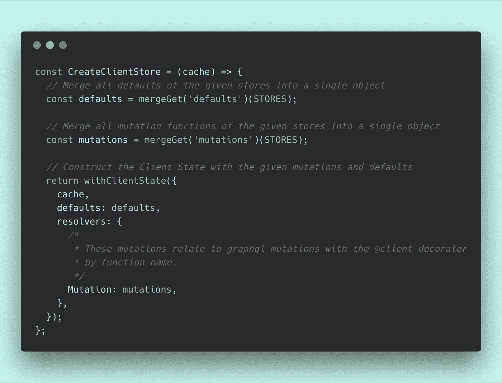
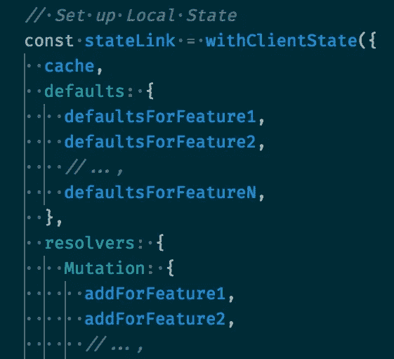
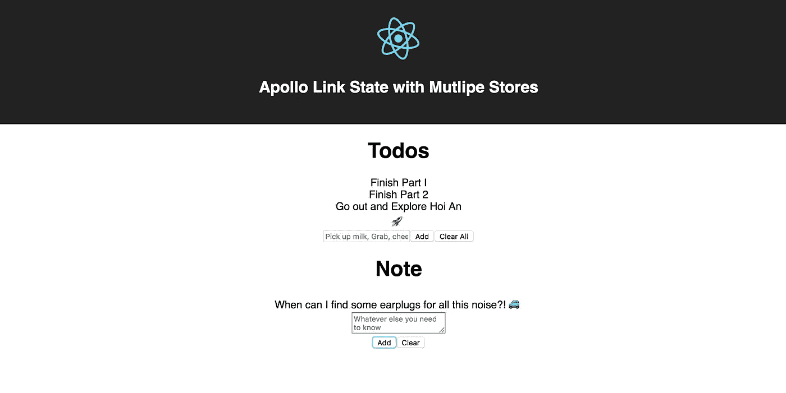

# 为多个商店设置阿波罗链接状态

> 原文：<https://medium.com/hackernoon/setting-up-apollo-link-state-for-multiple-stores-4cf54fdb1e00>

Take a look into your future 🔮

我想谈谈如何设置`apollo-link-state`来支持多个商店而不互相干扰。

在我的上一篇文章中，我们讨论了如何设置基本用途的`apollo-link-state`:

 [## 在与 apollo-link-state 的反应中存储本地状态

### 特别感谢 Peggy Rayzis 围绕该产品所做的出色工作和交流。

medium.com](/@bnchrch/storing-local-state-in-react-with-apollo-link-state-738f6ca45569) 

在本教程中，这是我们要拍摄的月亮:

1.  将`withClientState`移动到自己的文件中。
2.  将特定的解析器和突变移到它们自己的文件中。
3.  写一个优雅的方式将多个商店合并在一起。
4.  在之前的演示中添加了一个新的 Notes 特性。

让我们开始吧！🚀🌙

# 我在使用`apollo-link-state`时最大的问题

首先，我想谈谈我们正在努力解决的问题。

归结起来，`CreateClientState`只期望`defaults`有一个值，而`Mutations.resolvers`有一个值，如果你有不止一个想要存储的对象，这是不兼容的。

This will get unruly fast

这是不兼容的，因为它迫使我们将多个逻辑上分离的特性的`resolvers`和`defaults`保存在一个地方。或者，如果每次我们创建一个单独的文件时，都强制我们显式地从该文件中引用一个`resolver` / `default`。

这是不好的，在一个中型到大型的应用程序中，这是一个让你的逻辑难以追踪的好方法。

# 我们如何解决这个问题

谢天谢地，解决这个问题真的很简单！它包括以下内容:

## 1.移动`CreateClientStore out of` 我们的`client.js file`

将您的客户端存储的配置移动到它自己的文件中，以帮助强调这是我们的应用程序中非常具体和非常重要的一部分。

我们的新`client.js`应该是这样的:

## 2.将我们的默认值、解析器和`@client`查询移动到它们自己的文件中

将特定功能领域的`defaults`和`resolvers`分解到它们自己的“存储”文件中，以帮助确保随着应用程序的增长，代码在逻辑上处于同一位置。

## 3.用洛达什魔法🧙‍把它绑在一起

最后，我们使用 lodash 的一些助手将每个`store`文件的导出合并成一个。这允许我们在单独的文件中定义`resolvers`和`defaults`，并在配置期间将它们放在一起。

*具体看一下* `*mergeGet*` *函数，看看这是如何发生的。*

# 添加另一个特性变得很容易

现在我们已经有了上面的基础设施，添加第二个特性就像添加第 100 个特性一样简单。

让我们通过向应用程序添加一个自由形式的注释字段来测试这个语句。

## 1.创建便笺存储

几乎与上面的 Todo 商店相同。

## 2.连接新商店

将新商店导入`CreateClientStore.js`并添加到我们的`STORES`。

## 3.创建注释组件

现在，我们已经创建了商店，是时候使用它了。

## 4.添加到 app.js

最后，将我们的新组件添加到我们的`<App/>`容器中。

# 看看它的实际效果！

现在，您应该能够运行更新演示，并看到我们的新笔记的功能在运行。简单。

# 包裹

我想把这个放出来，因为我认为这个维持地方政府的阿波罗版本有一些真正的潜力，作为一个年轻的项目，它得到的支持越多，我们就越应该看到它是否会发展壮大。

支持一个项目的一部分是学习如何使用它和学习如何改进它。我希望这有助于做到这两点！

编码快乐！

> 🧞‍这是开源的！你可以在 Github 上找到它
> 
> ❤️ **我只写编程和远程工作。如果你** [**在 Twitter 上关注我**](https://www.twitter.com/bnchrch) **我不会浪费你的时间。**