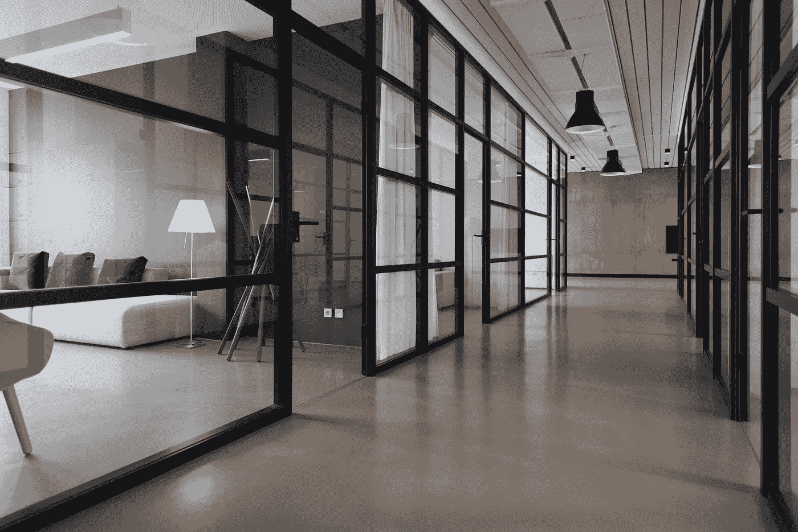

# 为成功做准备:远程工作站

> 原文：<https://medium.com/hackernoon/setting-up-for-success-remote-workstation-63cbc6d07cb>

Photo by [Nastuh Abootalebi](https://unsplash.com/photos/yWwob8kwOCk?utm_source=unsplash&utm_medium=referral&utm_content=creditCopyText) on [Unsplash](https://unsplash.com/search/photos/workspace?utm_source=unsplash&utm_medium=referral&utm_content=creditCopyText)

虽然[远程工作](https://hackernoon.com/tagged/remote-working)的[旗舰](https://hackernoon.com/tagged/flagship)形象将永远是游牧民族，但很大一部分人更喜欢日复一日地呆在一个地方(*展品 A:我*)。在这种情况下，没有比拥有一个良好的远程工作设置更好的方法来帮助自己获得成功。

# 战略

优化你的设置的一个很好的起点是有一组你想要调整的值。在办公室里，工作站是为了迎合公司的目标而设计的。在你的远程环境中，你有更多的自由来选择你更喜欢追求的目标。

举个例子，下面是我优化的价值观:

*   生产率
*   最小的干扰
*   最小决策

由于远程工作是[所有关于输出](https://hackernoon.com/how-to-make-remote-job-hunting-easier-a-practical-guide-f681e48ff062)，*生产力和工作质量*是清单上的第一件事。另外两个主要支持第一件事。让*最少的干扰*确保大量的时间里干扰最少。这有助于让我的总体思路保持连续和集中。最后，*最小决策*是为更重要的决策保留脑力。

# 设置

记住这些，让我们深入了解如何为你的目标优化你的设置。

## 基本要素

桌子——我有一张 2.5 英寸 x4 英寸的白色平板桌子，涂有防水塑料涂层。如果你不喜欢估计数字，想象一张适合四个人的桌子被一个人使用。使用大量空间有助于理清总体思路，并确保有足够的空间用于未来升级。防水意味着更少的清洁工作，这将大大减少决策过程。

*需要记住的一些问题:*

*   身高够不够好？当你的椅子调整时，它够得着吗？
*   有足够的空间吗？
*   容易清洗吗？

椅子——选择一把带头枕和靠背的标准办公椅。当你陷入沉思时，这样可以让你的头躺下。以及滑动到房间中任何地方的能力。虽然这些额外津贴是惊人的，但最重要的事情很可能是背部支撑。从长远来看，在标准的塑料椅子上工作一定会让你背痛。如果健康对你来说不是一个大问题，那么把它想成是分心的潜在原因:唠叨的疼痛肯定会让你分心。

*需要记住的一些问题:*

*   它倾斜吗？你想让它倾斜吗？
*   它能调节高度吗？
*   它有背部支撑吗？

笔记本电脑—在远程工作环境中，这是您的面包和黄油。只要你用起来舒服，任何笔记本电脑都可以。一般来说，尽可能投资高端笔记本电脑，因为它们在速度和生产力方面有很大的回报。最大的延迟应该是你思维的速度，而不是你笔记本电脑的速度。

*需要记住的一些问题:*

*   快吗？
*   快吗？
*   但是快吗？

耳机——远程工作意味着经常与客户联系，所以买一副好的耳机也无妨。就一般用途而言，无线耳机将大大有助于减少分心和提高您的移动性。你甚至可以戴着耳机在椅子上打滚，多酷啊？

*需要记住的一些问题:*

*   《音乐之声》有多好？你是音乐人吗？
*   麦克风的声音是否清晰？
*   它能消除噪音吗？

## 外围设备

键盘——在我开始感到手腕疼痛之前，我并不喜欢人体工程学/机械键盘。当我开始使用它们时，我意识到我再也回不去了。一旦你试一试，你可能会得出同样的结论。更少的手腕疼痛意味着连续几个小时打字(生产力，更少的分心)以及你的手更长寿。

*需要记住的一些问题:*

*   舒服吗？你能想象自己在上面敲几个小时吗？
*   它有学习曲线吗？
*   它是可重新编程的吗？

显示器——更大的空间意味着你可以一次放入更多的东西，这也意味着你的生产力会大大提高。)。将显示器放在与眼睛齐平的位置也有助于您的姿势和整体健康。

*需要记住的一些问题:*

*   它倾斜并适应你的头部空间吗？
*   它有允许放松观看的设置吗？
*   它颜色好吗？

鼠标——如果你不是一个游戏爱好者，你可以用蓝牙鼠标来减少你的电线混乱，增加你的移动性。一般来说，鼠标没有什么好优化的，除非它不工作。

*   有用吗？
*   你的手休息得好吗？
*   有反应吗？

## 事后的想法

房间——你工作的环境对你的工作效率有很大的影响。你可能需要完全的安静来保持专注。你也可以选择一个好的视野来更容易集中注意力。在其他时候，你也可以在一个有很多人的地方，帮助处理在偏远环境中不可避免的孤立。总的来说，有一个让你感到自在的地方总是一个优势。

*   你喜欢安静吗？
*   你喜欢去散步吗？
*   你喜欢开阔的空间吗？

食物——饥饿很容易分散注意力，比如一声巨响。让它们触手可及有助于保持连续性。对于午餐和晚餐时间，5 分钟半径内的地方也有助于为其他更重要的事情保留时间。

*   从您的系统中获取食物的可能性有多大？
*   有你能经常去的一个不错的午餐地方吗？
*   你吃东西吗？

# 摘要

与办公室环境不同，优化您的远程工作环境始终取决于您和您想要追求的价值。首先，关注那些帮助你实现你的价值观的基本要素，然后在你前进的过程中不断改进。

Ace 做了七年的开发人员，最近两年是远程软件开发人员。如果你喜欢这篇文章，请留下你的掌声，发表评论或发送关注。非常感谢！