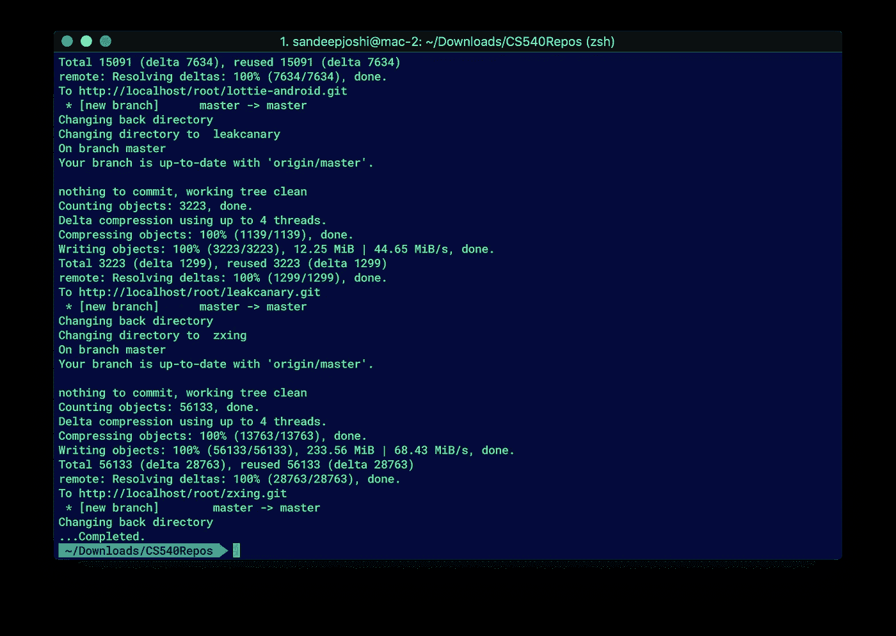
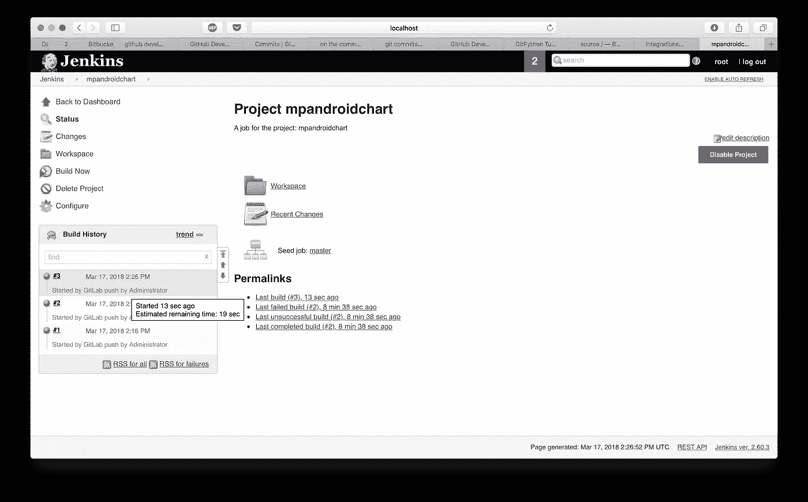
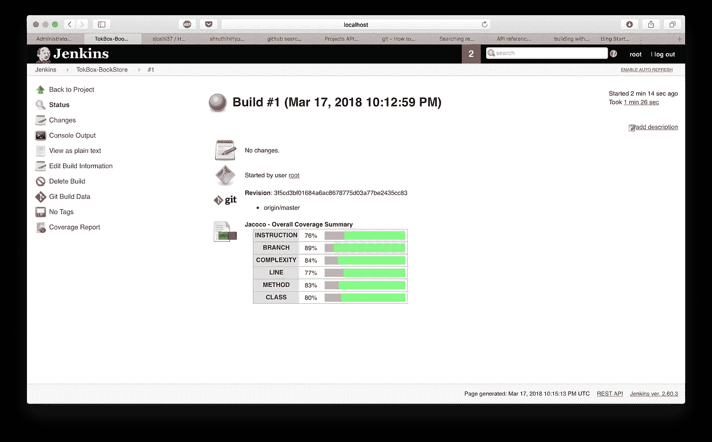
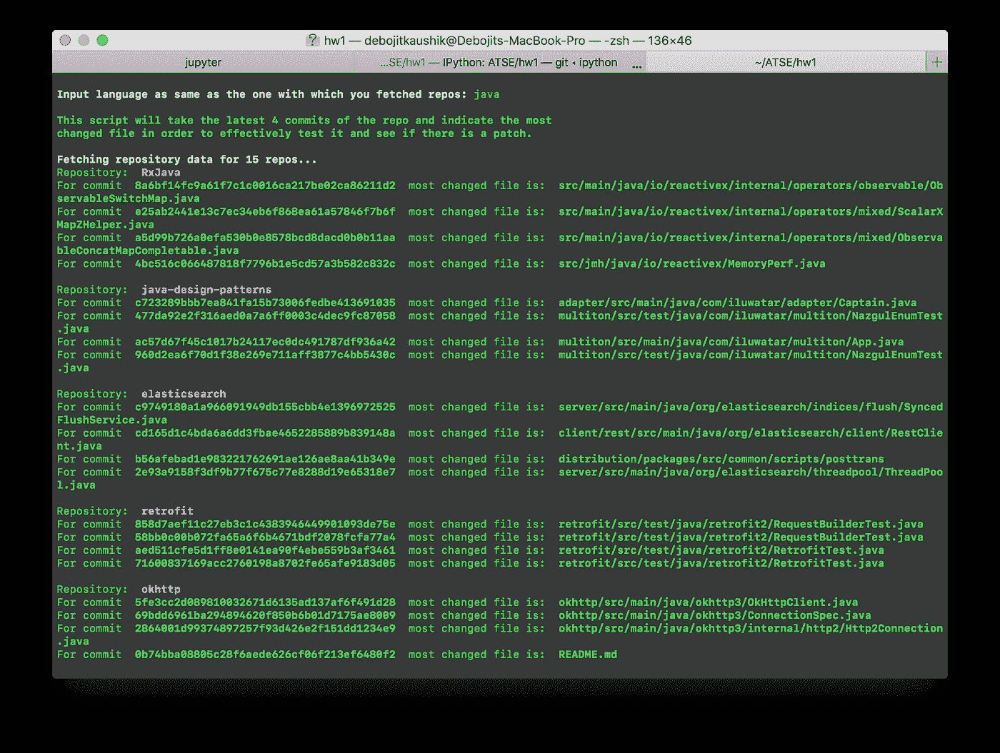

# DevOps:使用 Docker 设置 GitLab + Jenkins CI

> 原文：<https://medium.com/hackernoon/setting-up-gitlab-jenkins-ci-with-docker-da74c67373ac>

每一个认真的开发者在某一点之后肯定会想要部署他/她的产品或者将他们的游戏升级到产品。一旦你写完软件/产品，精通 DevOps 管道肯定会有帮助。因此，我们继续设置我们自己的 Git 服务器，以及一个持续的部署/集成管道。这里有一个更简单的介绍，让你接触到后端工程之后的东西。欢迎来到 DevOps！

找了好几天，也找不到足够的关于如何设置自己的 GitLab 服务器和 Jenkins CI 服务器的信息。特别是如何将它们整合起来，建立一个最小但完整的生态系统。有一些非常好的博客展示了这个过程，但都是零碎的。这就是为什么这个博客可能会帮助那些试图掌握相关概念的人，并且有一个一站式教程可以遵循。

我用截图策划了整个过程，因为我知道即使在通读之后看到事情也有很大帮助。为了清楚地了解它是如何工作的以及本教程接下来会讲些什么，这里有一个完整设置和流程的流程图。


该教程遵循代码可在[这里。](https://github.com/dkaushik94/Gitlab-Jenkins)您可以选择克隆存储库并遵循代码。或者，您可以按照指南设置自己的代码。该设置需要 docker。在这里找到安装 docker [的信息](https://docs.docker.com/install/)。

运行以下命令来安装 Gitlab。安装完成后，我们可以看到 Gitlab 容器正在运行。您可以通过运行命令`docker ps -a`找到这些信息

```
sudo docker run --detach \ --hostname gitlab.example.com \ --publish 443:443 --publish 80:80 --publish 22:22 \ --name gitlab \ --restart always \ gitlab/gitlab-ce:latest
```


现在去`https://localhost:80/`找 Gitlab 启动运行。如果它还不可用，请等待几分钟，直到您可以看到 Gitlab 正常运行。


设置一个新密码，这将是用户`root`的密码，默认为管理员用户。您可以根据需要创建更多用户。一旦设置了密码，您就可以登录 Gitlab，如下所示。


现在导航到用户设置。


导航至访问令牌，继续生成访问令牌。给它一个名称和截止日期。


生成令牌后，请将其保存在安全的地方。我们将使用这个令牌来自动填充 Gitlab 服务器中的项目。


我们现在将运行`fetch_repo.py`从 Github 中提取指定语言的项目，并将它们推送到 GitLab。

```
python3 fetch_repos.py [your_github_username] [your_github_password]
```

使用有效的 Github 凭证运行这个命令，然后会提示提供我们之前获得的个人访问令牌。输入令牌后，项目就在 Gitlab 中建立起来了。



我们现在可以检查 Gitlab 是否已经设置了所有的回购。我们现在就安排詹金斯。


# Jenkins —设置

```
sudo docker run -p 8080:8080 --name=jenkins-master jenkins
```

一旦 Jenkins 容器运行，我们需要做一次设置。如您在终端中所见，复制打印的密码或密码始终可用:`/var/jenkins_home/secrets/initialAdminPassword`


为此，首先通过运行命令登录到容器，

`sudo docker exec -i -t jenkins-master(name_of_the_image) /bin/bash`

然后导航到上面的路径，将`initialAdminPassword`复制到剪贴板。现在转到`http://localhost:8080/`找到如下图所示的启动并运行的 Jenkins。


现在将`initialAdminPassword`粘贴到 Jenkins 网页的剪贴板中。

单击继续。现在 Jenkins 给出了定制/建议安装的选项，如下图所示。我们选择建议的安装。

这将安装标准组件。


完成安装后，Jenkins 将带您创建第一个用户。如图所示创建一个用户。


创建用户后，单击 complete，Jenkins 现在就可以使用了！


詹金斯的新观点应该是这样的。


我们现在需要在 Jenkins 中设置插件。运行 install_plugins 脚本— `python3 install_plugins.py`
如果输出是`True`，运行命令`docker restart jenkins-master`重启 Jenkins


# 现在我们需要配置 Gitlab 插件。

前往`Manage Jenkins` > `Configure System`。这里 Gitlab 部分没有配置，应该如下图所示


我们需要给出一些细节:
·连接名称:Gitlab 连接的名称，我们稍后将在每个创建的作业以及作业 DSL 中引用它。这种联系对詹金斯来说是全球性的。我们将给出`gitlab`作为名称。

Gitlab 主机 url:这是系统中运行的 Gitlab 容器的 url。我们输入`[http://172.17.0.2:80/](http://172.17.0.2:80/)`

凭证:到目前为止，我们没有任何 Gitlab 凭证设置。我们将创建一个新的如下。点击`Add`按钮设置新的凭证。输入之前生成的 Gitlab 个人访问令牌。Jenkins 会将此凭证用于各种目的，如获取工作回购


设置完成后，单击测试连接。这将返回如下所示的`success`。

> *取消勾选* `*Enable authentication for project Endpoint*` *。我们将禁用身份验证，以便 web hook 在没有令牌的情况下也能工作。*


> 如果您遇到任何错误，请查看 Gitlab 的 url。它不应该是 localhost。由于我们是通过 docker 运行 Gitlab 和 Jenkins，所以 Jenkins 和 Gitlab 是在 docker 的局域网内运行的。詹金斯需要在那个网络中参考 Gitlab。所以，要获取 Gitlab 的地址，在 Gitlab 的 bash 中，在`/etc/hosts`文件中找到 url。在此输入 url。

# 提供就业机会

我们需要为 Gitlab 中的每个回购设置创建工作。为此，我们将使用作业 DSL 插件来完成。Job DSL 是用 groovy 编写的，用于获取 Gitlab 中的所有项目，并为 Gitlab 中的每个 repo 设置设置一个作业。下面是作业 DSL 的代码

> *注:我们使用的是 Jenkins 的 IP，* `*private_token*` *是之前从 Gitlab 获得的个人访问令牌。令牌对你来说是不同的。在运行脚本之前，替换* `*create_master_job.py*` *中的令牌。如果 IP 也不同，也要更换。*

```
//This is the Private Access token obtained in GitLab. Please //replace this with the one you obtained in create_master_job.py. String private_token = "DjotJ94w7GRsRdU6eDWt" // If the address of jenkins is different from this, please replace that too. String ip = "http://172.17.0.3:80/" // We need to fetch URLs of all the repos in order to create a job for each of them def jdata = new groovy.json.JsonSlurper().parseText(new URL("http://172.17.0.3:80/api/v3/projects?private_token="+private_token).text) jdata.each { String repo_url = it.ssh_url_to_repo repo_url = repo_url.replace("git@gitlab.example.com:",ip) String proj = repo_url.substring(repo_url.lastIndexOf('/') + 1); String project_name = proj[0..-5] job(project_name) { // Basic details of the job description('A job for the project: ' + project_name) displayName(project_name) // SCM details of the repo scm { git { branch('master') remote { url(repo_url) credentials('gitlab-root-user') } } } // Build steps steps { gradle('check') gradle { tasks('clean') tasks('build') switches('--stacktrace') switches('--debug') } } // Setting up Jacoco Code coverage publishers { jacocoCodeCoverage { execPattern '**/**.exec' classPattern '**/classes' sourcePattern '**/src/main/java' exclusionPattern '' inclusionPattern '' } } // Setting up triggers for Gitlab triggers { gitlabPush { buildOnMergeRequestEvents(true) buildOnPushEvents(true) } } authenticationToken('auhgtbereb675nksnwewrhbbe==') } }
```

我们将此代码用作主作业 xml 中脚本的一部分。我们再次使用 python Jenkins 创建一个主作业，然后构建已创建的作业。该作业将依次为 Gitlab 中的每个 repo 创建一个作业。验证 url 并用我们在 Gitlab 中得到的替换`private_token`是很重要的。

我们现在需要运行 create_master_job 脚本来完成所有这些工作。打开终端并运行命令`python3 create_master_job.py`

现在已经为 Gitlab 中的每个 repo 创建了一个作业，如下所示


# 网钩

一旦所有的工作都在詹金斯创建，我们需要创建网络挂钩。为此，我们将运行`create_webhooks.py`，它将查看所有创建的作业，并使用 python Gitlab 向 Gitlab 中的每个 repo 添加 web hook。运行命令`python3 create_webhooks.py`。然后前往 Gitlab 查看为每个项目创建的 web 挂钩，如下所示。

您可以导航到任何回购的集成部分，以找到创建的挂钩。


在集成部分，一旦你向下滚动，你可以看到钩子。单击 test，您应该会在顶部看到一条成功消息。如您所见，web-hook 中的 url 是 Jenkins job 的项目 url。


现在回购中的任何推动都会自动触发詹金斯的构建。让我们试试吧！

让我们编辑 README.md 文件并推送更改，看看它是否会触发构建。


一旦变更被推送，我们前往 Jenkins job 进行同一个项目`MPAndroidChart`，我们可以看到构建已经被触发。在左下角，我们可以看到构建和指示`Started ​by ​GitLab ​push ​by ​Administrator`的消息



# 代码覆盖率

如果 gradlew 配置和 build.gradle 是正确的，构建应该工作正常，并且应该生成如下代码覆盖率报告。



> 如果一个项目没有成功，我们有一个回购协议，Jacoco 在这方面做得很好。你可以在这里找到回购[](https://github.com/sandeepjoshi1910/TokBox-BookStore)

# *明白；理解*

*这一部分是分析 Jenkins CI 代码覆盖率工具的输出。现在你一定已经为 Gitlab 和 Jenkins 做好了一切准备。我们使用 understand 来生成代码分析报告。脚本`understand.py`交互地询问以下参数*

*   *包含理解工具的文件夹的路径*
*   *要分析的回购的路径*
*   *存储结果的路径*
*   *了解项目的名称*

********

# *运行例行程序*

*运行以下命令来启动脚本。这个脚本独立于目录，因为它直接与 Github API 对话。*

```
*python3 git_analytics.py <your_github_username> <your_github_password>*
```

*这将会询问你想看哪种语言的分析。您可以输入您选择的任何语言，但是对于这个练习，输入与您在`'fetch_repos.py'`中获取存储库完全相同的语言。*

*输入参数后，脚本将开始与 API 对话，并遍历 15 个(脚本中 repos 的预定义范围)存储库，分析最近 4 次提交中的每一次，哪些文件更改最多。这表明这些文件中出现了更多的错误，因为更大的更改更容易导致测试失败。*

*它将输出如下内容:*

**

*它还将创建一个名为“analytics.md”的文件，这是在 markdown 中生成的输出文件，将包含所有 15 个存储库的输出。*

*注意:*您可以删除 analytics.md 文件，因为它是自动生成的文件，然后重新运行您的脚本以生成新文件。**

# *试验*

*`fetch_repo_test.py`运行 fetch_repo.py 并检查设置为从 Github 导入的回购编号是否确实被推送到 itlab*

# *2.插件安装*

*`plugin_install_test.py`通过运行`install_plugins.py`安装插件，并获取 Jenkins 中安装的所有插件，以查看脚本安装的插件是否确实安装了。*

# *3.詹金斯创造就业机会*

*`jenkins_job_test.py`运行 create_master_job.py 为 Gitlab 中的每个 repo 创建作业。然后检查创建的作业数量是否等于现有的回购数量。*

# *4.网络挂钩创建*

*现在，一旦设置了 web 挂钩，我们就将一个样本文本文件推送到其中一个 repo 中，然后检查相应的 Jenkins 作业的构建号是否增加了。*

# *项目的局限性*

*   *Gradle:项目的 Gradle 配置可能非常不同，构建经常失败。很难分析每个回购，然后对作业 DSL 脚本中创建的作业进行更改。如果项目是使用 maven 或 sbt 构建的，同样很难在 Job DSL 中为项目存储库中指定的所有可能的构建配置设置构建选项。*
*   *由于 webhooks 的编程创建，我们无法对 webhooks 进行身份验证，并且它们是在没有令牌的情况下创建的。这可以通过手动创建 webhooks 来解决。*
*   *我们正在使用 python-jenkins 包。虽然我们可以用 python-jenkins 完成几乎所有的 Jenkins 任务，但是有些非常特殊的事情却做不到。例如，我们需要在 Jenkins 的系统配置中配置 Gitlab 插件。我们无法用 python-jenkins 或 jenkins-cli 做到这一点。并非所有可能的插件配置都支持 API。唯一可能的选择是使用 selenium 这样的自动化工具或者手动完成。*

*你已经成功地设置了 Gitlab 和 Jenkins，集成了 JaCoCo 和 *Understand* 代码分析工具。我已经尽力做到尽可能全面。欢迎对本教程发表评论并留下任何问题。如果你喜欢这个博客，别忘了喜欢和分享！感谢你的阅读。干杯！*

**原载于 2018 年 5 月 15 日*[*dkaushik 94 . github . io*](https://dkaushik94.github.io/devops/2018/05/15/jenkins-gitlab/)*。**