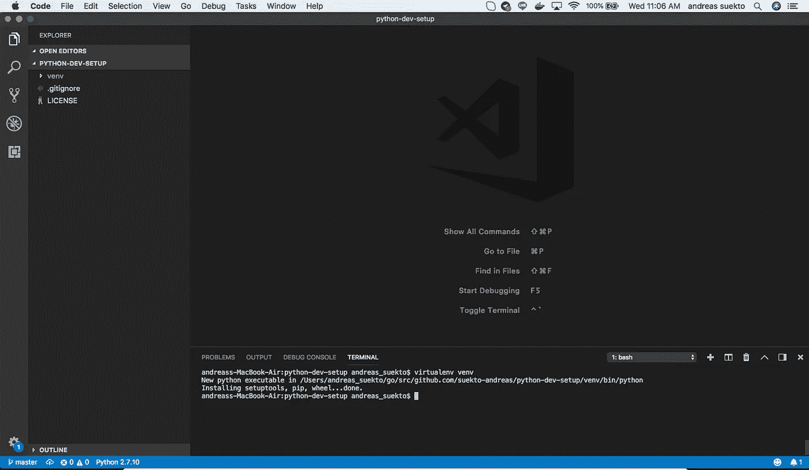
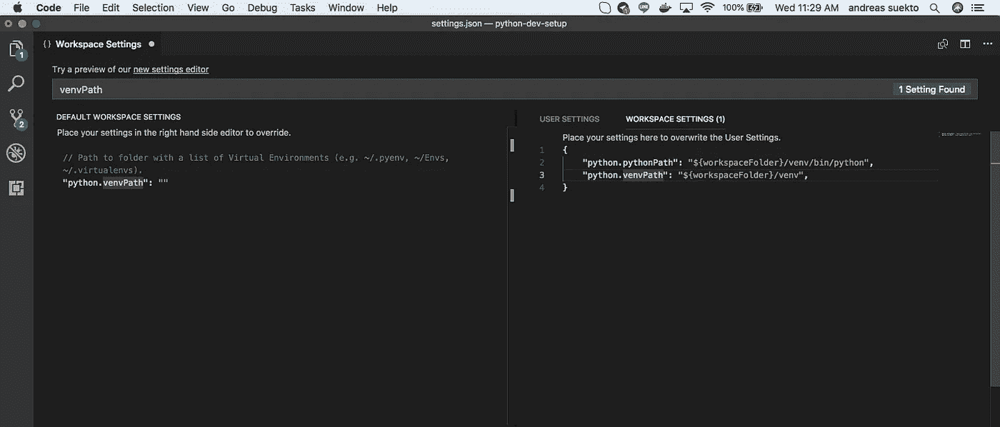
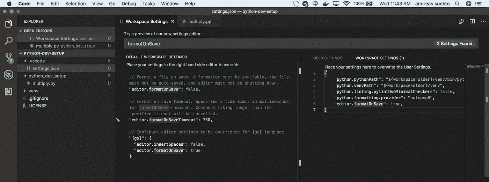
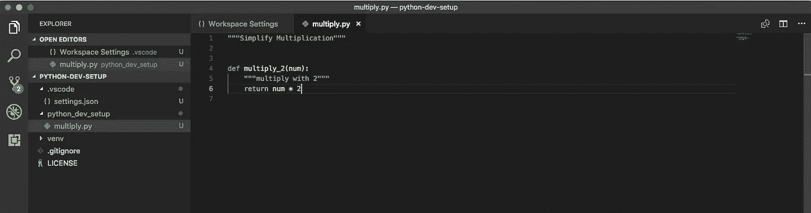
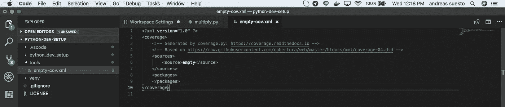
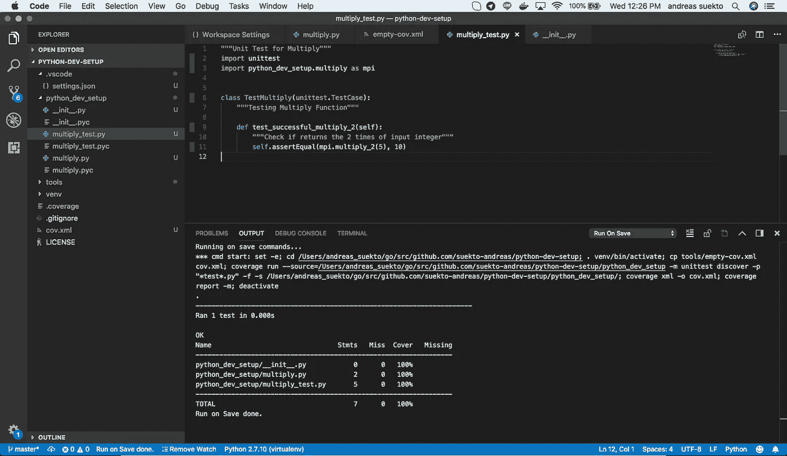
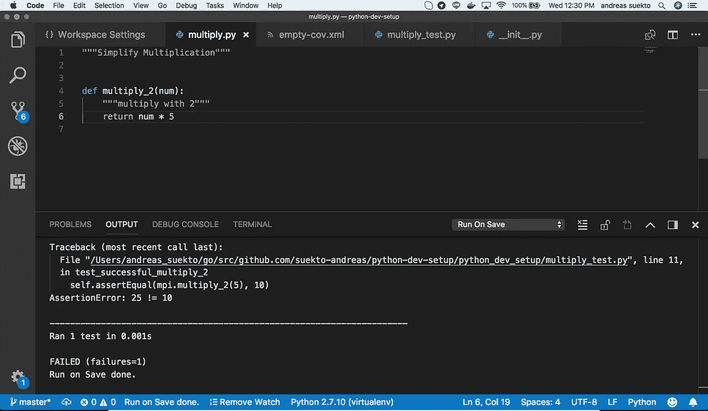
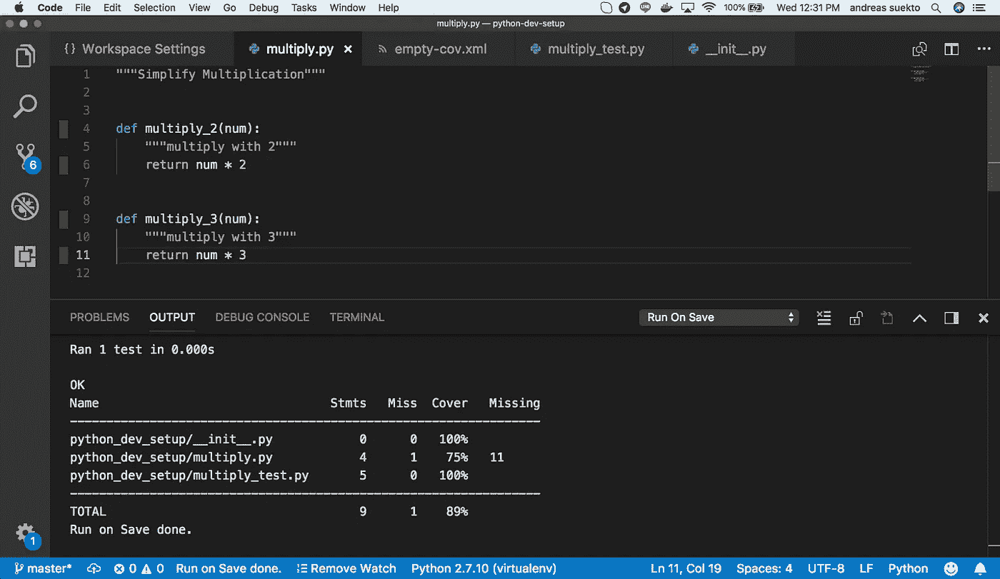

# 在 VS 代码中自动化 Python 开发

> 原文：<https://medium.com/hackernoon/setting-up-python-dev-in-vs-code-e84f01c1f64b>

我们将讨论如何用 Visual Studio 代码设置 python 开发环境。我们将在这里讨论如何自动化几个非常重要的东西，以使 Python 中的编码参考 PEP 实现标准化:

1.  使用 PyLint 自动检查代码
2.  自动格式化代码
3.  保存时自动运行单元测试
4.  在保存时自动覆盖运行，在代码上有图形指示器(绿色/红色/空白)

# 目录

[动机](/p/e84f01c1f64b#3874)
[假设](/p/e84f01c1f64b#0676)
[先决条件](/p/e84f01c1f64b#53c3)
[动作 00 —创建我们的项目](/p/e84f01c1f64b#7906)
[动作 01 — PyLint 标准化我们的代码](/p/e84f01c1f64b#761e)
[动作 02 —保存时自动套用格式](/p/e84f01c1f64b#2973)
[动作 03 —自动化单元测试&覆盖报告](/p/e84f01c1f64b#a1b2)
[结论](/p/e84f01c1f64b#06c0)

# 动机

我完全是刚刚开始用 Python 写东西！

就我个人而言，我对此很感兴趣，因为我正通过 AWSGlue 的一个相对较新的亚马逊无服务器服务开始着手 PySpark 项目；因此 python 开始进入我的生活。

以前我在 Golang 编写代码，在那里我的开发环境已经自动化了很多东西，帮助我产生好的代码。我也想在我的 Python 上看到它！

挑战在于，在 VS 代码中找到这样做的方法并不容易，因此本文将向您展示如何使用现有的多个扩展来实现这一点。

# 假定

这篇文章是从 Mac OS 用户的角度写的，类似的东西应该可以移植到其他机器上，比如 windows，尽管可能需要进一步的搜索来适应。

# 先决条件

## 工具:

1.  在你的主机上安装 Python 2.7(因为我的 AWS Glue 目前只支持 2.7 版本——2018 年 8 月)
2.  [PIP](https://pip.pypa.io/en/stable/installing/)
3.  [虚拟人](https://virtualenv.pypa.io/en/stable/installation/)
4.  [Visual Studio 代码](https://code.visualstudio.com/download)
5.  [微软 VSCode Python 插件](https://github.com/Microsoft/vscode-python)

## 技能:

1.  在 VSCode 中安装插件扩展
2.  基本的 Python 编码(它们的语法等)

# Action00 —创建我们的项目

*   启动项目
*   虚拟

让我们创建一个项目，从一个空项目开始，这里我将其命名为 python-dev-setup。打开 Visual Studio 代码目录。

的。gitignore 和许可证文件有我们从 github 得到的东西。

让我们为这个项目创建 virutalenv，在这个项目文件夹中打开一个终端(cmd + j)

```
$ virtualenv venv
```



Project with Virtualenv

Virtualenv 对于一个更加整洁的 Python 项目非常重要，因为它整理了依赖关系。

将工作空间设置为将我们的 venv 用于它的 python 解释器。打开“代码”>“首选项”>“设置”,然后转到“工作区设置”选项卡。按照下面的代码片段设置并保存它。

```
{
    "python.pythonPath": "${workspaceFolder}/venv/bin/python",
    "python.venvPath": "${workspaceFolder}/venv"
}
```



Setting our Workspace Python Intrepreter to use venv

# 行动 01 — PyLint 标准化我们的代码

接下来，我们将在一个更详细的分析模式下设置 linter，这样它可以提醒我们输入文档等。

为我们的 venv
安装 pylint 首先我们激活 virutalenv，然后我们运行 pip install 命令。

```
... $ . venv/bin/activate
(venv)... $ pip install pylint
```

打开“代码”>“首选项”>“设置”,然后转到“工作区设置”选项卡。按照下面的代码片段设置并保存它。

```
{
    "python.pythonPath": "${workspaceFolder}/venv/bin/python",
    "python.venvPath": "${workspaceFolder}/venv",
    **"python.linting.pylintUseMinimalCheckers": false**
}
```

为了检验我们行为的效果，我们将创建一个简单的代码。

创建一个目录来保存我们的 python 示例代码 python_dev_setup，以及一个名为 multiply.py 和 __init__.py 的文件。py 表示它是一个模块目录)

在 multiply.py 中键入以下代码，并保存它

```
def multiply_2(num):
    return num * 2
```

注意到漩涡线并悬停在它上面，您将收到这两条 pylint 消息

```
[pylint] C0111:Missing module docstring
[pylint] C0111:Missing function docstring
```

现在你已经得到了帮助来提醒你遵循好的编码标准。

让我们遵循 pylint 的建议

```
"""Simplify Multiplication""" def multiply_2(num):
    """multiply with 2"""
    return num * 2
```

这就对了。现在不再有来自 pylint 的叫喊，我们有了更好的编码标准！

# 动作 02—保存时自动套用格式

到这一步，我们每次保存都会有一个基于 PEP8 的自动格式，这有助于我们生成标准的代码类型布局，并更加关注我们的代码逻辑。布局的标准化是非常重要的，因为它显示了你的手艺，看起来很容易，看起来容易的东西是好的，因为它增加了代码审查的准确性。

从在我们的 virtualenv 中安装 Autopep8 开始

```
... $ . venv/bin/activate
(venv)... $ pip install autopep8
```

打开“代码”>“首选项”>“设置”,然后转到“工作区设置”选项卡。按照下面的代码片段设置并保存它。

```
{
    "python.pythonPath": "${workspaceFolder}/venv/bin/python",
    "python.venvPath": "${workspaceFolder}/venv",
    "python.linting.pylintUseMinimalCheckers": false,
    **"python.formatting.provider": "autopep8",
    "editor.formatOnSave": false**
}
```



Setting up Workspace Settings Autoformat with PEP8

跟进来自 [Action01— PyLint 标准化我们的代码](/p/e84f01c1f64b#761e)的示例代码，让我们试试上面设置的效果。

打开 multiply.py，删除模块 docstring 和函数定义之间的空格(暂时不要保存)

```
"""Simplify Multiplication"""
def multiply_2(num):
    """multiply with 2"""
    return num * 2
```

现在省省吧！
你会看到它自动重新格式化成分散的 2 个换行符



Autoformat with Autopep8

# Action03 —自动化单元测试和覆盖报告

1.  确保我们的 venv 中有覆盖 python 包。

```
... $ . venv/bin/activate
(venv)... $ pip install coverage
```

2.在 VSCode 中安装以下插件: [Coverage Gutter](https://github.com/ryanluker/vscode-coverage-gutters) 和 [RunOnSave](https://github.com/emeraldwalk/vscode-runonsave) (可能需要重新加载 VSCode)

3.在工具目录下准备一个 empty-cov.xml

```
<?xml version="1.0" ?>
<coverage>
    <sources>
        <source>empty</source>
    </sources>
    <packages>
    </packages>
</coverage>
```



empty-cov.xml

4.将 VSCode 工作空间设置更新为以下内容

```
{
    "python.pythonPath": "${workspaceFolder}/venv/bin/python",
    "python.venvPath": "${workspaceFolder}/venv",
    "python.linting.pylintUseMinimalCheckers": false,
    "python.formatting.provider": "autopep8",
    "editor.formatOnSave": false, **"emeraldwalk.runonsave": {
        "autoClearConsole": true,
        "commands": [
            {
                "match": "\\.py$",
                "cmd": "set -e; cd ${workspaceRoot}; . venv/bin/activate; cp tools/empty-cov.xml cov.xml; coverage run --source=${fileDirname} -m unittest discover -p \"*test*.py\" -f -s ${fileDirname}/; coverage xml -o cov.xml; coverage report -m; deactivate"
            }
        ]
    }**
}
```

解释:

```
set -e // exit on any fail exitcode of the commandcd ${workspaceRoot} // change directory to our workspace dir. venv/bin/activate // activating virtuanenvcp tools/empty-cov.xml cov.xml // initialise with empty coverage xml// running coverage with unittest 
// referencing toward the file directory 
// and discover file with regex of *test*.py as unittest file
coverage run --source=${fileDirname} -m unittest discover -p "*test*.py" -f -s ${fileDirname}/coverage xml -o cov.xml // generate xml report file named cov.xml// printout on the Output of Run On Save our Coverage report
coverage report -m
```

5.让我们在 python_dev_setup 目录下创建一个示例单元测试文件，名为 multiply_test.py。

```
"""Unit Test for Multiply"""
import unittest
import python_dev_setup.multiply as mpiclass TestMultiply(unittest.TestCase):
    """Testing Multiply Function"""def test_successful_multiply_2(self):
        """Check if returns the 2 times of input integer"""
        self.assertEqual(mpi.multiply_2(5), 10)
```

6.开启阴沟守望模式！
(蓝色底栏上，有一个**手表**可点击，激活后会显示**解除手表**)



Coverage Unittest on Save !

注意到代码的绿色指示器被覆盖

7.在单元测试失败时，将会出现空白颜色，并且在保存输出时会出现失败指示器。



Break the code !

8.在添加新功能且没有单元测试时，它将在那些尚未覆盖的功能上显示红色



Not Covered Yet ! Go Cover it !

# **结论**

现在您有了一个开发环境，它会自动帮助您生成更好代码！

下面是示例项目的存储库:[https://git lab . com/suekto . Andreas/python-dev-setup/tags/v 1 . 0 . 0](https://gitlab.com/suekto-andreas/python-dev-setup/tags/v1.0.0)