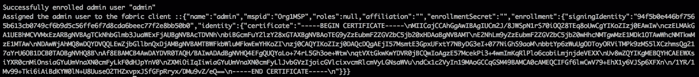

# 使用 NodeJS SDK 为 Hyperledger Fabric 设置 RESTful API 服务器

> 原文：<https://medium.com/hackernoon/setting-up-restful-api-server-for-hyperledger-fabric-with-nodejs-sdk-a4642edaf98e>

了解如何为您的[区块链](https://hackernoon.com/tagged/blockchain)网络设置 NodeJS 服务器，以允许多个用户轻松地与链进行交互。


在上一篇文章中，我们学习了如何在 Go 中编写第一个简单的[Hyperledger Fabric](https://hackernoon.com/tagged/hyperledger-fabric)chain code，以及[如何为 Hyperledger Fabric](https://www.skcript.com/svr/setting-up-your-development-environment-for-hyperledger-fabric/) 设置开发环境。本文重点介绍如何使用 ExpressJS 为您的 Hyperledger Fabric 网络构建 NodeJS 服务器。

# 先决条件

在我进一步阅读本文之前，我将假设您熟悉与多个组织建立网络，并且假设您的机器上已经有一个网络在运行。(如果没有，请按照我们以前的文章来完成它们。)

如果你有以下方面的经验也很好，

*   JavaScript OOP 概念
*   Javascript 承诺
*   服务器路由和 HTTP 方法。
*   ExpressJS

# 步骤 1:设置项目

作为任何项目的第一步，我们将创建文件夹和文件结构。

```
mkdir myapp
cd myapp
touch index.js
npm install express fabric-ca-client fabric-client body-parser --save
```

包`fabric-ca-client` & `fabric-client`是帮助我们与光纤网络交互的包，`express`是为 RESTFul API 创建 web 服务器，最后`body-parser`解析请求体中传递的数据。

# 步骤 2:创建连接配置文件和加密配置

设置完成后，我们需要创建一个公共连接配置文件，其中包含有关当前组织的对等方、订购方和 CA 的信息，以便客户端可以与相应的服务进行通信。

我已经在`Config/ConnectionProfile.yml`下创建了一个文件

```
name: "Org1 Client"
version: "1.0"client:
  organization: Org1
  credentialStore:
    path: "./hfc-key-store"
    cryptoStore:
      path: "./hfc-key-store"channels:
  mychannel:
    orderers:
      - orderer.example.com
    peers:
      peer0.org1.example.com:
        endorsingPeer: true
        chaincodeQuery: true
        ledgerQuery: true
        eventSource: true
      peer0.org2.example.com:
        endorsingPeer: true
        chaincodeQuery: false
        ledgerQuery: true
        eventSource: falseorganizations:
  Org1:
    mspid: Org1MSP
    peers:
      - peer0.org1.example.com
      - peer1.org1.example.com
    certificateAuthorities:
      - ca.org1.example.com
    adminPrivateKey:
      path: crypto-config/peerOrganizations/org1.example.com/users/Admin@org1.example.com/msp/keystore/1a11ffdebfb3bba13a7738dfa820a505002d29ba3e812657a127f27ba79345e5_sk
    signedCert:
      path: crypto-config/peerOrganizations/org1.example.com/users/Admin@org1.example.com/msp/signcerts/Admin@org1.example.com-cert.pemorderers:
  orderer.example.com:
    url: grpcs://localhost:7050
    grpcOptions:
      ssl-target-name-override: orderer.example.com
      grpc-max-send-message-length: 15
    tlsCACerts:
      path: crypto-config/ordererOrganizations/example.com/msp/tlscacerts/tlsca.example.com-cert.pempeers:
  peer0.org1.example.com:
    url: grpcs://localhost:7051
    eventUrl: grpcs://localhost:7053
    grpcOptions:
      ssl-target-name-override: peer0.org1.example.com
      grpc.keepalive_time_ms: 600000
    tlsCACerts:
      path: crypto-config/peerOrganizations/org1.example.com/peers/peer0.org1.example.com/msp/tlscacerts/tlsca.org1.example.com-cert.pem peer1.org1.example.com:
    url: grpcs://localhost:8051
    eventUrl: grpcs://localhost:8053
    grpcOptions:
      ssl-target-name-override: peer1.org1.example.com
      grpc.keepalive_time_ms: 600000
    tlsCACerts:
      path: crypto-config/peerOrganizations/org1.example.com/peers/peer1.org1.example.com/msp/tlscacerts/tlsca.org1.example.com-cert.pemcertificateAuthorities:
  ca.org1.example.com:
    url: https://localhost:7054
    httpOptions:
      verify: false
    tlsCACerts:
      path: crypto-config/peerOrganizations/org1.example.com/ca/ca.org1.example.com-cert.pem
    registrar:
      - enrollId: admin
        enrollSecret: adminpw
    caName: ca-org1
```

这里要注意的重要事情是应用程序将用来存储密钥和证书的凭证存储。

有关连接配置文件的详细说明，请查看[https://fabric-SDK-node . github . io/tutorial-network-config . html](https://fabric-sdk-node.github.io/tutorial-network-config.html)。

# 第三步。创建用于生成管理加密材料的脚本。

为了从客户端提交事务，您需要在 SDK 中设置用户内容。但是，在此之前，我们需要为组织的管理员注册并获得证书。下面是一个简单的脚本，`./enrollAdmin.js`

```
'use strict';
var fabricClient = require('./Config/FabricClient');
var FabricCAClient = require('fabric-ca-client');var connection = fabricClient;
var fabricCAClient;
var adminUser;connection.initCredentialStores().then(() => {
  fabricCAClient = connection.getCertificateAuthority();
  return connection.getUserContext('admin', true);
}).then((user) => {
  if (user) {
    throw new Error("Admin already exists");
  } else {
    return fabricCAClient.enroll({
      enrollmentID: 'admin',
      enrollmentSecret: 'adminpw',
      attr_reqs: [
          { name: "hf.Registrar.Roles" },
          { name: "hf.Registrar.Attributes" }
      ]
    }).then((enrollment) => {
      console.log('Successfully enrolled admin user "admin"');
      return connection.createUser(
          {username: 'admin',
              mspid: 'Org1MSP',
              cryptoContent: { privateKeyPEM: enrollment.key.toBytes(), signedCertPEM: enrollment.certificate }
          });
    }).then((user) => {
      adminUser = user;
      return connection.setUserContext(adminUser);
    }).catch((err) => {
      console.error('Failed to enroll and persist admin. Error: ' + err.stack ? err.stack : err);
      throw new Error('Failed to enroll admin');
    });
  }
}).then(() => {
    console.log('Assigned the admin user to the fabric client ::' + adminUser.toString());
}).catch((err) => {
    console.error('Failed to enroll admin: ' + err);
});
```

还有一个名为`./Config/FabricClient`的文件，它扩展了 FabricClient SDK 的功能，以提供增强的特性。

现在您可以运行上面的脚本来生成一个管理证书，它将被存储在`ConnectionProfile.yml`中提到的加密存储中

```
node enrollAdmin.js
```

相应的结果应该是这样的，



```
var FabricClient = require('fabric-client');
var fs = require('fs');
var path = require('path');var configFilePath = path.join(__dirname, './ConnectionProfile.yml');
const CONFIG = fs.readFileSync(configFilePath, 'utf8')class FBClient extends FabricClient {
    constructor(props) {
        super(props);
    } submitTransaction(requestData) {
        var returnData;
        var _this = this;
        var channel = this.getChannel();
        var peers = this.getPeersForOrg();
        var event_hub = this.getEventHub(peers[0].getName());
        return channel.sendTransactionProposal(requestData).then(function (results) {
            var proposalResponses = results[0];
            var proposal = results[1];
            let isProposalGood = false; if (proposalResponses && proposalResponses[0].response &&
                proposalResponses[0].response.status === 200) {
                isProposalGood = true;
                console.log('Transaction proposal was good');
            } else {
                throw new Error(results[0][0].details);
                console.error('Transaction proposal was bad');
            }
            returnData = proposalResponses[0].response.payload.toString();
            returnData = JSON.parse(returnData); if (isProposalGood) {
                console.log(
                    'Successfully sent Proposal and received ProposalResponse: Status - %s, message - "%s"',
                    proposalResponses[0].response.status, proposalResponses[0].response.message); var request = {
                    proposalResponses: proposalResponses,
                    proposal: proposal
                }; var transaction_id_string = requestData.txId.getTransactionID();
                var promises = []; var sendPromise = channel.sendTransaction(request);
                promises.push(sendPromise);                let txPromise = new Promise((resolve, reject) => {
                    let handle = setTimeout(() => {
                        event_hub.disconnect();
                        resolve({ event_status: 'TIMEOUT' });
                    }, 3000);
                    event_hub.connect(); event_hub.registerTxEvent(transaction_id_string, (tx, code) => {
                        clearTimeout(handle);
                        event_hub.unregisterTxEvent(transaction_id_string);
                        event_hub.disconnect(); var return_status = { event_status: code, tx_id: transaction_id_string };
                        if (code !== 'VALID') {
                            console.error('The transaction was invalid, code = ' + code);
                            resolve(return_status);
                        } else {
                            console.log('The transaction has been committed on peer ' + event_hub._ep._endpoint.addr);
                            resolve(return_status);
                        }
                    }, (err) => {
                        console.log(err)
                        reject(new Error('There was a problem with the eventhub ::' + err));
                    });
                });
                promises.push(txPromise); return Promise.all(promises);
            } else {
                console.error('Failed to send Proposal or receive valid response. Response null or status is not 200\. exiting...');
                throw new Error('Failed to send Proposal or receive valid response. Response null or status is not 200\. exiting...');
            }
        }).then((results) => {
            console.log('Send transaction promise and event listener promise have completed');
            if (results && results[0] && results[0].status === 'SUCCESS') {
                console.log('Successfully sent transaction to the orderer.');
            } else {
                console.error('Failed to order the transaction. Error code: ' + response.status);
            } if (results && results[1] && results[1].event_status === 'VALID') {
                console.log('Successfully committed the change to the ledger by the peer');
            } else {
                console.log('Transaction failed to be committed to the ledger due to ::' + results[1].event_status);
            }
        }).then(function () {
            return returnData;
        })
    } query(requestData) {
        var channel = this.getChannel();
        return channel.queryByChaincode(requestData).then((response_payloads) => {
            var resultData = JSON.parse(response_payloads.toString('utf8'));
            return resultData;
        }).then(function(resultData) {
            if (resultData.constructor === Array) {
                resultData = resultData.map(function (item, index) {
                    if (item.data) {
                        return item.data
                    } else {
                        return item;
                    }
                })
            } return resultData;
        });
    }
}var fabricClient = new FBClient();
fabricClient.loadFromConfig(configFilePath);module.exports = fabricClient;
```

在上面的脚本中，我扩展了基本客户端，并创建了一个函数来提交事务并查询数据以在检索后清理数据。这些将用于将来的目的。

# 步骤 4:创建基本端点

现在我们所有的基本东西都准备好了，让我们从提交一个名为`sell`的事务的端点开始。

```
const express = require('express')
const app = express()
var bodyParser = require('body-parser')//Attach the middleware
app.use( bodyParser.json() );app.post('/api/sell', function (req, res) {
  // ...
})
```

# 第五步。建立一个模型类

我们将创建一个模型类，它将像一个库函数一样执行一组与应用程序相关的操作，这些操作将由每条路由使用。

```
var fabricClient = require('./Config/FabricClient');
var FabricCAClient = require('./Config/FabricCAClient');class ExampleNetwork { constructor(userName) {
    this.currentUser;
    this.issuer;
    this.userName = userName;
    this.connection = fabricClient;
  } init() {
    var isAdmin = false;
    if (this.userName == "admin") {
      isAdmin = true;
    }
    return this.connection.initCredentialStores().then(() => {
      return this.connection.getUserContext(this.userName, true)
    }).then((user) => {
      this.issuer = user;
      if (isAdmin) {
        return user;
      }
      return this.ping();
    }).then((user) => {
      this.currentUser = user;
      return user;
    })
  } sell(data) {
    var tx_id = this.connection.newTransactionID();
    var requestData = {
      fcn: 'createProduct',
      args: [data.from, data.to, data.product, data.quantity],
      txId: tx_id
    };
    var request = FabricModel.requestBuild(requestData);
    return this.connection.submitTransaction(request);
  }
}
```

在上面的代码中，你会注意到我们再次使用了和以前一样的`fabricClient`。此外，我们有一个向系统提交`sell`交易建议的功能。

在这里，模型接受构造函数中的`userName`，并将其设置为客户端当前实例的上下文。在我们的例子中，管理员将签署这个交易。

# 步骤 6:桥接库和服务器端点

一旦我们创建了库和服务器端点，让我们从服务器函数调用库，如下所示。

```
const ExampleNetwork = require('./ExampleNetwork');
app.post('/api/sell', function(req, res) {
        var data = req.body.data;
        var exampleNetwork = new ExampleNetwork('admin');exampleNetwork.init().then(function(data) {
          return exampleNetwork.sell(data)
        }).then(function (data) {
          res.status(200).json(data)
        }).catch(function(err) {
          res.status(500).json({error: err.toString()})
        })
})
```

如果您注意到，上面的代码使用 admin 作为用户名与网络交互。如果您有多个用户，只要证书存在于存储中，您就可以使用相应的用户名呼叫网络。在我的下一篇文章中，我将解释如何为多用户场景处理用户管理和会话管理。