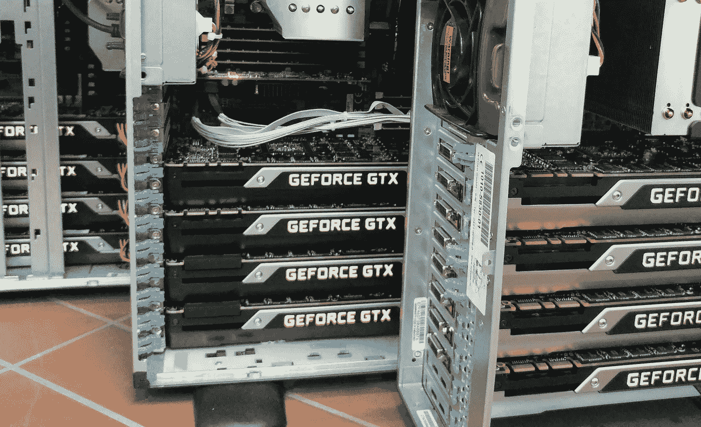

# 设置您的 GPU 机器为深度学习做好准备

> 原文：<https://medium.com/hackernoon/setting-up-your-gpu-machine-to-be-deep-learning-ready-96b61a7df278>



你好，

这篇教程是我上一篇文章的松散延续，一定要看一看。

[](https://hackernoon.com/deep-learning-with-google-cloud-platform-66ada9d7d029) [## 借助谷歌云平台实现 GPU 支持的深度学习

### 我知道，高端深度学习 GPU 支持的系统非常昂贵，而且不容易获得，除非你…

hackernoon.com](https://hackernoon.com/deep-learning-with-google-cloud-platform-66ada9d7d029) 

这是在假设你有一台带 GPU 的裸机的情况下编写的，如果它是部分预设置的，请随意跳过一些部分，我还假设你有一张 NVIDIA 卡，我们将在本教程中只介绍 TensorFlow 的设置，这是最受欢迎的深度学习框架(向 Google 致敬！)

# **安装 CUDA 驱动程序**

CUDA 是 NVIDIA 的并行计算平台，是 TensorFlow 的基本前提。但是后面我们会明白，其实反过来开始更好，所以后面再回到这个部分。

# 安装 TensorFlow

启动您的终端(或者 SSH，如果是远程机器)。找到您的特定应用所需的 TensorFlow 版本(如果有)，或者如果没有这种限制，我们就使用我目前使用的 TensorFlow 1.8.0。

> pip 安装 tensorflow-gpu==1.8.0

让它安装。现在转到 Python shell，

> 大蟒

在 Python shell 中，键入:

> 将张量流作为 tf 导入

此时，由于我们没有安装 CUDA，您应该会看到类似如下的错误:

> ImportError: libcublas.so.9.0:无法打开共享对象文件:没有这样的文件或目录

9.0 和文件名可能是其他名称，具体取决于您选择的 TensorFlow 版本。但是反其道而行之的全部意义在于知道我们需要哪个版本的 CUDA，在本例中是 9.0。官方文档对 TF 版和 CUDA 版的对应关系并不明确，所以我一直觉得这种逆向工程的方法比较好。

让我们回到安装 CUDA。

使用

> 退出()

退出 Python shell。

# 安装 CUDA 驱动程序(这次我们真的会做，我保证)

所以导航到 https://developer.nvidia.com/cuda-toolkit-archive 的。选择您刚刚在上面确定的版本。

Linux->x86_64->Ubuntu->16.04(或 17.04)->deb(网络)

将 deb 下载到您的机器上，并按照 NVIDIA 页面上的说明安装 CUDA。一旦完成，让我们检查是否一切顺利。

返回，重新打开 Python shell，

> 将张量流作为 tf 导入

所以我们还没有完成，您现在应该会看到一个稍微不同的错误消息。(如果您看到与之前相同的问题，请参考下面的“故障排除”)

> ImportError: libcudnn.so.7:无法打开共享对象文件:没有这样的文件或目录

我们还需要一个名为 cuDNN 的 NVIDIA 库，用于深度神经网络的 GPU 加速。再次注意我们需要的 cuDNN 版本，在本例中是 7.0。

导航到[https://developer.nvidia.com/cudnn](https://developer.nvidia.com/cudnn)并注册一个账户(免费)。在您创建帐户后，登录并进入 https://developer.nvidia.com/rdp/cudnn-archive[的](https://developer.nvidia.com/rdp/cudnn-archive)

选择所需的 cuDNN 版本，并确保您选择的 CUDA 版本。在这种情况下，我们需要，

*为 CUDA 9.0* 下载 cud nn v 7 . 0 . 5(2017 年 12 月 5 日)

在下拉选择中，

*cud nn v 7 . 0 . 5 Linux 库*

tgz 文件将开始下载，移动到您的机器，提取它使用

> tar -xzvf<cudnn_tar_filename></cudnn_tar_filename>

将提取一个文件夹“cuda ”, CD 到该目录，并执行这两个命令，

```
sudo cp lib64/* /usr/local/cuda/lib64/
sudo cp include/cudnn.h /usr/local/cuda/include/
```

我们完成了(希望如此)。再次启动 Python shell，您就知道该怎么做了。

如果这次它没有抛出任何错误，我们是好的。

为了确保 TensorFlow 能够检测到我们的 GPU，请在同一个 Python shell 上运行这个命令

> tf.test.gpu_device_name()

它应该打印出所有可用的 GPU。这在 TF 的旧版本上可能不起作用，如果是这样，请在您的终端上尝试这个:

> 英伟达-smi

# 解决纷争

如果你做的一切都是正确的，即使 *nvidia-smi* 工作，TensorFlow 仍然抛出相同的错误，这可能是环境路径变量的问题。执行以下操作来修复:

```
export LD_LIBRARY_PATH=/usr/local/cuda/lib64:${LD_LIBRARY_PATH}
export PATH=/usr/local/cuda/lib64:${PATH}
```

如果甚至 *nvidia-smi* 命令都不起作用，说明 CUDA 安装不正确，如果您遗漏了什么，请重新开始。

让我知道任何问题，建议或批评。

干杯。

*Saurabh 是印度瓦朗加尔国家理工学院计算机科学专业的本科生，目前是班加罗尔印度科学学院的研究实习生。*