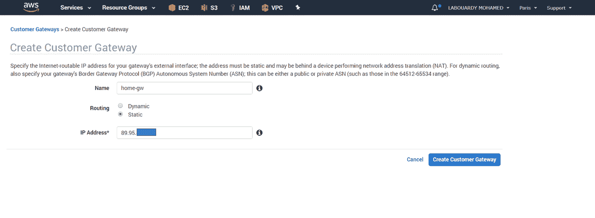
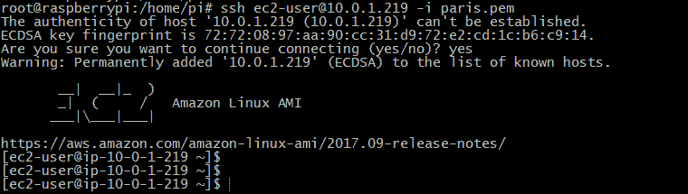

# 将 Raspberry PI 3 设置为 AWS VPN 客户网关

> 原文：<https://medium.com/hackernoon/setup-raspberry-pi-3-as-aws-vpn-customer-gateway-7432f653707>

在我的[上一篇文章](https://hackernoon.com/aws-openvpn-access-server-c9edaece035a)中，我向你展示了如何使用 **VPN 软件解决方案**，比如 **OpenVPN** ，来创建一个到你的 **AWS** 私有资源的安全隧道。在这篇文章中，我将带你一步一步地了解如何用一个 **Raspberry PI** 作为**客户网关**，从你的家庭网络建立到你的远程 **AWS VPC 子网**的安全桥。

首先，找到您的**家庭路由器**面向公众的 IP 地址:

接下来，登录 [AWS 管理控制台](http://console.aws.amazon.com/console/home?region=us-east-1)，导航到 **VPC 仪表板**并创建一个新的 **VPN 客户网关**:

接下来，创建一个**虚拟专用网关**:

并将其连接到目标 **VPC** :

然后，创建与**客户网关**和**虚拟专用网关**的 **VPN 连接**:

注意:确保将您的**主 CIDR 子网**添加到**静态 IP 前缀**部分。

一旦 **VPN 连接**被创建，点击“**隧道详细信息**”选项卡，您应该看到两条冗余隧道:

创建 VPN 连接可能需要几分钟时间。准备好后，选择连接，选择“**下载配置**，打开配置文件，记下您的**预共享密钥**和**隧道 IP** :

我用了一个**Raspberry PI 3**(Quand Core CPU 1.2 GHz，1 GB RAM)搭配 **Raspbian** ，启用 **SSH server** (默认用户名&密码: *pi* / *raspberry* ，你可以登录并开始操作 PI:

**必须安装 IPsec** 内核支持。因此，您必须在您的 PI 上安装 **openswan** :

> sudo apt-get install-y open swan lsof

更新 */etc/ipsec.conf* 文件，如下所示:

在*/etc/IPsec . d/home-to-AWS . conf*中创建新的 **IPsec 连接**:

*   **左**:你的树莓派私人 IP。
*   **leftid** :您的家用路由器面向公众的 IP。
*   **左子网**:您的主子网的 CIDR。
*   **右**:虚拟专用网关隧道 IP。
*   **右子网**:你 VPC 的 CIDR。

将隧道**预共享密钥**添加到*/var/lib/open swan/IPSec . secrets . Inc*:

> 89.95 . x . y 52.47.119.151:PSK

要启用 **IPv4 转发**，请编辑 */etc/sysctl.conf* ，并确保以下行未被注释:

运行 *sysctl -p* 重新加载。然后，重启 **IPsec** 服务:

> 服务 ipsec 重新启动

验证服务是否正常运行:

如果您返回到您的 **AWS 仪表板，**您应该看到第一通道状态变为 **UP** :

添加一个新的路由条目，通过 VPN 网关将流量转发到您的家庭子网:

注意:按照上述相同步骤设置第二个隧道，以实现 VPN 连接的弹性和高可用性。

在私有子网中启动一个 **EC2 实例**来验证 VPN 连接:

只允许从你的**家庭网关 CIDR** 使用 SSH:

创建实例后，使用服务器私有 ip 地址通过 **SSH** 进行连接:

恭喜你！现在，您可以安全地连接到您的私有 EC2 实例。

为了进一步从同一个**家庭网络**中的其他机器进行连接，添加一个静态路由，如下所述:

**1 —窗户**

> 路由添加 10.0.0.0 掩码 255.255.0.0 192.168.1.81

**2 — Linux**

> sudo 上行路由添加网络 10.0.0.0 网络掩码 255.255.0.0 gw 192.168.31.232

**3 —麦克·OS X**

> sudo route -n 地址 10.0.0.0/16 192.168.31.232

测试一下:

