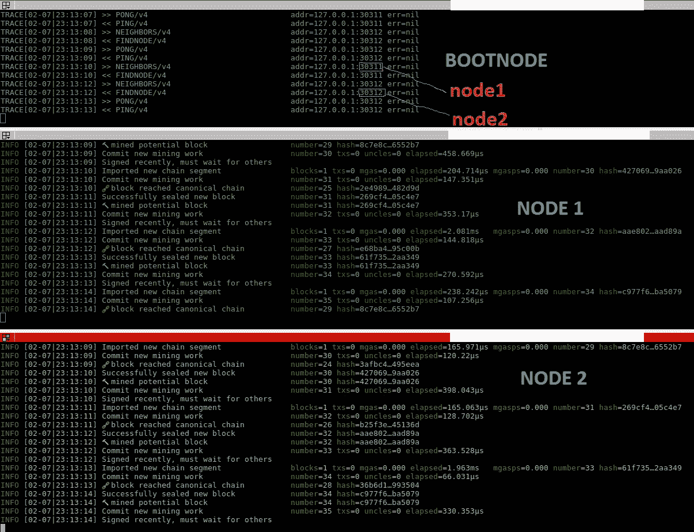

# 使用 Geth 设置您自己的私人权威认证以太坊网络

> 原文：<https://medium.com/hackernoon/setup-your-own-private-proof-of-authority-ethereum-network-with-geth-9a0a3750cda8>


2018 年 2 月。

**更新**:

1.  geth 1.8 是在本指南发布后几天发布的，幸运的是它没有破坏任何东西。这篇文章是有效的，并且在 geth 1.7.3 和 geth 1.8 上都经过了测试。厉害了:)
2.  我后知后觉*每个区块的气限是[动态](https://github.com/ethereum/go-ethereum/issues/2185)。因此，我更新了第 2.3 节，提供了更多关于这种特殊情况的信息。在我的私人网络中，大部分时间都是空闲的，我根本不知道要减少多少限制！*
3.  *Clique 要求`int(N/2+1)`封口机(其中 N 是起源文件中定义的封口机数量——在`extraData`字段中)在线才能运行。*
4.  *感谢 [PoA 没有采矿奖励

    所以我强烈建议你在 genesis 文件中给一堆地址分配一些 ether(以 wei 为单位定义),否则你会在没有任何 ether 的情况下放弃，从而无法支付你的交易。您可以将`gasPrice`设为 0，但这有时会导致节点出现不受欢迎的行为，这些行为可能会被发现(比如不广播未决事务，这取决于网络上其他节点的配置)。不过，我鼓励您尝试每个参数:)

    ## 1.4 初始化您的节点

    现在我们有了`genesis.json`文件，让我们来伪造创世块吧！每个节点**必须用**相同的**起源文件**初始化。

    ```
    devnet$ geth --datadir node1/ init genesis.json
    devnet$ geth --datadir node2/ init genesis.json
    ```

    tada！完成了。](https://medium.com/u/e7ef0de8aa9c#225 </a></p><blockquote class=) 

    [***旁注*** :你的节点在加入以太坊主网或者 Ropsten testnet，或者 Rinkeby testnet 的时候是怎么知道 genesis 参数的？它们已经在`params/config.go`的](https://medium.com/u/e7ef0de8aa9c#225 </a></p><blockquote class=)[源代码](https://github.com/ethereum/go-ethereum/blob/master/params/config.go)中定义好了。

    ## 1.5 创建启动节点

    bootnode 唯一的目的是帮助节点发现彼此(记住，以太坊区块链是一个对等网络)。节点可以有动态 IP，关闭后再打开。bootnode 通常运行在静态 IP 上，因此就像一个酒馆，节点知道它们会在那里找到自己的伙伴。

    初始化启动节点:

    ```
    devnet$ bootnode -genkey boot.key
    ```

    这创建了一个名为`enode`的值，唯一地标识您的 bootnode(稍后会有更多的介绍)，我们将这个 enode 存储在`boot.key`文件中。

    ## 1.6 中途庆祝

    恭喜你。第一章做完了:)试试

    ```
    devnet$ tree -L 2
    ```

    并将输出与第 1.0 节进行比较。希望你能得到同样的树。

    至此，设置已经完成，我们已经准备好让区块链上线了。

    # 2.让它活起来

    ## 2.1 启动 bootnode 服务

    ```
    devnet$ bootnode -nodekey boot.key -verbosity 9 -addr :30310
    INFO [02-07|22:44:09] UDP listener up                          self=enode://3ec4fef2d726c2c01f16f0a0030f15dd5a81e274067af2b2157cafbf76aa79fa9c0be52c6664e80cc5b08162ede53279bd70ee10d024fe86613b0b09e1106c40@[::]:30310
    ```

    我喜欢让我的 bootnode 变得冗长，因为当节点在网络上打乒乓时看起来很好(意味着它正在工作！).

    您可以随意使用任何您喜欢的端口，但请避免使用主流端口(如 HTTP 的 80 端口)。`30303`用于公共以太网。

    ## 2.2 启动节点

    大时代！最后(但通常麻烦也会随之而来)。

    一切尽在一个巨大的命令中！我将介绍一些选项，但请做好您的功课并参考[文档](https://github.com/ethereum/go-ethereum/wiki/Command-Line-Options)。

    开始节点 1

    ```
    devnet$ geth --datadir node1/ --syncmode 'full' --port 30311 --rpc --rpcaddr 'localhost' --rpcport 8501 --rpcapi 'personal,db,eth,net,web3,txpool,miner' --bootnodes 'enode://3ec4fef2d726c2c01f16f0a0030f15dd5a81e274067af2b2157cafbf76aa79fa9c0be52c6664e80cc5b08162ede53279bd70ee10d024fe86613b0b09e1106c40@127.0.0.1:30310' --networkid 1515 --gasprice '1' -unlock '0x87366ef81db496edd0ea2055ca605e8686eec1e6' --password node1/password.txt --mine
    ```

    *   `--syncmode 'full'`有助于防止错误[丢弃不良传播块](https://github.com/ethereum/go-ethereum/issues/14945)。
    *   `--port 30311`是 node1 的 enode 端口，它必须不同于 bootnode 端口(如果您按照我的命令操作，那就是`30310`),因为我们在本地主机上。在真实的网络中(每台机器一个节点)，使用相同的端口。
    *   `--rpcapi`允许通过 RPC 调用使用列出的模块(参见第 3.3 节的示例)。更多信息见[Geth 管理 API](https://github.com/ethereum/go-ethereum/wiki/Management-APIs)。请注意黑客攻击，因为如果没有防火墙保护您的节点，每个人都可以调用您的 RPC 方法。
    *   `--bootnodes`告诉你的节点在什么地址找到你的引导节点。用 bootnode IP 替换`[::]`。不允许使用域名！只有 IP。[检查 enode URL 格式](https://github.com/ethereum/wiki/wiki/enode-url-format)。
    *   `--networkId`如`genesis.json`文件中所定义。请使用相同的 id！
    *   `--gasprice '1'`我不喜欢在自己的网络上付费:)小心 gasprice。如果您的交易没有被广播到网络，而是只有接收交易的节点在处理它们，这意味着您发送的交易的 gasprice 不被网络上的其他节点接受(太低)。不会返回任何错误。如果有两个节点，只有一个节点会处理事务。这是偷偷摸摸的，会使你的网络吞吐量降低 2 倍。
    *   `--unlock`
    *   `--targetgaslimit value`参见 2.3 节中的**更新**。

    节点 2 也是如此(更新特定于该节点的参数)

    ```
    devnet$ geth --datadir node2/ --syncmode 'full' --port 30312 --rpc --rpcaddr 'localhost' --rpcport 8502 --rpcapi 'personal,db,eth,net,web3,txpool,miner' --bootnodes 'enode://3ec4fef2d726c2c01f16f0a0030f15dd5a81e274067af2b2157cafbf76aa79fa9c0be52c6664e80cc5b08162ede53279bd70ee10d024fe86613b0b09e1106c40@127.0.0.1:30310' --networkid 1515 --gasprice '0' --unlock '0x08a58f09194e403d02a1928a7bf78646cfc260b0' --password node2/password.txt --mine
    ```

    此时，bootnode 应该对来自 node1(端口 30311)和 node2(端口 30312)的连接进行流式传输，如上面的终端窗口所示。Node1(中端)和 node2(下端)应该是高高兴兴的挖矿签名区块了。这里我有一个 1 秒的周期(在 genesis 文件中定义),因此快速块创建。

    

    ## 2.3 更新您的 genesis 文件

    我相信你会想要修改你的 genesis 文件中的一些值。去吧！但是，为了使这些更改生效，我们必须初始化一个新的区块链。以下是我目前正在使用的 genesis 文件:

    ```
    {
        "config": {
            "chainId": 1515,
            "homesteadBlock": 1,
            "eip150Block": 2,
            "eip150Hash": "0x0000000000000000000000000000000000000000000000000000000000000000",
            "eip155Block": 3,
            "eip158Block": 3,
            "byzantiumBlock": 4,
            "clique": {
                "period": 1,
                "epoch": 30000
            }
        },
        "nonce": "0x0",
        "timestamp": "0x5a722c92",
        "extraData": "0x000000000000000000000000000000000000000000000000000000000000000008a58f09194e403d02a1928a7bf78646cfc260b087366ef81db496edd0ea2055ca605e8686eec1e60000000000000000000000000000000000000000000000000000000000000000000000000000000000000000000000000000000000000000000000000000000000",
        "gasLimit": "0x59A5380",
        "difficulty": "0x1",
        "mixHash": "0x0000000000000000000000000000000000000000000000000000000000000000",
        "coinbase": "0x0000000000000000000000000000000000000000",
        "alloc": {
            "08a58f09194e403d02a1928a7bf78646cfc260b0": {
                "balance": "0x200000000000000000000000000000000000000000000000000000000000000"
            },
            "87366ef81db496edd0ea2055ca605e8686eec1e6": {
                "balance": "0x200000000000000000000000000000000000000000000000000000000000000"
            },
            "F464A67CA59606f0fFE159092FF2F474d69FD675": {
                "balance": "0x200000000000000000000000000000000000000000000000000000000000000"
            }
        },
        "number": "0x0",
        "gasUsed": "0x0",
        "parentHash": "0x0000000000000000000000000000000000000000000000000000000000000000"
    }
    ```

    我已经清理了 puppeth 在创建文件时包含的空地址(在 1.3 节)。我还添加了第三个地址，该地址在创建 genesis 块时得到资助。然后，我将`period`从 15 秒更改为 1，以便更快地挖掘这些块(注意，一个空块重 1024 字节——这里我的`chaindata/`文件夹每秒增加 1024 字节(如果块不为空，则增加更多)。最后，我增加了`gasLimit`,以允许每个块有更多的事务(确切地说，计算)。

    **更新**:genesis 文件中定义的`gasLimit`只适用于 genesis 块！新区块的`gasLimit`是 [**动态**](https://github.com/ethereum/go-ethereum/issues/2185) 的，这意味着它的值随着时间而变化，这取决于母(先前)区块中使用了多少天然气。新`gasLimit`的计算在函数`CalcGasLimit` ( [github 源](https://github.com/ethereum/go-ethereum/blob/master/core/block_validator.go#L106))中完成。如果您想要一个恒定的气体极限，运行 geth 时使用[选项](https://github.com/ethereum/go-ethereum/wiki/Command-Line-Options) `--targetgaslimit intValue`。我建议将它设置为等于 genesis 文件中的`gasLimit`(命令选项是一个整数，而 genesis 值是十六进制的)，这样您就可以获得一个不随时间变化的恒定气体限制。给定上面带有`"gasLimit":"0x59A5380"`的 genesis 文件，我用`--targetgaslimit 94000000`运行我的节点，以获得所有块的恒定气体限制。

    字段`extraData`包含允许密封的地址(这就是为什么 puppeth 很好拥有的原因)。

    我调查了改变`period`和`gasLimit`对区块链每秒可以处理的事务数量(事务速率)的影响。但那将是另一篇文章。点击这里。

    当你对你的创世纪文件满意的时候。如果您的节点正在运行，请终止它们(在终端中按 ctrl+C)。然后删除`node1/`中的文件夹`geth/`和`node2/`中的`geht/`。只删除`geth/`文件夹！

    然后初始化您的节点。来自第 1.4 节:

    ```
    devnet$ geth --datadir node1/ init genesis.json
    devnet$ geth --datadir node2/ init genesis.json
    ```

    并使用 2.2 节中的命令再次启动节点

    # 3.与您的节点互动

    很好，您的网络现已上线:)但如何连接并开始探索呢？

    ## 3.1 打开一个 Geth Javascript 控制台

    最简单也可能更直接的处理节点的方法可能是将一个 [Geth javascript 控制台](https://github.com/ethereum/go-ethereum/wiki/JavaScript-Console)附加到一个节点上。

    ## 3.1.1 通过 IPC

    IPC([**I**enter-**P**process**C**communication](https://en.wikipedia.org/wiki/Inter-process_communication))只在本地工作:你应该和你的节点在同一台机器上。打开一个额外的终端并连接到您的节点。要连接到节点 1:

    ```
    $ cd devnet
    devnet$ geth attach node1/geth.ipc
    Welcome to the Geth JavaScript console!instance: Geth/v1.7.3-stable-4bb3c89d/linux-amd64/go1.9
    coinbase: 0x87366ef81db496edd0ea2055ca605e8686eec1e6
    at block: 901 (Sat, 10 Feb 2018 21:15:30 CET)
     datadir: /home/salanfe/privateNetworks/devnet/node1
     modules: admin:1.0 clique:1.0 debug:1.0 eth:1.0 miner:1.0 net:1.0 personal:1.0 rpc:1.0 txpool:1.0 web3:1.0>
    ```

    文件`geth.ipc`仅在节点运行时创建。所以，如果你的 node1 关闭了，就不要指望能找到它。

    RPC 可以无限制地访问终端中列出的所有模块:`admin: 1.0 clique:1.0 debug:1.0 eth:1.0 miner:1.0 net:1.0 personal:1.0 rpc:1.0 txpool:1.0 web3:1.0`

    ## 通过 RPC

    RPC([**R**emote**P**procedure**C**all](https://en.wikipedia.org/wiki/Remote_procedure_call))作为 HTTP 请求在互联网上工作。因此，当您向外界开放 RPC 时要小心，因为每个人都可以访问您的节点。因此，RPC 在默认情况下是禁用的，启用时，它不会提供对所有模块的访问。在本指南中，我们使用命令`--rpc`允许 Geth 节点上的 RPC，并允许访问模块`personal,db,eth,net,web3,txpool,miner`(来自 2.2 节)。使用 RPC 连接到节点 1:

    ```
    $ cd devnet
    devnet$ geth attach 'http://localhost:8501'
    Welcome to the Geth JavaScript console!instance: Geth/v1.7.3-stable-4bb3c89d/linux-amd64/go1.9
    coinbase: 0x87366ef81db496edd0ea2055ca605e8686eec1e6
    at block: 945 (Sat, 10 Feb 2018 21:16:14 CET)
     modules: eth:1.0 miner:1.0 net:1.0 personal:1.0 rpc:1.0 txpool:1.0 web3:1.0>
    ```

    ## 3.1.3 使用 Geth Javascript 控制台

    下面是一些方法的例子

    ```
    > net.version
    "1515"
    > eth.blockNumber
    1910
    > eth.coinbase
    "0x87366ef81db496edd0ea2055ca605e8686eec1e6"
    > eth.sendTransaction({'from':eth.coinbase, 'to':'0x08a58f09194e403d02a1928a7bf78646cfc260b0', 'value':web3.toWei(3, 'ether')})
    "0x299a99baa1b39bdee5f02e3c660e19e744f81c2e886b5fc24aa83f92fe100d3f"
    > eth.getTransactionReceipt("0x299a99baa1b39bdee5f02e3c660e19e744f81c2e886b5fc24aa83f92fe100d3f")
    {
      blockHash: "0x212fb593980bd42fcaf3f6d1e6db2dd86d3764df8cac2d90408f481ae7830de8",
      blockNumber: 2079,
      contractAddress: null,
      cumulativeGasUsed: 21000,
      from: "0x87366ef81db496edd0ea2055ca605e8686eec1e6",
      gasUsed: 21000,
      logs: [],
      logsBloom: "0x00000000000000000000000000000000000000000000000000000000000000000000000000000000000000000000000000000000000000000000000000000000000000000000000000000000000000000000000000000000000000000000000000000000000000000000000000000000000000000000000000000000000000000000000000000000000000000000000000000000000000000000000000000000000000000000000000000000000000000000000000000000000000000000000000000000000000000000000000000000000000000000000000000000000000000000000000000000000000000000000000000000000000000000000000000000",
      status: "0x1",
      to: "0x08a58f09194e403d02a1928a7bf78646cfc260b0",
      transactionHash: "0x299a99baa1b39bdee5f02e3c660e19e744f81c2e886b5fc24aa83f92fe100d3f",
      transactionIndex: 0
    }
    > exit // to quit the Geth javascript console
    ```

    有关方法的完整列表，请参见[管理 API](https://github.com/ethereum/go-ethereum/wiki/Management-APIs)和 [JSON RPC API](https://github.com/ethereum/wiki/wiki/JSON-RPC) 。

    ## 3.2 使用喷雾

    [Mist 浏览器](https://github.com/ethereum/mist)提供了一个图形用户界面，用于部署智能合同并与之交互，以及管理账户。要通过 IPC 将 Mist 连接到您的本地专用网络，只需执行以下操作:

    ```
    devnet$ mist --rpc node1/geth.ipc
    ```

    和通过 RPC(确保 RPC 已启用)

    ```
    $ mist --rpc 'http://localhost:8501'
    ```

    如果你想用[以太坊钱包](https://github.com/ethereum/mist/releases)代替 mist，程序完全一样。只需在上面的命令中用`ethereumwallet`代替 mist。

    ## 3.3 使用您最喜欢的编程语言进行 RPC 调用

    在 3.1 节中，我们看到了如何手工与 Geth API 交互。现在让我们用我们的电脑做它最擅长的事情:自动化。

    到目前为止，向节点发送 JSON-RPC 请求的参考是 [web3.js](https://github.com/ethereum/web3.js/) javascript 库。我相信互联网上有很多关于如何使用 web3.js 库的教程和例子。因此我不会在这里隐藏任何东西。

    JSON-RPC API 目前也在 java 中用 [web3.j](https://github.com/web3j/web3j) 库实现，在 python 中用 [web3.py](https://github.com/ethereum/web3.py) 库实现。这些库提供了使用以太坊区块链的高级方法，就像 web3.js 一样

    然而，也可以直接向您的节点发送原始的 [JSON-RPC](http://www.jsonrpc.org/specification) 请求。我认为这是值得一试的，因为它提供了对那些高级库如何在幕后工作的有价值的理解。

    下面是一个使用 python 3 向我的节点发送原始 JSON-RPC 请求的简单示例:

    ```
    $ python
    Python 3.6.4 |Anaconda custom (64-bit)| (default, Jan 16 2018, 18:10:19) 
    [GCC 7.2.0] on linux
    Type "help", "copyright", "credits" or "license" for more information.
    >>> import requests
    >>> import json
    >>> session = requests.Session()
    >>> method = 'eth_getTransactionCount'
    >>> params = ["0x627306090abaB3A6e1400e9345bC60c78a8BEf57","latest"]
    >>> PAYLOAD = {"jsonrpc":"2.0",
    ...            "method":method,
    ...            "params":params,
    ...            "id":67}
    >>> PAYLOAD = json.dumps(PAYLOAD)
    >>> headers = {'Content-type': 'application/json'}
    >>> response = session.post('[http://127.0.0.1:8501'](http://127.0.0.1:8501'), data=PAYLOAD, headers=headers)
    >>> response.content
    b'{"jsonrpc":"2.0","id":67,"result":"0x0"}\n'
    >>> json.loads(response.content)['result']
    '0x0'
    ```

    此处记录了`geth_transactionCount`方法[。](https://github.com/ethereum/wiki/wiki/JSON-RPC#eth_gettransactioncount)

    “帐户”[现时值](https://github.com/ethereum/wiki/wiki/Glossary)是一个交易计数器，与工作证明的现时值无关。账户随机数为零意味着地址`0x627306090abaB3A6e1400e9345bC60c78a8BEf57`从未在网络上进行任何交易:`0x0`是零的十六进制表示。

    ## 3.4 在您的专用网络上使用 Truffle 部署和测试您的智能合约

    像[松露](http://truffleframework.com/)(或者 [Embark](https://github.com/iurimatias/embark-framework) 、 [Populus](https://github.com/ethereum/populus) )这样的开发框架是开发和测试智能合约的好工具。

    当您使用初始化工作区时

    ```
    $ truffle init
    ```

    Truffle 创建了一系列文件和文件夹来帮助你开始。我通常这样编辑`truffle.js`文件

    ```
    module.exports = {
        // See <[http://truffleframework.com/docs/advanced/configuration](http://truffleframework.com/docs/advanced/configuration)>
        // to customize your Truffle configuration!
        networks: {
            devnet: {
                host: '127.0.0.1',
                port: 8501,
                network_id: '*'
            },
            ganache: {
                host: '127.0.0.1',
                port: 7545,
                network_id: '*'
            }
        }
    };
    ```

    然后使用命令

    ```
    $ truffle deploy --network devnet
    ```

    部署您在`migrations/X_deploy.js`中定义的智能合约。或者在`test/`运行你的测试

    ```
    $ truffle test --network devnet
    ```

    通常以太坊区块链模拟器 [Ganache](http://truffleframework.com/ganache/) 对于运行你的测试来说绰绰有余。然而，我喜欢使用我的私人区块链在真实节点上进行最终测试，而不仅仅是在模拟器上。对于 Ganache，我认为抽象层太大，它的优点是什么，但也是一个危险，因为它不需要了解真实节点的复杂性(交易池、gasPrice、gasLimit、节点之间的广播交易、挖掘或投票、计算时间、共识引擎等)。).

    # 下一步是什么？

    这就是本指南的基本内容。如果你理解这里的一切，我相信你已经走上了很好的轨道，你有一个坚实的基础，在这个基础上你可以充满信心地继续你的旅程。

    你可以通过获取一个 web3 库或者制作你自己定制的 JSON-RPC 包装器来开始开发 Dapps。

    在[这篇文章](/@ethervolution/ethereum-create-raw-json-rpc-requests-with-python-for-deploying-and-transacting-with-a-smart-7ceafd6790d9)中，我探索了如何使用 python 来部署和处理一个仅使用原始 HTTP 请求的智能契约。

    [](/@ethervolution/ethereum-create-raw-json-rpc-requests-with-python-for-deploying-and-transacting-with-a-smart-7ceafd6790d9) [## 以太坊:用 Python 创建原始的 JSON-RPC 请求，用于部署和处理智能…

    ### 2018 年 2 月。

    medium.com](/@ethervolution/ethereum-create-raw-json-rpc-requests-with-python-for-deploying-and-transacting-with-a-smart-7ceafd6790d9) 

    # 最后的话

    如果你坚持到最后，恭喜你。我希望这个指南是全面的，对你的旅程有所帮助。我欢迎任何改进本指南的反馈！

    非常感谢社区提供的所有文档、教程、问答网站和指南。

    黑客快乐！*