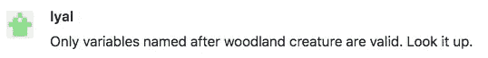
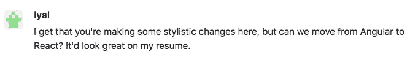
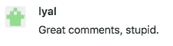
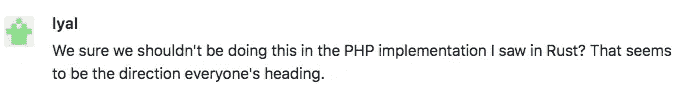
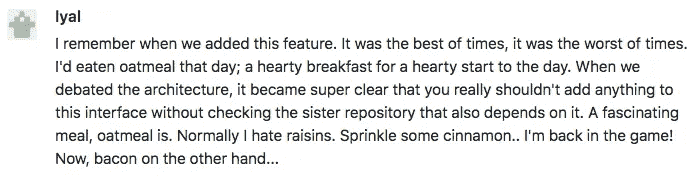
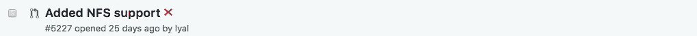

# 更有害的代码评审文化的七个习惯

> 原文：<https://medium.com/hackernoon/seven-habits-for-a-more-toxic-code-review-culture-69fc81eac3c>

请不要实践以下任何一条“建议”从初级开发人员到财富 500 强的首席技术官，我们都犯过软件开发中的错误。我们挑选了我们在代码评审中见过的最糟糕的例子，并把它们汇集成一个可怕的评审员:

听着——我明白了。你已经尽你所能确保没有人会要求你做代码审查，但是他们还是提升了你。现在你有一整个团队要和你一起被打倒，被打倒到有毒的代码审查文化的深处。

这并不容易——树敌从来都不容易——但是如果你遵循这七个高效的习惯，你的团队中甚至没有人会考虑提交一个拉取请求。更少的推动意味着更少的工作。双赢。

## 1.仅仅是事实——意见是给不太优秀的开发者的

不要浪费时间留下不真实的评论。去掉软化的语言，比如“我觉得”，永远不要用“我们”(除非你是被动攻击)。补充说，“函数式编程在上个季度已经过时了，Brent”一定会让你的所有队友发挥出最佳水平。

*例如*

## 2.根据样式拉取请求请求架构变更

他们已经在里面了，对吧？不要让他们偷懒，让我们调整数据库抽象来处理您在克林贡 UTF 支持上发现的边缘情况。等等……他们没有为与拉请求无关的事情增加测试？最好也建议那些。

*例如*

## 3.记住 ABA——永远攻击

关于虐待他人的朗朗上口的首字母缩略词不再只是为了销售。任何合理的请求都可以通过用“愚蠢的”、“你这个白痴”或“你为什么要写这个”来结束评论而得到改善大声说出他们明显缺乏知识。参考那篇关于处理一个相邻但不相关的问题的晦涩难懂的文章有加分。

*例如*

## 4.所有人都跟上潮流

我发烧了，唯一的处方是使用我几乎不理解的、无聊的解决方案。坚持作者对他们进行重构。因为谁知道呢？也许它们的实现会对你停滞不前的副业有所帮助。

*例如*

## 5.托尔斯泰比不上你

简洁的评论被高估了。人们欣赏和尊重的是在长度上可与大多数俄罗斯现实主义史诗相媲美的荒诞叙事。试着偷偷提及你早餐吃了什么，希望没人发现。在运球下面埋下有价值的反馈，这样你可以在合并后指向它，痛苦地抱怨从来没有人听你的。炒鸡蛋。

*例如*

## 6.像美酒一样陈年

生活中最美好的事情需要时间，包括你的评论。确保在你完成更有价值的活动时，开发人员和产品不会被打扰。那些迷因不会分享它们自己。

*例如*

## 7.对我来说看起来不错

*例如*

显然，遵循这些习惯中的任何一个都会导致团队走向灭亡，但是我们在与数千个团队一起工作的经历中已经看到了这些特征的影子。我们在这里帮助开发人员养成良好的习惯，提高代码质量。立即了解更多关于 PullRequest 的[代码审查即服务](https://www.pullrequest.com/?utm_source=hackernoon.com&utm_medium=referral&utm_campaign=7habits)的信息。

*感谢* [*亚当·内梅切克*](http://ngrid.io/) *审阅了这篇文章的初稿。*

*原载于 2018 年 8 月 17 日*[*www.pullrequest.com*](https://www.pullrequest.com/blog/7-habits-for-more-toxic-code-review/?utm_source=hackernoon.com&utm_medium=referral)*。*