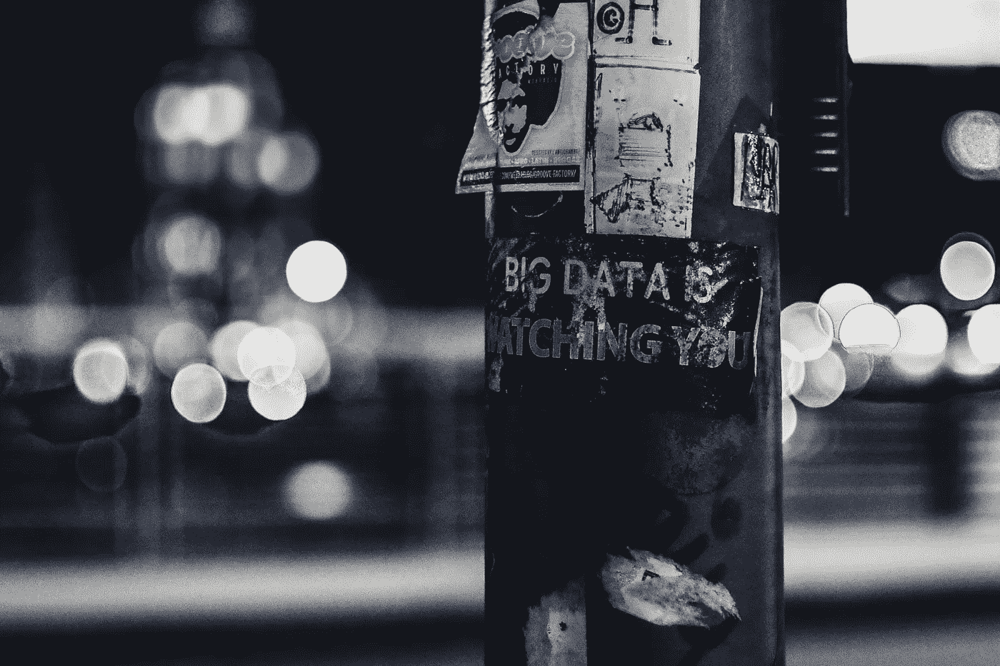
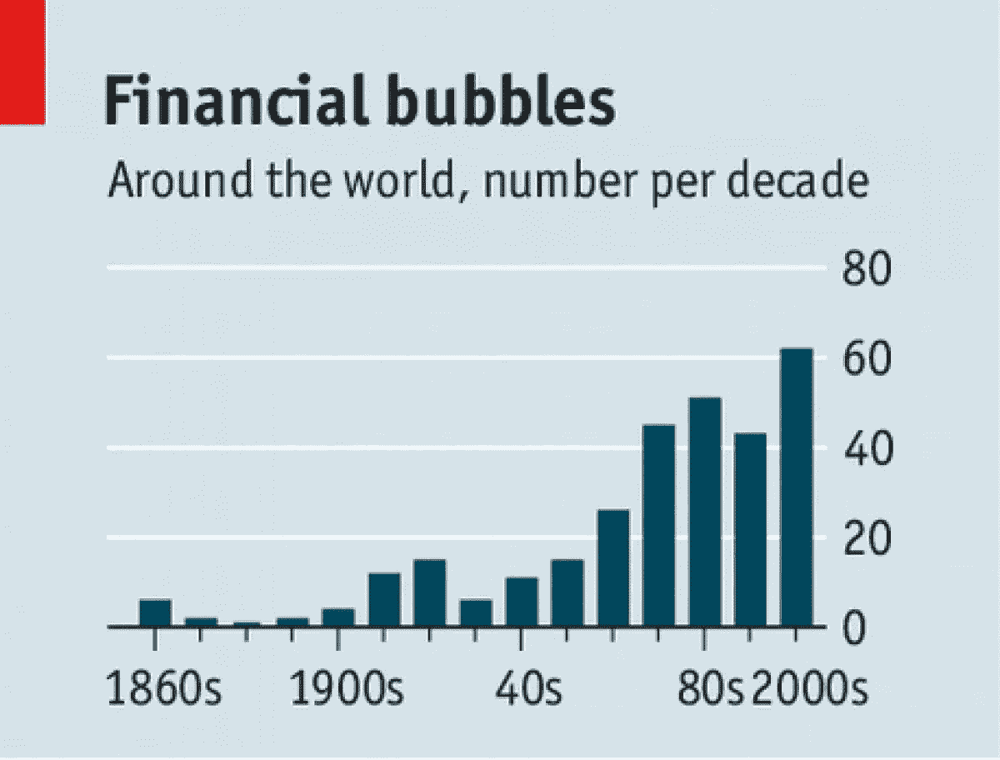
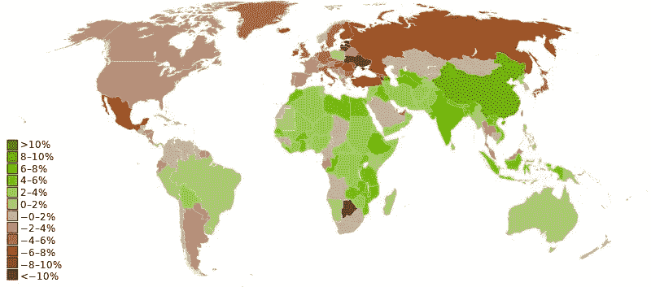
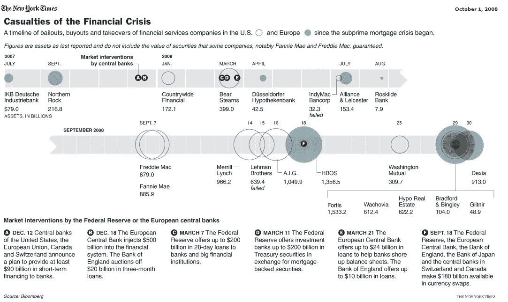
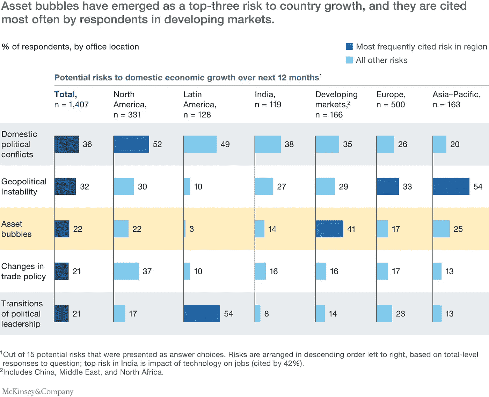
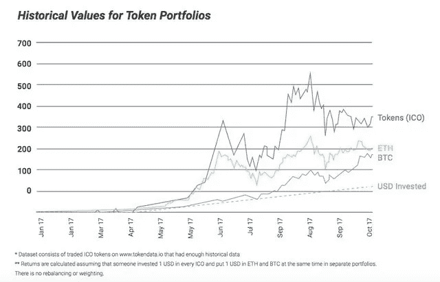
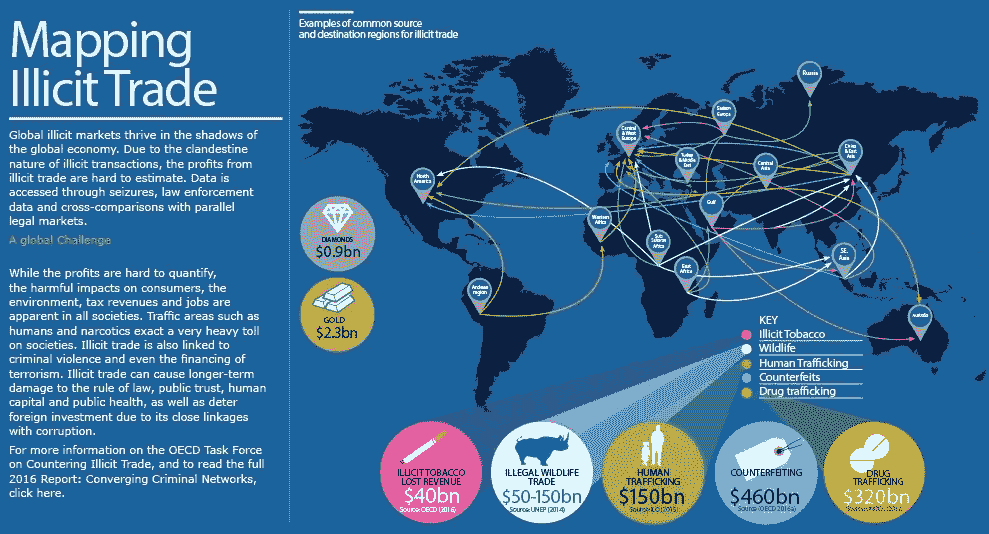
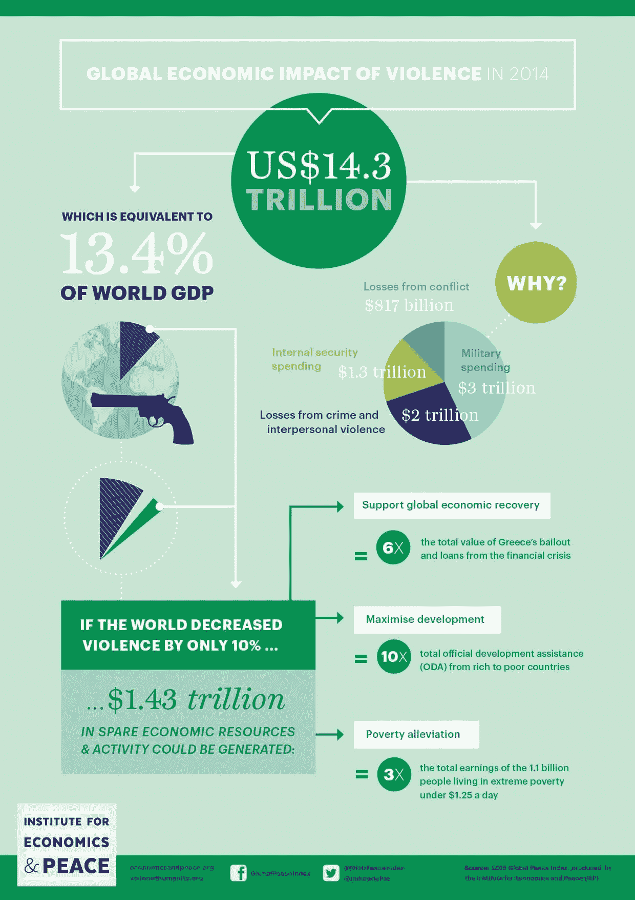

# 七宗罪公司。

> 原文：<https://medium.com/hackernoon/seven-sins-inc-9523574b2da8>

## 脸书、金融危机和社会腐蚀

Ev on Unsplash.com

> 我担心有一天科技会超越我们人类的互动。世界将有一代傻逼——爱因斯坦/粉(1995)

本周，脸书首席执行官面临美国国会议员为期两天的密集质询，内容涉及脸书无力保护其用户数据隐私。我必须承认我是一个社交媒体迷。脸书上的红色通知符号或我在 Twitter 上的推文被转发所带来的即时满足感是首屈一指的。在这个时代，我和许多人一样着迷。从 Snapchat 到 Musical.ly，我在几乎所有流行的社交媒体平台上都有账户。

所有这些观察，加上马克·扎克伯格在国会的证词，让我开始审视自己的粗鲁行为。我相信很多人和我一样焦虑。我不知道法定警告“社交媒体成瘾有害健康”是否足以阻止我们过度沉迷，但我知道我们的行为会腐蚀社会关系的基础。分享我们生活中的每一刻可能不仅会导致隐私的丧失，还会导致人性的丧失。这篇文章着眼于七宗罪是如何驱动企业乃至整个社会的。自古以来，这些罪恶代表着永远不会消失的原始本能。它们可以被管理和平衡。

没有自我调节，社会和整个文明的结果是不难想象的。

# 贪婪

金融危机清单是人类历史上不同时期贪婪达到顶峰的时间表。我们从贪婪到克制再到贪婪。令人不安的趋势是，全球的泡沫数量正在增加。

The Economist

近代史上最大的全球性传染是 2008-09 年的全球金融危机。到 2009 年底，世界上一半的国家都陷入了衰退。

Wikipedia: World map showing real GDP growth rates for 2009 (Countries in brown were in recession.)

从次级抵押贷款中获利的贪婪不仅吞噬了银行，还吞噬了国家、评级企业、中产阶级、纳税人和全世界的工人。

Bloomberg/NYTimes

2008 年危机的余波仍然挥之不去。根据麦肯锡 2017 年的一项调查，资产泡沫已成为国家增长的首要风险之一，特别是在发展中国家。发展中国家也有非常脆弱的中产阶级，他们严重依赖债务，通常储蓄较低，特别是当实际通胀超过工资增长时。

McKinsey Economic Conditions Snapshot, Sept. 2017

虽然有很多关于 2008 年金融危机的文献，但我建议阅读金融危机委员会的报告和 T2 的斯夸姆湖报告，以了解更多关于这场危机的信息。

# 羡慕

害怕错过(FOMO)是嫉妒的现代委婉说法。2017 年的加密货币狂潮导致了比特币、以太坊和初始硬币发行(ICO)的猖獗投机。中国不得不禁止 ICO，因为代币成了纸老虎企业筹集资金的通行证。即使没有任何商业模式，白皮书也成了 ICO 的计划书。当投资者看着他们的邻居一夜之间成为亿万富翁时，嫉妒驱使许多人为了明显的投机目标而赌上辛苦赚来的钱。就像任何新的和颠覆性的技术一样，聪明的投资者撤出他们的资本，留给普通人一文不值的资产和面临贫困的未来。很难将责任归咎于庞氏骗局的操作者，因为没有人类的嫉妒，他们就无法繁荣。我们越早明白没有免费的午餐越好。

虽然 ICO 在 2017 年共筹集了 56 亿美元，但许多投资者因 FOMO 或嫉妒而亏损。代币的总体回报率是投资的 12.8 倍，相比之下以太坊的回报率为 7.7 倍，比特币的回报率为 4.9 倍，这也是事实。

Businessinsider.com

大学时，我在一家股票研究公司实习了几个月。我会走过 Dalal 街(孟买的华尔街),听人们讲述抵押房子去炒股的故事。你可以猜到，结果从来都不好。

# 渴望

整个行业都依赖于欲望，据估计，这是一个价值 970 亿美元的庞然大物。宣传追求“甜爹”以偿还学生贷款的网站和宣传已婚男人出轨的网站一起蓬勃发展。

有些人可能会说，所有这些事情让婚姻免于破裂。虽然在某些情况下，这种观点可能是正确的，但欲望驱动了许多电影、杂志和整个行业。最重要的是，它推动了世界上最古老的职业。

对于所有与客户有着罪恶联系的企业来说，很难进行哪怕是很小的道德辩论。但话说回来，做出正确选择是人类的责任。

# 懒惰

“sloth”这个词是拉丁文术语 acedia(中古英语，accidie)的翻译，意思是“没有牵挂”。懒惰是最难定义的罪恶，但也可以被视为不愿意努力。也是不工作，懒惰，无所事事的代名词。

在现代社会，没有在正确的方向上尽足够的努力，或者缺乏做正确事情的纪律，都是懒惰的典型例子。精神消耗可以采取多种形式，比如阅读复杂的想法或广泛阅读，即剥夺大脑的健康营养。身体懒惰可能意味着不锻炼，不努力工作，不付出足够的努力。

在我看来，看过多的娱乐节目和无所事事的消磨时间是我懒惰的明显表现。走极端的话，这可能意味着不愿意为家庭赚钱或放弃作为家庭成员的基本职责。

例如，没有人知道人工智能(AI)将通过自动化夺走多少工作。然而，在我看来，我的懒惰之处在于没有为新的世界秩序做任何事情来重新培养自己。

# 贪食

暴食包括任何种类的过度放纵，即糖、脂肪、酒精、阿片类药物或其他对任何国家的年轻人都特别有害的受控物质。

OECD.org

虽然暴食是根据食物来定义的，而且有许多暴饮暴食的受害者，但现代世界已经看到了更邪恶的东西，那就是上瘾。

# 愤怒

虽然全面的常规战争是不可想象的，并保证彻底毁灭，世界似乎总是在外交和武力恫吓之间摇摆。除了无数人丧生之外，战争造成的严重经济负担是无法想象的。

愤怒有多种表现形式。对我来说，对所爱的人生气，使用不恰当的语言，在社交媒体上发布负面评论，公开展示我的愤怒，都是愤怒的形式。

# 骄傲

在希腊神话中，那西塞斯的毁灭是因为他爱上了自己的倒影。现代版的脸书正被我们自己的形象所吸引，等待着那些喜欢的人涌入。

在我看来，我自恋的表现已经超越了我与朋友和家人保持联系的需要。说实话，我不需要脸书来和我最亲密的朋友和家人保持联系。我们必须共同评估，我们是否都陷入了同一个怪圈，将自己的生活与他人进行比较，强调我们感觉优越的时候，然后将这些照片贴到脸书上。我不记得曾打开一本旧的家庭照片相册，甚至是一张旧的高中照片并微笑着。然而，我记得每次打开脸书，看着我最喜欢的照片，赞美我所谓的完美生活时，我都感觉自己像水仙一样。

我不停地问自己这些没有特定顺序的问题:这是我在脸书上发帖的原因吗？是我的自恋倾向战胜了我吗？这是今天每个人都做的吗？我们分享生活中的每一刻，只是为了意识到它们不是私人的吗？相反，它们是数据点，是利用我的自恋来创造永无止境的消费主义循环的市场商人的命脉。

老实说，我没有答案。当马克·扎克伯格在国会作证时，我意识到一部分责任在于我分享了我生活中的每一个数据点。没有隐私保证一直是我的默认假设。

# 不要和魔鬼争论

当一个行业的天平向七宗罪之一倾斜时，我们驱动这个行业的行为已经超过了人性的临界点。当一个社会成为由罪恶驱动的这种行为的集合时，这个社会就面临着迫在眉睫的崩溃。我不是末日预言家。然而，我自己的错误让我害怕。我内心的黑暗经常出现，足以让我思考人类的集体未来。自远古以来，傲慢和享乐主义一直是人类的特征。我们一再需要的是自我控制。

阿根廷教皇弗朗西斯建议人们不要与魔鬼争论。魔鬼比我们聪明得多，会赢的。据英国《每日电讯报》报道，教皇方济各说:“他是邪恶的，他不像雾。他不是一个弥漫的东西，他是一个人。“我确信，一个人绝不能与撒旦对话——如果你那样做，你将会迷失方向，”他告诉 TV2000，一个天主教频道，并做着手势强调他的观点

每当我决定沉湎于与他人比较、怀有消极想法或总的来说有不好的想法时，教皇弗朗西斯的话就在我脑海中回响。与魔鬼交谈的问题是，这是一条很难走的路。他总是赢，罪的诱惑变得太强大而无法战胜。

# 珍惜良心

我不确定七宗罪公司能否盖过全球 GDP，据估计全球 GDP 约为 85 万亿美元。那是因为这是一个黑暗、空旷、缺乏人性的地方。此外，对社会和人的生命造成的损失无法量化。它肯定高于附带损害，即我们行为的货币价值。

我写这篇文章背后的意图并不是批评脸书或任何其他企业。我没有任何权限或专业知识来这样做。

我的意图是通过自我批评来抑制我自己对某些七宗罪的肆无忌惮的追求，这从抑制我对脸书的自恋倾向开始。也是为了和和我有同样感受的人感同身受。令人惊讶的是，我们的社会如此频繁地面临几个不同领域的危机。

积极的良心是一笔巨大的财富。我希望我们珍惜它，因为当所有其他的事情都完成后，责任总是在我们身上。把错误归咎于他人是非常容易的。然而，很难承认我们在最大的错误中的作用，即金融危机或在社交媒体上失去隐私。

查理·芒格说“激励是一种超能力”。我同意。放弃沉迷于错误行为的动力是在现实生活中得到爱和尊重。两样越来越难得到的东西。此外，你每天都需要钱来支付账单。

这是我最难写的一个故事，因为我对我所写的各种各样的话题都不是专家，上面的话代表了我的感受。第二，我和许多人一样犯了一些罪。

最后，我给你们留下伟大诗人贾拉尔·阿德·丁·穆罕默德·罗姆关于上帝的话:

> 最后，我审视自己的内心，在那里我看到了他；他不在别的地方。

就像他们在歌剧里说的，直到胖女人唱歌才算结束。用现实生活中的比喻来说，我们的工作就是不给她麦克风。