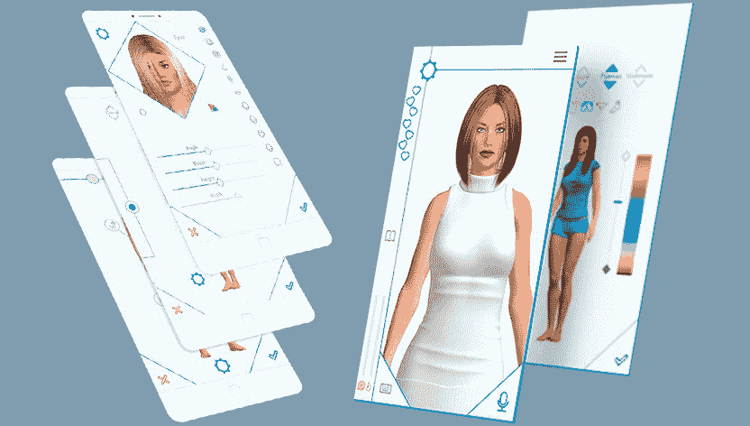

# 性玩具和人工智能——过去、现在和未来

> 原文：<https://medium.com/hackernoon/sex-toys-and-artificial-intelligence-the-past-present-and-the-future-45242f154bca>

纵观我们的历史，人类已经尝试了许多方法来获得性满足。虽然原始形式的性玩具已经存在了很长时间，但人工智能的集成直到最近还被认为是不可思议的。

# 性产业

在过去的几十年里，文明带来了更高程度的自由。这导致了性产业中尖端技术和创新的随之扩散。根据专家的评估，该行业目前价值超过 150 亿美元，预计这一价值在不到三年的时间内将翻一番。

人工智能驱动的性玩具相对较新，它们的目的是应用机器学习的先进概念来改变我们的性体验。由于身体敏感部位的传感器，这些性爱机器人可以体验快乐，并反过来回报他人的帮助。此外，他们可以从以前的经验中学习。比如你的心情，什么让你兴奋等等。

# 人类对性玩偶的偏爱

令人惊讶的是，在最近进行的一项调查中，五分之一的男性表示，他们对与洋娃娃发生性关系的想法持开放态度。当性玩偶变得更像人类和更便宜时，这个数字可能会增加。事实上，它们可能比我们想象的更快地超越人与人之间的交流。

# 性玩偶的问题

然而，主要的问题正在出现，如儿童性玩偶的性行为。有了性爱娃娃，正常关系中典型的浪漫和闲聊就不复存在了，我们现在只能推测会有什么心理影响。

# 人工智能的应用现状及其对情趣用品的影响

人工智能的采用率非常高。有了在最少的人工监督下从大型数据集学习的能力，可能性真的是无穷无尽的。在过去的十年里，人工智能的巨大突破帮助人类从普通的性玩具飞跃到人工智能驱动的性玩具。以下是一些可用优势的示例。

# [Realbotix](https://realbotix.com/)Harmony——完美的移动设备伴侣

Realbotix 是一款移动设备上的性爱伴侣。这个软件背后的人工智能技术已经存在了十年，并且在不断完善。此外，有成千上万种可能的衣服、长相、性格组合，你可以在你的移动设备上定制完美的伴侣。

此外，你可以谈论广泛的话题。更有趣的是，该应用程序随着时间的推移而学习，并能够与时间进行更深入的对话。然而，有一个缺点是，该应用目前只适用于 Android 设备。

# [萨曼塔](http://syntheaamatus.com/)

萨曼莎是一个超现实的性爱娃娃，集成了人工智能功能。她的手、脸、乳房和阴道里都有传感器。因此，当你触摸她时，她能感觉到。事实上，她更喜欢在实际性交前被爱抚、亲吻和玩耍。不仅如此，通过她的交互式语音，她可以像你的 iPhone 上的 Siri 一样参与从科学到性等话题的对话。

对于那些喜欢自己的伴侣是外表和头脑的结合体的人来说，萨曼莎非常有趣。据《萨曼莎》的制作者塞尔吉·桑索斯称，“人类对性爱机器人产生感情是可能的。”这并不难想象，考虑到娃娃会因为性而被唤起，就像女性一样。

公平地说，它不仅仅是为了性，它还可以作为伴侣，甚至融入家庭环境。这是因为她可以在不同的模式下操作；浪漫、家庭和性感模式。

# 和谐

Harmony 是最先进的性爱机器人之一，具有超现实的人类特征。传言说这个性爱机器人在性交时高潮。她记忆力很好，她知道你最喜欢的食物、电影，甚至记得你的生日。对一些人来说，她是金钱可以买到的完美女友。

哈蒙妮可以是你想让她成为的任何人。如果你愿意，她可以表现出害羞、嫉妒、喜怒无常，甚至多嘴多舌。这个娃娃还能讲非常有趣的笑话或背诵诗歌。

“和谐”目前售价约为 11，670 英镑——对一些人来说相当便宜。和谐是完美的伴侣，尤其是对于那些很难保持稳定关系的人或没有时间发展正常关系的人。不像你必须去散步，一起看电影或做其他事情。你独自定义关系的条款。

# 人工智能情趣用品的未来

根据伊恩·皮尔森博士的说法，2050 年将是人类/机器人性行为超过人类/人类性行为的一年。这种说法的理由很少。

# 更好的机器人-人类关系

人工智能驱动的性玩具的未来可以有很多可能性，但可以肯定的是，人工智能玩具和人类的关系会变得更好。人类将更好地识别机器人的不同情绪，反之亦然。随着目前人工智能驱动的性玩具能够眨眼，感觉，交流，他们可以实现的没有限制。此外，随着人工智能技术的进步，性爱娃娃将能够进行更复杂的对话。

# 价格下降

目前，这些玩具的成本很高；一个 Realbotix 的头部价格大约为 10，000 美元(T1)，身体价格大约为 25，000 美元(T3)到 65，000 美元(T5)。更常规的设备从**4000 美元**到**12000 美元**不等。随着技术的进步，价格肯定会下降，使普通人更容易接受。

# 人工智能奇点

有人吹捧说，人工智能将接管世界，这将在机器能够独立思考创造和执行过程的时候到来。虽然像埃隆·马斯克和已故的斯蒂芬·霍金这样的人物也持有类似的观点，但几位人工智能专家已经消除了人工智能奇点的概念。

如果/当人工智能奇点在未来出现，机器人与人类的性关系将变得难以处理，并且很难以任何确定性水平预测未来。

# 包装它

人工智能驱动的性玩具正在迅速改变我们看待性的方式。你可以获得快速性爱，满足任何正常的人类伴侣可能不想参与的性恋物癖。此外，性病的风险完全消除。未来的承诺是令人兴奋的，我们只能拭目以待。

[由罗曼·昆采维奇撰写](https://www.linkedin.com/in/roman-kuntsevich-55819515a/)