# 分片通过向您销售伪装成向外扩展的向内扩展来集中以太坊

> 原文：<https://medium.com/hackernoon/sharding-centralizes-ethereum-by-selling-you-scaling-in-disguised-as-scaling-out-266c136fc55d>

## 轻型客户端和完全验证节点之间的区别

你想知道这意味着什么吗？别担心，你会的。先去冲杯咖啡，又是一杯很长的。如果你还没有读过这篇文章，请从这里开始:

 [## 以太坊-区块链的大小已经超过了 1TB，是的，这是一个问题

### (TL；DR:与存储空间限制无关)

hackernoon.com](https://hackernoon.com/the-ethereum-blockchain-size-has-exceeded-1tb-and-yes-its-an-issue-2b650b5f4f62) 

以下是我在发表上述文章后与 Vitalik 的一次交流。虽然是由[他对我的文章](https://twitter.com/VitalikButerin/status/999647893605642243)的回应引发的，但从我的角度来看，交流的目的变成了提取他和许多其他以太坊粉丝不认为分片会削弱其所应用的网络的完整性的潜在原因。幸运的是，他很合作地回答了我提出的问题，这些问题是有意打破逻辑的，所以我们最终可以得到这个半预期的回答:

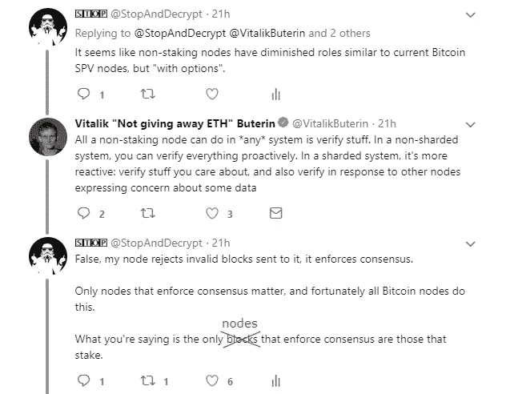

I meant nodes. He knew what I meant and responded accordingly.

我强调这一点是因为它很好地概括了本文的全部内容。

**维塔利科:** *“这是以太坊现在的方式，当我们改用它时，切分将没有什么不同，只是有些事情对某些人来说会更容易。”*

**我:** *“我完全不同意那种说法，这里有一个完整的反驳。”*

## 本文的目的是以通俗易懂的方式(不分先后)解释以下信息及其细微差别:

*   比特币、旧以太坊和新以太坊(2.0)之间的网络架构差异。非常基础的数学，没有复杂的方程式。只是一点逻辑。
*   基于区块链的网络，取决于它们的架构，将**内在地**在足够长的时间内集中或分散。这不包括引导&炒作周期*(无论它们有多长)*，并且假设没有对协议进行任何更改。我们可以把这称为网络的“固有方向”。
*   协议的改变如何对网络[去中心化]产生直接或间接的影响，但不一定改变网络的长期“固有方向”。
*   以太坊本质上是集中的，因为它现在的立场，切换到股权证明并不能改变这一点，而切分只是通过向您出售一个有缺陷的扩展解决方案来推迟不可避免的事情。

会很长，但是很容易。如果你关心理解这些，请阅读它。

# 索引

## 概念入门

*   [缩放的类型，以及它们如何应用于*分散式*区块链网络。](/@StopAndDecrypt/266c136fc55d#aee4)
*   [完全有效节点在*分散*网络中的重要性。](/@StopAndDecrypt/266c136fc55d#2562)
*   [固有集权与固有分权](/@StopAndDecrypt/266c136fc55d#1d93)

## 网络差异

*   [比特币的网络拓扑，以及它如何内在地*去中心化*。](/@StopAndDecrypt/266c136fc55d#6e2e)
*   [以太坊的工作拓扑证明，以及它如何内在地*集中化*。](/@StopAndDecrypt/266c136fc55d#a606)
*   [以太坊的桩子拓扑证明，和它没什么不同。](/@StopAndDecrypt/266c136fc55d#3a29)

## 分片

*   [以太坊的 Stake 拓扑证明 *w/Sharding* ，以及如何更差。](/@StopAndDecrypt/266c136fc55d#3a31)

## 反回复

*   对维塔利克回应的反驳。
*   [对本文的一个反驳:](/@StopAndDecrypt/266c136fc55d#db7f)

 [## 跟上以太人——对区块链尺寸问题的回应

### 昨天@StopAndDecrypt 发表了一篇中间文章，讨论了以太坊区块链的发展和关注点…

medium.com](/@gustav.simonsson/keeping-up-with-the-etherians-a-response-to-blockchain-size-concerns-a4858c2701d9) 

# 缩放-什么？缩放-谁？缩放-在哪里？

## 缩放……什么时候？

Vitalik 说分片是第 1 层扩展解决方案:

注意，这里使用的缩放没有上下文，所以让我们提供一些上下文。我们不能一直使用术语“可伸缩性”,而对这个词的含义却没有一个一致的定义。即使不同的人有不同的定义，提出论点的人至少应该提供他们的定义。

当*我*在本文中谈到可伸缩性时，我只谈了一件事，即**在不牺牲分散性的情况下增加功能**，验证节点的总集合是网络分散程度的最直接表示之一。在讨论区块链网络的扩展时关注其他任何事情，要么是没有正确理解这一点，不同意这一点，要么是出于任何原因故意误导的行为。

首先弄清楚这一点很重要，因为要理解以下扩展类型的差异以及它们如何应用于分散式网络，就需要这一基线。

*   **向外扩展:**增加网络基础层(L1)上的**全验证节点**、**或**的数量，在不影响网络“固有方向”的情况下增加基础层的功能。增加功能增加了使用网络的动机，从而增加了验证节点的集合。因此，在这两种情况下，验证节点数都会有一定程度的增加。
*   **向上扩展:**在基础层之上增加网络层。放大可以正确或不正确地完成。正确的做法是对它下面的层几乎没有影响。像 Lightning 这样的支付渠道网络就是一个很好的扩大规模的例子。侧链可以说是一个坏的向上扩展的例子，因为它们有可能打破采矿安全模式，但本文不是关于这个的。

相反，有:

*   **扩大:**减少完全验证节点的数量。在基础层添加功能以减少完整节点的数量就是扩展。分片就是这样做的，这也是我写这篇文章的原因。
*   **缩小:**降低图层复杂度。这在分散网络中是不必要的。这个术语通常用在集中的系统中，如试图缩小规模或重组内部结构的公司。

术语“节点”经常被使用，但是对于试图理解它的局外人来说，更多的时候仍然是不明确的。我有一个朋友试图告诉我，Nano 让每个人运行一个节点，并拥有自己的区块链。人们只是不知道他们在谈论什么，这是因为正确的信息对他们来说并不容易获得。如果节点不是正确的[种](https://www.youtube.com/watch?v=eVJur6Gk_1s)节点，增加节点数量是没有意义的。所以，当我说向您销售扩展解决方案时，是因为重要类型的节点会因为这种变化而减少。不一定马上，*但是随着时间的推移*，我也会谈到为什么这很重要。

# 充分验证节点的重要性

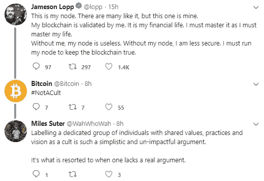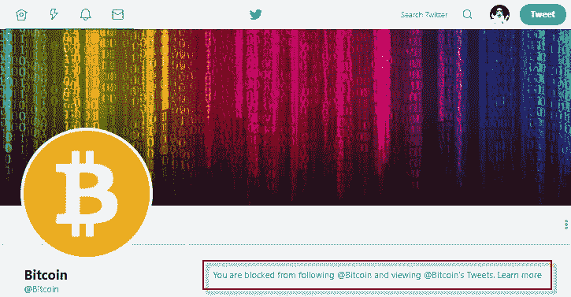

[https://twitter.com/lopp/status/1001903809004736513](https://twitter.com/lopp/status/1001903809004736513) /// Read my BCash article if you’re interested in why the “Bitcoin” Twitter account blocked me.

我想做的第一件事是用一个简单的例子来说明为什么这些很重要，然后我会向你们展示反对它的普遍观点。我将简要回应这些论点，然后在本文的后面深入研究比特币网络实际上是如何工作的，然后你就可以从我的解释中看出这些反节点论点的不足之处。

只是提醒一下:如果你来这里是为了阅读以太坊，而不想了解比特币的网络功能，那么你应该失去你投入的任何资金，或者你浪费在以太坊开发上的任何时间。

## 我的情况很简单:

在比特币中，所有节点都完全有效。如果有人想提交任何无效的东西，它不会在网络上流传。每个节点都是一个白细胞。对于区块链网络来说，没有比这更安全的了。

## 反对亲节点立场的一些常见论据是:

*   除非你的节点是“挖掘节点”,否则它们不会强制执行共识，而你的节点会妨碍“挖掘节点”。
*   对于去中心化来说，边比节点更重要，所以增加节点数量并不总是意味着更多的去中心化。
*   需要多少个节点是安全的？肯定有“足够好”数量的节点可以到达吗？

## 1:“除非在挖掘，否则节点不会强制执行共识。”

对此，我将直接切入比特币网络的工作原理。在“比特币网络拓扑”一节的末尾，你会很容易地看到它是如何回答这个问题的。我也将该部分作为[独立文章](https://hackernoon.com/bitcoin-miners-beware-invalid-blocks-need-not-apply-51c293ee278b)发表，因为仅在这个话题上，错误信息就传播得如此猖獗。*(相信我，这一切都会回到切分和以太坊。)*

## 2:“边比节点重要。”

为了让本文的其余部分更清楚，当我说分散化时，我指的是下图中的**(c)***(但在《4D》中不是 2D)* ，这是我从 Vitalik 那里偷来的，他用它来[写这幅图有多糟糕](/@VitalikButerin/the-meaning-of-decentralization-a0c92b76a274):

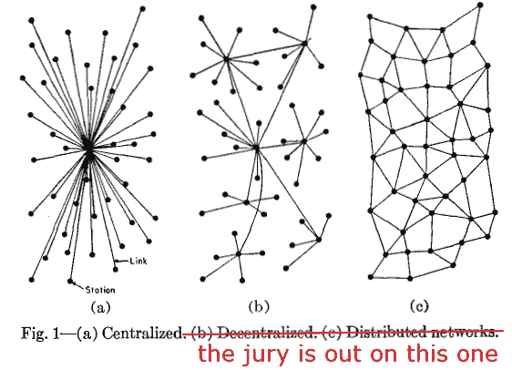

边只是从一个节点到另一个节点的连接。下图是各有 16 个节点的网络。相同数量的节点，但其中一个的边要少得多。另一个是每个节点都与其他节点相连。

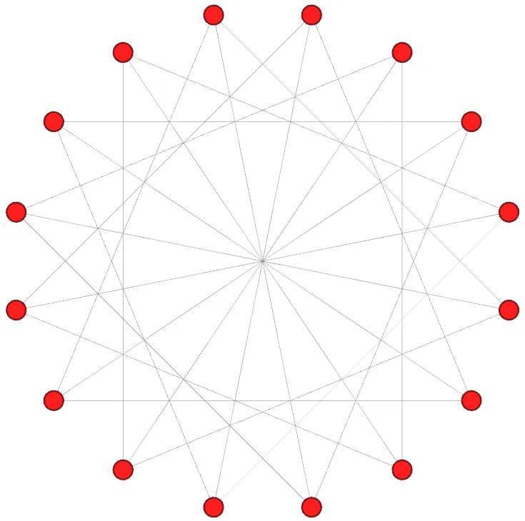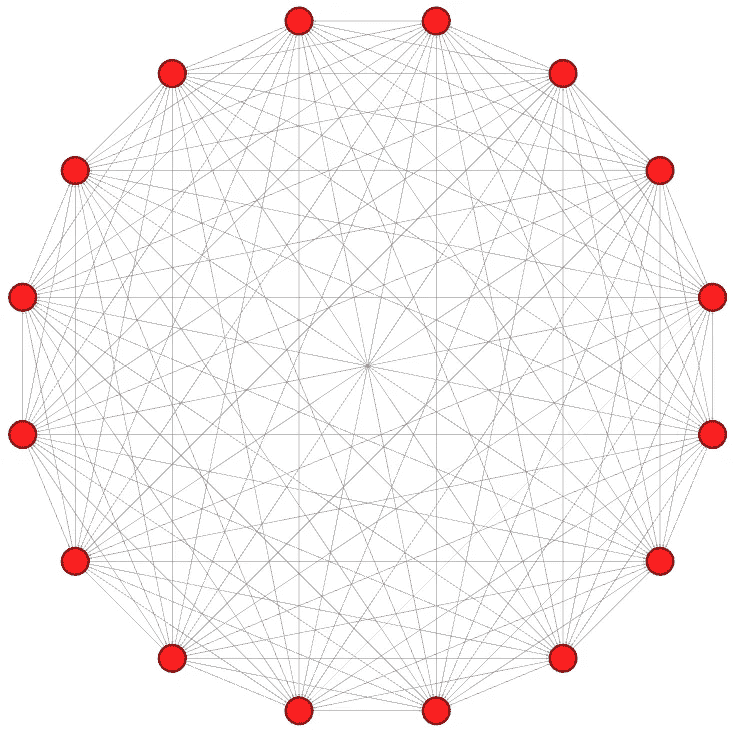

这两者的区别？

第一个有足够的边以足够的“跳数”将*(我们将在后面进一步讨论)*传播到网络上的每个节点，并且没有一个节点是可审查的，因为连接*(边)*是适当分布的。

另一个网络？

*   每个人都知道你是谁。
*   大家都知道你发的交易是不是你创建的。
*   每个人都知道一个节点中继的块是由该节点创建的，或者是通过该节点从他们不喜欢的潜在矿工中继的。
*   现在他们知道 IP 地址保存着一个地址，上面有很多比特币。
*   他们知道这是一个矿工，或者他们知道什么 IP 地址允许一个不需要的矿工中继这些块。
*   任何控制有限数量验证器的人都可以审查你，或者阻止你的交易。

**是 private 的反义词，也是 secure 的反义词。**

关于边缘，正如您稍后将看到的，绝对有一个“足够”的数量。我在以前的文章中也谈到了传播，尽管有这些“有限”的优势，它只会变得更好。这主要是骗子*(甚至 Vitalik 也经常这样称呼)*使用的一个论点，他们想在诈骗时听起来很聪明:

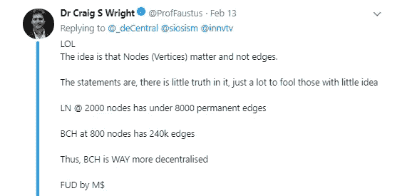

He also comparing a Layer 1 network to a Layer 2 network here, like an idiot.

## 3:“需要多少个节点？”

在我看来,“多少就够了”的争论可能是某人没有得到更大的图景的最大标志之一。通过问这个问题，他们已经同意了这样一个条件，即需要有*一些*才能被认为是安全的，现在他们只是试图通过争论来计算出那个值。有时他们是真诚的，有时他们在转移话题。

这里有一些简单的问题，我不一定期望你有答案。假设我们都确定并同意这个数字是 20，000 个完整节点。

*   我们如何对协议进行编码，以确保节点数保持在 20，000 个以上，而不是低于 20，000 个节点？
*   即使我们搞清楚了这一点，如果没有外部的[甲骨文](https://en.wikipedia.org/wiki/Oracle_machine)告诉它这个数字，网络怎么知道它是大还是小呢？
*   我们同意 20，000 个节点，但是*为什么*我们同意 20，000 个节点？我们是否在“现实生活”中衡量了一些东西，并确定我们需要 20，000 个“人”来阻止政府接管？这是一个愚蠢的例子，但如果人口乘以 10 会发生什么？20000 这个数字还准确吗？
*   如果我们现在决定某个值，并确定它在将来是一个坏值，那么我们必须经历尝试改变协议以适应新值的过程*(并承担风险)*。这值得吗？

我这里的观点是，*这个*没办法。您不能将网络编码为在某个节点数“徘徊”。我非常倾向于相信以下说法，我没有看到反对这种说法的好理由:任何区块链网络，如果协议保持不变，而需求继续增长，将随着时间的推移分散*或*集中，这取决于它们是如何构建的。因此，如果去中心化是您想要的特性，**协议需要本质上去中心化。**这意味着协议的设计需要确保验证节点数*会随着时间的推移而增长*。如果是保证增长，那就是*而不是*保证[收缩](https://www.youtube.com/watch?v=8DoARSlv-HU)，这就把我带到了下一节。

# 固有的集权/分权

我想通过澄清一些关于这些链如何比较的困惑来开始这一部分。关于我和其他人过去使用的比较方法，有一些公认的盐，所以我的目的是向你展示一个更公平的比较，这实际上使它看起来更糟。

*   比特币区块链“大小”线性增长**，因为随着时间的推移，节点需要以最大块容量处理的数据是静态的**。所以当你看到下面的第一个图表时，它等于第二个图表。****

****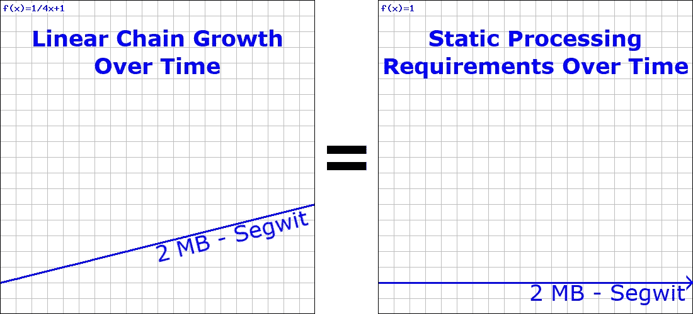****

*   ****随着时间的推移，**单个**块大小的增加将导致节点需要处理更多数据*(但静态)*，以及更快的链增长*(但线性)*。**永无止境的**块大小的增加**使它们都呈指数增长。******

****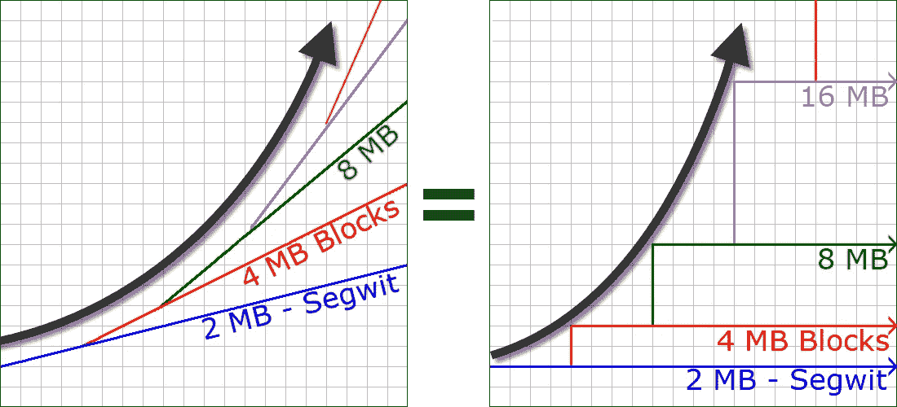****

****希望以下内容是清楚的，但我会进一步阐述:****

## ****固有的去中心化:验证器上升****

*   ****区块大小上限=线性链增长****
*   ****线性链增长=静态节点需求****
*   ****静态节点需求=节点数量随着时间的推移而增加****

****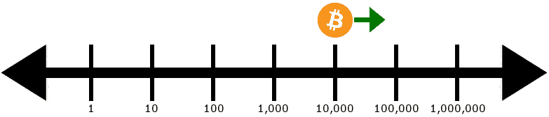****

## ****固有的中心化:验证器下降****

*   ****无上限=指数链增长****
*   ****指数链增长=不断增长的节点需求****
*   ****不断增长的节点需求=节点数量随着时间的推移而减少****

****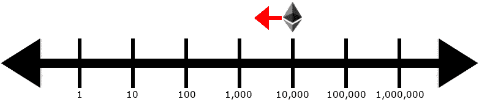********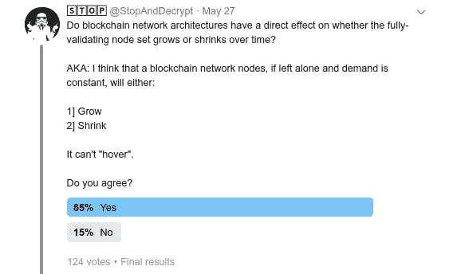****

****[https://twitter.com/StopAndDecrypt/status/1000874907448827904](https://twitter.com/StopAndDecrypt/status/1000874907448827904)****

********

****[https://twitter.com/StopAndDecrypt/status/1003807436967481344](https://twitter.com/StopAndDecrypt/status/1003807436967481344)****

****随着技术的发展，运行一个节点变得越来越容易，因此总节点数会随着时间的推移而增加。这就是我说的“内在去中心化”的意思。当比特币升级到 Segwit 时，运行一个进行完全验证的节点的要求*的确*提高了，但幅度很小。它没有把任何人踢出网络，也没有让运行 Segwit 之前的节点的人更加困难，但最重要的是，它保持了固有的去中心化:****

****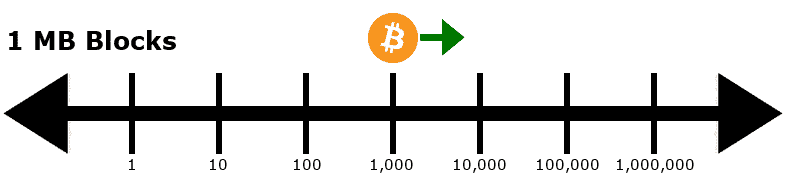****

****为 Segwit 更改大小时，除了随意“添加空间”之外，还有其他原因。现在比特币的块大小是受管制的，上限是设定的，而且不会改变。如果块太大，则**无效。**这很理想，因为它确保了数据量随着时间的推移保持不变。没有人对此投票，这不是 51%对 49%的情况。**太大了总是无效。******

****网络无法判断你的节点是否挖掘了一个块，因此该协议在这个意义上实施了隐私平等，但块大小上限实施了物理平等，在这个意义上，验证器之间无论是否挖掘都没有区别*(稍后详细介绍)*。它们处理事务的能力不会将它们分开，因为这对每个节点来说都很容易。取消块大小上限会将这些节点分成层，其中一个组有能力通过创建关闭另一半网络的块来强行切断其他组，从长远来看会破坏网络。****

********

****改变比特币的设计以允许可变的块大小将导致:****

*   ****不合需要的尺寸现在有效。****
*   ****挖掘者开始创建块，而不用担心它对其他可能挖掘或可能不挖掘的验证器的影响。****
*   ****运行一个节点的需求不断增长，因此数量不断减少。****

****更多的变量意味着更多区分和隔离节点类型的方法。****

****我还想指出，上限设置为 2 MB，还是 8 MB 都没关系。在*点，一些*点技术将允许该块大小是可行的，但那是另一个辩论，因为我们*现在可以*将块大小设置为 50tb，“只需等待它赶上来”，但比特币将变得集中，并在那一点被摧毁。上限应该在哪里是一个不同的辩论，但我现在唯一的论点是需要有一个硬限制不随时间变化**如果超过它，块是无效的**。****

****这让我想到了下一个例子:以太坊及其任意的“气体极限”:****

************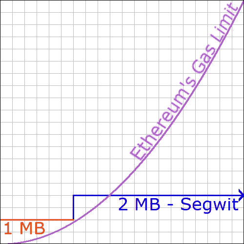****

****如果没有上图或以太坊中的适当上限，块大小会不断增长，技术永远无法以足够快的速度有效地跟上，以便您能够继续运行您的节点。这就是我所说的“内在集中”的意思。由一小群集中的参与者决定的无限制的增长需求是不好的。即使使用分片，这个限制也会随着时间的推移而增加。分片可能会暂时成功地分割作品，但以太坊的固有方向是南方:****

****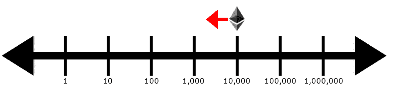****

****以太坊的大小是由矿工决定的，他们设定了以太坊的气体限制。如果你不了解以太坊的气体极限，这里有一个非常简单的解释，可能会吓到一些技术人士:****

****在以太坊中，不是字节，一个块被限制在它能有多少单位气体。对于这个例子，假设是 1000 单位的气体。****

****当你想要创建一个交易，或者一个“合同”时，它需要耗费大量的处理时间。假设你的交易成本是 2 块汽油，我的交易成本是 5 块。我们都可以放入一个街区，还有 993 个单位的天然气交易。****

****因此，当一个矿工做一个区块时，他们只限于包括 1000 个单位的天然气价值的交易，否则网络认为它是无效的。****

****除了他们没有被限制在 1000 个单位…****

****他们可以生产 1200 个单位的一个街区。然后他们可以生产 1500 个单位的产品。共识规则允许他们逐渐增加它，而不会使它无效。其他矿工可以制造更小的区块，这有助于降低平均*(因此，限制)*，但这些只是其他矿工。如果你在*这些*类型的共识规则下操作一个完全有效的节点，你没有能力决定这个度量。矿工是这个网络上所有其他节点之上的一层，Vitalik 甚至不否认这一点。****

****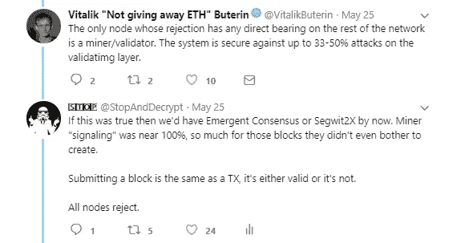****

****由于以太坊网络中节点*由代码*区分，以太坊本质上是集中的。这是比特币和以太坊目前存在的网络属性的根本区别。以太坊的一组完全验证节点没有平等的投票权，因为它们的外部能力允许它们改变协议，这会影响其他节点。在比特币中，没有投票权会影响你运行节点的能力。****

*   ****如果你不去管比特币*(这就是计划)*，它的完全验证节点数将会随着时间的推移而增加。****
*   ****如果你不去管以太坊，它的完全验证节点数会随着时间的推移而减少。****

****我认为这里需要注意的是，如果没有像闪电这样的国家渠道网络技术，我的说法就不适用于比特币。像这样的固有属性不仅限于节点增长/收缩。我还认为，尽管以太坊也可以存在国家渠道网络，但以太坊手头还有一个更深层次的问题。****

****接下来的两节将详细介绍比特币的网络拓扑，以进一步阐述这一概念，然后是以太坊网络的差异，这直接归因于谁可以和谁不能投票的等级制度。****

# ****比特币的网络拓扑****

****比特币不仅仅是一个区块链，我想先帮助你理解比特币的区块链*网络*是如何设计的，因为它是这一系列中最简单的一个，它的简单性有一些基本属性，你需要在本文的其余部分理解。我说*区块链*网络是因为比特币还有一个*支付通道*网络*(闪电)*层叠在它上面，不会影响区块链网络的结构。不过，我不会在本文中讨论比特币的闪电网络，因为它与我要说的观点没有太大关系。****

****下面是一个缩小到 1000 个完全验证节点的比特币网络的粗略例子*(目前实际上有 115，000 个)*。这里的每个节点都有 8 个到其他节点的连接，因为这是客户端在不做任何更改的情况下建立的默认连接数。我的节点在这里的某个地方，如果你在运行一个，它也在那里。比特币基地的节点在那里，比特大陆的节点在那里，如果聪还在，聪的节点也在那里。****

*****请注意，这只是一个示意图，真实的网络拓扑可能(很可能)与此不同。一些节点拥有超过默认数量的连接，而其他节点可能选择连接到有限数量的节点，或者只留在一个其他节点之后。没有办法知道它实际上看起来像什么，因为* ***它的设计考虑到了隐私*** *(尽管一些监控公司肯定试图获得非常接近的近似值)，节点可以而且确实经常改变它们的对等点。*****

****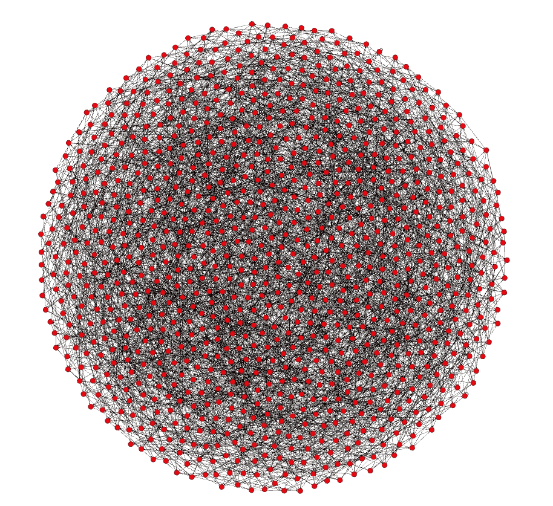********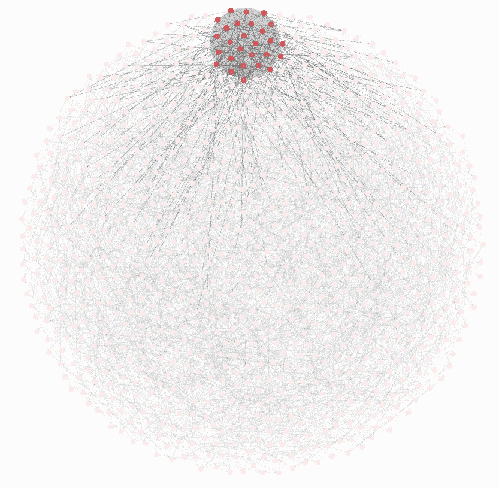****

****我从这张图开始，因为我想让你明白这些节点没有区别，因为**它们都完全有效。里面的人和外面的人没有什么不同，他们都有相同数量的连接。当您启动一个全新的节点时，它会找到对等节点并成为蜂巢中的一员。在这个图中，从这些节点中的任何一个到另一个的最长距离*是 6。在现实生活中，这个距离会有一些偏差，因为[寻找新的对等点](https://en.bitcoin.it/wiki/Satoshi_Client_Node_Discovery)并不是一个完全自动化的过程来平均分配每个人，但是一般来说，向网络中添加更多的节点不会改变这一点。有 6 度凯文·贝肯，在 6 跳中我的交易在*(差不多)*每个节点，**是否有效。*********

**我将从该组中选择“my”节点并将其拖出来，这样我就可以演示当我创建一个事务并将其公布给网络时会发生什么。在下面你会看到我的节点一直到右边，然后你会看到我的节点所连接的其他 8 个节点*(对等)*。**

**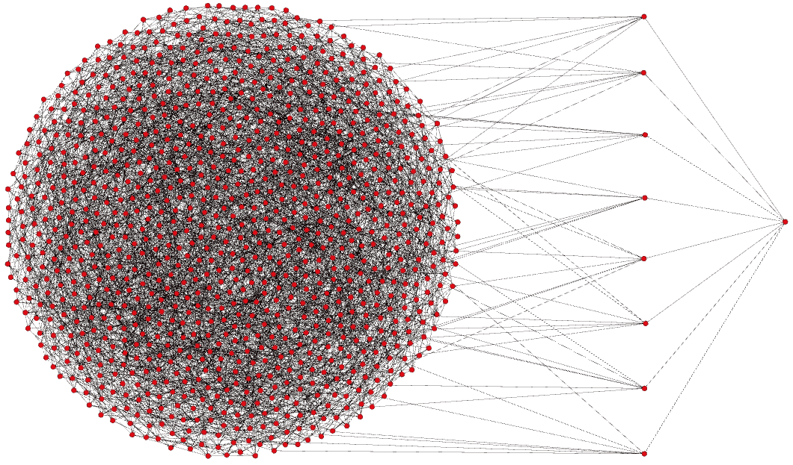**

**当我创建一个事务并“将其发送给全世界”时，实际上只是发送给这 8 个对等方。由于比特币从一开始就被设计成让每个节点都是完全有效的节点，当这 8 个节点收到我的交易时，它们会检查交易是否有效，然后再将其发送给它们的 8 个对等节点。**如果我的交易无效，它将永远不会破坏网络的“表面”。**我的同行绝不会把那种不好的交易发给他们的同行。他们实际上甚至不知道我创造了那个交易。他们没有办法分辨，他们对所有数据一视同仁，但如果我继续向我的 8 个同事中的任何一个发送无效交易，他们最终都会阻止我。这是他们自动做的，以防止我向他们发送垃圾邮件。不管你是谁，也不管你的公司有多大，如果你的交易无效，它就不会传播。**

**现在，假设您没有运行一个完整的节点，而是使用了一个[轻型客户端](https://en.bitcoin.it/wiki/Thin_Client_Security)。各种各样的轻型客户端存在于桌面和手机上。其中一些是银金矿，军械库，面包，和 Samourai 钱包。轻型客户端绑定到特定的节点。有些可以被设置来随着时间改变他们所连接的人，但是他们最终还是被束缚住了。这就是网络共享的样子:**

**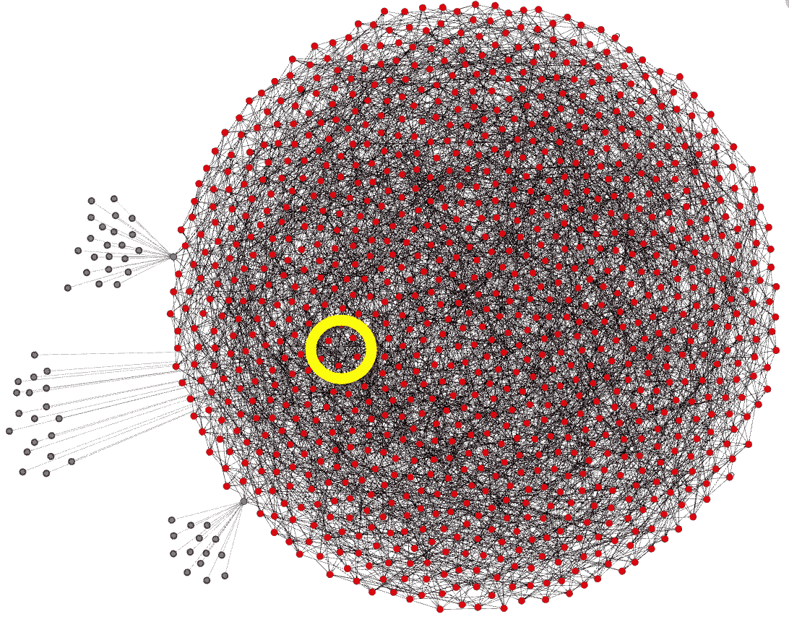**

**我向您展示这一点的原因将在本文中变得更加明显，但我希望您注意，这只是一个图表，很容易使用一个节点来演示网络共享，其中*碰巧*在 rim 上，但没有*真正的* rim，网络共享是指该节点恰好在该图表中的任何位置。我用黄色突出显示了这个。被连接的节点是绿色的，蓝点是轻型客户端。所有去往或来自轻型客户端的信息都要通过它们所连接的节点。它们依赖于那个节点。**他们不是网络的一部分。它们不是节点。**记住这一点，因为在以太坊他们的*行为*略有不同，但他们在网络上的*效果*是一样的:什么都没有。**

**这就是有趣的地方，也是其他人试图歪曲网络实际工作方式的地方:**如果我想开始采矿呢？****

***开采*一个区块就是*创造*一个区块的行为。与您想要发送的事务非常相似，您必须创建该块并将其通告给网络。任何节点都可以宣布一个新的块，这个过程没有什么特别的，*你只需要一个新的块*。挖掘变得越来越困难，但如果你愿意，你可以购买专门的硬件，并将其连接到你的个人节点。**

**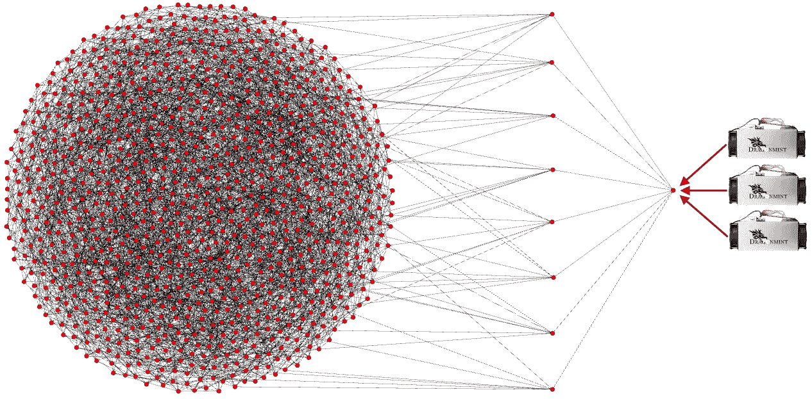**

**还记得关于无效事务的那一点吗？对于块也是一样，但是你需要了解一些关于块是如何被创建的非常具体的东西。**

**先看这个视频。我跳过了关于散列的重要部分，使用 nonces *(随机值)*并向链添加新的块头**:****

****Please watch the entire thing if you have time. It’s personally my favorite video explaining how mining works.****

****当您看到视频中应用了标签“Prev hash”的以下部分时，这些是块头:****

****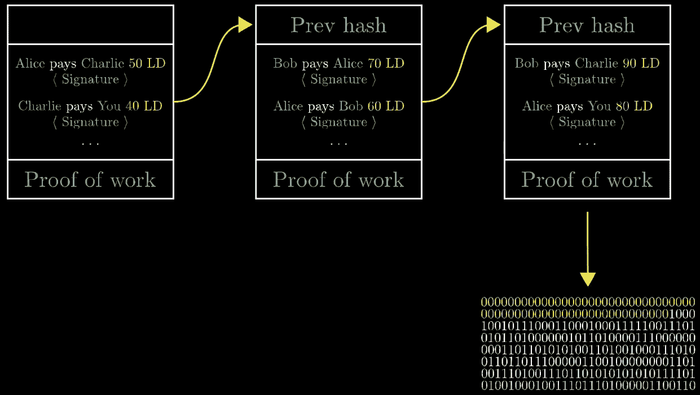****

****这个视频中没有提到的是，即使块中的所有事务都是无效的，你也可以创建有效的块头**。它仍然需要与挖掘具有有效事务的块相同的时间来挖掘具有无效事务的块。花费所有时间和精力创建这样一个区块的动机，将是推动一项用不属于你的比特币回报你的交易。这就是为什么所有节点不仅要检查块头**，还要检查事务**的重要性。这是阻止矿工花费时间的原因。因为**所有**节点都检查过，**没有**矿工可以欺骗系统。如果所有的节点都没有检查，你就必须依靠*做*检查的节点。这将把节点分成“类型”，唯一重要的类型将是检查的类型。以太坊目前就是这样做的，我将在下一节谈到这一点。******

**加入矿池又如何？你可能会这样做，因为采矿对你一个人来说太难了，或者如果你是一个稍微大一点的实体，你可能更喜欢稳定的收入，而不是零星的收入。许多矿工都这样做，他们使用完全不同的协议[地层采矿协议](https://en.bitcoin.it/wiki/Stratum_mining_protocol)将他们的专用硬件直接连接到采矿池。就像用你的非节点手机创建一个事务一样，**你不必运行一个节点来将你的硬件连接到一个矿池。**不跑节点也能挖矿，很多矿工正是这么做的。这是下面蓝色部分的样子。我在这个例子中使用了 Slush Pool:**

**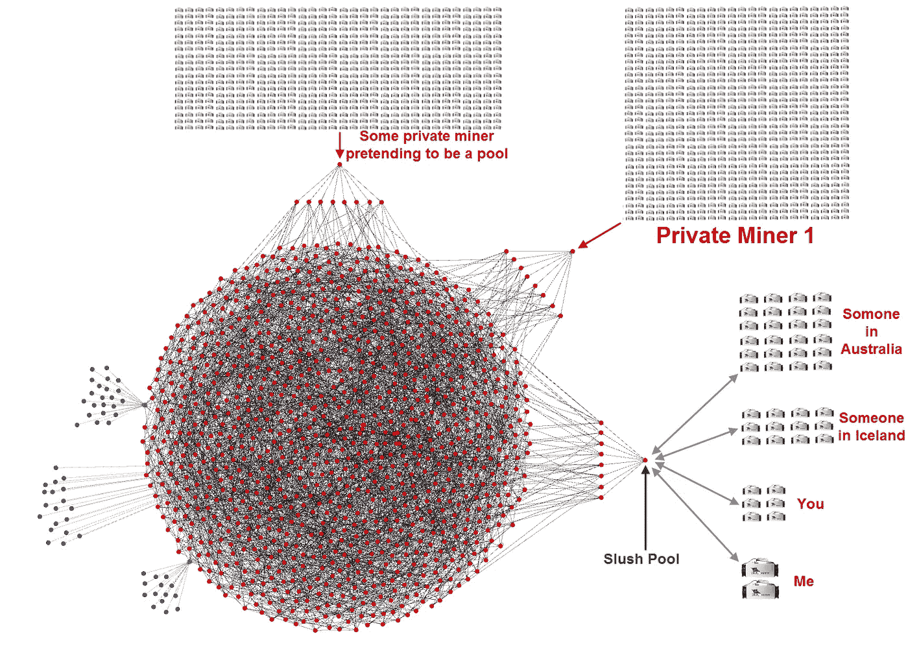**

**请记住，出于演示目的，我将这些池运行节点拖出了图表。就像任何其他节点一样，这些池运行节点需要对等体。他们需要对等体来接收事务和块，并且他们需要对等体来宣布他们创建的块。请允许我再次重申:*所有节点验证所有块和事务。*如果这些池中的任何一个宣告无效块，它们的对等体将知道**，因为它们完全验证**，并且它们不会将它发送到其他节点。就像事务一样，**无效块不进入网络。****

**这里有另一种方式来看待这个问题，而不需要从图中拉出这些节点。下面是一个**不想被人知道**的私人矿工，它有 8 个随机的同伴，**这些同伴中没有一个知道它是矿工**。同样，这是出于隐私考虑而故意这样设计的。网络中的任何节点都无法知道他们接收到的信息块是由他们的对等节点创建的*，还是由他们的对等节点*转发的*。他们只知道它是否有效，如果有效，他们就发送出去，如果无效，他们就不发送。***

**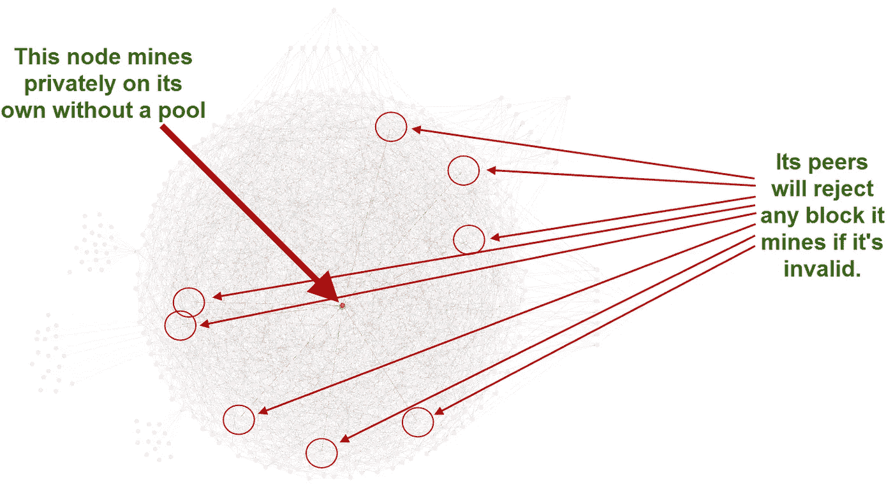**

**希望你已经明白了，我不相信我用了任何复杂的数学或方程式来达到这一步。我想继续，因为我觉得这是完整的覆盖面，但还有最后一件事我想解决，因为这是最后一个方面是用来混淆那些不完全理解我刚才解释的一切的人。它被如此肆无忌惮地使用，我需要解决它。**

**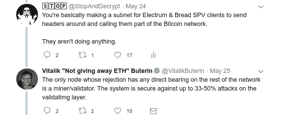**

**[https://twitter.com/VitalikButerin/status/1000232465540136960](https://twitter.com/VitalikButerin/status/1000232465540136960)**

**我最初的评论是关于轻客户端，也称为 SPV 客户端，以及它们如何不属于网络的一部分。我在上面用蓝色系住的点演示了这一点。他的后续评论试图暗示我的节点是唯一拒绝重要的节点。*记住:节点无法知道哪些其他节点挖掘了一个块，以及谁中继了一个块，* ***这是有意设计的。*****

**现在是最后一张图，这样我可以试着解释当人们说“只有挖掘节点才重要”时使用的逻辑。一些挖掘者直接连接到其他挖掘者，使得在他们与网络的对等列表之外，他们中的一些也是其他挖掘者。**不是所有矿工都这么做**。一些直接连接的矿工也使用可选的中继网络，如比特币核心开发者马特·科拉洛和 T21 正在设计的光纤网络，但即使是这个侧网络也不是矿工专有的，任何人都可以加入，包括你和我，它只是帮助阻止整个网络的中继。无论哪种方式，人们都试图争辩说，挖掘*(无论是否使用类似光纤的东西)*的节点的互连性意味着它们是唯一重要的，这是荒谬的:**

**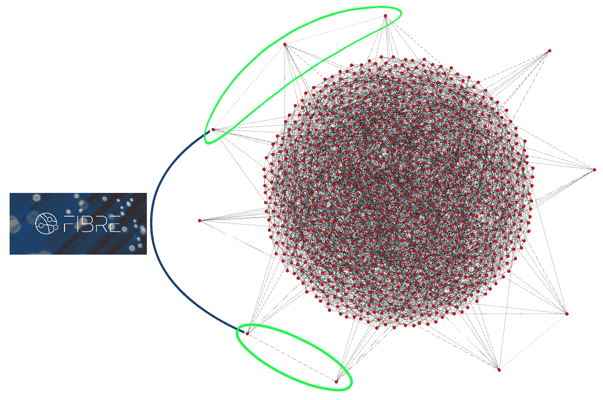**

**在这个例子中，我将节点的对等体留在了图中。你现在应该明白了。他们拒绝无效的块。绿色圆圈内的那组节点肯定不是这个网络中唯一重要的节点，也就是说，我想我已经涵盖了你需要了解的关于比特币区块链网络的一切，以便我继续讨论以太坊的网络。**

# **以太坊与工作证明**

**这一次相对来说是一样的，只是有一些关键的不同。所有这些最大的好处是，完全验证的节点不能根据块的大小或气体限制来拒绝块。对这个外部过程没有限制会给这些完全验证的节点带来压力，使它们无法跟上处理信息的速度，从而随着时间的推移减少节点数量，并使节点集向更大的实体倾斜。**

**与比特币非常相似，以太坊目前为其区块链附加过程&令牌分发过程使用工作证明系统。由于以太坊区块链网络的预期功能不同，放入块中的数据也不同。这不会是关于数据的种类，“智能合同”或任何类似的东西。这只是关于数据的*量*和网络拓扑。**

**下图和比特币一样，只是一个视觉图，而不是实际的拓扑结构。我没有将每个节点的对等点平均分布，而是将每个节点的对等点数量绘制在一条曲线上，因为众所周知，以太坊存在对等点问题，因为节点数量一直在下降，而如今很难找到能够提供足够数据量的“好”对等点。**

**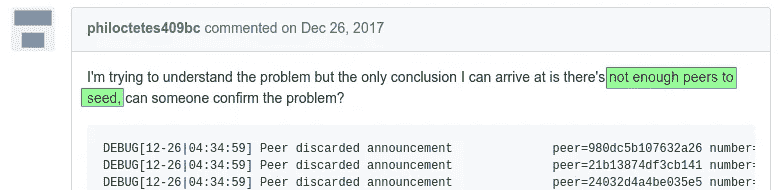******

**[https://github.com/ethereum/go-ethereum/issues/15753](https://github.com/ethereum/go-ethereum/issues/15753)**

**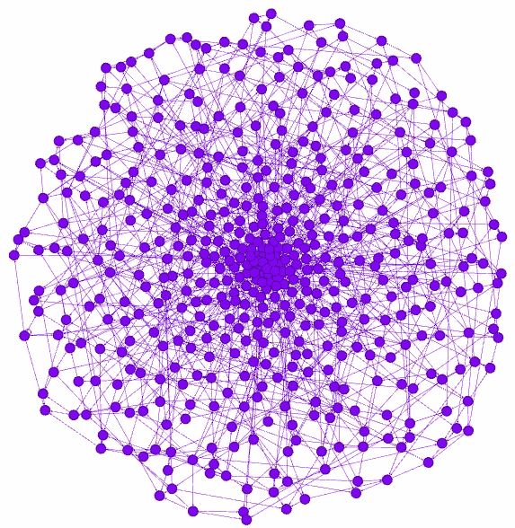**

**当好的对等点数量有限时，这就是“分散”网络的样子，当人们试图同步一个新的以太坊节点时，这就成了问题，因为没有足够多的对等点播种他们所请求的数据。你会看到一小群关系密切的同龄人在为区块链的所有其他人服务。**这对广播电视网来说非常糟糕。**更糟糕的是，gas 限制*(作为回报，总块大小)*不断增加，因为对它没有限制，这给这些有限的节点带来了更多压力，并减少了现有的数量，尽管有人声称“gas 限制在 X 个月内没有变化”:**

**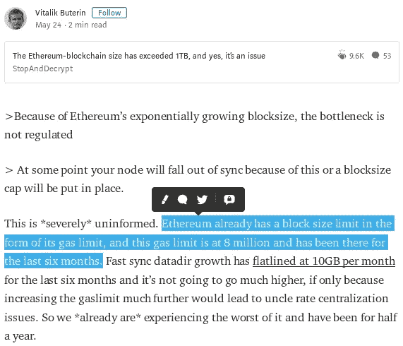**

**气体“限制”并不是一个限制，就像我前面提到的，矿工们在闲暇时选择这个。重要的一点是**以太坊节点无论气限是多少都不拒绝格挡**。这是比特币和以太坊的根本区别之一。节点的设置不是为了防止外部压力将它们与没有监管的数据集中在一起。出于利他主义的原因，矿工们现在没有增加这个限制，因为 Vitalik 告诉他们不要这样做。听起来很分散，对吧？这不是你希望区块链发挥作用的方式。当费用太高时会发生什么？**

**根据 Vitalik 的回答和下面的区块大小图表，您可以随意选择:**

**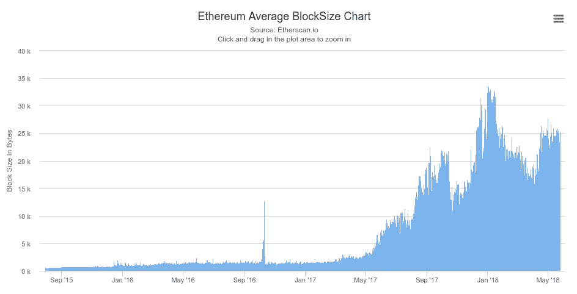**

**以太坊有两个选项:**

*   **如果天然气限额不提高，将没有足够的空间来签订所有的合同，一场竞标战将会开始，因此费用将会上升。如果费用上涨太多，基本合同开始变得过于昂贵，低费用运作的 Dapps 就会停止运作。上次发生这种情况时，他们被迫提高了限额，因为他们需要 Dapps 来工作。**
*   **如果提高了 gas 限制，那么已经对等的集中式节点数会下降得更多。**

**幸运的是，以太坊有像比特币一样的轻量级客户端，如果你不能运行自己的验证节点，它们可以拯救你…**

**还记得我之前演示过 SPV 客户端*(仅同步报头)*绑定到一个特定的节点，而不是网络的一部分吗？在以太坊，他们更进一步，为这些轻客户端创建了一个“子网”，在那里他们可以共享块**头**。如果你不知道，事实证明大多数人实际上并不运行以太坊中的完全验证节点*(出于各种原因)*，他们实际上运行的是轻量级客户端。**

**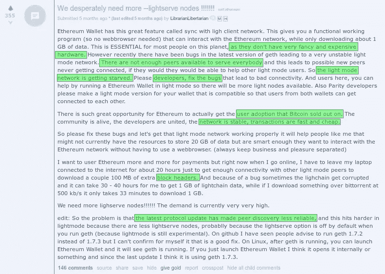**

**[https://www.reddit.com/r/ethereum/comments/7k4vy5/we_desperately_need_more_lightserve_nodes/](https://www.reddit.com/r/ethereum/comments/7k4vy5/we_desperately_need_more_lightserve_nodes/)**

**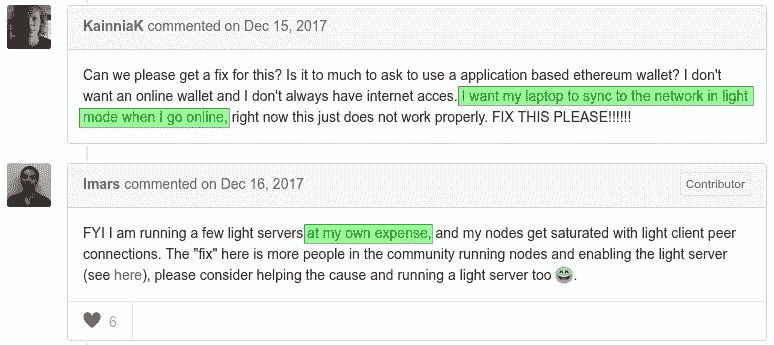**

**[https://github.com/ethereum/go-ethereum/issues/15454](https://github.com/ethereum/go-ethereum/issues/15454) /// You can also refer to my prior article.**

**他们在获得足够的全节点来为轻型客户端提供所需的块头方面遇到了一些问题。轻型客户端无法保持相互凝视，因为人们过于宽容地关闭和打开它们，所以它们变得更加依赖于自愿向它们提供数据的完整节点。在比特币中没有志愿服务，所有完整节点都执行相同的中继功能，这很容易做到。总而言之，我实际上不认为为轻客户端建立一个子网有什么错。我认为任何想经营的人都应该可以。我认为拥有他们的子网是一件好事，最好的情况是更多的人不必信任特定的节点作为头，最坏的情况是，他们不能充分满足他们自己创造的需求。问题是当开发者开始称这些为“节点”时，社区被引导去相信他们对网络有贡献。**它们不是“节点”,对网络没有任何作用。****

**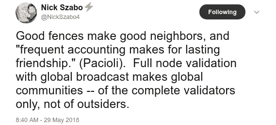**

**[https://twitter.com/NickSzabo4/status/1001488447129829377](https://twitter.com/NickSzabo4/status/1001488447129829377)**

**以太坊开发者*的确*称它们为节点。下面是关于分片的，我接下来会谈到，但是他们不应该到处告诉社区他们运行的轻客户端是节点。然后，他们得到的节点数不断增加，但实际发生的是轻型客户端数增加，而完整节点数缓慢下降。调用这些节点掩盖了问题。**

**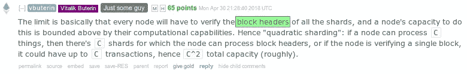**

**Hopefully I’ve drilled it in by now. Verifying block headers do nothing for the network.**

**这是一个更准确的网络模型:**

**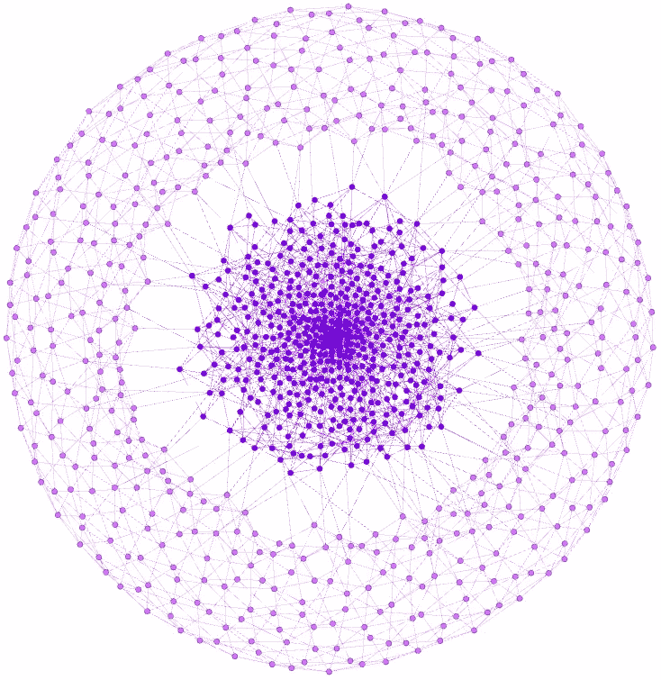**

**看到这里，看到这个总“节点”数，你现在有什么想法？他们能辨别这些节点吗？在发表这些文章之前，你了解它们之间的区别吗？即使他们不包括光节点，随着时间的推移会发生什么？**

**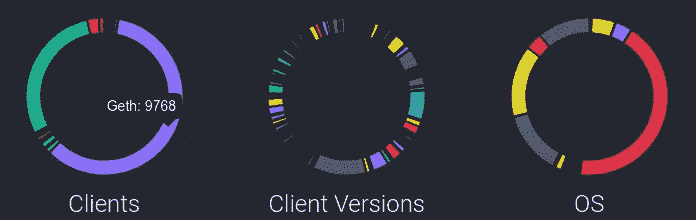**

**随着时间的推移，尽管总的“节点”数量可能会增加，但这就是发生在一个网络上的事情，这个网络本来就是*集中式的，并且不关心它的完全有效的节点集:**它会变得更糟。*****

**不仅网络开始减少验证者数量，矿工们出于避免糟糕的叔叔/孤儿比率的需要，开始彼此直接连接。叔叔/孤儿是由于阻塞时间彼此太接近而发生的丢弃阻塞。当不同的矿工在同一时间制造有效的区块时，你会得到两个有效的区块链。最终，其中一个块构建在另一个块之上，而另一个块是孤立的。**

**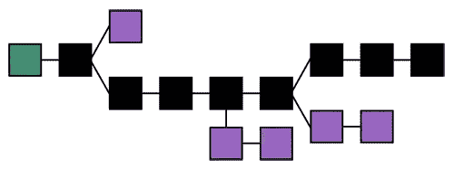**

**In this diagram the purple blocks are orphans.**

**您知道由于网络选择了不同的分支而导致数据块丢失时，谁损失最大吗？较小的矿商，进一步集中网络，因为他们不能处理收入波动。**

**所以现在你有了:**

*   **不断缩小的验证器总数**
*   **一个社区转向光节点，因为他们不能运行验证节点**
*   **一个开发团队告诉社区这是可以的，因为他们从一开始就不是“有意义的验证者”**
*   **一个即将到来的网络结构的基本变化，进一步缩小了验证集，你需要 32 个以太网作为一个**

**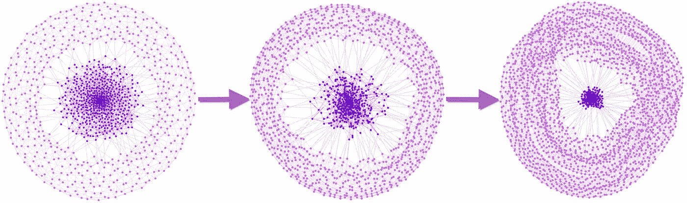**

**对提出这一问题的反应要么是一致的关注，要么是完全不考虑这一问题。当人们忽视这个问题时，他们通常使用我们已经讨论过的“非采矿”策略。他们说“所有中间的节点都在缩小，*他们从来没有做过任何事情，除非他们在采矿/打桩。***

**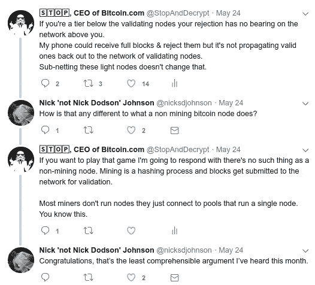**

**[https://twitter.com/StopAndDecrypt/status/999716942322814976](https://twitter.com/StopAndDecrypt/status/999716942322814976)**

**这真的是你这个月听到的最难理解的论点吗？**

****

**[https://twitter.com/NickSzabo4/status/1001488447129829377](https://twitter.com/NickSzabo4/status/1001488447129829377)**

## **概述:**

*   **在比特币中，所有节点都是有效的，没有一个节点有更大的发言权，因为区块大小是由所有节点限定和执行的。**
*   **在以太坊中，节点分为完全和轻量版本，只有完全节点有效。完整节点没有硬性限制气体限制，这导致它们必须随着时间的推移处理更多的数据，从而关闭许多节点。**

# **带股份证明的以太坊**

**就像以太坊的工作证明一样，上述所有内容都适用于股权证明。我们的目的是同时推出 PoS 和分片，所以我不认为只有 PoS 的以太坊会出现。这只是为了在我们接近分片时突出集中化的垫脚石。除了上一节中的所有内容，PoS 还会带来以下问题:**

*   **没有开采就意味着没有外部成本。下注的验证者只需要下注他们的硬币并托管他们的服务器。当他们无所事事地赚钱时，他们可以继续升级他们的服务器以补偿不断增长的节点需求，而其他人则被抛在后面。**
*   **赌注需要 32 ETH *(目前为 16，000 美元)*，因此不仅验证器的数量在不断减少，而且那些有 16，000 美元可支配的赌注**的人也不关心数据处理需求。**因此，这只会加速数据吞吐量的增长**

**在这个网络中，它在结构上与我下面提供的以太坊图相同，但这次我突出显示了相关的节点，因此您可以看到验证节点集随时间的进展，与同样相关的验证器成比例。请记住，维塔利克说它总是这样开始，上面我解释了这在技术上是不正确的。无论如何，有了 PoS，这一过程会加快:**

**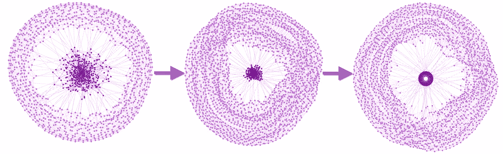**

**在其峰值价格，你会假设需要 45，000 美元成为这些节点之一。资金池并不能改变什么，资金池运行的是节点，而不是你。幸运的是，PoS 将与分片捆绑在一起，因此我们可以在此结束本节。**

# **以太坊(2.0)，带股份证明+分片**

**如标题所述，分片引入了向内扩展，同时让您相信它在帮助以太坊向外扩展。可以想象，这与验证节点数有很大关系，但有一点不同。验证职责被划分到不同的组中，每个组都有自己的分片。其目的是减轻单个验证节点必须完成的工作量，这样就可以有更多的验证节点，但这只会延长问题，而不能解决问题。此外，这些节点中的一些现在有巨大的成本，因为赌注是*要求*成为其中之一。**

******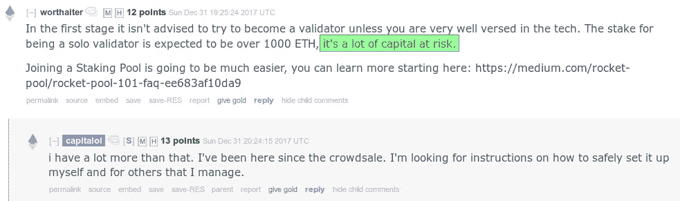****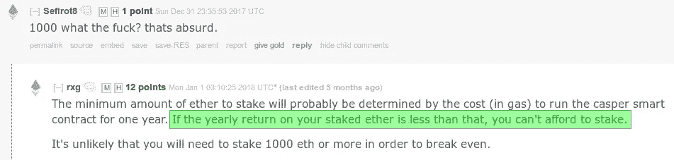**

**Full Video: [https://www.youtube.com/watch?v=r0TGpp2SV-w](https://www.youtube.com/watch?v=r0TGpp2SV-w)**

1.  **我们不会让比特币全节点每 3 秒处理 1 千兆字节，因为我们不会增加块大小上限。**
2.  **我们不会有 10 个完整节点，我们会有数百万个，因为我们不会增加数据块大小上限。**
3.  **显然，我们对“向外扩展”的定义在这里是不同的，它们可以接受在基础层以全节点数换取吞吐量。**

**因为我相信我已经为全节点提出了一个很好的论点，我们的定义不同并不重要，我将集中讨论他们的定义。**

**重新措辞:**

*   **他们希望提高基础层的事务吞吐量。**
*   **他们知道无论他们做什么，这都会减少节点数。**
*   **他们的解决方案是划分责任，这样就不会“一样糟糕”地萎缩。**
*   **他们认为缩减后的总数对于轻客户端安全性来说已经“足够好”了。**
*   **他们根据“挖掘节点”谬论，将这个缩小的总数与一个假设的有 10 个完整节点的比特币进行了比较，以此来证明其合理性。**
*   **他们的解决方案是分片，他们称之为向外扩展，并同意牺牲“一些”节点来获得，但声称这将导致未来的节点数超过比特币的 10 个节点。**

**我认为整篇文章中最重要的一点是比特币网络的完全验证节点，固有的去中心化，以及当人们试图向你出售“扩展解决方案”时，这与其他任何东西相比有何不同。让我们把这个和分片进行比较。这就是有趣的地方，因为即使是 Vitalik 也没有清楚地勾勒出拓扑将会是什么样子。我打算尽力而为，因为分片把“所有节点都是平等的，做同样的工作”这个概念，彻底废了。精确定位集中存在的地方将会非常有趣。**

**对于初学者来说，下面是对分片的通常解释[听起来像](https://www.youtube.com/watch?v=m4Kcgj4mSh8)，下面是典型文章的样子:**

**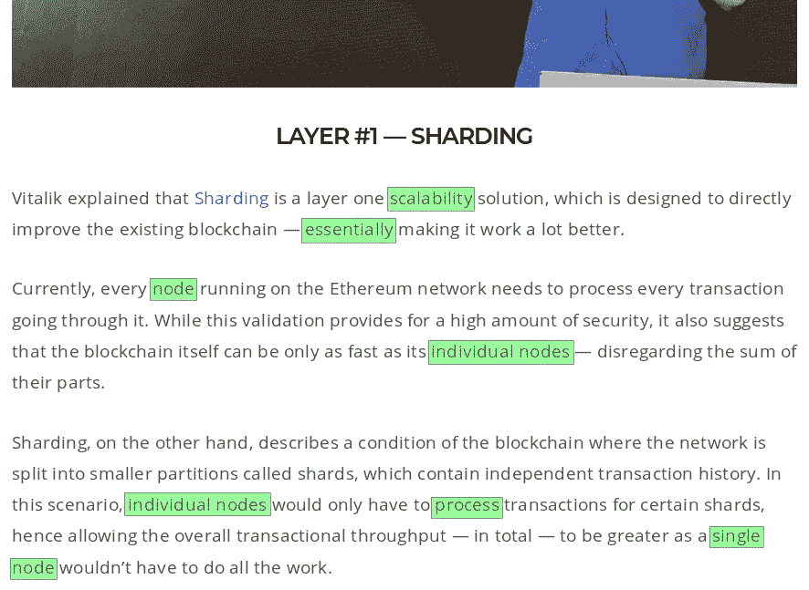**

**[https://bitcoinist.com/vitalik-buterin-sharding-plasma-scale-ethereum-10000-times/](https://bitcoinist.com/vitalik-buterin-sharding-plasma-scale-ethereum-10000-times/)**

**这只是一个区块链新闻网站，所以它应该有流行语和零技术信息。我之所以强调它，是因为它充斥着一堆似乎被不知情的秘密社区忽略的词汇和术语。“可伸缩性”仍然没有定义，“处理”需要进一步澄清，并且“节点”一词的每一次提及都不适用于您或您的 light-node。所有这些都提到:**

*   **"单一节点"**
*   **"单个节点"**
*   **"每个节点"**

**可以替换为:**

*   **16，000 美元的赌注**
*   **16，000 美元的赌注**
*   **16，000 美元的赌注**

**无论你在哪里读到或听到关于分片的解释，*似乎是在说“节点上的事情会更容易”，但是能够承担 16000 美元赌注的节点不需要事情变得更容易。他们已经可以处理大得多的块。**数据中心不需要碎片**，你也不会在笔记本电脑上运行*重要的*节点之一。这个系统中的节点有很多种，目前还不清楚在协议最终确定时，哪些节点将实际存在。我将从解释基本结构开始，然后定义这个系统中的主要节点类型，这样我们就可以突出那些重要的节点和那些不重要的节点。***

**分片取一个区块链，把它变成多个被称为**整理**的区块链，然后在上面放一个扭带，希望霉菌不会生长。玩笑归玩笑，这个单一排序规则的图表应该有助于您理解:**

****

**玩笑归玩笑，这里有一个很好的例子，花了很长时间才变得好看:**

**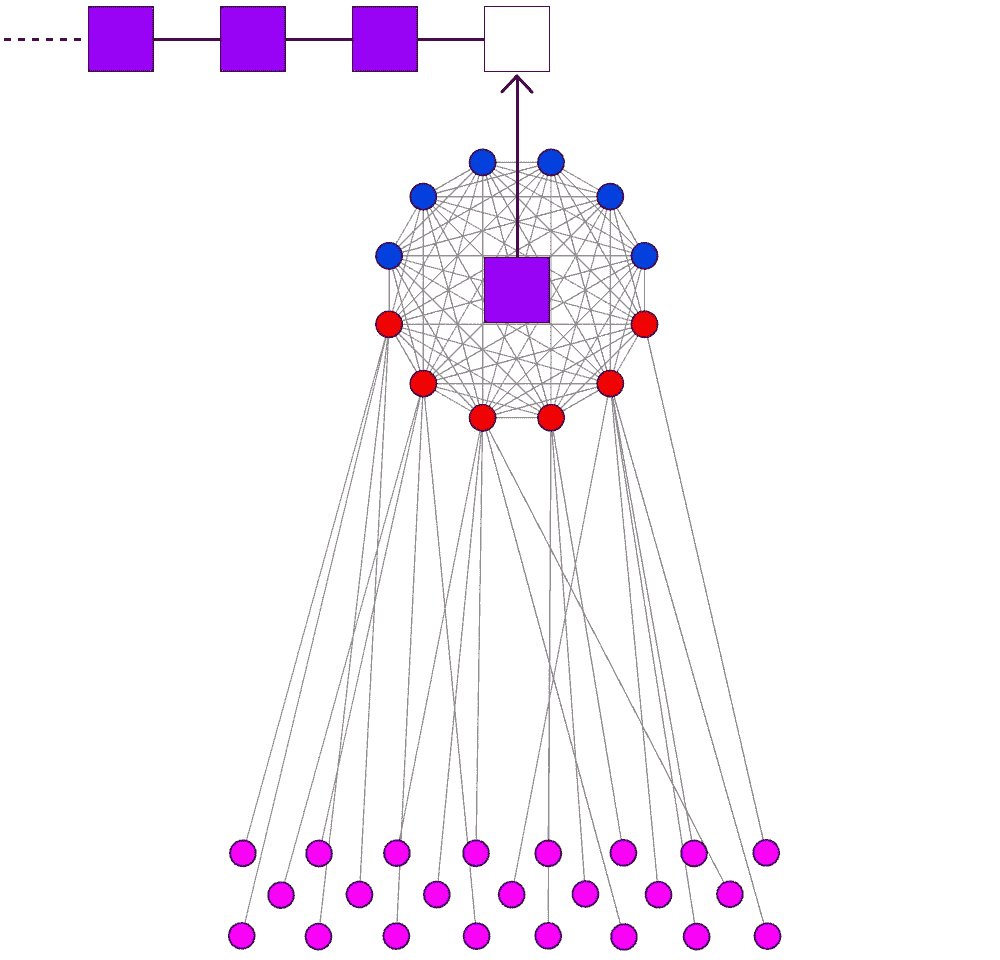**

**让我们来分析一下您看到的内容:**

*   ****排序规则**【紫色块】:排序规则只是一个分片特定的块。它们形成排序链，类似于块链。**
*   ****执行者节点**【蓝色】:执行者节点验证每个排序规则内的交易数据。它们计算契约，并将整理器节点委托给特定的碎片。**
*   ****整理器节点**【红色】:整理器节点“收集”该分片的数据，进行整理 *(block)* ，然后提交给执行器节点“执行”。**
*   ****光节点**【粉色】:这些是你将要运行的节点。他们对网络没有任何贡献，他们只是“看着”。他们有能力检查交易，但是由于他们没有转发交易或者阻止交易，如果交易无效，他们没有权力阻止转发。同样，这也是比特币节点和所有其他区块链的根本区别。每个比特币节点都做同样的事情，没有办法区分它们。**

**在每个碎片中，唯一重要的节点是执行器和排序器节点。**都需要 32 个 ETH 才能运行**。每个 light-node 可以“选择一个他们‘关心’的碎片*(如果他们愿意)*，同步那个碎片和主链的块头。他们可能不需要这样做，除非他们是一个依赖于验证碎片的应用程序或服务，因为他们的合同就建立在其上。**

**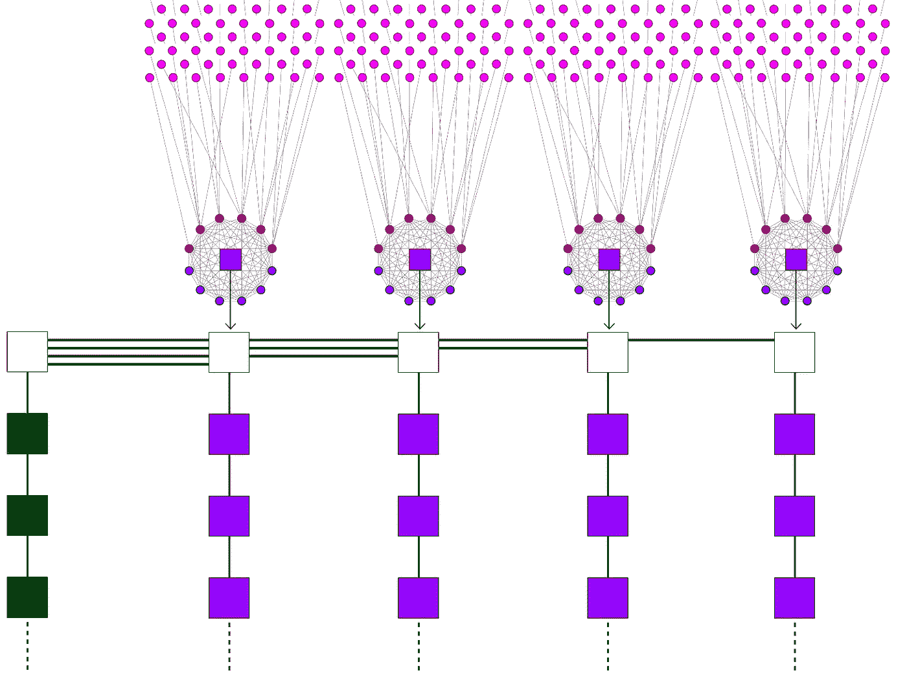**

**上面你会看到多个排序链，执行程序/排序器节点集合在这些链上工作 *(32 ETH)* ,“主链”*(绿色)*，当然如果你选择了一个特定的碎片来“验证”，你的 light 节点在顶部*。***

**您应该注意的几件事:**

*   **除非你有 32 个 ETH，否则你不会成为执行者/整理者节点之一。**
*   **你的光节点不中继块。它不强制执行共识代码，除了声嘶力竭的尖叫，它对无效数据什么也做不了。*(验证节点的网络从拒绝无效事务/块传播的能力中获得力量。当你开始不传播时，你不能保留它们。)***
*   **主链中没有交易数据。它只存储校对链的头。**

**但这还不是全部，这个网络还有更多。你所有的光节点，只要同步主链的头，就可以在下面这个大盒子里组合在一起。他们什么也不做，但他们会是数量最多的。一般来说，如果你没有 32 个 ETH，你就会成为其中一个节点。**

**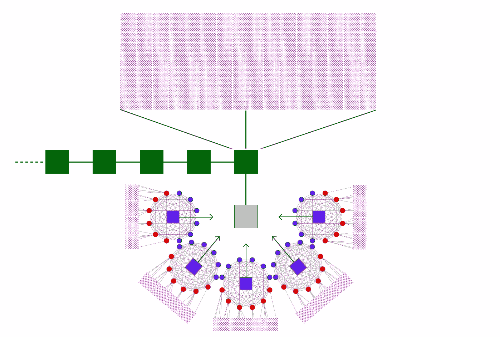****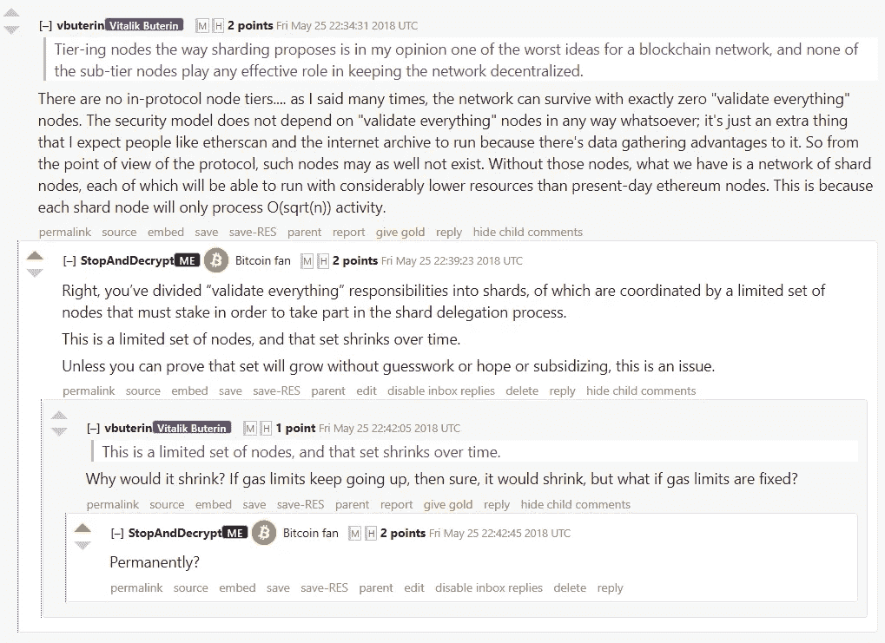**

**我在这里的观点是，即使“完全验证”被分成子作业，完成这些工作的节点组仍然是有限的。他说，这些节点的处理能力将低于目前的以太坊节点，但这从来都不是问题。问题是，随着时间的推移，这样做的难度越来越大，节点的数量也会随之减少。是*固有的集中化*。Vitalik 甚至同意，如果气体限制继续上升，这个数字将随着时间的推移而缩小，没有什么可以阻止这种情况发生。现在矿工是利他主义者，但是当采矿甚至不存在的时候会发生什么？如果只是下赌注，而做赌注的人并不关心其他人的积木变成孤儿，会发生什么？他们为什么要降低汽油限量？请记住，他们可以手动调整这一点，如果他们彼此高度连接，完全有能力处理这些数据，他们为什么要故意保持低水平呢？当他们开始复合他们的赌注收入，建立更多的节点，并获得对网络的更多控制时，会发生什么？**

**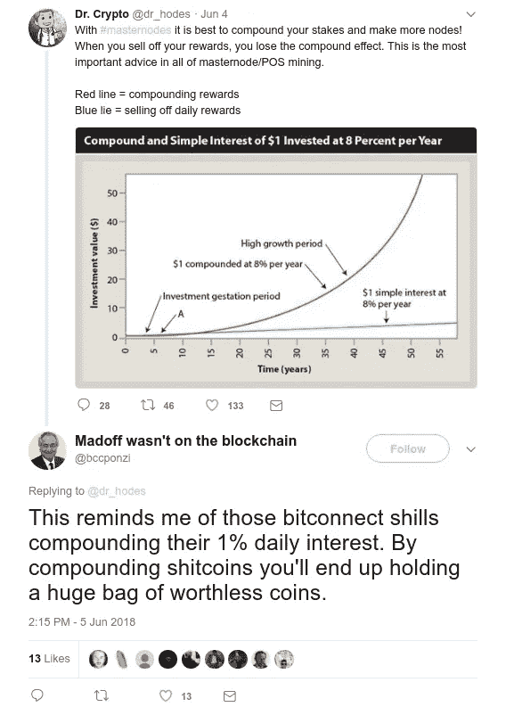**

**当人们不认为这是一枚狗屎硬币时会发生什么？大多数将会失败，但是当其中一个令人信服地被分散*刚好足够让人们暂时使用它的时候会发生什么？***

**我说过这一切会很容易。我不觉得事情会变成那样，但我尽量让事情变得简单。我提到这一点是因为我想用一个链接来结束这篇文章，链接到[分片常见问题](https://github.com/ethereum/wiki/wiki/Sharding-FAQ)，这里有一个关于分片的公认问题的长列表，以及他们计划如何解决这些问题，以及这些问题中的每一个如何引入其自身问题的新复杂性，以及解决该新问题的另一个解决方案。这很复杂，我花了太长时间才破译了节点类型的文字，但提供它是公平的。**

**我的问题从来不是它是否“有效”，而是它是否保持分散。在分片之前这有点糟糕，但我不认为在足够长的时间尺度上这个网络只有一条路可以走。如果你不介意有集中式验证器，你还不如买 EOS。他们跳过了整个假装的部分，直接进入了集中。他们甚至不需要分片，因为他们只是以集中的方式处理区块链数据。**

**谷歌可以处理每个人的付款。**

**我们不希望谷歌处理每个人的支付。**

**我们也不想让财富 500 强或福布斯 400 强来处理它。**

**那么我们学到了什么？**

**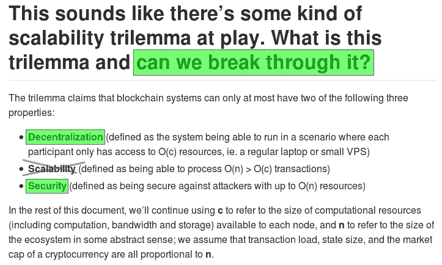**

# **号码**

# **使用第二层。**

** [## 🅂🅃🄾🄿 (@StopAndDecrypt) |推特

### 来自🅂🅃🄾🄿的最新消息(@StopAndDecrypt)。全栈社会工程师:10% FUD，20%迷因，15%集中…

twitter.com](https://twitter.com/StopAndDecrypt) 

# 分解维塔利克的反应

## 1:

> 这是严重的无知。以太坊已经有一个气体限制形式的块大小限制，这个气体限制是 800 万，并且在过去的六个月里一直存在。

我在上面提到过这个问题。如果分片还没有准备好来拖延这个问题，你将提高气体限制。

## 2:

> 在过去的六个月里，快速同步数据目录增长[保持在每月 10GB】的水平，而且不会再增长太多，因为进一步增加 gaslimit 会导致大叔速率集中化问题。所以我们已经经历了最糟糕的时期，而且已经持续了半年。](https://etherscan.io/chart2/chaindatasizefast)

如果你不提高汽油限额，这些费用将使 Dapps 失去能力，并在社区中引起愤怒，因为他们有期望和要求。我也在上面看过了。当你没有其他解决方案的时候，利率叔叔并不重要，现在矿工们只是通过听你的来表现出利他主义。这本身就是一个问题。

## 3:

> 此外，关注归档节点大小是非常错误的，因为(I)您可以通过每年重新同步一次或只运行一个奇偶校验节点来获得更低的 datadir 大小，这为您进行了删减,( ii)它包括一堆无关数据(技术上来说，所有历史状态，加上 Patricia 树节点),这些数据无论如何都可以从区块链(低于 50 GB)中重新计算，因此从任何重要的信息理论意义上来说，您这样做甚至不是“丢弃历史”。如果您愿意丢弃历史记录，您可以在仅状态模式下运行奇偶校验，磁盘需求将降至 10 GB 以下。

当我展示数据吞吐量随时间变化的图表时，我解决了这个“冲突”。目录大小类似于节点处理需求的指数增长。对此唯一的反制是你不会提高汽油限额。你会的。

## 4:

> 分片的全部意义在于，网络理论上可以在没有你所谓的“满节点”的情况下生存。而如果有五个完全节点，那五个完全节点没有任何额外的特殊权力来决定共识；他们只是验证更多的东西，所以会更快地找到正确的链，仅此而已。共识形成节点只需要是分片节点。

我在上面提到了分片。

## 5 (lol):

> 最后，你用错了术语“BCash ”;这是一种实现，而不是区块链/加密货币。

 [## 那不是比特币，那是 BCash

### 或者，一个完整节点的故事

hackernoon.com](https://hackernoon.com/thats-not-bitcoin-that-s-bcash-f730f0d0a837) 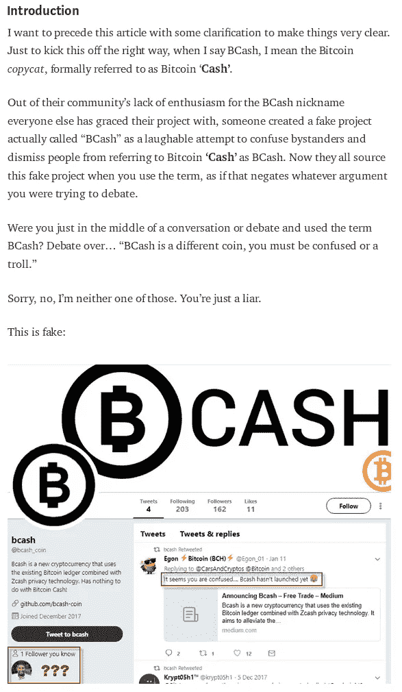

# 分解古斯塔夫·西蒙松的回应:

 [## 跟上以太人——对区块链尺寸问题的回应

### 昨天@StopAndDecrypt 发表了一篇中间文章，讨论了以太坊区块链的发展和关注点…

medium.com](/@gustav.simonsson/keeping-up-with-the-etherians-a-response-to-blockchain-size-concerns-a4858c2701d9) 

**1:**

> 这往好里说是误导，往坏里说是错误。以太坊*有*块大小限制，这是由于共识协议强制实施的块气体限制。
> 
> 他们不太可能投票支持会破坏网络的块大小增加

我在本文中进一步讨论了气体限制。谢谢你激励我。网络不会因为验证器的消失和对等点的丢失而中断。网络通过两个数据中心运行。*打破*的是**放权**。连接的节点没有动机去关心其他较少连接的节点的验证能力。

**2:** *“即使有一个[区块大小的上限]到位，它也必须是合理的，然后这些 Dapps 甚至不会工作，因为他们现在几乎没有上限。”*

> 没有人再去海滩了，那里太拥挤了。
> 
> 如果区块链网络处于满负荷状态，所有的块都被事务填满，那么所有的 tx 发送者都发现用他们特定的费用发送他们的 tx 是有用的。

这完全没有抓住要点，因为这和我们在比特币中的论点是一样的。它非常受欢迎，但比特币并没有向 Dapp 开发者和用户承诺低费用和可用性。当那些 dapp 被 mixers (lol)的基本交易定价过高，使用 90%的块空间来倾倒他们被黑/被偷的硬币，因为混合比使用没有人真正使用的愚蠢 dapp 更值得支付时，**你还剩下什么营销？**这才是重点。你可以尽你所能反驳这一点，但在某个时候，你开始只用比特币的匹配属性来证明以太坊的存在，而没有花哨的花里胡哨，比特币比比特币做得更好。

> 作者继续他们的谬论，通过主张以太坊上的应用程序转移到比特币来直接自相矛盾。如果由于 tx 费用增加，应用程序在以太坊上变得无用，那么如果被支付更高 tx 费用的其他用户挤出，它们在比特币上也将无用。

我建议开发者在比特币的基础上开发。我并没有说把你拥有的可能永远也不会成功的相同的程序想法建立在比特币上。几乎所有的 dapp 一开始都是集中的，实际上并不是“dapp”。它们都可以建立在闪电之上。无论支付渠道网络的区块大小如何，你都不会有费用问题。同样，你可以争辩以太坊也可以做到这一点，但这并没有给它的基础层承诺任何额外的存在理由。

> 不存在由于高负载而导致以太坊瘫痪的应用

 [## cryptokitties 以太坊——谷歌搜索

### 2017 年 12 月 15 日……密码猫发展到如此规模，以至于它们正在扰乱以太坊网络——创造……

www.google.com](https://www.google.com/search?q=cryptokitties+ethereum) 

**3:**

> 对于任何合理的“事务流”定义来说，这都是错误的。对 tx/s 的任意限制确实会限制交易流，因为在给定的时间段内无法有更多的交易流……**如果我们将 lightning network 等链外解决方案**作为 L1 tx/s 限制不会减少流量的论据，那么我们也应该将以太坊上已经上线的[解决方案](https://www.coindesk.com/microraiden-payment-channels-go-live-ethereum-network/)包括在内。**或者认识到随着 L1 费用的上涨，建立支付渠道等的成本也会增加** …

我们包括他们，这就是为什么我说它不限制流量。街区大小是一座以收费形式发电的大坝。溢出溢出到 Lightning 网络中，该网络在 Lightning 节点和支付通道的容量之外对交易吞吐量没有上限，而这些节点和支付通道本身没有限制。

此外，任何收到比特币的交易，都可以直接收到新开通的渠道。这不是一个两步走的过程。

**4:** *“我是说这个信息需要停止被遮掩。我还说，如果/当它不清楚的时候，那就太晚了，无论如何也无能为力。”*

> 这一信息并不模糊。您可以简单地运行一个完整的节点并查询它
> 
> 只是因为你没找到做这个的网站
> 
> 当它未被掩盖时，认为它“为时已晚”的论点，往好里说是一种错误的概括，往坏里说是事后谬误。

很模糊。这不是我“找不到”追踪这个的网站的问题。**跟踪的网站**停止跟踪。

你忘了包括下一句话:“已经太晚了。”

这是一句俏皮话，不是谬论。要么接受，要么放弃。

**5:**

> 这是错误的。通过运行几个地理上分布的完整节点，将它们相互连接，并测量它们何时发现和中继新的数据块和事务，可以轻松地测量数据块传播时间。
> 
> 懒得花几个小时学习如何部署、使用甚至添加调试以太坊客户端，为了收集这些信息，他们可以随时检查连接到[https://ethstats.net/](https://ethstats.net/)的节点的传播时间

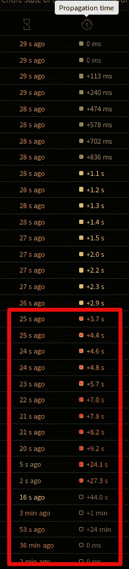

首先，这是容易的反义词。再说一次，这不是关于我，因为我清楚地能够辨别这些网络中的差异，并将信息收集在一起。我是分享它的人，因为我做了。

第二，我不需要在全球各地设置节点来检查这一点，所有的在线投诉加上你建议的网站左边的数据只是巩固了在线共识。当一半自愿向该网站提供数据的节点有可怕的延迟时，这表明存在问题。

第三，一个懒惰的人不会经历我所经历的努力，我也不会错误地声明这不是公开的。网络数据**一般来说**是不公开的，实际上公众是看不到的，其中一些曾经是。你需要更多的常识来获取它。

**6:** *【含糊不清地咆哮着用“正确的”方式使用区块链，并憎恨那些神秘的小猫】*

> 作者假设有一个“正确的”方法来使用一个公共的、未经许可的区块链。比特币和以太坊等区块链的魅力在于，用户可以用它们做任何他们想做的事情，只要他们能说服矿工接受他们的交易。
> 
> 例如，许多人实际上喜欢猫，以至于在最近的一次拍卖中为一只猫出价 14 万美元。

这与矿商接受什么交易无关。我是说，即使他们现在被接受，在未来，任何只能使用低费用运行的 Dapps 都将无法使用，除非提高限制，或者牺牲去中心化。您可能想开始在其他地方寻找这种功能。如果你不在乎分权，那么这就不适合你，这完全没问题。但这确实是以太坊现在的卖点:

抛开洗钱不谈，傻逼是存在的。CryptoKitties 是证明这一点的一个很好的工具。事实上，我喜欢 CryptoKitties 是因为这个有价值的公开测试，我不讨厌猫:

**7:** *“比特币网络约有 115000 个节点，其中约 12000 个是监听节点。”*

> 这似乎与比特币节点数的其他来源相矛盾
> 
> 如果所有这些来源都是错误的，他们可能很想知道作者链接的站点是如何计算节点数的。
> 
> 此外，谁审核过计算这些更大的节点计数的脚本？

它所做的只是计算非监听节点和监听节点的数量。两者都算比较难做，所以网站不做。同样，在以太坊中分离光节点和验证节点更困难，所以网站不这么做。

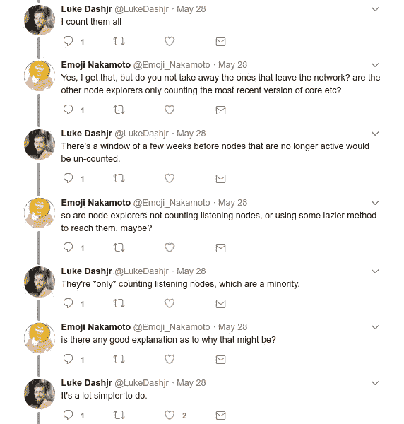

[https://twitter.com/LukeDashjr/status/1001202223009935361](https://twitter.com/LukeDashjr/status/1001202223009935361)

**8:** *“那以太坊的节点算不算？我向你保证，这些大部分都是轻量级节点，完全不做任何验证工作(检查头不是验证)。不同意那个？证明我错了。给我看数据。”*

> 作者提供一些支持他们推测性主张的数据怎么样？*【保证你】[暗示着对权威](https://en.wikipedia.org/wiki/Argument_from_authority)的诉求，鉴于以上的错误主张和误解，作者在我心目中已经失去了足够的可信度，不能再认真对待(以太坊)协议和网络的事情了。*

*我承认冒昧，但说我失去了信誉有点牵强。我的担忧是合理的，不应该被忽视。你可以不同意，但是你需要为你不同意的原因提出一个理由，这篇文章和我之前的文章提出了一个非常清楚的理由:验证节点是重要的，而以太坊在协议层面忽略了它们。*

***9:** *当您的节点无法保持同步时，它会降级为轻型客户端。**

> *假的。即使一个节点在同步时落后于多个块，它仍然可以回答对过去的块和事务的查询，并为正在同步的其他节点提供服务。作者将很好地研究诸如奇偶校验和 go-ethereum 等客户端的并发性和状态处理，以了解更多节点当前如何实现同步以及如何与新的分片提案一起工作。*

*不是假的，你只是照字面理解。网上所有关于人节点不同步的评论导致*人*决定使用快速同步，通常是在别人告诉他们“没关系”之后。从缩小的角度来看，这导致验证节点离线& light-nodes 在线，就像我上面显示的图表。*

***10:** *“您怎么知道这个设置中有多少完全验证节点呢？你现在甚至都不知道，因为唯一跟踪它的网站是把轻度用户计算在内的。你怎么知道全节点集中到比如说 10 个数据中心？你永远不会知道。你。威尔。从来没有。知道。”**

> *好吧，那么现在我们能够完全肯定地知道，有 115000 个正确验证的完整比特币节点，但在这个假设的未来，作者想象我们无法知道以太坊网络中有多少个正确验证的完整节点？*
> 
> *显然，目前比特币中存在一些网络工程设计魔法，未来的以太坊网络可以利用这些魔法。鉴于比特币和以太坊客户端都是开源的，我预计这种魔力很快就会被以太坊开发人员发现，然后合并进来，让我们所有人都能准确知道在任何给定时间存在多少完整节点。*

*你能确定比特币的原因是因为**所有节点都验证**。网络中的每一个参与者都会验证这个链，这是在不信任任何人的情况下，你知道下一个块是否有效的唯一方法。比特币中没有光节点。*

*在以太坊中，节点之间有如此多的不明确的交互方式，以至于合理检测哪些节点正在完全验证的唯一方法是从过去请求随机块，以查看它们是否拥有完整的块，但是大多数以太坊节点通常不保留历史，因为以太坊是基于状态的。*

*网络从根本上是不同的，这就是为什么比特币很容易在网络上投票，而以太坊充其量是有问题的。*

*— — —*

> *自然，运行一个以太坊全节点需要更多。而且它可能会使特别旧的笔记本电脑变得紧张，并且肯定需要 SSD。然而，从任何合理的角度来看，它都不需要一个强大的服务器。事实上，任何具有过去 6 年的 CPU、8gb RAM 和现代 SSD 的专用机器都可以很好地处理一个以太坊完整节点(或者在我非常普通的服务器上运行的几个完整节点)。tx 和 block relay 的带宽使用是需要考虑的事情，但在连接良好的网络上通常不是问题。*

*1:随着时间的推移越来越难了。*

*2:考虑到 45，000 美元的验证节点，这也是一种模拟。*

*3:非 45，000 美元的验证节点网络上的带宽肯定是非常重要的，因为“良好连接”对隐私是危险的，正如我上面所描述的。*

*— — —*

> *矿工了解当前的区块大小(气体)限制，并积极参与社区其他部分关于理想区块大小限制的讨论*
> 
> *过去，矿商们曾采取行动降低或提高上限*

*在 PoS 集中式网络中，这些都不重要。但从长远来看，这在一个战俘系统中是非常危险的。当“其他”节点可以同步报头时，就没有保持“其他”节点连接或同步的动机。他们现在可能表现出利他主义，但没有理由期待未来会有这种行为。随着这些网络开始扩大，在当权者中开始信任诚实是一个危险的主张。*

*— — —*

> *总体而言，自网络推出以来，随着客户不断提高性能，矿商逐渐将限制提高到当前的 800 万英镑(以太坊推出时为 3.14 万英镑)。一般来说，如果同步问题变得严重到足以影响以太网价格，矿商就会有动力降低限制来监管网络。*

*我没有理由相信这个限制会被降低，正如我在这些文章中明确指出的那样。*

*— — —*

> *正如其他人已经讨论过以太坊客户端支持的各种同步模式及其变化的资源需求，另一个值得讨论的紧急补救措施是[检查点](https://bitcoin.stackexchange.com/questions/1797/what-are-checkpoints)，如果以太坊网络确实增长如此之快，以至于大多数完整节点都难以跟上。*
> 
> ***像 StopAndDecrypt 这样的人可能一提到像区块链检查站这样不神圣和罪恶的事情就感到恐慌。**如果实现一致协议的客户端同意使用检查点块，而不是从起源块同步，那么如何分散区块链？！*

*检查点有它们的功能，但是你对我对它们的看法有所猜测。不管怎样，同步模式并不重要，如果你想这么做，它们对你来说很好。我关心的还是验证节点集，检查点只处理历史数据，而不是同步后的数据处理需求。*

> *在实践中，比特币或以太坊的重组深度超过几个小时的可能性极小*

*我同意。*

*— — —*

> *收场白*
> 
> *没有人真正知道一个网络需要多少完整的节点才是“安全的”。*
> 
> *在此之前，我们无法知道 1K、5K、10K 或其他数字是否是保持网络合理安全的最低要求。*

*见上文。*

*— — —*

> *也就是说，我们应该继续鼓励从事以太坊应用的个人和项目——或者任何有兴趣为网络做贡献的人——运行他们自己的完整节点。*

*我希望有超过 45，000 美元，一旦 PoS+分片来了。如果 ETH 上涨，那就更糟糕了。DASH 需要 1000 枚硬币，运行一个 masternode 一度需要 100 万美元。*

*— — —*

> *对于那些读到这里的人来说—*

*是的，我不恨你。人们倾向于认为我的作品带有敌意。不是的。***