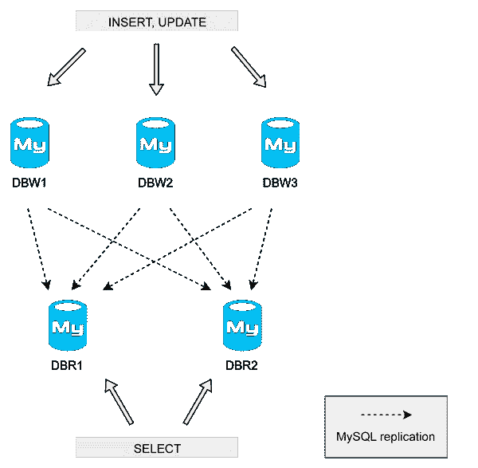

# 使用 MySQL 和增量偏移量进行分片写入

> 原文：<https://medium.com/hackernoon/sharding-writes-with-mysql-and-increment-offsets-48df32379563>

# TL；速度三角形定位法(dead reckoning)

*   我们使用 PKs 上的增量偏移量来分片写入并避免冲突
*   每个数据中心都包含本地写服务器
*   我们在读取服务器上使用多源复制，因此它们包含来自所有数据中心的所有数据，并按月进行分区

# 一开始，事情很简单

我们使用的是 MySQL:一个主数据库用于写，几个从数据库用于读。除了*复制滞后*(稍后会有更多介绍)，它运行良好。然后你扩大规模。然后就失败了！主人是一个 SPOF——“**S**single**P**point**O**F**F**failure”。

无论是流程失败、虚拟机崩溃，还是我们必须在服务器上进行维护，只有一个“主机”需要写入数据都意味着服务会中断几分钟。这是不可接受的。

我们实现的第一件事是基于数据“类型”的**分片**:有“stats”集群(一个主+ N 个从)、“calls”集群、“customers”集群等等。这使得服务器的维护更加容易，因为我们可以在一个集群上工作，而不会影响其他集群。

但是在每个集群中仍然有一个 SPOF:主人。

# 选择

为了摆脱主节点是 SPOF 的主从架构，我们需要一种解决方案，可以在任何节点上写入，如果前一个节点不可用，可以故障转移到另一个节点。对于读取，我们需要一个可以针对“联邦”数据(从每个节点读取)运行查询的解决方案。

这并不像听起来那么简单。在分布式系统上工作时，您必须使用:

*   一致性
*   **一**可用性
*   P 分割公差

是的，[上限定理](https://en.wikipedia.org/wiki/CAP_theorem)。

如果在一个节点上更新一行，同时在另一个节点上更新同一行，会发生什么情况？数据协调很难(有时甚至不可能)。

如果网络出现故障，并且节点之间的数据不一致，该怎么办？你相信哪一个？

我们研究了许多技术。存在“主-主”拓扑。MySQL Cluster 是一个不错的选择。还有 Galera 集群、钨复制器、MySQL 代理……(当时，MySQL 组复制还没有做好生产准备)。

我们也观察了 NoSQL 世界。Cassandra，MongoDB，HBase…但是:

*   我们在团队中对 MySQL 有很深的了解
*   我们对它很有信心，它很稳定，我们知道如何运行它
*   我们想尽可能少地改变我们的代码

> 新技术肯定很性感。但是当你经营一家企业时，稳定性和维护是关键。

*注意:现在有很多解决方案，尤其是如果你是“在云端”并且从头开始。如果您有一个现有的 MySQL 基础设施、一个现有的代码库、有 MySQL 经验的人，并且需要在不改变整个存储层的情况下进行扩展，那么我们在此公开的解决方案会非常有效。*

# 我们的解决方案

我们处理两种类型的数据:

*   **【永久】**数据:运营商、电话号码、路由配置文件、拨号代码等。数据很少变化，我们必须“永久”保存它(除了根据 GDPR 和其他法规强制删除)，并且它随着时间的推移增长非常缓慢。
*   **【用法】**数据:通话、短信、API 请求、事件、webhooks、日志。**成长非常迅速**。写过一次。可能会在小时内更新。

对于永久数据，我们使用主-主拓扑。这里没什么特别的。我们总是在同一个母版上书写。如果它失败了，或者如果我们需要做维护，我们就切换到另一个主机。

**这里的故事是针对使用数据的。**

我们称之为**“DBRW”架构**，因为我们拆分了读/写。

# 它是如何工作的

我们的实现非常简单:当我们需要插入数据时，**我们随机选择一个写服务器** (*)。如果它不可用，或者如果错误让我们进行故障转移，我们尝试另一个写服务器。嘣！**SPOF 不见了！**

写服务器只包含已经写入其中的数据。它们的数据在读取服务器上异步复制。

读取服务器使用多源复制联合来自所有写入服务器的数据。我们对连接应用与写服务器相同的规则:我们随机选择一个服务器(*)，如果它不可用，就进行故障转移。

*(*)我们的系统更聪明一点:它避开了正在维护或被监管机构降级的服务器，对“随机”进行了加权，并且我们总是首先尝试同一个数据中心的服务器。*

DBRW illustrated

写服务器上的我们`INSERT`和`UPDATE`。我们`SELECT`在阅读服务器上。

# 写服务器

*   数据每天清除，他们只需要有限的存储空间
*   我们使用非常快速的固态硬盘来获得最佳性能
*   除了主键之外没有索引(所以插入非常快)
*   可以关闭服务器进行维护，这不会影响系统

# 读取服务器

*   相同的模式+索引+分区(按月)
*   索引允许快速搜索查询(但是占用空间)
*   分区让我们可以在磁盘之间移动数据，或者在几毫秒内丢弃旧数据

# 增量偏移解释

通过利用多源复制，读取服务器接收并“合并”来自所有写入服务器的数据。为了避免主键冲突，我们在写服务器上使用一个增量[增量](https://dev.mysql.com/doc/refman/5.7/en/replication-options-master.html#sysvar_auto_increment_increment) + [偏移量](https://dev.mysql.com/doc/refman/5.7/en/replication-options-master.html#sysvar_auto_increment_offset)。例如:

*   服务器 DBW1(增量 20，偏移量 1): 1，21，41，61，81
*   服务器 DBW2(增量 20，偏移量 2): 2，22，42，62，82
*   服务器 DBW3(增量 20，偏移量 3): 3，23，43，63，83

这样，插入就不会发生冲突。

当我们需要更新时，**我们需要在拥有数据**的服务器上进行。写服务器仅保留数据几天，旧数据将被清除。幸运的是，一旦写入，**使用数据很少更新**，或者在几个小时内更新。

显然，这种体系结构不适用于需要随时间不断更新的数据！

要知道哪个服务器保存了带有主键的数据，我们需要做的就是应用增量的模，它会给我们一个偏移量，也就是服务器。例子:`41 mod 20 = 1` (DBW1)或者`62 mod 20 = 2` (DBW2)。

# 这种架构的优势

*   任何服务器都可以关闭，而不会影响服务
*   写服务器很轻，速度极快(没有索引)
*   适用于多数据中心拓扑:
*   ➡️写服务器可以“本地”放置在每个数据中心
*   ➡️读取服务器可以是“远程”的，因为 MySQL 复制在广域网上运行良好
*   读取服务器包含所有数据，因此搜索查询可以按预期工作
*   有了分区，读服务器的维护相当容易
*   扩展写入很容易

# 骗局

*   读取服务器需要很大的空间(“垂直扩展”)，但是分区使它变得很容易
*   在读取服务器上复制和聚合的写入服务器的主键不连续，也不按顺序排列，因为它在每个写入服务器上独立递增

我们已经使用这个架构很多年了，到目前为止，它一直工作得很好。

# 履行

实现读/写拆分可能很棘手。在我们的例子中，我们的大多数项目都有一个“数据存储”层，在这个层中我们可以很容易地实现分割和[分片](https://hackernoon.com/tagged/sharding)。

最重要的是，在进行更新时，或者当复制延迟成为问题时，不要忘记**读取您自己的写入内容**。

# 推荐阅读

*   [高性能 MySQL](https://www.amazon.fr/High-Performance-MySQL-Baron-Schwartz/dp/1449314287/ref=sr_1_1?ie=UTF8&qid=1535544569&sr=8-1&keywords=mysql+performance) 是一本好书，不幸的是没有最新版本的 MySQL
*   [设计数据密集型应用](https://dataintensive.net/)，虽然不是专门针对 MySQL 的，但却是一本好书
*   [珀科纳博客](https://www.percona.com/blog/)真的很棒

*原载于 2018 年 8 月 29 日*[*blog . callr . tech*](https://blog.callr.tech/sharding-writes-with-mysql-increment-offsets/)*。*