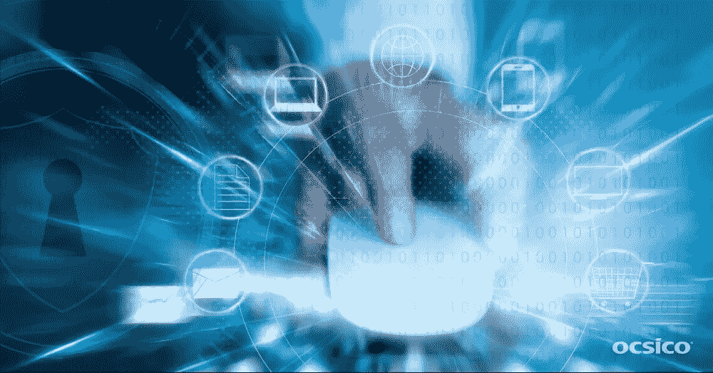

# 保护您的网站免受内容窃贼的侵害

> 原文：<https://medium.com/hackernoon/shield-your-website-from-content-thieves-ca8e3499a8ec>

现代在线[营销](https://hackernoon.com/tagged/marketing)是文案战场。这不像前些日子黑灰帽 [SEO](https://hackernoon.com/tagged/seo) 营销产生积极效果。为了赢得谷歌、雅虎等搜索巨头的喜爱。和 Bing，营销人员为门户网站和社交网络创建高质量、引人入胜的内容。尽管如此，还是有一些骗子总是利用现成内容的便利。是时候揭示窃取内容的问题和保护方法了。

接下来，我将所有众所周知的验证作者身份的方法放在括号后面。这篇文章的主要目标是帮助网站所有者使他们的内容安全。

**谁需要偷窃？**

在超过 10 年的工作中，OCSICO 的营销团队遇到了许多充斥着从我们这里窃取的内容的门户网站。通过我们的努力，大多数网站都被移除了。由于这样的活动，我们设法维持我们网站的高信任度。现在我可以揭露那些从事窃取内容的人的信息。那么，他们是谁？

*   ***无良的网络开发者。我们遇到的几乎一半的无良门户网站都是我们公司网站的翻版。基本上，他们是一些小的网络代理，只是欺骗那些选择了他们的网络开发服务的客户。他们的一些 HTML 编码员使用我们的内容作为他们网页模板的默认填充。其他人想换一个公司标志，但窃取了 UX 的设计、投资组合截图、产品和项目名称。***
*   ***黑暗 SEO 高手。*** 不管你听起来有多天真，一些所谓的 SEO 专家真诚地认为，复制高排名网站的内容就足以获得同等的信任、流量和排名。其实没用但是可能会影响原网站。因此，防止创建克隆网站的活动至关重要。
*   ***懒惰的文案。*** 偷一整篇文章或者几个整洁段落的诱惑，往往是不可抗拒的。否则，必须有人打开大脑。

**为什么屏蔽内容是必要的？**

首先是 SEO 原因 ***。搜索引擎索引克隆网站的速度通常比你自己的原始门户网站快得多。在这种情况下，你的内容将为竞争对手而不是为你工作。它甚至可能引发评分指数的下降，这对你的网站来说是绝对不可接受的。***

其次，优质内容是你对网站的投资。你需要的是保证你的投资安全，否则投资的钱将不会对你有利，而是对不诚实的竞争对手有利。

第三，独特的内容促进销售。如果潜在客户在众多类似的网站中失去了你的网站，你就会失去订单。

**内容保护的技术手段**

1. ***限制从不安全的地方访问网站*。这是一种有效但有争议的技术。网站封锁是一种罕见的情况。或者，你可以采取不那么激进的方式，强行将用户重定向到网站的区域副本。**

2. ***通过 JavaScript* 禁止复制和禁用上下文菜单。这真的只对 nubby 用户有效。此外，并不是所有的浏览器都支持这些功能。最终，你不会保护内容免受熟练内容窃贼的侵害，但会大大降低网站的可用性和兼容性。**

3. ***阻止 CSS 样式中的文本选择*。**这也不是一个通用的解决方案，因为复制某些内容有许多变通办法。

4. ***使用特定渲染引擎*。也许你还记得基于 flash 的网站，在那里，如果作者反对，就不可能复制文本。允许生成位图而不是原生文本的引擎以同样的方式工作。今天，由于没有系统限制，您可以很容易地使用这种技术。但你不要忘记，在这种情况下，搜索引擎会忽略你的网站，不会索引它。**

5. ***个性化*。**这个方法真的管用！与传统网站相比，你将需要更多的内容和一个特殊的 CMS 来跟踪用户配置文件，并在单独的块中提供最相关的内容。将 CMS 与测试结合使用，你将增加显示内容的多样性，并防止窃取全部内容。

**结构手段**

你需要将内容整合到你的网站结构中。这将使复制选定的网页对窃贼来说毫无意义。

**动态网站结构**

采用特定的方法来组织门户网站的内容和结构。你可以用主题的快照替换长篇文章。或者你可以在单独的框架或可点击的剧透中上传新内容。最终用户肯定会欣赏一个按需添加内容的网站的高可用性。另外，内容窃贼将无法恢复网页结构，因为他们不在你的目标受众中，也不遵循内容呈现的逻辑。另一方面，您应该小心地将内容拆分到框架中。这些信息中的一部分可能会从搜索爬虫中溜走，从而影响索引。你需要设计出你的 web 解决方案的架构，或者甚至考虑一个定制的 web 应用程序。这样一来，你就一举两得了:保持内容对搜索引擎的吸引力，让你的网站对访问者和你的文案真正做到用户友好和易于使用。

**文案的意思是**

**内容品牌**

如果竞争对手的文案意识到有必要重写 30%以上的内容，那么复制你的页面的想法就不再那么有吸引力了。要防止窃取内容，请遵循以下提示:

选择以品牌为中心的方法来创建内容

经常提到公司名称和产品

积极利用链接内页

插入您员工的姓名

提及办公室和商店地址

**从作者的角度看**

适当的时候，用第一人称写内容。尽可能多地插入个人经历的细节和参考。一点幽默感和讽刺性的评论会对你的文章大有帮助。一些大胆的写作技巧肯定会吓跑那些总是寻找中性内容的无良文案。

**动态块**

添加新闻、见解、推荐文章等板块。，在每一页上。对于你的目标受众来说，这将是一个可用性特征，而对于内容猎人来说，这将是一个真正的噩梦。