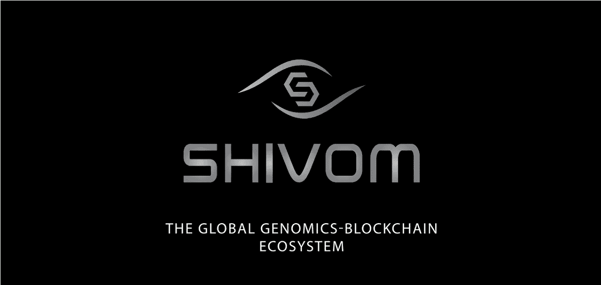
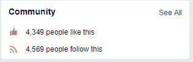
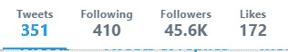
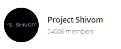
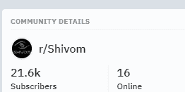
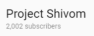

# Shivom:区块链和基因组学的神秘协同

> 原文：<https://medium.com/hackernoon/shivom-the-uncanny-synergy-of-blockchain-and-genomics-e1ca7f2a0173>

## 从你的蓝图中根除疾病的探索

你曾经生病吗？这是什么问题——你当然有。我们每个人在生活中都会生病。也许通过某种形式的药物治疗或疗法，你已经康复了，现在你和以前一样过得很好。但是如果疾病没有真正消失呢？如果这种疾病在你生病之前就已经存在了，而你只是不知道而已，那该怎么办？如果它在你出生时就已经锁定在你的 DNA 里了呢？

**进入 SHIVOM** ，这是一家总部位于区块链的基因组数据库、网络市场和创新中心，利用区块链技术、数字基因组技术和人工智能的突破性创新，为世界各地的各类人群提供基于基因组分析的服务和医疗保健解决方案。通过区块链协议，SHIVOM 能够创建一个基因组数据库，其中人们可以通过密钥安全地提供和存储他们的个人健康数据，并完全控制这些数据:无论他们选择自愿捐赠还是从他们的基因组数据中获得收入。

通过这种分散的数据库和激励系统，非营利组织、制药公司和政府等能够方便地从单个分散的数据库中收集数据，使研究和开发达到更高的高度，具有更多数量的统计多样性数据，而没有从本地化的研究机构单独集中收集数据的不便和低效，这带来了信息冗余的风险，并使数据由于本地范围和范围的限制而具有一定的统计偏差。位于区块链的 SHIVOM 数据库使得无与伦比的大型基因组数据库成为可能，这使得基因组图谱和医疗保健研究更加准确和有效，同时仍然让贡献者保持对其敏感个人信息的完全控制和透明度。

# 有用的 DYOR 信息

**研究日期:**2018 年 3 月 20 日

【https://shivom.io/】网页:

****硬币名称:**希沃姆(OMX)**

****总供应量:**30 亿**

****流通供给:**9.9 亿 OMX**

****市值:**1500 万瑞士法郎**

****Ico 价格:** 1 OMX = 0.0542 美元(0.00014 瑞士法郎)**

****时区:** UTC +1**

****白皮书:**[https://drive . Google . com/file/d/1 xwtlzm 0 VL 48 CJ 8 hsex 93 bkcy 3 grijhaq/view](https://drive.google.com/file/d/1xwTLZm0VL48cJ8hSEx93BkCy3GrIJhaQ/view)**

****令牌类型:** ERC20**

## **人类基因组:通向生物永生的地图**

**制药公司目前面临抗生素困境，这是一场全球性危机。由于抗生素耐药性在全球范围内以惊人的速度增长，致病微生物在对抗药物方面正占据上风。由于抗生素不断被大量生产，伴随着这些药物的滥用，微生物开始快速进化并适应这些药物的抗生素特性，从而使它们变得无用。这些具有弹性的病毒和细菌的出现带来了一种威胁，即由于缺乏有效的药物，简单的普通感冒可能已经成为威胁生命的疾病。此外，糖尿病和高血压等疾病仍然无法治愈，大量维持药物使市场过度饱和，而不是永久治愈。**

**最近的研究表明，最常见的疾病实际上是遗传性的，最显著的是:心血管疾病、高血压、阿尔茨海默病、关节炎、糖尿病、肥胖症甚至癌症。据 SHIVOM 网站报道，随着基因组图谱的进步，研究人员将能够更好地了解多达 7000 种罕见疾病、长期复杂疾病和感染，并最终提出从预防到治疗的医疗保健解决方案。然而，近年来基因组研究的进展有所下降。这是怎么回事？这是因为抗生素和维持药物对制药公司来说很容易赚钱，而不是彻底根除疾病。**

**SHIVOM 的目标是通过将密码经济整合到基因组研究技术中，并使世界各地的人们都能获得医疗保健，从而建立一个以基因组学为导向的竞争性医疗保健市场，从而消除这种情况。**

## **从你的细胞到数据库:SHIVOM 平台如何工作**

**人类基因组由大约 30 亿个碱基对组成。在过去的十年里，对整个人类基因组进行测序将花费大约 100，000，000 美元。然而，如今，全基因组测序的费用不到 100 美元。随着成本的大幅降低，基因组分析服务的成本将大幅降低，这将成为世界各地所有人获得医疗保健见解的曙光。**

**SHIVOM 利用相同的基因组测序技术从供应商那里收集数据。**

## **● DNA 提取试剂盒**

**为了让提供商成为 SHIVOM 生态系统的一部分，提供商必须首先创建他/她的 SHIVOM 帐户。之后，提供者收到 DNA 提取试剂盒，其中提供者收集他/她的唾液样本，该样本将被送回 SHIVOM 进行测序。在提供者已经有他/她自己的基因组序列数据的情况下，提供者也可以上传他/她的基因组序列。**

**一旦提供者的基因组数据已经被分析，提供者被给予关于他/她的祖先的信息以及来自提供者的原始基因组数据的个人健康见解。这些数据将以完全透明的方式存储和保护在区块链中，提供者将有权选择是将他/她的数据捐赠给研究还是通过出售获得利润。**

## **●区块链如何捍卫你的 DNA**

**SHIVOM 保证，通过使用基于区块链的技术，基因组数据将永远归其提供商所有。一旦数据被添加到区块链数据库中，它就成为一个永久的块，标记有时间戳和到链中前一个块的加密链接。由于数据库中的每一个数据都是相互加密链接的，篡改是绝对不可能的。这实现了无信任系统，因为永久分类帐的数学保证，其中系统中的每个资产都受到保护并且不可辩驳。**

**在提供商希望分享他/她的数据以供捐赠或出售的情况下，区块链平台的非对称加密(也称为公钥加密)允许提供商加密他/她的数据。已经被授予许可的接收端接收私有密钥，该私有密钥具有解密所述数据的唯一能力。加密也可以用私钥进行，但只能由另一方解密。这相当于签名，它确保只有预期的接收者可以访问许可的数据，因此不允许任何未经许可的第三方干扰数据访问和记录保存。最后，由于强调专用于数据访问的密钥，因此保持了提供商的匿名性。**

## **●智能合同和 OmiX 令牌:医疗保健加密**

**智能合同允许对用户和捐助者进行激励，并允许提供者和利益相关者之间共享数据。此外，智能合同允许提供商选择他们共享的信息，并保留他们希望对利益相关方保密的敏感数据。**

**OmiX 是 SHIVOM 的标志，是 SHIVOM 生态系统中所有交易和激励的关键组成部分。OmiX 是中央加密货币，其中 SHIVOM 数据库的所有特征都被访问和最大化。这允许访问数据、赞助项目、为贡献者付费以及执行智能合同。此外，这还将用户扩展到第三方健康和健身应用程序，并享受它们的好处。**

## **随时随地为任何人开放医疗保健技术**

**SHIVOM 旨在建立一个医疗保健生态系统，个人、非营利组织、政府和公司都可以在其中发挥各自的作用。在更大的范围内，SHIVOM 旨在通过安全且高度可访问的大规模全球数据库的优势，在医疗保健和医学研究领域创造创新，并最终使这些突破在世界各地可用，特别是发展中国家。**

**SHIVOM 数据中心与 SHIVOM 基金会一起，期待着一个完善的数字医疗系统，为任何人、任何时间、任何地点提供民主和分散的基于基因组学的医疗技术。**

****社交媒体信息:****

****研究日期:**2018 年 3 月 20 日**

****T5【脸书】T6****

**网址:[https://www.facebook.com/ProjectShivom](https://www.facebook.com/ProjectShivom)**

**喜欢:4349 喜欢 4569 关注者**

**过去 7 天有多少帖子/更新:3 条最近更新**

****

*****推特*****

**网址:[https://twitter.com/projectshivom](https://twitter.com/projectshivom)**

**追随者:45.6 万名追随者**

**过去 7 天有多少条推文/转发:3 条最近的推文/转发**

****

*****电报*****

**网址:[https://t.me/projshivom](https://t.me/projshivom)**

**用户:54，006 名成员**

****

*****电报管理员*****

**用户名:@dhendrickk**

**用户名:@jason018**

**用户名:@CryptoTeddy**

**用户名:@Mig_AmaZix**

*****懈怠*****

**网址:[https://shivom . slack . com/join/shared _ invite/enktmjgwodqwnjk 2 mde 4 lwzmgy 2 mzcyode 3 zgyyyzy 1 mmfhjuzodk 0 mgvlywe 4 zmjnjazndutzmy 2 fizjdhntk 4 mjg](https://shivom.slack.com/join/shared_invite/enQtMjgwODQwNjk2MDE4LWZmNTA3ODljOWZmZGY2MzcyODE3ZGYyYzY1MmFhMjUzODk0MGVlYWE4ZmJlNjAzNDUzNTJmY2FiZjdhNTk4Mjg)**

**用户:-**

****Reddit****

**网址:[https://www.reddit.com/r/Shivom/](https://www.reddit.com/r/Shivom/)**

**读者:21.6 万订户**

****

****Youtube****

**网址:【https://www.youtube.com/c/ProjectShivom **

**订户:2002 名订户**

****

*****中等*****

**网址:[https://medium.com/@projectshivom](/@projectshivom)**

**追随者:303 名追随者**

**过去 7 天内有多少次更新:1 次最近更新**

*****领英*****

**网址:【https://www.linkedin.com/company/project-shivom **

**追随者:490 名追随者**

*****Steemit*****

**网址:[https://steemit.com/@projectshivom](https://steemit.com/@projectshivom)**

**关注者:853**

****员工/团队信息:****

**姓名:阿克塞尔·舒马赫博士**

**头衔:联合创始人/首席执行官**

**生物:Axel 在基因组学、表观遗传学、生物标记发现、生物信息技术、衰老和长寿领域拥有超过 20 年的研发领导经验。他是“区块链和医疗保健战略指南”的作者，这是医疗保健行业的标准纲要。Axel 将科学发现转化为实际应用，以帮助理解、诊断和治疗复杂的疾病，同时促进尖端技术的发展，从而改变精准医疗和我们的衰老方式。阿克塞尔也是多伦多区块链研究所的成员。他拥有科隆大学人类遗传学博士学位。**

**领英:[https://www.linkedin.com/in/draxelschumacher/](https://www.linkedin.com/in/draxelschumacher/)**

**额外链接:[https://twitter.com/methylogix](https://twitter.com/methylogix)**

**姓名:Gourish Singla**

**头衔:联合创始人。首席运营官**

**简历:Gourish 拥有投资银行和财富管理的背景，是一位成功的商业领袖、天使投资人和社会企业家，专注于业绩、增长和创新。他在最近的一次创业中为竞争激烈的市场带来了 3000 多万美元的收入，并在数字医疗领域成功地创立了三家公司。通过 Shivom 项目，Gourish 将他对这一领域的浓厚兴趣与对区块链和分布式账本技术的倡导结合起来，这些技术可以为企业和更广泛的社会带来变革。**

**领英:[https://www.linkedin.com/in/gourish-singla-1a1980a5/](https://www.linkedin.com/in/gourish-singla-1a1980a5/)**

**额外链接:[https://twitter.com/singla_gourish](https://twitter.com/singla_gourish)**

**姓名:莎莉·伊夫斯**

**头衔:联合创始人/CMO**

**简历:Sally 集首席技术官、金融科技实践教授和全球战略顾问的丰富经验于一身，为颠覆性技术在商业和社会领域的应用提供咨询。她是创新、数字转型和新兴技术领域屡获殊荣的思想领袖，尤其是区块链、人工智能、机器学习和机器人技术。作为福布斯技术委员会的成员，Sally 是一位多才多艺的作家，经常向领先的商业、技术和学术出版物投稿。她是一名国际主题演讲人，是多个社交媒体渠道中受人尊敬的在线影响者，一直被评为全球区块链和社交媒体影响力前十名。**

**领英:[https://www.linkedin.com/in/sally-eaves/](https://www.linkedin.com/in/sally-eaves/)**

**额外链接:【https://twitter.com/sallyeaves **

**名称:Per Lind**

**头衔:联合创始人/CSO**

**简历:作为一名出色的业务发展专家，Per 是社交媒体管理解决方案的领导者，他知道如何在任何组织中进行社交营销。与嘉士伯、宜家、WPP(及相关机构)和许多其他全球品牌合作。面向企业客户的最高级销售专家。他希望通过体验管理来改变世界，体验管理是将公司与其利益相关者联系起来，以不断提高他们的品牌质量和客户体验。**

**领英:【https://www.linkedin.com/in/per-lind-5b894/ **

**姓名:亨利·伊内斯**

**头衔:首席创新官**

**简历:Henry 是一名全球高管，拥有丰富的风险投资、跨境咨询、企业融资和企业家经验。作为一名投资者，他专注于金融科技/区块链和前沿科技投资和风险投资，这是基于他迄今为止作为 DraperDragon Fund、DFJ Dragon Fund 和 DragonVenture，Inc .的合伙人的集体风险投资经历。亨利也是硅谷多家区块链/ico 和科技初创公司的顾问；并且继续为全球的加速器和孵化器提供指导。此外，Henry 还负责旧金山全球商会(Global Chamber San Francisco)的工作。旧金山全球商会是一家专注于跨境贸易和投资机会的成员组织，他还定期在新加坡南洋理工大学(NTU)举办讲座。Henry 在 LLP 普华永道开始了他的职业生涯，担任财富 500 强公司的管理顾问。后来，在转向直接投资之前，他专注于 IT 和消费品及工业产品领域的卖方 M&A 和其他企业融资交易。Henry 拥有宾夕法尼亚州大学城宾夕法尼亚州立大学的金融学士学位和北卡罗来纳州达勒姆杜克大学富卡商学院的 MBA 学位。**

**领英:[https://www.linkedin.com/in/henryines/](https://www.linkedin.com/in/henryines/)**

**姓名:阿卡什·高拉夫**

**职位:联合创始人/首席技术官**

**简历:阿卡什是区块链的一名企业家。在 IIT 孟买大学学习期间，他创建了印度第一家区块链公司 Auxesis Group。Auxesis 如今已跻身全球最具影响力的区块链公司 100 强。阿卡什还在印度创建了区块链实验室，并且是热门区块链初创公司 Cashaa 的顾问委员会成员，Cashaa 是一家零费用汇款公司。他还是 MISB·博科尼企业家俱乐部的顾问委员会成员。在创立 Auxesis 之前，阿卡什是印度最大的创业促进俱乐部——IIT 孟买创业俱乐部的经理。作为一名经理，他带领一个由 120 名志愿者组成的团队组织全球层面的创业项目和峰会。他也是 IIT 孟买创新单元的核心成员，该团队成功地为印度的第一辆自动驾驶汽车提出了一种新模型。**

**领英:【https://www.linkedin.com/in/akashgaurav/ **

**姓名:娜塔莉·潘科娃**

**头衔:首席科学官**

**简历:作为两家早期健康科技公司的资深董事，Natalie 擅长运营、业务发展、投资者关系和研发。她拥有多伦多大学医学院的博士学位，研究重点是眼科、炎症疾病、诊断和个性化医疗。Natalie 还拥有丰富的经验，在加拿大多伦多大学和特伦特大学任教超过 8 年，并在非营利部门担任多个董事会、管理和咨询职位。**

**领英:[https://www.linkedin.com/in/natalie-pankova-phd-028a3a34/](https://www.linkedin.com/in/natalie-pankova-phd-028a3a34/)**

**姓名:拉希德·易卜拉欣博士**

**标题:中东头**

**Bio:区块链爱好者，技术想象工程师，阿拉伯联合酋长国迪拜救护服务公司智能政府转型技术顾问。作为一名医疗顾问和 IT 专家，对信息技术、密码学、后量子密码术和区块链技术有着巨大的热情。曾在联合国、非政府组织和政府机构的多个国际机构工作。设计和实施智能医疗项目，整合预测人工智能和学习算法、大数据分析、物联网和最新的 DLT 技术。**

**领英:【https://www.linkedin.com/in/corezone/ **

**额外链接:【https://twitter.com/RashadGamar **

**姓名:阿甘·坎萨尔**

**职位:营销副总裁**

**Bio:喜欢挑战界限的好色之徒，独立的学习者，总是对世界各地发生的新技术发展感到兴奋。Agam 在 IOT 的一个空间里联合创立了一个被资助的创业公司。Agam 希望通过技术为社会带来有意义的改变，并帮助提高穷人的生活水平。Agam 拥有斯坦福大学的创业证书课程，在跨组织开发和实施沟通战略方面拥有丰富的经验。**

**领英:[https://www.linkedin.com/in/agam-kansal/](https://www.linkedin.com/in/agam-kansal/)**

**姓名:查尔斯·莱斯利**

**标题:投资主管**

**简历:Charles 拥有阿拉巴马大学的计算机科学学位和数学辅修学位。他从事技术工作已经 20 年了。他是 20 世纪 90 年代末互联网繁荣时期的资深人士之一。他曾在 4 家初创公司任职，包括第一家高速互联网宽带电缆调制解调器公司 Excite@Home，现在是美国的 Comcast network。他还曾在瑞银香港、瑞银东京、摩根大通香港、摩根大通东京、摩根大通美国和花旗银行东京等金融公司从事技术工作。Charles 一直对区块链技术感兴趣，并在 2011 年尝试了比特币挖矿。**

**领英:[https://www.linkedin.com/in/charlesleslie/](https://www.linkedin.com/in/charlesleslie/)**

**姓名:阿吉特·辛格·库拉尔**

**标题:搜索和数字营销主管**

**简历:Ajit 在数字营销和 SEO 行业拥有超过 8 年的经验，处理过各种电子商务销售和基于产品的客户，包括财富 500 强公司。他是一个足智多谋、雄心勃勃的人，他通过 SEO 和数字营销为组织提供动力以推动结果，从而寻求挑战和增长。**

**领英:【https://www.linkedin.com/in/ajitsinghkular/ **

**额外链接:【https://twitter.com/ajitkular **

**姓名:斯蒂芬·洛朗**

**标题:中国次大陆头**

**作为一名世界公民，夏羽在解决冲突领域开始了他的职业生涯，在中东为联合国支持的项目工作。他的优势是在国际商业分析和发展领域，由战略和项目管理技能以及讲 5 种语言的能力支持。夏羽对技术、全球发展和企业家精神充满热情，目前在上海管理着一个社会企业家社区。**

**LinkedIn:[https://www . LinkedIn . com/in/Stephane-Laurent-% E7 % BD % 97% E6 % 80% 9D % E5 % 87% A1-MBA-1b 6 ab 769/](https://www.linkedin.com/in/stephane-laurent-%E7%BD%97%E6%80%9D%E5%87%A1-mba-1b6ab769/)**

**姓名:Azam Shaghaghi**

**职位:公共关系主管**

**简历:阿扎姆是一名企业家和区块链顾问。她热衷于创新和颠覆性技术，为全球带来积极的变化。**

**领英:[https://www.linkedin.com/in/azamshaghaghi/](https://www.linkedin.com/in/azamshaghaghi/)**

**额外链接:[https://twitter.com/azamshaghaghi](https://twitter.com/azamshaghaghi)**

**姓名:彭婷**

**职位:公共关系经理**

**简历:彭婷，经验丰富的副教授，过去 8 年在韩国釜山的高等教育行业工作。她拥有国际关系和商业人类学的背景，在研究生院为欧盟中心的几个研究项目做出了贡献，并在商业和国际教育会议和论坛上担任咨询和翻译的角色。她还是当地英语广播电台的一名活跃的定期广播节目嘉宾主持人，评论当前的商业和政治问题及趋势。在学习和分享方面是一个真正热情的沟通者。**

**领英:[https://www.linkedin.com/in/ting-peng-2394487/](https://www.linkedin.com/in/ting-peng-2394487/)**

**额外链接:【https://twitter.com/tingblockchain **

**姓名:凯琳·史瑞博**

**职位:设计主管**

**简介:凯琳可以通过动画、信息图表和写作向公众传达复杂的概念。她旨在通过强调科学方法的奇迹、过程和挑战来展示科学的价值。**

**领英:【https://www.linkedin.com/in/kayleen-schreiber/ **

**姓名:皮埃尔·马瑞克**

**标题:投资主管**

**简历:现任 Exane America 股票衍生品业务主管。他在这个行业为最大的公司工作了 15 年(伦敦的 JP 摩根，巴黎的 Natixis，现在纽约的 Exane)，他将带来他对金融行业的深刻了解和广泛的网络。**

**领英:[https://www.linkedin.com/in/pierre-maarek-037a321/](https://www.linkedin.com/in/pierre-maarek-037a321/)**