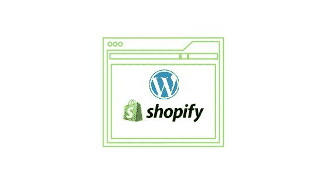

# 通过嵌入购买按钮实现购物化

> 原文：<https://medium.com/hackernoon/shopify-wordpress-integration-by-embedding-buy-button-3fec6cec9a80>

WordPress 是世界上最流行的内容管理系统之一。Shopify 是建立电子商务商店的绝佳解决方案。由于 WordPress 有自己流行的电子商务解决方案[woo commerce](http://learnwoo.com/refer/woocommerce), Shopify 和 WordPress 的整合看起来有点不真实。然而，对于想要两全其美的网站、博客和小企业来说，有一个解决方案。Shopify 有一段时间有一个 WordPress 插件用于这种集成，尽管他们现在已经停止了它。相反，Shopify 建议在你的 WordPress 网站或博客上嵌入一段代码，以显示“购买按钮”。本文将讨论嵌入购买按钮的过程，还将讨论 Shopify 的一些突出特性。你还会了解到这次整合的一些独家 WordPress 主题。

[**立即开始 Shopify 试用！**](http://learnwoo.com/refer/shopify)

# 如何在你的 WordPress 站点上嵌入 Shopify 购买按钮？

您可以通过两种方式嵌入 Shopify 购买按钮:

*   在 WordPress 博客中的一篇个人帖子上
*   到你的 WordPress 网站上的菜单

让我们快速地看一下两者的过程。

## 如何在 WordPress 博客文章中嵌入 Shopify 的“购买按钮”?

1.  在您的 Shopify admin 上创建一个“购买按钮”(您可以自定义按钮的颜色、文本和外观)。
2.  生成并复制按钮的嵌入代码。
3.  转到你的 WordPress admin 上的文章编辑器(你可以选择添加一篇新文章或者打开一个现有博客的编辑器)。确保编辑器处于文本模式，而不是可视模式。
4.  将代码粘贴到您希望购买按钮出现的地方，并保存帖子。

## 如何将 Shopify 的“购买按钮”嵌入 WordPress 菜单？

1.  按照上一步解释的相同方式复制嵌入代码。
2.  在你的 WordPress 仪表盘上，转到**外观>定制>部件**
3.  选择您想要添加“购买按钮”的区域
4.  添加微件或打开现有微件。
5.  将嵌入代码复制到小部件的文本字段中，并保存更改。

# Shopify 的 WordPress 电子商务解决方案到底是什么？

如上所述，将 Shopify 集成到 WooCommerce 的过程非常简单。这样做的好处是，你将在你的 WordPress 站点或博客上拥有一个迷你店面。同时，您可以访问 Shopify 的安全功能，包括购物车。而且，你可以根据自己店铺的具体需求，完全定制这个店面的观感。

# 这有什么不同？

当你用 Shopify 开一家新的在线商店时，你实际上是从零开始。如果你已经有了一个博客或网站，带来了可观的流量，并想通过它销售产品，该怎么办？在这种情况下，这种集成真的可以帮助你快速有效地建立一个店面。让我们来看几个积极的方面。

## 利用你网站的流量

如果你有一段时间在维护一个受欢迎的博客或网站，你可能每天都会有可观的流量。而且，如果你想销售一小组产品，甚至可能只是一个单一的产品，你可以有效地利用现有的流量。只需添加购买按钮并开始销售！

## 简单设置

使用 Shopify 代码在您的网站或博客上设置电子商务功能非常简单明了。当你想整合该功能来销售某些产品时，你可以轻松地管理它，无需外部帮助。

## 个性化选项

您也可以个性化店面的外观和感觉。Shopify 提供了改变“购买按钮”的颜色、文字和外观的选项。

## 经济高效的解决方案

Shopify WordPress 集成是一个经济高效的解决方案，因为您可以使用 Shopify 的一些强大功能。每月订阅的费用仅为每月 9 美元。通过订阅，您将获得无限的产品、超过 100 个支付网关、安全结账等。此外，您还可以跟踪您的销售业绩，整合运输选项，并获得税务计算支持。

## 获取大量资源

Shopify 提供了大量资源来帮助初露头角的企业家实现他们的梦想。你可以通过播客、营销技巧等来了解经营一个成功企业的细微差别。

## 同步多个销售渠道

如果你有多个销售渠道，就没有分别管理每个渠道的麻烦了。Shopify 自动同步所有销售渠道的库存和订单，以避免任何可能的复杂性。

## 可靠的支持

最重要的是，Shopify 提供全天候的专门支持。您可以通过电子邮件或实时聊天随时联系知识渊博的支持代理。如果你在店面的设置或管理中遇到任何障碍，这肯定会有所不同。

## 顶级安全选项

Shopify 与众不同的另一个重要方面是安全选项。256 位 SSL 证书可确保您客户数据的安全性。此外，Shopify 平台在 PCI 合规性方面是 1 级。

## 多种支付方式

Shopify 本身的内置支付选项能够为您的客户提供出色的体验。您可以使用内置选项通过所有主要信用卡接受付款。此外，它还提供包括 PayPal 和 Stripe 在内的 70 多个支付网关。

## 自动运费和税费

Shopify 通过自动设置运费和税款来帮助您。事实上，这将节省你很多麻烦，通常与电子商务商店管理。

立即试用 Shopify Lite，每月 9 美元！

# Shopify WordPress 主题

随着 Shopify WordPress 的整合势头越来越大，主题开发人员正专注于为其开发专属主题。这里有几个由专家精心挑选的主题，你可以用在嵌入购买按钮的 Shopify WordPress 集成中。

# 脉搏

这是一个专为 Shopify WordPress 购买按钮集成而构建的主题。你可以在你的 WordPress 网站上免费下载并安装这个主题。这个主题非常适合你，即使你只是通过商店销售一种产品。有了 Shopify 集成，你实际上可以忘记在 WordPress 上整合电子商务解决方案时需要面对的所有麻烦。这个主题增强了 Shopify WordPress 集成的整体流畅度。

以下是 Pulse Shopify WordPress 主题的功能列表:

*   与 Shopify 完美集成
*   响应式设计
*   Retina 显示屏支持
*   强大的定制选项，包括颜色、布局和字体

[**免费下载主题。**](http://themes.theultralinx.com/shopify-button-wordpress-theme/)

# 简单的

名副其实，这个主题将简单性作为一个好的 WordPress 主题的重要特征之一。你可以在任何 WordPress 博客或网站上使用这个主题，以获得更好的外观和感觉。然而，如果你的博客或网站有 Shopify 的“购买按钮”,那会特别有帮助。基本上，你可以在你的 WordPress 网站上销售产品，并管理商店的电子商务方面，如库存和来自 Shopify admin 的订单。而且，您可以使用主题的页面生成器，通过简单的拖放界面，根据您自己的个人选择定制站点。

快速浏览 Simple 的突出特性

*   页眉选项——你可以选择在你的网站上设置一个透明的粘性页眉。这将使你的网站导航更容易，结果将是更好的用户体验。
*   页面标题 Simple 提供了一个在您的站点上自定义页面标题的选项。这将给你更多的灵活性，将用户的注意力吸引到你想去的任何地方。
*   直观导航——直观的“返回到上一页”按钮等功能为用户浏览您的网站提供了便利。这种面向用户的功能将有助于整个网站的体验，以及随后的转换。

[**访问主题页面。**](https://themify.me/themes/simple)

# Shopify 相对于其他电子商务平台的优势

Shopify 显然是目前市场上最受欢迎的电子商务平台之一。该平台的巨大受欢迎程度是由于用户喜爱 Shopify 的各个方面。以下是一些让 Shopify 区别于竞争对手的有趣功能。

## 易于设置

这是许多新进入电子商务的人更喜欢 Shopify 而不是其他解决方案的主要原因之一。你可以使用 Shopify 在几分钟内建立一个在线商店，不需要任何编码知识或其他麻烦。Shopify 是一个托管解决方案，这意味着 Shopify 强大的服务器将会在没有您任何干预的情况下管理您的商店。这意味着很多，因为你可以从小处着手，考虑到你的商店的增长曲线，升级到一个更大的计划。

对于没有像 WooCommerce 这样的解决方案的技术知识的用户来说，找到一个好的主机方案和域名可能很困难。然而，一旦托管和域名注册都处理好了，WooCommerce 也提供了很大的灵活性。

## 易用性

这是另一个没有技术型企业家转向 Shopify 的因素。界面非常用户友好和直观，因此任何人都可以根据自己的喜好定制需求。您可以轻松配置与商店和产品相关的各种功能。此外，使用 Shopify 可以很容易地集成不同的支付网关、运输解决方案和税收计算。

## 不用担心服务器

当运行一个电子商务商店，你需要确保您的网站连续正常运行时间。只有将你的网站托管在一个可靠的服务器上，这才是可能的。Shopify 在这方面做得很好，他们的服务器管理非常出色。更重要的是，用户保证 Shopify 服务器的可靠性，确保连续正常运行时间。

## 出色的功能

大量的功能是 Shopify 的另一个明显的卖点。您会发现，Shopify 集成了大量对电子商务商店管理至关重要的功能。库存管理、支付网关、运输选项、营销工具、分析报告等。此外，你也可以利用[大量的附加组件](http://learnwoo.com/refer/shopify-app-store)。

## 令人惊叹的设计

Shopify 呈现了一种很棒的设计语言，受到专家们的喜爱。你会在 [Shopify 主题商店](http://learnwoo.com/refer/shopify-themes)找到很多付费主题和一些免费主题。这些主题适用于您计划销售的任何产品系列。现代主义和当代风格确保您的网站设计永远不会落后于任何竞争对手。

## 支持所有类型的产品

Shopify 在产品范围方面非常灵活。你可以使用 Shopify 销售任何产品，如实物或数码产品。如果你考虑其他解决方案，比如简单的数字下载，你会发现他们更喜欢可下载的产品。如果你用的是 Shopify 就没有这种担心了。

## 安全性

您需要格外小心，确保您网站上客户数据的安全。Shopify 也会处理这个问题，这一点你可以放心。所有 Shopify 计划都附带一个免费的 SSL 证书。此外，Shopify 符合 1 级 PCI 标准。

## 可靠的支持

一个电子商务平台的主要要求之一是在你需要的时候得到可靠的支持。有了 Shopify，这个因素就很好的照顾到了。他们通过电子邮件、电话和实时聊天获得全天候支持。也就是说，当你的网站出现问题时，你可以向支持代理咨询。对于在线商店来说，获得及时的支持至关重要，因为任何延迟都会影响他们的收入和利润。

# 结论

WordPress 被全世界推崇为世界上最好的内容管理解决方案之一。同样，世界各地的许多在线商店都使用 Shopify 平台，并且非常喜欢它！这就是为什么两者的结合可以证明是许多小商人的成功交易。较大的商店通常有带宽来定制带有技术支持的功能。但是只要嵌入一段代码，你就可以在你的 WordPress 网站或博客上加入一个 Shopify 的“购买按钮”。本文提供了 Shopify WordPress 集成的一步一步的描述。您还看到了一些支持这种集成的独家主题，以及 Shopify 的一系列突出功能。

[**立即开始 Shopify 试用！**](http://learnwoo.com/refer/shopify)

*原载于 2018 年 1 月 19 日*[*learnwoo.com*](http://learnwoo.com/shopify-wordpress/)*。*