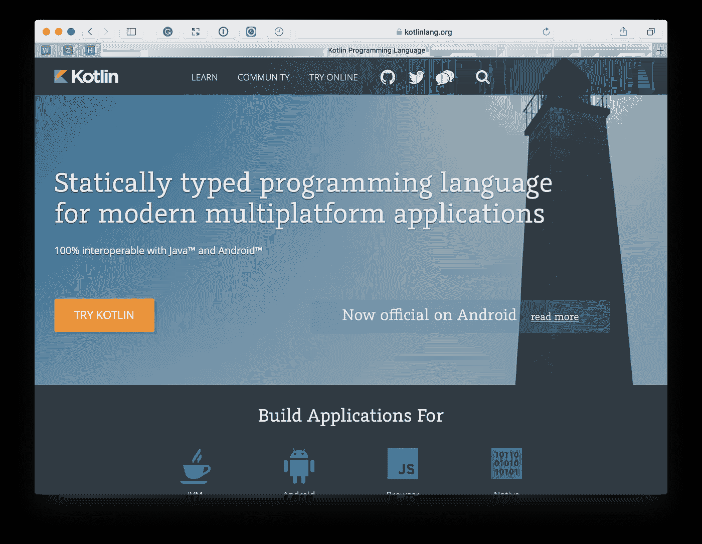

# 学习科特林的捷径

> 原文：<https://medium.com/hackernoon/shortcuts-to-learning-kotlin-b9390c44318b>

# 1.7 亿美元的以太坊漏洞是如何被阻止的

> 披露: [**Codacy**](https://goo.gl/s8fRSz) ，自动化代码评审平台，之前赞助过黑客 Noon。对于《黑客正午》的读者来说，他们使用这个代码 [**提供 15%的折扣:HACKERNOON**](https://goo.gl/s8fRSz) **。**

Kotlin 是一种我曾考虑使用一段时间的语言，但直到最近我才决定尝试一下。我很兴奋我做到了！

如果你没有听说过 Kotlin，这是一种比大多数语言都新的语言，但它在最近几年获得了大量的关注。为什么不呢？它有一系列的优势，尤其是相对于 Java 而言，这使得它非常引人注目。

这里有一个简短的选择:

*   它是由一家经验丰富的软件公司开发的。
*   对于[安卓](https://hackernoon.com/tagged/android)来说是一级语言。
*   受*Java**Scala**Groovy**c#**Gosu**JavaScript**Swift*影响。
*   它可以和 Java 互换。
*   高阶函数。这些函数接受函数作为参数。
*   零安全。变量需要可以为空，以便能够设置为`null`。
*   扩展功能。这些允许您扩展现有的类，而不从它继承。
*   变量和属性类型的类型推断
*   数据类:这些自动具有`equals()`、`hashCode()`、`toString()`和`copy()`功能。

这些只是一小部分选择。如果你想要更多，一定要看看来自安卓权威的[这个列表。](https://www.androidauthority.com/kotlin-vs-java-783187/)

然而，如果你仍然对学习 Kotlin 持观望态度，我想我会与你分享一系列的技巧和资源，让你不再犹豫，开始学习。

# 资源

## 科特林的官方网站

The Official Kotlin Site

像大多数语言一样，这种语言有一个官方网站，在 kotlinlang.org。在那里，您可以找到大量的信息和有用的资源，无论您是初级、中级还是更高级的 Kotlin 开发人员。

还有 [Kotlin 的参考文档](https://kotlinlang.org/docs/reference/)，它带你从绝对基础开始，包括*基本语法*、*习惯用法*和*编码约定*，到语言的整个特性集，比如*类*、*对象*、*泛型*、*嵌套类*和 *lambdas* 。

有一系列教程

*   让您开始使用 ide 和命令行
*   展示如何使用生成工具
*   展示如何在一系列不同的环境中使用 Kotlin，例如使用 *Android* 、 *Java* 、 *JavaScript* 和 *Web 开发*。

然后是[书单](https://kotlinlang.org/docs/books.html)，包括 Kotlin in action 和面向 Android 开发者的 Kotlin，以及[一系列其他资源](https://kotlinlang.org/docs/resources.html)，包括框架、库、编辑器和 IDE 插件。

在 KotlinLang 上花了很多时间，进行了无数次搜索后，我还没有找到一个网站像这个网站一样提供如此有条理和全面的 Kotlin 信息。其他网站，比如由个人开发者创建的网站，也很棒，但是没有什么比你在这里找到的信息更有深度。

我的建议是，要么选择教程部分的入门指南，要么阅读参考部分的概述和入门部分。然后，从那里逐步积累你的知识。

## 科特林松弛水道

The Kotlin Slack Channel

我发现的下一个最好的资源是 Kotlin Slack 频道。我不情愿地承认 IRC 没有 Slack 那样的受欢迎程度和知名度。如果可以，我会一直用 IRC。

然而，人民已经说话了，这是一个宽松的渠道。在频道中，您可以找到讨论以下内容的频道:

*   使用 Android。
*   开始使用。
*   服务器和 JavaScript 开发。

像所有好的社区一样，你会发现对人们的问题有帮助的建议，链接到令人兴奋的花絮，最近发生的事情，库和软件包，等等。

我在那里的经历非常棒。尽管我相对来说是新来的，但这个社区一直都很热情，知识丰富，响应迅速。我不能说我参与的每个社区，或者我尝试过互动的每个社区都是如此。

## 在推特上搜索科特林

A Twitter Search for Kotlin

虽然 Twitter 的影响力和受欢迎程度不如从前，但它仍能迅速为技术话题带来重大成果。只需搜索“*科特林*”就会返回大量信息的链接，包括:

*   [科特林配置 17](https://www.kotlinconf.com)
*   代码风格讨论
*   工装支架，如*弹簧*、*梯度*和 *IntelliJ IDEA*
*   针对特定平台的讨论，例如针对 Android 和 iOS 的讨论
*   关于语言特性的讨论，比如协程
*   Kotlin 主要开发人员和影响者的介绍，例如 Kotlin 的主要语言设计师 Andrey Breslav。

# 技巧

现在，我们已经学习了一系列顶级资源，让我们来看看一套帮助你使用 Kotlin 的技巧。

## 获取 IntelliJ IDEA 社区的(免费)副本

IntelliJ IDEA Community

虽然有一系列支持 Kotlin 的 ide，比如 Eclipse，但是没有一个像 Kotlin 的核心开发公司 JetBrains 的 IntelliJ IDEA 那样提供全面的支持。

我可能看起来有偏见，因为我喜欢在编写 PHP 代码时使用 PhpStorm，在某种程度上我确实如此。然而，即使少量的谷歌搜索也会为 IntelliJ 返回比其他任何编辑器或 IDE 都要多的结果。

有两个版本，旗舰版(商业和非免费)和社区版(开源，在 Apache 2.0 许可下发布)。自然，两者也有一些不同。

对于刚刚入门的人来说，社区版本拥有你将需要的所有功能，比如*代码分析*、*洞察*、*检查*、*集成版本控制*、*代码完成*，以及绝对过剩的插件。

然而，除了这些差异之外，它还提供了丰富的功能，包括:

*   使用 Maven 和 Gradle 快速引导新 Kotlin 项目的集成工具，我发现后者更好。
*   处理模板项目目录创建
*   集成了 Gradle 支持，因此您可以直接从 UI 执行任何任务。如果您喜欢这种方法，您可以使用终端，因为项目提供了用于运行任何 Gradle 任务的命令行实用程序`gradlew`和`gradlew.bat`。

## 做 Koans

Kotlin Koans

假设您已经安装了 IntelliJ IDEA 社区的一个副本，并创建了一个基本项目。现在怎么办？好问题。像任何技能一样，要想更好地掌握它，你必须经常使用它，逐步学习它的每个方面。

你必须以一种有组织和专注的方式学习。为了帮助你做到这一点，Kotlin 提供了 Koans。[公案是](https://www.elephantjournal.com/2012/11/what-are-koans-why-are-they-important/):

> 修行者用来打破自己身份外壳的短语、对话或话语。公案是一种外科手术工具，用来切入并突破从业者的心智。

它们是一种分解和学习技能的方式，有三种形式:

1.[科特林在线公案](https://try.kotlinlang.org/#/Kotlin%20Koans/Introduction/Hello,%20world!/Task.kt)
2。作为 IntelliJ 和 Android Studio 的[插件  3。作为一个 GitHub 库](http://kotlinlang.org/docs/tutorials/edu-tools-learner.html)

你可以在上面看到的在线版本提供了 42 个列表，涵盖了核心语言特性，从最基本、最简单的函数开始。使用它们，你可以有组织地学习，逐步提高你的技能。

这样，你就有了一个清晰的从初学者到高级的路径，你可以看到你已经学了多少，你已经走了多远，你不必无休止地搜索接下来要学什么。

## 移植现有应用程序

假设您已经学习了几个——或者全部 Koans，并且对 Kotlin 知识(以及它的习惯用法)感到满意，那么是时候构建一个有意义的应用程序了；不同于典型的 Hello World 示例。

麻烦的是，每个人的需求都不一样。那么，您应该创建什么样的应用程序呢？我提供了我的编程导师 John Sonmez 的建议，他引用了 Douglas Hofstadter 的话:

> 我们能够学习新信息的唯一方法是它是对其他事物的类比。

他建议，当您移植一个现有的应用程序(最好是您自己创建的应用程序)时，您会更快地了解到:

*   不需要考虑发展什么。
*   你可以更快地学习新的语言，因为你是通过类比现有的语言来学习的。
*   你可以把这门语言和你已经知道的联系起来，并建立在现有的基础上

理想情况下，我建议您移植的应用程序越小越好。这样你可以更快地获得成功感和满足感。

然而，应用程序需要比“ *hello world* ”更多，这样你才能覆盖新语言的足够广泛的横截面，而不仅仅是抓住低挂的果实。

## 向现有项目和其他开发人员学习

我建议你学习 Kotlin 的最后一种方法，不是 Kotlin 特有的，而是适用于任何软件语言的，那就是通读现有项目的代码，并向其他开发人员学习。我不能高度推荐这种方法！

如果有一种方法可以提高我的语言知识，那就是与比我更有经验的开发人员一起工作。

通过观察他们如何处理和解决问题，他们编写代码的方式，他们的代码随时间的演变，并向他们提问，我学到的东西比我自己学到的要快得多。

我不打算在这里深入探讨，我只想说，这两种方法是名副其实的知识宝库，你永远也不想错过。

## 链接

到了最后一个技巧的时候了，一组链接指向各种博客文章，这些文章在我学习的过程中给了我无穷的帮助。

*   [**为什么 Kotlin 是我的下一个编程语言**](/@octskyward/why-kotlin-is-my-next-programming-language-c25c001e26e3) 。这篇文章对开发人员 Mike Hearn 从 Java 迁移到 Kotlin 的原因进行了全面而详细的分析。尽管在 2015 年年中被写了回来，但这个推理仍然非常有效。他讨论了为什么 Kotlin 是一种好语言，因为它可以编译成 JVM 字节码和 JavaScript，可以与 Java 互换，可以使用现有的 Java 框架和库，并且有强大的商业支持；如果你渴望得到一个深入的介绍，请先阅读这篇文章！
*   [**为什么要完全改用科特林**](/@magnus.chatt/why-you-should-totally-switch-to-kotlin-c7bbde9e10d5) 。Magnus Vinther 写的，提供了 17 个令人信服的理由切换到科特林；包括 *IDE 支持*、 *better Lambdas* 、*范围*、*析构声明*、*操作重载*、*When 表达式*。之后，他提供了一系列其他博客文章的链接，其中一些我已经包括在这里了，这些都是建立在他所开创的基础上的。
*   [**我为什么抛弃爪哇而青睐科特林**](https://hashnode.com/post/why-i-abandoned-java-in-favour-of-kotlin-ciuzhmecf09khdc530m1ghu6d) 。由 Jan Vladimir Mostert 撰写，这篇文章读起来很有趣，因为 Jan 公开声明他爱上了 Java，但觉得他必须继续前进，Kotlin 是他必须去的地方。考虑到与 Java 的紧密联系，他给出了这样做的一系列令人信服的理由。
*   [**关于科特林**](https://frozenfractal.com/blog/2017/2/10/10-cool-things-about-kotlin/) 的 10 件爽事。顾名思义，这是一个关于 Kotlin 十大优秀特性的列表帖子。许多要点都包含在提供的其他链接中。然而，这篇文章的好处在于，它允许你尝试一下，而不会被太多的细节淹没。所以，如果你时间不够，或者想快速知道这有什么大惊小怪的，就从这里开始吧。
*   [**雨燕就像是从 Java 到 Kotlin**](http://nilhcem.com/swift-is-like-kotlin/) 的 kot Lin[**。这两个网站提供了一系列 Kotlin 语言特性的简明对比，以及如何用 Swift 或 Java 编写它们。**](https://fabiomsr.github.io/from-java-to-kotlin/)

# 最后

以上是我学习科特林的捷径。我不像其他 Kotlin 开发人员那样有经验，但我认为这是一个优势，而不是障碍。

我希望我相对新鲜的眼光和热情已经让你对为什么 Kotlin 必须在你的语言学习清单上有了实质性的了解。

如果你知道其他原因或想分享你来自另一种语言的经历，我很乐意在评论中听到并与你讨论。所以不要害羞，分享你的知识吧！

哦，最后一件事，如果你热衷于审查你的 Kotlin 代码的质量，Codacy 会支持你，因为[他们的支持语言列表中有 kot Lin](https://www.codacy.com)。注册、登录、添加您的项目，并了解其质量。

> 阅读更多关于 Codacy 博客 **的文章。**