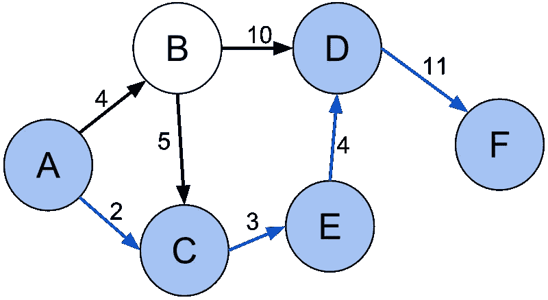
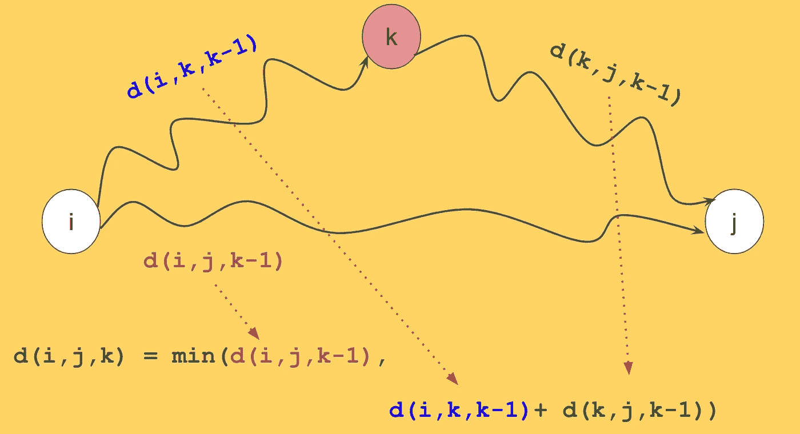
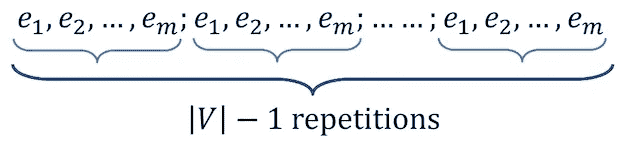

# 最短和最长路径算法:工作面试备忘单

> 原文：<https://medium.com/hackernoon/shortest-and-longest-path-algorithms-job-interview-cheatsheet-2adc8e18869>

图中最短和最长路径算法的快速概述和比较。

关于图中看似简单的最短和最长路径问题，有很多小问题需要记住。关于这个话题的问题在计算机程序员的技术性工作面试中很常见。然而，经常很难保持你的记忆新鲜并记住这些问题及其算法的所有细节。

例如:

*   你知道在图中寻找最短的简单路径是 NP 难的吗？(如果不是，请参见下面的最长路径部分)
*   **你知道在一些图中最短路径可以在线性时间内找到吗？**

在这里，我在一个地方提供了关于每个著名算法的快速总结和重要观点，可以在每次面试前快速回顾。

**在我们开始之前:**

首先，我们假设图是 *G(V，E)* has，其中

*   *V = {1，2，…，n}，|V| = n*
*   *|E| = m*

查看我的 C++图形表示视频:

对于最短路径问题，我们假设我们在寻找最短的**非简单**路径，即顶点可以重复。此外，我们假设边权重可以是整数值，即正、负或零。

**最短距离**问题只要求节点间的最短距离，而**最短路径问题**要求节点间的实际最短路径。我们在这里讨论最短距离问题。最短路径通常可以通过对算法进行较小的改进来找到。

# 弗洛伊德-沃肖尔算法

Floyd-Warshall 是最简单的算法:

**快速直觉**:我们仅使用集合 *{1，2，…，k}* ***中的节点作为它们之间的中间点*** ，计算从节点 *i* 到 *j* 的最短可能路径。d(i，j，k)表示仅使用 k 个节点的 I，j 之间的最短距离。我们可以写:

> **d(i，j，k) = min(d(i，j，k-1)，d(i，k，k-1)+ d(k，j，k-1))**

下图是直觉:

Shortest path from i,j using k nodes can be calculated by comparing the shortest path from i to j using k-1 nodes and the sum of i to k and k to j using k-1 nodes

下面是一段清晰解释弗洛伊德-沃肖尔算法的视频:

A video clearly explaining Floyd-Warshall Algorithm in 9 minutes

下面是 C++中的实现:

## 关于 Floyd-Warshal 算法你需要知道的是:

*   它查找所有节点对之间的最短距离。
*   是 *O(n )*
*   这是一种递归算法，可以使用动态编程来实现
*   图形可以有负边
*   它可以报告负循环

# **Dijkstra 算法**

Dijkstra 算法寻找单个源和所有其他节点之间的最短路径。

**直觉:**保留访问过的节点列表。在每一步:

1.  找到距离最短的未访问节点 *u*
2.  放宽 *u* 邻居的距离
3.  将 *u* 添加到已访问列表中，然后重复

下面是 Dijkstra 在 C++中的实现:

## 关于 Dijkstra 算法你需要知道的是:

*   运行时是: *O(n* *)* 的简单形式。带 min-heap: *O( (m+n)log(n))。*用斐波那契堆: *O(m+n log n)*
*   这是一个贪婪的算法
*   它不能处理负边沿或负周期

下面是 Dijkstra 在 C++中使用优先级队列的算法:

# 贝尔曼-福特算法

该算法寻找从源到所有其他节点的最短距离。

直觉:我们有两个循环:

*   内部循环:我们在所有的边上迭代。在每次迭代中，我们通过使用从 *0* 到 *j* 的边来放宽距离。
*   外循环:我们重复内循环 *n-1 次*

Bellman-Ford Algorithm. Picture taken from [here](https://courses.csail.mit.edu/6.006/spring11/lectures/lec15.pdf).

在外循环的第 *i 次*迭代后，计算最多有 *i 条*边的最短路径。任何简单路径中最多可以有 *n - 1* 条边，所以我们重复 *n - 1* 次。

下面是贝尔曼-福特算法在 C++中的实现。

Bellman-Ford Algorithm. Notice that we use an adjacency matrix to iterate edges

**关于贝尔曼-福特算法你需要知道的事情**

*   运行时间: *O(m.n)。*
*   如果我们使用邻接矩阵(如上面的代码)来迭代边，运行时间是 *O(n )*
*   它可以处理负边缘
*   它可以报告负循环

# DAGs 中的最短距离

DAG(有向无环图)中的最短距离可以在线性时间内计算。

我们使用拓扑排序来查找单个源到所有其他节点的距离。

**直觉:**按拓扑顺序迭代图的节点 *u* 。对于作为 *u* 的邻居的每个节点 *v* ，使用以下方式放松*d【v】*

> d[v]=min(d[v]，d[u] + w(u，v))

**你需要知道的:**

*   运行时间: *O(m+n)*
*   它可以处理负边缘
*   它不能处理负周期(Dag 中没有周期)

下面是使用拓扑排序的 DAG 中最短路径的实现:

拓扑排序在 C++中的具体实现如下:

# **广度优先搜索算法**

广度优先搜索，BFS，可以在一个非加权图或一个加权图中找到最短路径，如果所有的边都具有相同的非负权重。不失一般性，假设所有重量为 *1* 。

**直觉:** BFS 拉平一个图，即在每次迭代中 *i* 它访问距离源 *i* 的节点。因此，如果从源到一个节点的最短路径是 *i* ，我们一定会在迭代中找到它 *i.*

关于 BFS 你需要知道的:

*   运行时间:O(m+n)
*   所有权重应该相等
*   它不能处理负权重
*   它不能处理负循环

# **最长距离问题**

寻找最短路径的姊妹问题是寻找最长路径。但是首先请注意，当我们谈论最长路径时，有一个巨大的困惑:

> 最长路径问题通常意味着寻找最长的**简单**路径。
> 
> 然而，最短路径问题(如上所述)侧重于寻找最短(简单或非简单)路径。

因此，在文献中，即使当人们谈论寻找最长路径时，他们通常指的是寻找最长的**简单**路径。

## 转换到 *-G*

最长简单路径问题可以通过将 *G* 转换为 *-G(即*将原 *G* 中每条边的权重的符号取反)来解决，然后计算**最短简单路径**。

注意，如果 *-G* 没有负环，寻找最短的简单路径与使用上述算法寻找可以在多项式时间内解决的最短路径是相同的。

**关于最长简单路径问题你需要知道什么**

*   寻找最长的简单路径通常是 NP 难的。这可以很容易地从哈密顿回路问题中推导出来。
*   由此可见，在 *G* 中存在正循环的情况下，寻找最长的简单路径是 NP 难的。
*   如果 *G* 中没有正循环，那么在 *-G* 上运行上述最短路径算法之一，可以在多项式时间内解决最长简单路径问题。

关于在我们不常听到的图中寻找最短的简单路径，这里有一个有趣的观点:

> 在图中寻找最短的简单路径是 NP 难的。

这可以用 *-G* 变换到求最长简单路径的问题来证明。

为了更好的理解，假设 *G* 中有一个负循环。在这种情况下，我们著名的算法都找不到最短路径，因为它不存在。然而，在图中仍然有最短的简单的**路径，其中没有顶点重复。寻找最短的简单路径是 NP 难的！**

## DAGs 中最长的路径

如果 *G* 是一个 DAG，因为没有圈，所以在线性时间内使用拓扑排序可以解决寻找最长简单路径的问题。该解决方案类似于在 Dag 中寻找最短距离的解决方案，除了我们在放宽距离时取最大值。

请告诉我你是否在工作面试中听说过关于最短和最长路径算法的有趣问题。祝你面试好运！