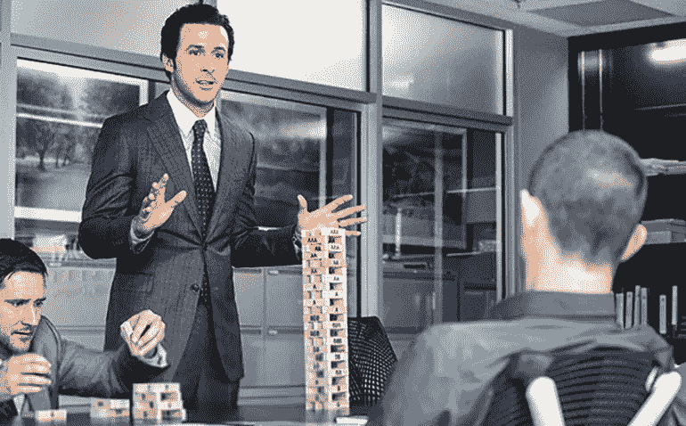

# 打破高等教育的泡沫

> 原文：<https://medium.com/hackernoon/shorting-the-bubble-in-higher-education-1ebec95e97df>

“2004 年初，另一位股票市场投资者迈克尔·伯里第一次涉足债券市场……但他没有考虑购买抵押债券。他在考虑如何做空次级抵押贷款债券。” *—* 迈克尔·刘易斯，*大空头:末日机器内部*

How Michael thinks he looks pitching 1517 to investors.

在关于哪部小说将被证明更具预言性的辩论中——赫胥黎的*的《勇敢的新世界》和奥威尔的*1984*——双方的观点都是暴政将依赖于哪种工具:对于奥威尔的粉丝来说，是枪支、监视和酷刑的政府；对于赫胥黎的粉丝来说，快乐和对奴役的自愿热爱。*

赫胥黎肯定持有更违反直觉的观点。似乎不太可能有人会以他们的压迫为乐。然而，赫胥黎的反面乌托邦也建立在合理的逻辑之上。奥威尔所描绘的所有胁迫和力量都需要努力和消耗资源，最终它真的是一项不完美的事业。一些反叛者总是会溜进一个系统，时不时地破坏它的运转。“一个真正高效的极权主义国家，”赫胥黎总结道，“是一群管理者控制着一群奴隶，他们不必被强迫，因为他们喜欢被奴役。”

今天，美国社会呈现出赫胥黎和奥威尔的影子。人们感觉我们所做的一切都被跟踪。但是，赫胥黎遥遥领先的地方包含了一种我们更频繁看到的、赌注更高的剥削——即理想的陷阱。找到一个引导数百万人生活的愿望，然后通过让他们专注于神圣的误导来引诱他们做一笔糟糕的交易——这可能是苹果派、美国国旗或博卡拉顿的一所房子。

美国的实验和它的例外主义总是被进步的想法所驱动，但是当事实不能支持这个故事时，我们发现否认。

比如，自 20 世纪 70 年代以来，中值收入停滞不前，政府没有解决问题的根源，而是用政策掩盖问题。

我们在 2005 年至 2007 年的房地产泡沫高峰期看到了这一点。美国梦，不管它曾经是什么，被重新定义为在一个房地产价格只会上涨的神奇王国里拥有一栋房子。轻率的贷款和再融资掩盖了许多美国人没有变得更富有的事实。渴望拥有自己的房子——这是误导——但事实上大多数人并不像他们想象的那么富有。布鲁克林的出租车司机或拉斯维加斯的脱衣舞娘可能会觉得更富有，因为银行说他们合法拥有第三套房子，但账单最终会到期。花了几年时间。现实可以被否认这么长时间，真是令人惊讶。但最终，数百万人背负着债务和破产。

像 2005 年的少数其他投资者一样，对冲基金经理迈克尔·伯里预见到了即将到来的灾难。但是其他人不太清楚的是如何交易。为了做空房地产泡沫，Burry 不得不设计一种抵押债券保险形式——信用违约互换——这种保险将在债券基础贷款违约时支付。他的计划起初不受欢迎。只有两家投资银行会向他出售这些新奇的金融产品。但到了 2006 年，抵押债券的信用违约掉期成为了一个数十亿美元的市场。

现在，在 2018 年，我们有另一个愿望，另一个债务陷阱，和另一个泡沫。大学能提升灵魂的谎言夸大了这一点。谁会质疑心灵的培养呢？因此，华尔街日报 报道称，学生债务总额已达 1.5 万亿美元。这些贷款的违约率已经达到 20 年来的最高水平，布鲁金斯学会[发布了一份估计](https://www.brookings.edu/wp-content/uploads/2018/01/scott-clayton-report.pdf),预计到 2023 年，一些国家的违约率可能高达 40%。这是在全球经济以强劲的速度增长的情况下。如果未来几年商业周期放缓，预计这些问题会恶化。

我们还没有调查是否有可能卖空这些学生贷款，假设它们已经被打包成债券。我们不是寻求设计神秘金融产品的聪明的对冲基金经理。但我们确实把我们对 1517 年的研究视为高等教育泡沫的乐观预测。通过支持体制外的创业者，我们的目标是从技术进步的正面故事中获得不对称回报。我们的创始人越成功，混乱的教育体系中的裂痕就越明显。