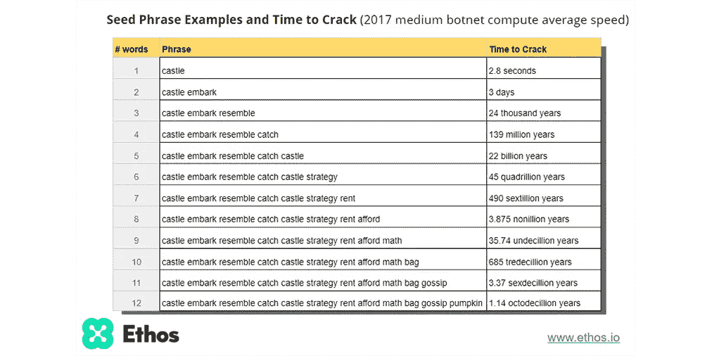

# 消费者的私钥应该被信任吗？

> 原文：<https://medium.com/hackernoon/should-consumers-be-trusted-with-their-private-key-a01a11bf0e09>

“person holding key” by [CMDR Shane](https://unsplash.com/@cmdrshane?utm_source=medium&utm_medium=referral) on [Unsplash](https://unsplash.com?utm_source=medium&utm_medium=referral)

向比特币世界中任何称职的人提出这个问题，你很可能会遭到严厉的批评，甚至更糟。它公然对抗比特币、加密货币和区块链所代表的一切；一个分散的世界，消费者完全控制着他们的数据。不再有等待被黑和泄露敏感信息的集中式服务器。

这个概念是一项崇高的事业，在 facebook 丑闻、社保数据泄露和信用卡被盗的时代，这是我们应该努力实现的理想。但是天平会向安全倾斜太多吗？

> " C **天平向有利于安全的方向倾斜得太厉害了"**

区块链的核心是使用公钥加密，这两者不可避免地交织在一起。我不打算介绍公钥密码学是如何工作的，也不打算详细介绍它在区块链是如何使用的，但是你可以在这里找到关于那个[的更多信息。简而言之，您的私钥是您拥有的最重要的信息，因为没有它，您将无法再访问您的帐户或其中的资金。更重要的是，对于所有意图和目的来说，在没有密钥的情况下，猜测它、导出它或者以某种方式破解它以重新获得访问权实际上是不可能的。具有讽刺意味的是，这种安全级别也是一个安全弱点，因为如果有人获得了您的密钥…现在你的账户属于他们了。](http://lmgtfy.com/?q=public-key+cryptography)

> “如果有人拿到了你的钥匙…现在你的账户属于他们了

有各种各样的技术可以使其更加安全，如使用“多签名”钱包，这需要使用两个或更多的私钥来执行任何重要的更改，虽然这些技术可以降低有人可能在您的密钥发生时偷走您的资金的风险，但对于解决无法访问您自己的帐户的问题作用不大。

大多数平台的通常方法是在创建帐户时，为用户生成私钥，然后要求用户保存一个 12 个字的助记符，该助记符可以在以后丢失时用于重新生成相同的私钥。我承认这比要求用户写下一长串十六进制字符要友好一些，但是我们实际上只是在根本问题上贴了一个创可贴。仅仅一个单词的一个字母被遗漏或拼错，或者一年后当用户忘记他们写下或保存助记符的地方时，就意味着不可逆转的锁定。

example of a 12 word mnemonic. (image courtesy of [https://bit.ly/2SLpiTa](https://bit.ly/2SLpiTa))

我们又回到了本文标题中的问题:**消费者的私钥应该被信任吗？**

当我们从安全和信息隐私的角度来看这个问题时，答案很可能是肯定的。通过让用户拥有自己的密钥并对其负责，系统级黑客导致数千用户的敏感信息泄露的可能性为零。您的帐户所属的服务提供商不可能以误导的方式访问或使用您的敏感数据。然而，当我们从产品开发或用户体验的角度来看这个问题时，答案并不十分清楚。

想象一下，你是大通银行的忠实客户。你的薪水会存入你的账户，你的存款会用于即将到来的家庭度假，当然你所有的信用卡也会用于你的日常开销。您最近收到一个提示，要求您更新密码，您照做了。你甚至在密码管理器中保存了新密码…或者至少你认为你知道。您登录您的在线帐户— ' *用户名或密码'*不正确。你检查你的密码管理器，才发现你从来没有点击保存，它仍然有你的旧密码。不幸的是，没有忘记密码的链接，所以你打电话给 Chase，告诉客户支持，你忘记了你的密码，需要重新设置密码才能再次访问你的帐户。

客户支持代理平静地告诉你，不幸的是，没有你的密码，你将无法访问你的帐户，令人惊讶的是，他们也没有办法访问它。就这样，它消失了:薪水，家庭假期，你的信用卡。我当然不会满足于此，你呢？

现在这可能听起来有点牵强，但事实是用户会忘记事情，用户不会总是仔细地遵循指示，几乎可以肯定的是，他们会向你寻求帮助。当他们发现你不能帮他们拿回他们的钱的时候…我只能说我不羡慕你。我担心这种情况可能是一个定时炸弹，随时都会发生。也许我们还为时过早，大多数用户都有足够的技术知识来充分理解丢失您的私钥的风险，但随着越来越多的人开始接触基于区块链的资产，这个问题只会越来越严重。

因此，当我们考虑安全性时，退一步想想我们到底需要多少安全性是很重要的。你可以在你家的每个入口处安装金属探测器，并安装 6 把不同的带视网膜扫描和拇指纹 id 的锁来进入你的前门，因为这些东西会让你的家更安全，但你当然不会这样做，因为显然这不实际。

> 重要的是退一步，问一问我们到底需要多少安全性。

我们会愿意为了更好的体验而牺牲一点安全性吗？我们应该牺牲多少安全？我们真的能测量我们引入的额外风险吗？

The amount of time required to crack a 12 word mnemonic

我很高兴看到一些平台已经开始朝着这个方向迈出步伐。StellarX 分散式交换有一种相当优雅的处理私钥的方式，因为它们有一个独特的用例，需要代表用户的帐户执行操作。所使用的方法允许服务在任何设备上工作，而不需要用户采取任何行动(这听起来似乎是理所当然的，因为事实上它适用于我们今天使用的几乎所有基于云的服务，可惜的是，它不适用于大多数区块链应用和 dApps)。StellarX 允许用户选择他们想要的安全程度，并明确决定在方便和安全之间进行权衡。这里重要的一点是，决定权在用户。默认设置迎合了主流用户的需求，允许更高级的用户根据自己的意愿提高安全级别。即使有了基本级别的安全性，StellarX 也能确保任何人通过服务器数据泄露获得用户账户的机会非常小。如果他们以某种方式获得了一个帐户的访问权限，他们不会立即获得所有帐户的访问权限。然而，即使使用 StellarX 及其多层安全级别，在基本级别上，仍然由用户单独负责他们的私钥。虽然仍然可以重置您的帐户密码，但没有 12 个单词的助记符，用户将永远无法访问他们的资金。

显然，对于消费者的私钥是否应该被信任这个问题的正确答案是:“这要看情况”。如果私钥保护的是持有客户个人资金的账户，那么我们应该真正评估通过系统级黑客攻击损失资金的风险是否大于通过用户错误损失资金的风险。另一方面，如果私钥保护的是个人信息，如用户已知的社会保险号，那么失去对该信息的访问权所造成的损害可能小于该信息被公开泄露所造成的损害。

请不要犯 GDPR 的错误，不要忽视下游的分支，试图解决问题的一个方面，而不看大局。区块链可能是一场革命，但它不需要以牺牲客户体验为代价。

> “区块链可能是一场革命，但它不需要以牺牲客户体验为代价。”