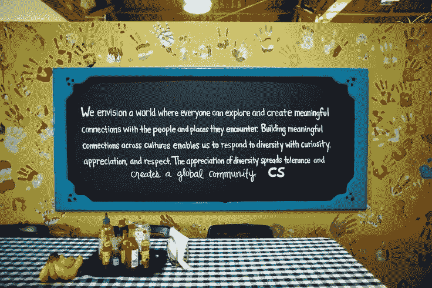
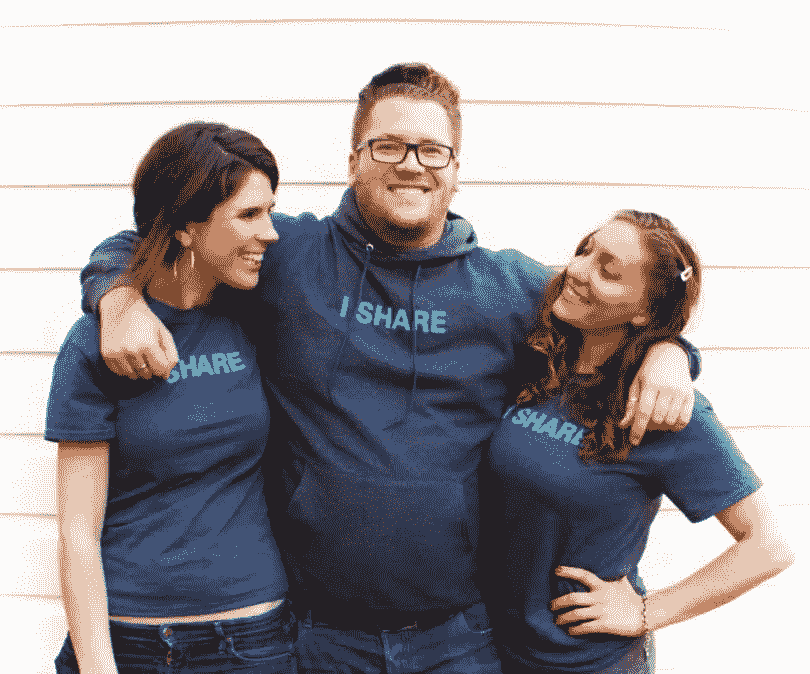
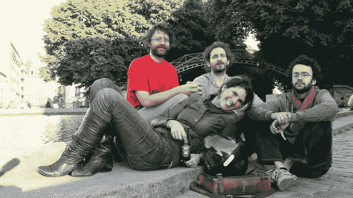
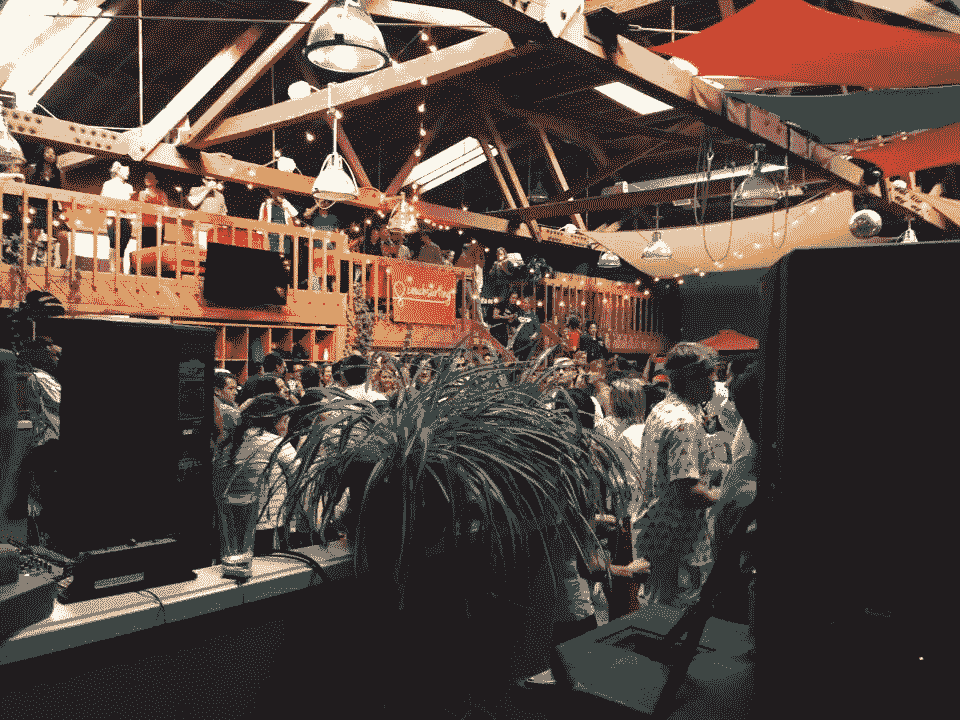

# Couchsurfing 该不该当刀？

> 原文：<https://medium.com/hackernoon/should-couchsurfing-be-a-dao-6507646e34ef>

几年前，我发表了一篇文章，题为“共享经济:一场社会运动正在变成一场经济运动”当时，我对共享经济的发展方向不再抱有幻想。

我体验过不用钱就能联系的快乐——在 Couchsurfing.com 与完全陌生的人分享食物和住所(包括我自己的家),在旅行时赠送我的汽车，尝试随机的慷慨行为，比如为站在我后面的人买一杯咖啡。这些经历如此具有变革性，以至于我自告奋勇帮助拍摄了一部纪录片，*，一次一个沙发，这部纪录片突出了蓬勃发展的共享经济的关系层面。*

**

*Collaborators on “One Couch at at Time” & It’s a Shareable Life*

*随着时间的推移，让共享经济如此富有文化内涵的社会粘合剂正在被风险资本的涌入和对人类互动和联系效率的渴望迅速抹去。事实上，大多数新加入的公司似乎都想尽可能地将人从等式中移除。*

**

*Hanging out with Couchsurfers in Paris in 2011*

*随需应变一切都诞生了，便利的用户体验似乎取代了最初将人们联系起来作为首要目标的意识形态。*

*在共享经济的最初繁荣时期，有无数的合作努力、草根共享计划和旨在通过桥接资源连接邻居和社区的材料和技能共享平台。一个接一个，大多数像多米诺骨牌一样倒下。他们无法获得足够的资本、支持或资源，因为对传统风险投资来说，他们的增长速度不够快。*

**

*One of the community gatherings I put together at Couchsurfing HQ*

*随着共享经济的发展，我在 Couchsurfing 担任临时顾问，负责社区和营销。在这个职位上，我目睹了风险投资对一个最初以价值观为导向、以社区为中心的组织的直接影响——那是毁灭性的。没有考虑到所有价值贡献者的一致决策模式的空间。我提出了一个给客人和主人股权或所有权的理由，但这种想法对于一个有这么多风险公司投资的公司来说是不可能的。*

*不管怎样，我一直相信我们可以将分享融入到经济结构中。我们只需要合适的工具。凭借强大的合作结构模型、区块链技术和以社区为中心的金融，我们可以建立在共享经济的最初承诺之上。*

*快进。*

*区块链技术现在可以为以前未实现的可能性提供动力，比如像 Couchsurfing 这样的组织中的价值共享。*

*位于马德里的研究公司 [P2P Models](https://p2pmodels.eu/) 正试图了解这一点。他们正在寻找使合作经济在他们所谓的第三次浪潮中成为现实的必要工具——去中心化的解决方案(点对点是第二次浪潮)。*

*就像我发现的那样，P2P 模式确定了共享经济的三大挑战:*

***集中监控**
公司有权控制人们的隐私和他们组织结构内的数据*

***无权社区**
成员对平台没有任何决策影响力*

***利润集中**
公司没有按比例向会员、用户、顾客和贡献者分配价值*

*在审视 P2P 模型的结论时，我认为利润集中是问题的根源。如果所有的利益相关者都不一致，社区自然会失去权力，并受制于对人们不利的集中监控和决策(而 P2P 市场中的人们是主要的贡献者)。*

*让所有这些工作成功的关键实际上并不那么明显。结构模型可以更紧凑，比以往任何时候都更有活力。区块链技术让价值分配成为可能。组织可以以一种考虑到所有利益相关者的方式建立和运作。*

*但是还有另一个症结。*

> *这些“第三波”共享经济组织将如何治理？换句话说，如何以集体的方式做出决策？*

***介绍 DAO(去中心化自治组织)。***

> *根据 P2P 模型的定义，“一个道可以被视为一个以软件代理为中介的数字组织，其代码在区块链中。作为一个分散的组织，DAO 可以向第三方提供服务(或资源),甚至雇佣人员来执行特定的任务。因此，个人可以与 DAO 进行交易，以便访问其服务或为其贡献获得报酬。Dao 是完全自主的，因为它们不依赖于任何中央服务器，因此不能被任何一方任意关闭(除非在它们的代码中特别规定)。”*

*Couchsurfing 可以像 DAO 一样运作，用户可以在其中互动，分享他们的时间和空间，甚至用加密货币奖励主机。Couchsurfing 不再是一家基于平台、有风险投资支持的公司，而是可以独立于一个中央集权的组织而运作。*

*然而，即使有了“道”,如何管理这样一个组织仍然是一个问题。*

*像 Couchsurfing 这样的东西的治理如何与组织的总体目标保持一致？有客人吗？有主持人？地面上的信任和安全？*

*对于 Couchsurfing DAO 来说，决策过程必须包括组织的整体意图，不管每个决策是大是小。当你扩展像 Couchsurfing 这样的组织时，有无数的决策需要实时做出。自上而下、瓶颈式的层级结构无法提供保持运行所需的便利性或规模。*

*我工作的一个组织有一些解决方案。DAOstack 提供了一个用于分散智能和协作的工具包。*

*正如 HTTP 允许网站和 web 应用程序的创建和互操作性一样，DAOstack 允许 web 公司、协作应用程序和 Dao 的创建和互操作性，以及它们的利益一致性。结果是一个新的开放合作网络，其中集体可以围绕共同的目标和价值观自我组织，而不受纯粹的经济增长的限制。*

*例如，DAOstack 最近开发了一个集体预算工具 [Alchemy](https://www.youtube.com/watch?v=iWm9SzYLq8A) 。这个工具为各种规模的团队和小组提供了一个决定支出优先顺序的方法。*

*如果 Couchsurfing 作为一个 DAO 来运行，就必须创建许多规则，并且需要设计和实现一个围绕网络的信任和安全的思想。虽然组织可以很容易地自治，但仍然需要人情味和集体决策，加上组织同意的与每个决策相关的价值模式。*

*在接下来的一篇文章中，我将详细讲述像 Couchsurfing 这样的组织如何像区块链的 DAO 一样运作，将价值分配给组织中所有的价值创造者。*

*分享吧！*

**本文是与 DAOstack 合作完成的，Dao stack 是一个新的区块链协议，是构建 Dao 的平台。要了解更多关于 DAOstack 及其即将推出的代币销售* [*的信息，请访问此处*](https://daostack.io/) *或通过 Telegram* *加入他们的* [。](https://t.me/daostackcommunity)*