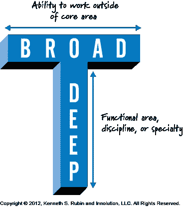
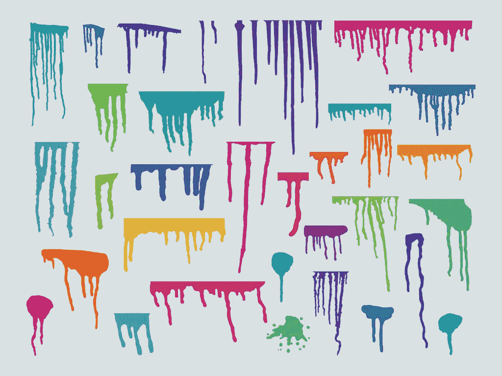

# 我应该是专家还是通才？都是！

> 原文：<https://medium.com/hackernoon/should-i-be-a-specialist-or-generalist-both-f0dc6996345c>

***我应该是专家还是通才？*** 是我们作为软件开发人员经常问自己的一个问题。这种争论常常以一个人不得不“选择一个”而告终。但是，我不认为必须这样，我的答案是“两者都有，不断地！”

## 专业化很诱人

坦率地说，我认为专业化的吸引力之一是，你可以“完成”学习，在 5 年后成为一名优秀的(如 C#、Java 等)开发人员，并为你的余生做这件事。虽然我看到了这样放松的吸引力，但它确实会让团队成员变得非常有害。我遇到过太多明明是学完了的高级软件工程师，抗拒改变，大概是出于纯粹的懒惰。这使得团队很难尝试新事物、玩流程、试验新技术或保持竞争力。

这对他们也不好。这会让他们情绪低落，阻碍晋升，并削弱他们工作的主要工具——大脑。

# 现实是学习永远不会停止，也不应该停止。

# 样样精通，样样不精通

成为“多面手”的一个普遍恐惧是，你在很多事情上都可以，但什么都不擅长。一个常见的解决方案是专攻某个领域，成为一名 *T 型*开发人员，这样你就能非常好地掌握一门语言/栈/技术，以及其他一些东西。这表明你可以学习其他东西，也可以深入某个领域。

然而，这个图没有真正表示的是**时间**。T 形更多的是一个人的现在，而不是过去或未来。

## 笔画开发人员

我的最后一个类比是我在软技能工程播客上听到的，我是这个播客的超级粉丝。我喜欢这个类比，因为它考虑到了时间，以及随着时间的推移，你的职业生涯将如何迫使你适应和改变。

As time goes on, you explore different areas in varying depth. Free Vector Design by [Vecteezy](https://www.vecteezy.com)

类比是这样的:浸湿的画笔在画布上移动，少量多余的颜料向下滴落。水滴是从上面看你的 T 形*的“深度”。随着时间的推移，横向会形成你的知识广度。*

有许多向下的滴水，因为作为一个开发人员，随着时间的推移，你会看到不同的东西，随着技术的变化，你换工作，或者一些新的东西出现。

把这和我自己的生活做个比较，我的点滴会是 C，iOS 和 Objective 之类的东西——C，Python，Java，PHP，C++，Embedded C，又是 iOS，Ruby on Rails，Ember JS，Elixir，Swift，AWS，等等。

随着时间的推移，我的知识面也变得更宽了，因为我了解了一些主题，看到了语言之间的共性。您能够在另一个领域重用一个领域的技能，并且通常您开始更加意识到编程语言和工具的可能性。最终，随着时间的推移，你的*未知的未知*会减少，而你获得新工具的能力会增加，因为你更能发现什么是熟悉的，什么是对比的，什么是新的。

**所以我鼓励你对自己的旅程进行这样的思考。** *丁字*，一遍又一遍。你可以改变你的专业，或者当你选择一个新的专业时让它消失。我认为你能养成的最好习惯是一直学习，即使是在同一个领域。深入研究，但要想办法增加你对科技世界的总体看法，这样当你接触到新的东西时，它不会完全吓到你。

祝你好运。