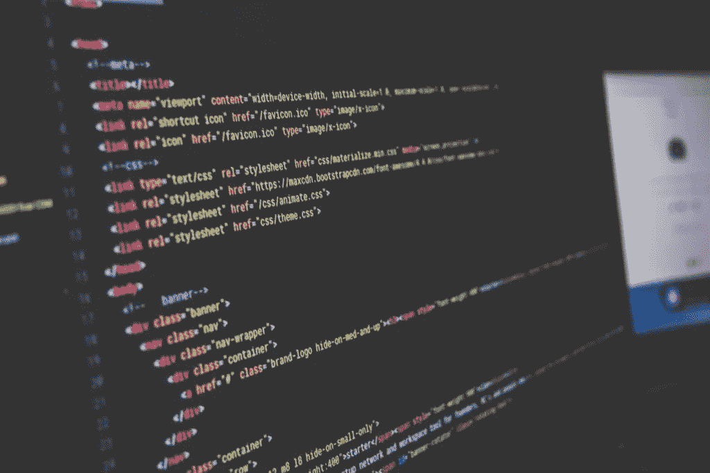

# 非技术型创始人应该学习编码吗？

> 原文：<https://medium.com/hackernoon/should-non-tech-founders-learn-to-code-b4b1fe005cf9>

有人无数次问我，作为一个非技术型的创始人，我应该学习编码吗？我的答案是既有也有。这个问题也来自很多不会编码的产品经理。

我属于那种认为应该教 3 yo 编程的学派。今天的编码就像语言学习，你对它越熟悉，你就越容易被社会接受。编程就像体育运动，它提供大量的学习，有助于个人成长、创造力、分析技能，并教授一种解决问题的技能。

“最好的初创公司想法往往有三个共同点:它们是创始人自己想要的，他们自己可以建立，很少有人意识到值得去做。微软、苹果、雅虎、谷歌和脸书都是这样开始的。”— **保罗·格拉厄姆**

哈佛商学院最近发表了一项研究，称当老板能做员工能做的工作时，员工会更开心。原因很简单，这样老板会更有同情心。当你在开发一个新软件时，在可能和不可能之间只有很小的差距，这个差距仅仅是由开发它的人和使用的[技术](https://hackernoon.com/tagged/technology)决定的。

**构思，高效迭代**

如果你是唯一的创始人，或者你的联合创始人也不是技术人员，学习编码的基础是一个很好的主意。你不应该以成为公司的首席技术官为目标，但初创企业所用技术的基础知识将帮助你构思和迭代出解决客户问题的可能方案。作为一个创始人，你需要对你的客户的问题和他们需要的可能的解决方案有一个公平的理解。如果你知道如何编码，你就可以便宜快速地测试出这些不同的想法和解决方案。

**设定正确的期望值**

它还能帮助你对你的技术设定正确的期望值。团队。我听过非编码人员问开发人员类似“这难道不是一个简单的改变吗？为什么这种改变需要这么长时间？只要向下移动按钮，让一切保持原样，5 分钟的工作，对不对？”不尽然，这对开发者来说是令人沮丧的，因为来自创始人本人的话也会让开发者失望。学习编码将帮助你理解完成事情所需的复杂性和努力。

**较小的冲突**

你不需要能够自己编写产品代码，但是当你接近你的技术团队时，理解其本质是非常有益的。这也有助于减少与你的首席技术官和工程团队的冲突，因为你知道事情是如何运作的。这有助于你在最初的日子里与技术团队建立信任。

**更好的规划**

既然您已经知道了事情是如何工作的，以及编写代码需要付出什么样的努力，那么您将能够更好地计划您的营销和销售计划。它还将有助于根据未来版本预测收入。

**招聘变得容易**

技术行业是一个竞争激烈的领域，你需要雇佣优秀的开发人员来确保你在游戏中处于领先地位。你至少需要了解某些技术的工作原理，才能理解你正在交谈的人所具备的技能，以及这些技能是否适合你。当你刚刚起步时，这是非常有用的。

# 作为创始人，什么时候不应该学习编码

有很多不写代码的企业家的例子，但是他们已经创建了非常成功的公司。Airbnb，Linkedin，Dell 都是由非技术人员创办的。
精益创业公司向创始人传授销售和营销知识，给他们一本无需学习编程就能经营创业公司的手册。

在某些情况下，作为一名创始人，学习编程可能不是最好的主意。

如果你已经有一个技术联合创始人，那么你应该发挥你的优势。在你的初创企业中，有许多其他事情需要你的时间、精力和注意力，这些事情不涉及编码，但仍然是对企业的巨大增值。

你可以负责运营、销售、营销、招聘、财务和会计。有一个不可逾越的工作量需要完成，这根本不是编码。

当你在主持节目时，你需要尽一切努力。学习-构建-测量是要遵循的咒语。最初几天的学习将有助于你更快地适应产品市场。

*原载于 2018 年 8 月 1 日*[*sugoilabs.com*](https://sugoilabs.com/blog/startups/should-i-learn-to-code-as-a-non-tech-founder)*。*