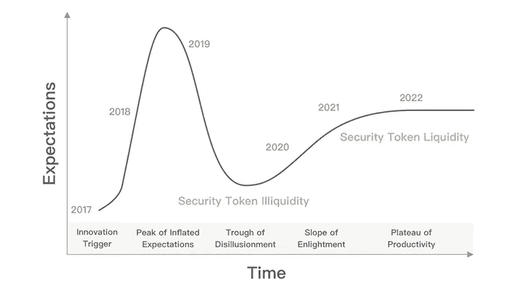
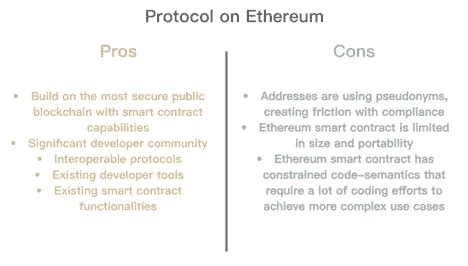
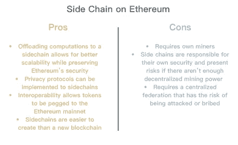
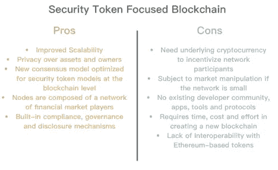
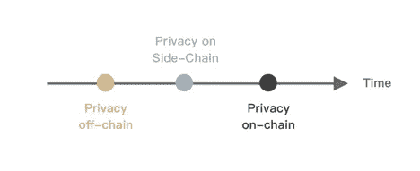
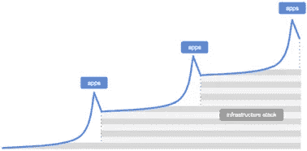
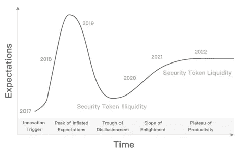

# Yubo Ruan:应该有一个安全令牌的区块链吗？

> 原文：<https://medium.com/hackernoon/should-there-be-a-blockchain-for-security-tokens-ba23c9156e9d>

# 概述:

*   资产的令牌化版本应该能够在区块链上展示三个关键属性:底层资产:资产的虚拟表示；资产的所有权:资产所有者的身份；以及资产的法规遵从性规则:管理资产所有权和交易的一组管理和法规遵从性规则。
*   *目前，隐私和合规性似乎是推出 sto 的主要挑战。根据不同的司法管辖区，投资者必须通过严格的“了解您的客户”( KYC)和反洗钱(AML)流程，以符合合规要求并有资格投资和交易证券。然而，由于加密货币的无边界、点对点、透明和去中心化的特性，在令牌化资产和合规性之间存在一些摩擦。*
*   *要将遗留系统过渡到令牌化系统，必须解决这些挑战。目前，一些发行平台正在提供证券令牌化解决方案。我们将它们分为三类:以太坊协议、以太坊侧链和安全令牌区块链。然后，我们分析这些不同类型的解决方案的利弊，并讨论空间如何发展。*

# 简介:

随着对首次公开募股(ico)的宣传减弱，人们的注意力现在转向了安全令牌(ST)行业。ST 行业目前正处于萌芽阶段，许多初创公司正试图彻底改变传统的金融生态系统。从传统资产向令牌化资产的过渡涉及一系列技术和合规性方面的要求，这使得令牌化流程比我们过去在 ico 中看到的通过 ERC-20 进行简单令牌化更加复杂。在我们的研究中， [8 Decimal Capital](https://medium.com/u/9e68686390f1?source=post_page-----ba23c9156e9d--------------------------------) 将讨论证券令牌化的各种组成部分和挑战，评估其他解决方案的利弊，并围绕该领域在未来几年的发展撰写一篇论文。

从基本面来看，资产的令牌化版本应该能够在区块链上展示这些关键属性:

1.  基础资产:资产的虚拟表示。
2.  资产的所有权:资产所有者的身份。
3.  资产的法规遵从性规则:管理资产的所有权和交易的一组管理和法规遵从性规则。

其他期望的属性包括私密性、可编程性、治理性、公开性、流动性和可伸缩性。智能合约引入了可编程性，允许实施更复杂的资产，如债券、大宗商品或衍生品。例如，令牌化房地产投资信托(tREIT)在一个单一的可交易单位中涉及一系列房地产债务和股权资产。在这种情况下，智能合约可以支持复杂的动态，如风险、再平衡、债务违约，以及区块链的简单所有权。

目前，隐私和合规性似乎是推出 sto 的主要挑战。金融证券目前由中央机构监管和控制，遵循 GDPR、SWIFT 和 FINRA 等确保投资者隐私和保护的严格法规。根据不同的司法管辖区，投资者必须通过严格的“了解您的客户”( KYC)和反洗钱(AML)流程，以符合合规要求并有资格投资和交易证券。然而，由于加密货币的无边界、点对点、透明和去中心化的特性，在令牌化资产和合规性之间存在一些摩擦。

例如，加密货币使用假名，投资者的地址不能直接反映他们的真实身份。然而，FINRA 和 SEC 要求投资者的身份完全为人所知，他们的交易和持有情况由公司和交易所定期报告。在令牌化证券领域，通过 KYC 和反洗钱的合格投资者名单将不得不依靠第三方将其真实身份与公共地址联系起来。只有这样，投资者地址对投资和交易才是有效的，因为它们在代码级别得到批准并自动合规。另一个例子是，德国法律要求在德国发行的令牌化资产的数据必须在德国各方之间交易，并且不能离开管辖区，这与目前数据在公共区块链上跨全球节点存储的方式相矛盾。此外，投资者并不能完全获得隐私，因为所有的交易和代币持有都可以在公开的区块链上看到和追踪。

要将传统系统过渡到令牌化系统，必须解决这些挑战。目前，一些发行平台正在提供证券令牌化解决方案。我们将它们分为 3 类:以太坊上的协议，以太坊上的侧链，以及安全令牌区块链。接下来，我们将分析这些不同类型的解决方案的利弊，并讨论空间如何发展。

# 1)基于以太坊的协议:

目前，最先进的安全令牌发行平台，特别是 [Securitize.io](https://medium.com/u/4181e01aabf0?source=post_page-----ba23c9156e9d--------------------------------) 、 [Polymath](https://medium.com/u/bdf13a23d3e9?source=post_page-----ba23c9156e9d--------------------------------) 和 [Harbor](https://medium.com/u/3d4192241ca8?source=post_page-----ba23c9156e9d--------------------------------) ，正在现有区块链的基础上构建他们的解决方案，以太坊是使用最多的区块链。sto 是通过它们的令牌标准发布的，分别是 ds 协议、ST-20 和 R-Token。这些项目作为集中实体运营，并与 KYC 和反洗钱的第三方合规验证机构合作。

以太坊于 2015 年发布，是第一个也是最成熟的具有智能合约功能的安全区块链，允许在区块链上实施更复杂的用例。在现有区块链的基础上发布 s to 确实有其好处，例如可以访问不同协议、现有工具、开发人员社区和智能合约功能之间的互操作性。智能合约可以用来定义交易和治理规则，以及分红机制。

**Figure 1:** Pros and cons of protocols built on Ethereum

另一方面，[以太坊](https://medium.com/u/d626b3859bc9?source=post_page-----ba23c9156e9d--------------------------------)上的地址是假名，其中隐藏了令牌持有者的身份，导致合规性方面的摩擦。为了解决这个问题，发行平台必须通过 1)要求投资者提交他们的地址并链接回他们的电子邮件 2)直接为投资者创建地址 3)利用地址验证工具(如 [Vertalo](https://medium.com/u/86347d8c846f?source=post_page-----ba23c9156e9d--------------------------------) 提供的工具)，其中地址的所有权通过要求投资者通过 [MetaMask](https://medium.com/u/17995a9c1d1c?source=post_page-----ba23c9156e9d--------------------------------) 进行微交易来验证。在验证了所有投资者之后，批准的地址列表(白名单)被包括在用于令牌发行的智能合同中，指定了用于投资/交易以及其他交易许可的合格投资者的列表。对于投资者的任何新增或减少，智能合约都必须通过各种机制进行更新。

另外，以太坊是一个通用的区块链，它没有专门迎合 STs 需求的功能。以太坊可以通过 ERC-20 轻松代表区块链的部分所有权，以及通过智能合约的转让限制和简单的分红机制。然而，适应遗留系统、标准证券法和更复杂的用例(如债务、衍生品、披露和投票)将需要大量的编码工作，以绕过智能合约的受限代码语义带来的挑战。此外，由于为更复杂的用例部署更大的智能合约的成本更高，智能合约在规模上也有限制，并且由于可靠性不能延续到其他区块链的智能合约，因此在可移植性上也有限制。这可能会影响处理事务、构建新功能和提供系统信任的整体可伸缩性。

# 2)以太坊上的侧链:

虽然我们还没有看到专注于 STs 的侧链，但一些现有的以太坊侧链解决方案包括 [POA Network](https://medium.com/u/c6dce655e286?source=post_page-----ba23c9156e9d--------------------------------) ，Loom ( [👽Dilanka @ LOOM](https://medium.com/u/35ab342b2b58?source=post_page-----ba23c9156e9d--------------------------------) / @mcu11inan)、Skalelabs([Jack O ' holleran](https://medium.com/u/5b62c5f46ae8?source=post_page-----ba23c9156e9d--------------------------------)/[Chadwick Strange](https://medium.com/u/7c4658c02157?source=post_page-----ba23c9156e9d--------------------------------))等。侧链是一个独立的区块链，它使用双向 peg 连接到其母公司区块链，从而可以在母公司区块链和侧链之间以预定的比率互换资产。

以太坊上的专用侧链可能是一个有趣的选择，因为它可以将特定的计算集卸载到隔离的环境中，然后将结果反射回主链。由于并非每个流程都需要在链上运行，因此披露、合规性、投票/治理以及与外部资源的集成等组件都可以通过侧链来实现，从而在利用以太坊安全性的同时提高交易的可伸缩性。此外，隐私方面的挑战可以在侧链上解决。创建侧链的成本、时间和精力也比创建新的区块链少得多。侧链还允许加密货币相互交互。例如，发行者可以先测试侧链上的令牌，然后再将它们推送到主链上。

**Figure 2:** Pros and cons of side chain built on Ethereum

侧链的一些缺点是围绕其安全性的要求。侧链需要自己的矿工，没有足够的采矿力量，他们可能会受到损害。因此，最初需要一个广泛的矿工网络来帮助保护侧链。此外，侧链开发人员需要指定一个联盟，作为主链和侧链之间的中间点。这个指定的集中组有权锁定和释放令牌，从而产生攻击或贿赂的风险。

# 3)专注于安全令牌的区块链:

以安全令牌为中心的区块链可以帮助解决隐私和治理方面的一些基本挑战，并提高信任度和可扩展性。 [SPiCE VC](https://medium.com/u/a23443abbc57?source=post_page-----ba23c9156e9d--------------------------------) 的联合创始人兼董事总经理，也是之前发起证券化的 [Ami Ben-David](https://medium.com/u/5e4ca7e201bb?source=post_page-----ba23c9156e9d--------------------------------) ，是为安全代币创建一个区块链的想法的主要支持者。他最近介绍了他的新项目 Ownerna，该项目提供了一个新的区块链基础设施，专门关注安全令牌。

这些节点由金融和商业实体的专家组成(例如美国 SEC 批准)，了解证券的法律后果，并被授权做所有权管理、KYC(了解你的客户)、KYA(了解你的资产)和交易。在所有权证明系统中，选择的主节点负责 KYA，这是一整套合法定义链外资产所有权和令牌持有者权利的文档，以其声誉为赌注，将资产上传到区块链，并将所有交易写入块。作为回报，主节点因帮助验证其交易而获得资产的终身收益。这样，只有主节点可以访问详细信息，从而保护投资者的隐私。所有者和资产也可以根据需要管理他们的隐私级别。此外，让特定节点验证交易可以实现更高的交易速度，提供更具可扩展性的基础设施，支持传统交易所(如[纳斯达克](https://medium.com/u/3aaaf6f9eea?source=post_page-----ba23c9156e9d--------------------------------))所需的更大交易量。

Ownera 还计划提供一个包含法规插件的开源法规库，每个插件涵盖每个国家、资产类型等的特定法规。任何资产都可以选择启用哪些法规，从而节省了不同协议自己经历这一过程的精力。此外，交换可以通过直接支持安全令牌区块链来节省分别支持不同发布协议的能量。还可以实现新的共识模型，以针对区块链级别的安全令牌进行优化，而不是在现有区块链之上创建人为的共识机制。

**Figure 3:** Pros and cons of Security Token focused Blockchain

虽然新的区块链听起来可能是更好的解决方案，但创建新的区块链将需要大量的精力和时间来构建，这意味着在构建任何应用程序之前可能需要数年时间。一个新的区块链还需要设计一种新的本地加密货币来激励网络参与者，其中的代币经济学必须得到很好的定义，以确保可持续性。此外，一旦部署完毕，新区块链的生存能力和安全也将经受时间的考验。此外，开发人员社区和工具的开发也必须从零开始。

# 结论:

大多数当前的解决方案是建立在以太坊之上的协议，一些新的项目正在寻求开发一个专注于 st 的区块链。我们认为，隐私问题需要时间在不同阶段得到解决，就像我们正处于 STO 革命的早期阶段一样。首先，隐私最有可能是链外的，严重依赖于可以访问投资者信息并将其存储在本地的可信中央机构。其次，基于侧链的隐私解决方案有助于将数据分离到不同的集合中，从整体上对公共网络隐藏这些数据。最后，隐私可以直接在更专业的安全令牌区块链上链上，这可以允许所有者和资产控制他们的隐私访问级别。

**Figure 4:** Evolution of privacy for Security Tokens

到目前为止，提供的发行解决方案是基于以太坊的协议，允许更简单的令牌化用例。虽然我们相信更专业化的区块链最终会出现，但这并不意味着以前基于以太坊的协议没有价值，将来会过时。例如，如果 ZKP(零知识证明)技术或防弹技术等隐私解决方案成功实施，区块链公共场所的隐私问题也可能在未来得到解决。一些正在探索如何在以太坊上实现 ZKP 的公司包括 [Zcoin Project](https://medium.com/u/6c8acd3591c3?source=post_page-----ba23c9156e9d--------------------------------) ，和 Ernst & Young ( [EY Ops Chain 公共版原型](https://www.coindesk.com/ey-reveals-zero-knowledge-proof-privacy-solution-for-ethereum))。现有的协议也可以过渡到不同的区块链，如果它们被证明是更好的。例如，Securitize 的第一个协议实现将在以太坊区块链上工作，但他们也计划将其架构模型转移到其他分布式分类帐系统。

**Figure 5:** Evolution of Apps and infrastructure from [Union Square Ventures](https://www.usv.com/blog/the-myth-of-the-infrastructure-phase)

另外，[联合广场投资](https://www.usv.com/blog/the-myth-of-the-infrastructure-phase)最近推出了一个有趣的基础设施和应用之间的关系理论。我们认为，该领域将以类似的方式发展，特定垂直领域(例如房地产)的突破性应用将首先打破该领域，并激发新协议或区块链的开发，从而允许大规模构建类似的应用。这一过程将在与证券相关的不同垂直行业中重复。随着时间的推移，随着不同用例的充分探索和理解，一刀切的协议或区块链将会出现，提供一个更强大和可扩展的平台，相当于证券的 AWS。

**Figure 6:** Hype cycle of the Security Token industry

截至目前，我们仍处于安全令牌生态系统的早期阶段，不同的发行解决方案仍在开发和测试中。我们认为，从技术和监管角度来看，STO 生态系统至少还需要 4 年才能成长和成熟，从而实现从传统证券系统到令牌化系统的可持续过渡。在这个领域变得更加成熟和可行之前，STs 的大多数早期采用者将来自加密货币领域，而不是传统玩家。随着明年不同的 sto 和交易所的推出，我们预计流动性的缺乏以及围绕实施复杂用例和证券法的挑战将使我们更接近现实，并减少围绕 sto 的整体宣传和期望。随着时间的推移，更高效的技术和新法规将会出现，并有助于推动传统企业的增长和采用。

# 来源

白皮书:[港湾](https://medium.com/u/3d4192241ca8?source=post_page-----ba23c9156e9d--------------------------------)，[证券化. io](https://medium.com/u/4181e01aabf0?source=post_page-----ba23c9156e9d--------------------------------) ，[博学](https://medium.com/u/bdf13a23d3e9?source=post_page-----ba23c9156e9d--------------------------------)，[开放金融](https://medium.com/u/7e954409a5ac?source=post_page-----ba23c9156e9d--------------------------------)

Union Square Ventures 的 dani Grant &[Nick Grossman](https://medium.com/u/5a0bc0cfd9ff?source=post_page-----ba23c9156e9d--------------------------------):[https://www . usv . com/blog/the-myth-of-the-infra structure-phase](https://www.usv.com/blog/the-myth-of-the-infrastructure-phase)

[Yogita Khatri](https://medium.com/u/d2cab3a24725?source=post_page-----ba23c9156e9d--------------------------------) 来自[coin desk](https://medium.com/u/f2fa6f2d51a6?source=post_page-----ba23c9156e9d--------------------------------):[https://www . coin desk . com/ey-reveals-zero-knowledge-proof-privacy-solution-for-ether eum](https://www.coindesk.com/ey-reveals-zero-knowledge-proof-privacy-solution-for-ethereum)

[Zcoin($ XZC)加密货币](https://medium.com/u/70838623f5e0?source=post_page-----ba23c9156e9d--------------------------------) / [Zcoin 项目](https://medium.com/u/6c8acd3591c3?source=post_page-----ba23c9156e9d--------------------------------):[https://Zcoin . io/Zcoin-implement-zero-knowledge-proof-ether eum/](https://zcoin.io/zcoin-implement-zero-knowledge-proofs-ethereum/)

[vasa](https://medium.com/u/2bfdd6540157?source=post_page-----ba23c9156e9d--------------------------------)from[hacker noon](https://medium.com/u/4a8a924edf41?source=post_page-----ba23c9156e9d--------------------------------):[https://hacker noon . com/difference-between-side chains-and-state-channels-2 F5 dfbd 10707](https://hackernoon.com/difference-between-sidechains-and-state-channels-2f5dfbd10707)

ower na:[https://Ownera . io/WP-content/uploads/2018/10/Ownera-presentation . pdf](https://ownera.io/wp-content/uploads/2018/10/Ownera-Presentation.pdf)

[来自](https://medium.com/u/46674a2c9422?source=post_page-----ba23c9156e9d--------------------------------)[hacker noon](https://medium.com/u/4a8a924edf41?source=post_page-----ba23c9156e9d--------------------------------):[https://hacker noon . com/do-security-tokens-need-a-new-区块链-福利-挑战-part-i-48f281f5101e](https://hackernoon.com/do-security-tokens-need-a-new-blockchain-benefits-challenges-part-i-48f281f5101e)

来自[hacker noon](https://medium.com/u/4a8a924edf41?source=post_page-----ba23c9156e9d--------------------------------):[https://hacker noon . com/do-security-tokens-need-a-new-区块链-benefits-and-challenges-part-ii-de 480 e 54 c 12a](https://hackernoon.com/do-security-tokens-need-a-new-blockchain-benefits-and-challenges-part-ii-de480e54c12a)

[来自](https://medium.com/u/46674a2c9422?source=post_page-----ba23c9156e9d--------------------------------) [Hackernoon](https://medium.com/u/4a8a924edf41?source=post_page-----ba23c9156e9d--------------------------------) 的 Jesus Rodriguez:[https://hacker noon . com/do-security-tokens-need-a-new-区块链-part-iii-the-building-blocks-7 adfa 7239 bb 0](https://hackernoon.com/do-security-tokens-need-a-new-blockchain-part-iii-the-building-blocks-7adfa7239bb0)

[Jesus Rodriguez](https://medium.com/u/46674a2c9422?source=post_page-----ba23c9156e9d--------------------------------) 发自[hacker noon](https://medium.com/u/4a8a924edf41?source=post_page-----ba23c9156e9d--------------------------------):[https://hacker noon . com/do-security-tokens-need-a-new-区块链-part-iv-how-ABO-a-side chain-ACD 8686 D8 FAE](https://hackernoon.com/do-security-tokens-need-a-new-blockchain-part-iv-how-about-a-sidechain-acd8686d8fae)

[Jesus Rodriguez](https://medium.com/u/46674a2c9422?source=post_page-----ba23c9156e9d--------------------------------) 来自[hacker noon](https://medium.com/u/4a8a924edf41?source=post_page-----ba23c9156e9d--------------------------------):[https://hacker noon . com/security-token-2-0-some-thoughts-off-chain-vs-on-chain-governance-2cba 087389 ab](https://hackernoon.com/security-token-2-0-some-thoughts-off-chain-vs-on-chain-governance-2cba087389ab)

[Jesus Rodriguez](https://medium.com/u/46674a2c9422?source=post_page-----ba23c9156e9d--------------------------------) 来自[hacker noon](https://medium.com/u/4a8a924edf41?source=post_page-----ba23c9156e9d--------------------------------):[https://hacker noon . com/some-cool-protocols-to-consider-for-the-next-generation-of-security-token-platforms-98697 f0c 55 e 6](https://hackernoon.com/some-cool-protocols-to-consider-for-the-next-generation-of-security-token-platforms-98697f0c55e6)

[Jesus Rodriguez](https://medium.com/u/46674a2c9422?source=post_page-----ba23c9156e9d--------------------------------) 来自[hacker noon](https://medium.com/u/4a8a924edf41?source=post_page-----ba23c9156e9d--------------------------------):[https://hacker noon . com/the-elephant-in-the-the-room-security-and-privacy-protocols-in-security-tokens-a 6687 af 8d 1d 6](https://hackernoon.com/the-elephant-in-the-room-security-and-privacy-protocols-in-security-tokens-a6687af8d1d6)

[Julianne Sloane](https://medium.com/u/c7589d812d2a?source=post_page-----ba23c9156e9d--------------------------------) 发自[hacker noon](https://medium.com/u/4a8a924edf41?source=post_page-----ba23c9156e9d--------------------------------):[https://hacker noon . com/can-security-tokens-full-they-promise-of-promise-of-liquidity-938022 e 53133](https://hackernoon.com/can-security-tokens-fulfill-their-promise-of-liquidity-938022e53133)

[Deepa Sathaye](https://medium.com/u/2d6ffd2add6f?source=post_page-----ba23c9156e9d--------------------------------)from[@ liquidity](https://medium.com/fluidity):[https://medium . com/liquidity/automatic-regulatory-compliance-with-ether eum-892 f 01 ef 9 EAA](/fluidity/automatic-regulatory-compliance-with-ethereum-892f01ef9eaa)

[Jesus Rodriguez](https://medium.com/u/46674a2c9422?source=post_page-----ba23c9156e9d--------------------------------) 发自[hacker noon](https://medium.com/u/4a8a924edf41?source=post_page-----ba23c9156e9d--------------------------------):[https://medium . com/@ jrod thoughts/about-disclosures-and-information-asymmetry-in-security-tokens-fc83c 350548 a](/@jrodthoughts/about-disclosures-and-information-asymmetry-in-security-tokens-fc83c350548a)

[Julianne Sloane](https://medium.com/u/c7589d812d2a?source=post_page-----ba23c9156e9d--------------------------------) 发自[hacker noon](https://medium.com/u/4a8a924edf41?source=post_page-----ba23c9156e9d--------------------------------):[https://hacker noon . com/can-security-tokens-full-they-promise-of-promise-of-liquidity-938022 e 53133](https://hackernoon.com/can-security-tokens-fulfill-their-promise-of-liquidity-938022e53133)

> 8 十进资本:塑造区块链未来
> 
> [媒介](/@8DecimalCapital) | [LinkedIn](https://www.linkedin.com/company/8-decimal-capital/) | [推特](https://twitter.com/8decimal) | [脸书](https://www.facebook.com/8Decimal/) | [网站](http://www.8dcapital.com/)
> 
> 电子邮件:contact@8dcapital.com，如果你对这个话题还有任何问题。

*8 DECIMAL CAPITAL is a multi-strategy investment firm focusing on token and equity investments. 8 Decimal currently has more than 40 portfolio companies with an AUM of 60M USD. The investment team consists of more than 10 venture capital veterans, researchers, and trading professionals. The advisory board comprises Fan Zhang (Former Founding Partner of Sequoia Capital China), Karen Chen (Former CEO of UBS China) and Ben Bartlett (Vice Mayor of Berkeley). Based on the professional fund index ranking agency* [*Token Metrics*](https://medium.com/u/80a0e0807b05?source=post_page-----ba23c9156e9d--------------------------------)*, 8 Decimal was ranked second out of the 51 active crypto funds. 8 Decimal is also well-received in China, named one of the top 10 funds in the blockchain industry by both* [*36 氪（36Kr.com）*](https://medium.com/u/ae3950e4f2fc?source=post_page-----ba23c9156e9d--------------------------------)*,* [*Chain Capture*](https://medium.com/u/ac4da81bc060?source=post_page-----ba23c9156e9d--------------------------------) *, and* [*Odaily*](https://medium.com/u/9c30cbe2074f?source=post_page-----ba23c9156e9d--------------------------------)*, as well as named one of the top 20 funds by Tsinghua X-Lab and Youth Education Chain League.*