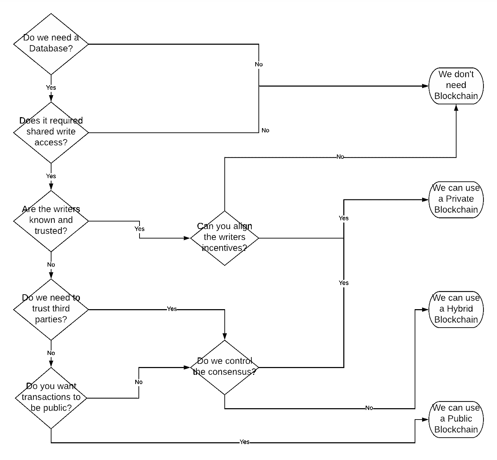

# 你应该 ICO 吗？

> 原文：<https://medium.com/hackernoon/should-we-ico-51964dccadbe>

Before reading this article, please read our disclaimer found at the bottom of the article or [here.](https://thebestoficos.com/disclaimer.html)

## ICO 先决条件 5 分钟指南

通过 ICOs 筹集了 40 亿美元的资金，对于一家公司来说，问自己这样一个问题看起来非常诱人:首次发行硬币是否是一种简单的融资方式？事实上，ICO 是一个非常困难的过程，只有当你的公司符合一套非常具体的标准时才有意义。

如果你正在考虑通过一个 ICO，你肯定不是一个人。这是我们作为区块链顾问最常见的问题之一。事实上，这个问题是基于大量的其他假设和情况，我们认为讨论其中的一些是很重要的。

在考虑 ICO 之前，我们必须考虑推理。如果你正在考虑做一个 ICO，因为你的公司不能通过传统的方式筹集资金，你就不太可能有一个成功的 ICO。导致这一事件的许多成本是不可避免的。

在技术方面，最重要的问题是你是否应该使用区块链技术。出于这个原因，我们将从这个问题开始，你应该使用区块链吗？

# 区块链测试

mage Caption: Image was made through information on the article: [When do you need blockchain?](/@sbmeunier/when-do-you-need-blockchain-decision-models-a5c40e7c9ba1) Decision models.

## 共识

公司应该满足的第一个条件是，满足区块链利用的条件对任何 ICO 来说都是至关重要的。即这个问题:

***“共享的、不可变的、分散的数据库是运行您的业务模型的最佳方式吗？”***

如果这个问题的答案是否定的，那么你可以停止这个实验。这是一个最重要的问题，不仅关系到 ico，而且关系到区块链技术的总体使用。

即使你决定创建一个私人区块链，并且只允许某些个人在其中写作或协作，你也必须接受，无论你使用什么共识协议，都需要一个共享的和不可变的数据库作为其中心，企业将依赖这个共享的信息数据库来提供商品或服务。

## 混合和私人区块链

一旦你决定基于区块链的共识协议对你的价值主张至关重要，下一个问题就是决定什么类型的区块链满足它。

混合区块链模型是一些分散数据库和私有数据库的结合。这对于有用户名和密码的公司来说很典型。集中式数据库的强大功能使用户能够在丢失数据的情况下进行恢复。一些你用钱包做不到的事情。

私人区块链是由公司(和/或合作伙伴)拥有的，不一定公开展示。这显然有合法性和中央集权的顾虑。这种类型的区块链更常用于在业务伙伴之间创建一个无信任的系统。

# 我们应该 ICO 吗？

## 你自己的令牌

即使使用区块链是必要的，**和**使用代币是你的产品提供的核心，这仍然不意味着你应该 ICO，甚至创建你自己的代币。已经有数百种选择，使用已经存在的令牌将从多个方面消除许多令人头痛的问题，包括:

*   技术的
*   发展速度
*   必须通过 ICO
*   潜在合法
*   鸡和蛋的问题
*   潜在可交换的

但是你当然会输:

*   控制
*   可选性
*   灵活性
*   为您的使用而优化
*   有时信任

根据您的资源和能力，从别人的令牌开始测试 MVP，然后在您了解问题和可以提供的解决方案之后开发您自己的令牌，这可能是一个不错的选择。

## 网络效应

你应该考虑到有必要可靠地生产和共享数据的公司比那些没有必要的公司更有理由支持 ICO。更重要的是，依赖网络效应增长和共享数据的公司将比那些没有网络效应的公司更快地发展成熟的区块链使用。

## ICO

浏览一个 ICO 的过程是漫长而复杂的，远远超出了本文的范围。然而，最重要的一点是，你必须在营销文档中策划和准备以下 5 个类别:

1.  业务战略和相关信息
2.  技术细节和重要性
3.  法律程序和最佳做法
4.  税收影响和最佳做法
5.  营销，尤其是法律方面的考虑

这意味着一系列的专业人士应该参与到你的 ICO 和你要瞄准的司法管辖区中来。更多信息你可以[查看我们的网站](https://durata.io/)。

# 结论

任何类型的资金筹集都需要在不同方面进行大量的专业咨询。ico 也不例外，事实上，可能比其他早期融资方式需要更多的建议。因此，你应该**经常**与专业人士交谈，与他们讨论你的意图，并达成解决方案。

虽然这个行业表面上看起来迷人而简单，但实际情况是，即使你的公司符合 ICO 的完美描述(不管是什么)，你仍然需要做大量的工作和准备，才能真正发起这种类型的活动。

最重要的是，目前还没有就哪些司法管辖区允许使用哪种类型的 ico 达成共识。当前的领域充满了关于法律、税收、技术的问题，以及许多关于区块链技术的实际应用及其问题的合理担忧。

也就是说，该行业将成为过去十年中最重要的通信和金融创新之一，并证明了将权力还给人民是一种不可思议的强大力量，无论好坏。

最后，请记住，我们是否应该把 T1 和 T2 和 T3 联系起来是非常不同的。你能做某事并不意味着你应该做。

Copyright Universal Pictures: Jurassic Park,

想帮忙吗？

在 Bountey 上支持我们！【https://www.bountey.com/bestoficos 

想在 ICOs 中保持最新？
在[https://thebestoficos.com](https://thebestoficos.com/)拜访我们

有一个有趣的故事？给我们在 info@bestoficos.com 写信

# 放弃

本网站及其包含的信息无意成为投资、金融、技术、税务或法律建议的来源。本网站不能代替专业建议和独立的事实验证。在没有首先评估你自己的个人财务状况，也没有咨询财务专家的情况下，千万不要使用这个网站上的想法和策略。本网站的所有内容仅供参考，按“原样”提供，不保证完整性、准确性、及时性或使用本网站所获得的结果。这只是一个存根，您对本网站的访问和使用取决于您对全部免责声明的接受和遵守。免责声明适用于所有希望访问或使用本网站的访问者、用户和其他人。