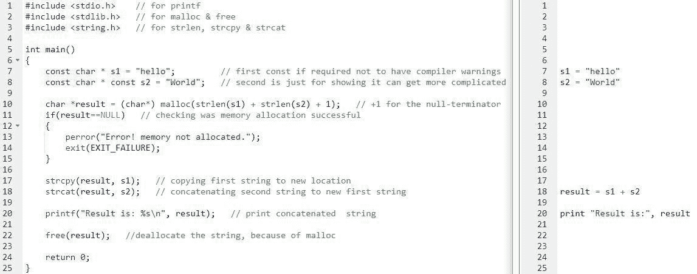

# 2018 年该不该学 C/C++？

> 原文：<https://medium.com/hackernoon/should-you-learn-c-c-in-2018-5b37324f590>

**发布于:**2018 年 2 月 15 日

# 结论

我**不建议你首先学习 C/c++**[**编程**](https://hackernoon.com/tagged/programing) **语言**只是为了学习编程，**最好选择** [**Python**](https://hackernoon.com/tagged/python) 。

同样，如果你不知道你为什么要学习 C/C++，最好不要花时间在这上面。

# 我的 C/C++背景

在我职业编程生涯的大部分时间里，大约有 **10 年我都在编写 C/C++程序**。

我所说的职业编程生涯是指其他人付钱让我写代码。

我花了更多的时间在 C/C++上，尽管我会说我比 C/C++更了解 Python。

我的 Python 知识更好，因为 **Python 的特性比 C/C++少，而且你不需要做内存管理**。

# 为什么 C/C++很难

由于许多特性和内存管理，IMHO C/C++很难。

等你懂了内存管理，你就能学会 80%的 Python 了。

看看这张图片，在 C 和 Python 中，**代码集中了 2 个字符串。**

是的，可以有更少的 C 代码(错误检查，免费，很少的 const less ),代码仍然可以工作。

但是那样我就会展示糟糕的 C 产品代码，而不是**演示真实世界的 C 代码应该如何编写**。

调试分段错误并不有趣，如果 c 语言中没有适当的错误检查，就会出现这种情况。

Python 代码可以，而且在现实生活中也应该有`if __name__ == "__main__":`，但是我已经把它删除了，因为它不像在 c 中那样是必需的。

重点是**高级编程语言(在这个例子中是 Python)正在自动做许多低级的事情**。

因此，你需要**更少的代码行**，这意味着更少的可能错误，从而**提高开发人员的生产力**。

**的代价是更多的 CPU 和内存，以加快上市时间**。

# C 和 C++是两种不同的编程语言

这里我使用的是 C/C++语言结构。

因为大多数代码库(至少我在企业环境中见过的)都是 C 和 C++的混合体。

我的理论是，旧的代码是用 C 写的，后来他们添加了面向对象编程(C++)。

但是 C 和 C++不是同一种编程语言，心智编程模型也大不相同。

c 代码是关于结构、函数和指针的。

在 C++中，你有面向对象的编程和许多其他特性。

在**现实世界中，你需要知道 C 和 C++** ，所以这就是我用 C/C++的原因。

# 什么时候应该学习 C/C++

我认为**人从学习 C/C++中学到的唯一积极的东西是手动内存管理和指针**。

基本上更好地理解计算机(在软件层面)是如何工作的。

如果你的唯一理由是更好地理解计算机(在软件层面)是如何工作的，最好学习 C 编程语言。

C 比 C++功能少。

**如果你知道 C** ，学习 C++会更容易，因为你应该知道手动内存管理和指针。

但是除了少数利基市场(系统、嵌入式、银行、游戏引擎等)，我看不出 C/C++在 2018 年会有多大的实际用途。

# 可能你不会用 C/C++

我不是说 C/C++在 2018 年不会在任何地方使用[。](https://blog.headlandstech.com/2017/08/03/quantitative-trading-summary/)

我个人(几乎每个月)都会收到一些 C/C++职位的面试请求。

通常，它们要么用于嵌入式软件，要么用于银行业(C++)。

我只是认为初学者(不懂任何编程语言的人)不应该从 C/c++开始。

唯一的例外是，如果你打算在 C/C++环境中找一份工作(或开始你的生意)。

如果不是为了工作/生意，我不明白你为什么要学习 C/C++，除了爱好。

但即便如此，还是要有一个更好的爱好🙂。

附注:亲爱的读者，如果你认为我遗漏了什么，请在评论中补充。

*原载于 2018 年 2 月 15 日*[*buklijas . info*](http://buklijas.info/blog/2018/02/15/should-you-learn-c-in-2018/)*。*