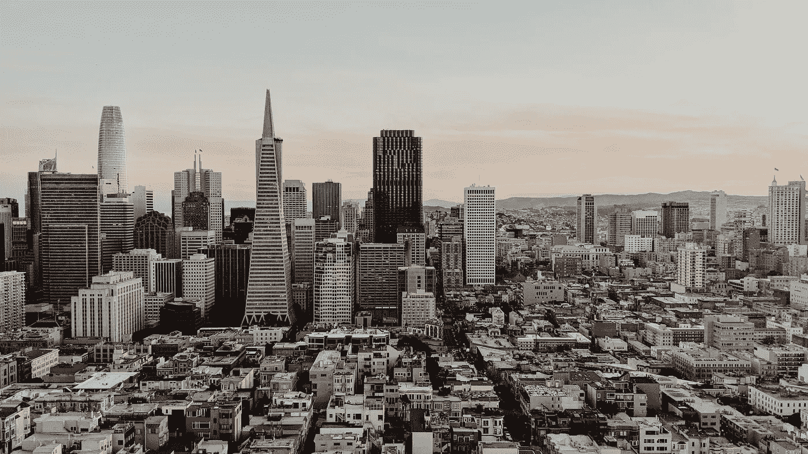

# 你应该搬到硅谷开始你的职业生涯吗？

> 原文：<https://medium.com/hackernoon/should-you-move-to-silicon-valley-to-kickstart-your-career-cce3954fcd83>

如果你总是抱怨没有时间或金钱，那肯定不会。那你在湾区就惨了。

# 我的故事

回到 2017 年秋天，我放弃了我的博士课程，并完成了研究生院的化学工程硕士学位。

然后我不得不做出一个决定。就进入职场而言，我的下一步行动是什么？

我有一个不容商量的标准:我未来的工作场所必须符合我的个人使命*活得有灵感，活得能启发他人。*

但是我陷入了对我下一个家的分析瘫痪。

所以我听从了史蒂夫·乔布斯的建议。

> *“你不能把向前看的点点滴滴串联起来；* ***你只能把它们联系起来*** *。所以你必须* ***相信这些点在你的未来会以某种方式连接*** *。你必须相信某些东西——你的勇气、命运、生活、因果报应等等。*

在研究生院的 5 年里，我成功地建立了 7 个失败的商业项目。

我阅读了 300 多篇非小说类文章，内容涉及商业、心理学、消费者行为、成长型营销、个人理财、企业家精神、禁欲主义、说服、营养、量化自我等等。

我去过美国的 45 个州，在墨西哥住了一个月，预算很少。

回顾过去，把点点滴滴联系起来，我完全确定了一件事。

穿着白大褂在实验室里从事与我的学位和工作相关的工作，在培养皿中培养酿酒酵母或大肠杆菌会让我想自杀。

但后来我想——当我可以利用我的跨学科技能和动力，为超越自我的事情做出贡献，建立新的关系，赚些钱，同时享受人生乐趣的时候，为什么要自杀呢？

因此，在浏览了美国目前和未来的科技创业热点城市名单后，我决定在纽约和旧金山之间做出选择。

**我在纽约的思考过程**

“我应该在曼哈顿的一家初创公司找份工作，离我当时住在佛蒙特州的女朋友近 5 个小时吗？WeWork 和 Etsy 听起来像是很酷的公司。另外，我喜欢忙碌的生活。我的两个堂兄弟住在泽西。我将乘 20 小时的飞机离开我在印度的父母。但是该死的，冬天的雪太糟糕了！在中西部生活了 5 年后，我已经不再需要它了。”

**我对科幻的思考过程**

Airbnb、FB、谷歌、网飞、优步、Lyft 的总部都在湾区。这里是该死的 [*硅谷*](https://hackernoon.com/tagged/silicon-valley)*——互联网的发源地。找工作的时候，我可以住在 Prashish(我婚礼上未来的伴郎)在山景城的公寓里。Angel.co 的工作机会比纽约多 10 倍。另外，我很好奇加利福尼亚的天气有什么好大惊小怪的？去他妈的。唯一想通的办法就是替我去体验。”*

我订了单程机票，2017 年 8 月 15 日在 SFO 落地。

**以下是我从 2017 年第四季度到 2018 年第三季度截至 9 月 30 日期间的 KPI。**

1.  **财务健康:**净值增长 1872.98%。
2.  **身体健康:**体脂减少 59.4%，肌肉量增加 18.6%。
3.  **智力健康:**在早期科技公司得到两份工作邀请，成为我目前公司表现最好的特别提款权，完成了 18 本非小说类书籍。
4.  **情感健康:**与[克雷格·托德](https://www.linkedin.com/in/amend1craigtodd/)开始了导师-学员的关系。建立了 9 个新的关系，他们现在是我核心圈子的成员。我遇到了更多激励我的人，并继续与一群不同的实干家、制造者和现状挑战者建立新的友谊。
5.  精神健康:明确了我的核心价值观和驱动我生活的动力。将我的个人使命与我目前所在公司的使命结合起来。

哦，等等！我不是故意跑题的。

让我们回到最初的问题——

# 你应该搬到硅谷开始你的职业生涯吗？

我们先来看数据。

> 有一种普遍的误解，认为硅谷是世界的加速器。真实的故事是，世界变得越来越快——硅谷只是第一个想出如何跟上步伐的地方。

旧金山、圣何塞和奥克兰在美国十大最昂贵城市中占据了 3 个席位。

但这只是事情的一面。

就像我前面说的，如果你一直抱怨没有*时间*或者*钱*，那你在湾区就惨了。

但是如果你还在阅读，这里有一些令人兴奋的数据！

截至 2017 年底，全球仅有 **14 家上市公司**的**市值超过 1000 亿美元**。想猜猜硅谷有多少这样的公司吗？**七家**——这是世界上最有价值的科技公司的一半。

硅谷 150 家最有价值的上市科技公司的总市值为 3.5 万亿美元。这个数字太大了，对我们大多数人来说没有任何意义。

所以考虑一下:仅这 150 家公司就占了纳斯达克市值的 50 %,它们占了全球市场资本总额的 5%。

这是一个大约有 350 万到 400 万居民的地区创造的巨大价值，大约占世界人口的 0.05%。

但是过去的表现和未来的结果没有关联。我同意你的观点。

虽然这在未来可能会发生变化，但硅谷历史上和当前的成功仍然使其成为人才、资本和创业文化的完美熔炉，使其成为技术创新的领跑者。

有一种普遍的误解，认为硅谷是世界的加速器。真实的情况是，这个世界一直在变得越来越快——硅谷只是第一个想出如何跟上步伐的地方。

但是在硅谷这里也有一种神秘的炼金术在起作用，它推动了如此多的世界上最有价值的公司的飞速发展？

闪电战是 T21 的秘密。根据雷德·霍夫曼和克里斯·叶(Chris Yeh)在 2018 年出版的书，闪电战是一种战略和一套技术，用于推动和管理极其快速的增长，在不确定的环境中优先考虑速度而不是效率。

硅谷是一个地方，在这里你可以最大限度地增加成为一个组织的一部分的机会，这个组织有目的、有意识地做一些根据传统商业思维没有意义的事情。

如果以下听起来像你，你会觉得在硅谷就像在家里一样。

你

*   本质上是一个真正的企业家——足智多谋、求知欲强、善于实验、坚持不懈，并对行动有强烈的偏好。
*   对不适有高于平均水平的容忍度，对必须重塑自我持开放态度。
*   节俭，有 5000-7000 美元的现金或信用卡，如果你有家人和朋友，你可以免费或补贴 90 天(足够启动你的职业生涯)

这并不是说硅谷不适合那些只想有一份工作，赚钱养家，去不同的地方旅游，享受生活的人。

世界上有更多的城市和地方，你可以用充实的职业创造有意义的生活。

如果你计划或渴望有一天住在硅谷，当我不得不在纽约和旧金山之间做出选择时，塞思·戈丁的一句话帮助了我。

> 大多数人认为他们必须用他们拿到的那套牌来玩。但是很少有人意识到，我们总是可以选择离开现在的桌子，换一张新桌子。

PS:如果你有朋友在争论是否应该搬到硅谷去工作，我希望你能和他们分享这篇文章。

PPS:你移民硅谷了吗？一定要在下面评论，和我们分享你的经验。

*最初发表于*[T5【https://www.linkedin.com】](https://www.linkedin.com/pulse/should-you-move-silicon-valley-kickstart-your-career-shrestha/)*。*