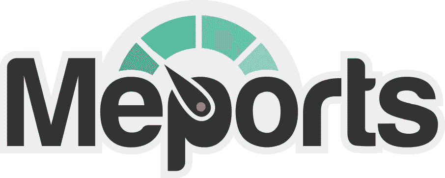
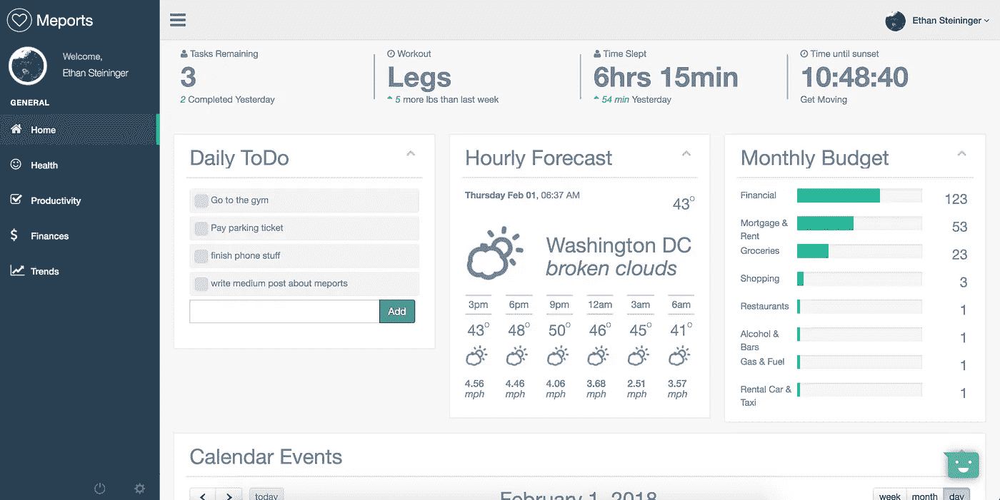
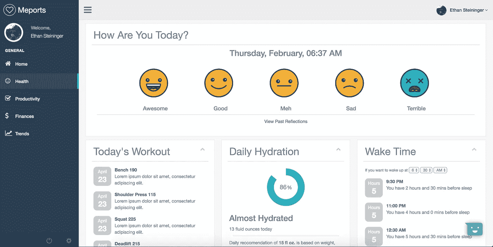
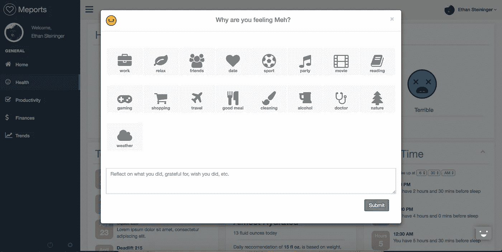
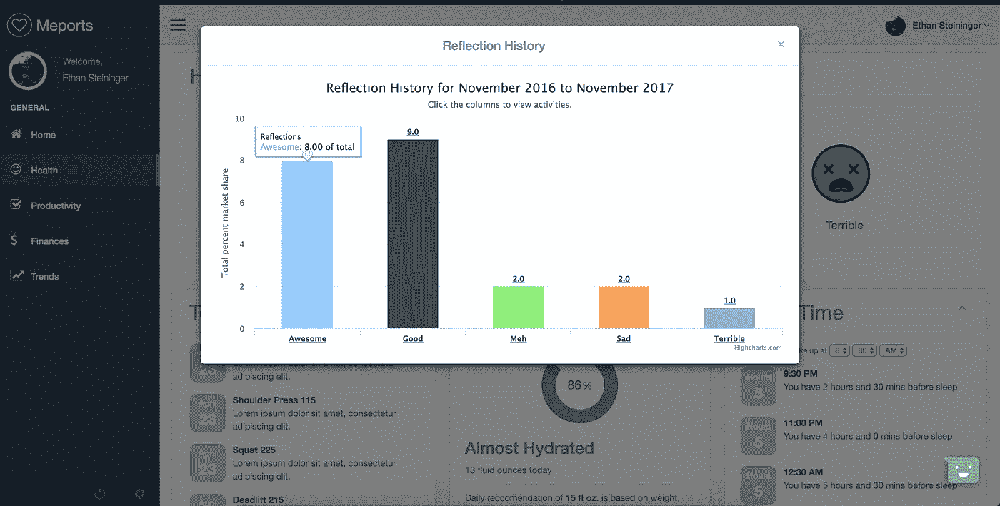
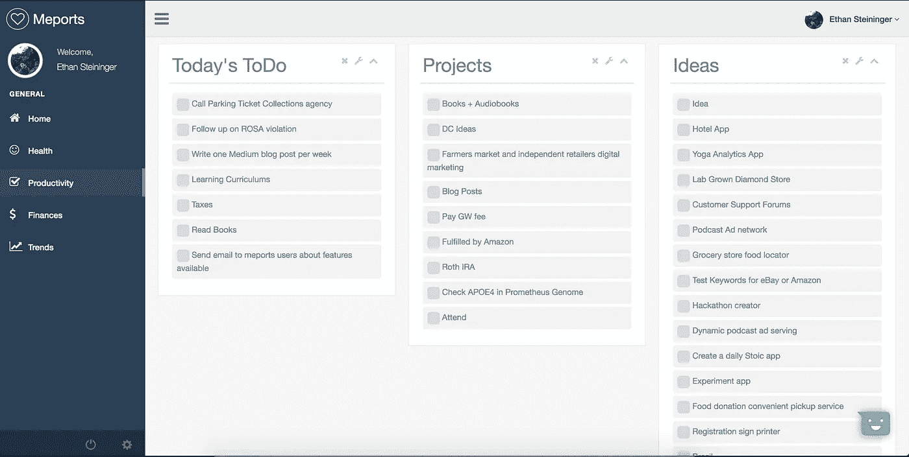
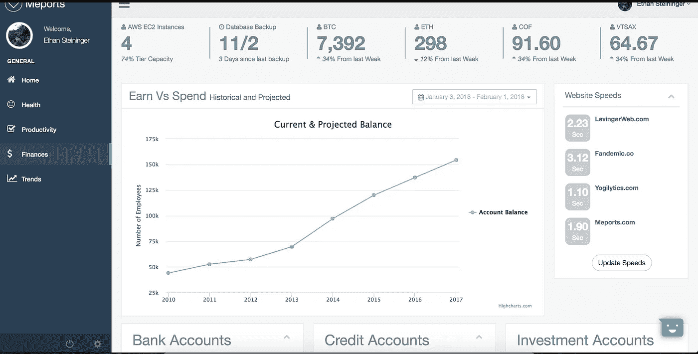
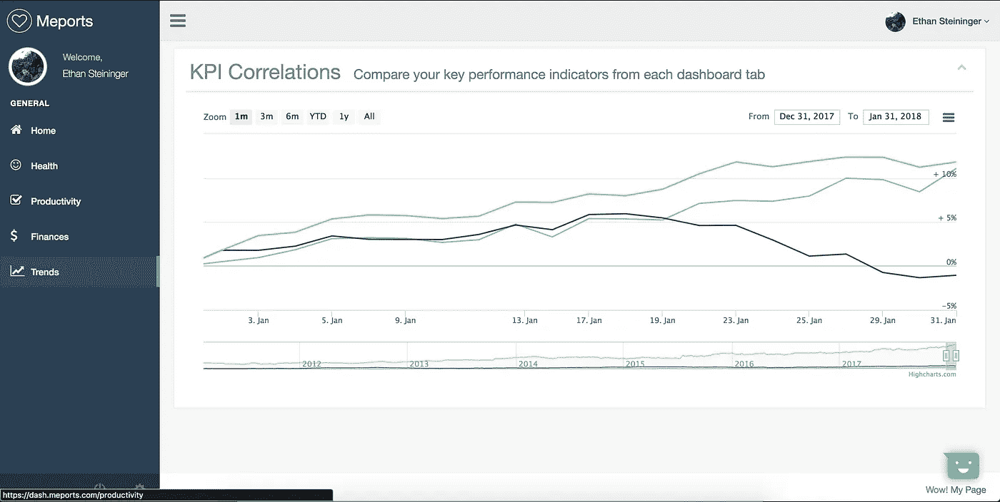

# 自我实验的框架

> 原文：<https://medium.com/hackernoon/should-you-treat-your-life-like-a-business-1dbf506a7919>

关键[绩效](https://hackernoon.com/tagged/performance)指标(KPI)、衡量标准和绩效分析。这些都是在产品生命周期中跟踪和监控的数据点。无论你经营的是一个产品、一家公司还是一项服务，关键是你要确定某种成功的标准/目标，并通过跟踪这些数据点来为之奋斗。实现这一目标的唯一途径是进行科学实验，KPI 是衡量的指标。我们本质上是要执行 [A/B 测试](https://www.optimizely.com/optimization-glossary/ab-testing/)，以确定获得成功和幸福的最佳策略。

有人在他们的个人生活中使用同样的方法吗？你如何定义成功？你如何衡量它？当涉及到像你的生活这样主观的事情时，成功的标准是一个棘手的问题。**我个人发现，我的健康、生产力和财务状况是个人成功和满意度的关键表现指标。**这个概念的灵感来自于蒂姆·菲利斯的一篇博文:[https://Tim . blog/2010/12/18/the-value-of-self-experimentation-plus-extreme-videos-do-not-try-This-in-home/](https://tim.blog/2010/12/18/the-value-of-self-experimentation-plus-extreme-videos-do-not-try-this-at-home/)

所以我假设你和我有相同的成功标准，你有你要衡量的数据点，现在呢？让我们像对待我们的事业一样对待我们的生活，让我们进行测试并衡量它们。

# 假设

科学实验总是从一个假设开始。你愿意花 2-3 周时间来证明/反驳哪些假设？我慢慢地积累了一份可以尝试的东西的清单。我尝试过的和/或在我的“尝试”清单上的一些例子包括不同的爱好、饮食、哲学、工作方式、睡眠时间表和锻炼制度。

为了举例，让我们尝试一个“尝试”实验。让我们沉浸在斯多葛派哲学中两周。我说的是播客，书籍，对话，写任何你能想到的东西，从第一天开始就着迷。

# **测量**

还记得我们讨论过我们的成功标准吗？现在是开始监控和追踪他们的时候了。你有几种方法。一个是很好的老式 Excel 电子表格，但是你必须记录它并且保持一致。有相当多的个人/量化仪表板。[Meports.com](http://Meports.com)是一个仪表板，要求脸书登录只是作为登录的一种方式，它不涉及任何社交/个人数据。我们沉浸在禁欲主义中 2 周，我们如何跟踪我们的 3 个 KPI？

# Meports:量化生活仪表板

Logo

Home dashboard

Meports 收集并帮助跟踪以下 KPI 和子指标(在您自己的实验中可以随意使用):

## 健康

情绪(手动输入)

每日反映(手动输入)

水合作用(水合物 API)

健身程序(手动输入)

睡眠(睡眠时间计算)

Health home

Reflection dashboard

Reflection history

## 生产力

我所有的列表都是通过 Wunderlist API 连接的。这些清单包括:

每天地；天天地

一周的

正在进行的项目

主意

目标

读

试验

## 金融

我拥有的网站的速度测试和 ping 速度(API)

最新数据库备份(API)

我拥有的股票和加密(API)

投资、检查和保存账户状态(Mint web scraper)

预算追踪器(薄荷网刮)

预计收益/w 支出(有一些计算的铸币厂)

You don’t need to see my accounts ;)

# 趋势和结果

两周的实验结束后，简单回顾一下每个 KPI。我构建了一条趋势线，从 3 个类别的每一个类别中选取一个“子指标”(根据假设选择)，并将它们放在一起。

Correlations between one selected KPI in each category over time

你注意到什么趋势了吗？一个实验在 2 周内提高了生产力和健康吗？是时候把它加入我们的日常生活了。

这可能是显而易见的，但轻微的免责声明:我建立了这一点，所以反馈将是惊人的。

这里有一段关于这种体验的简短视频(如果你犹豫是否要免费注册):【https://vimeo.com/241999476T2

如果你好奇的话，这个 web 应用是用一点点 Angular 构建的，前端大部分是普通的 JS/Jquery，后端是 Flask/Python 和 MongoDB 数据库，都位于 Amazon EC2 实例上。

—

那么哪些数据点对你的成功贡献最大呢？