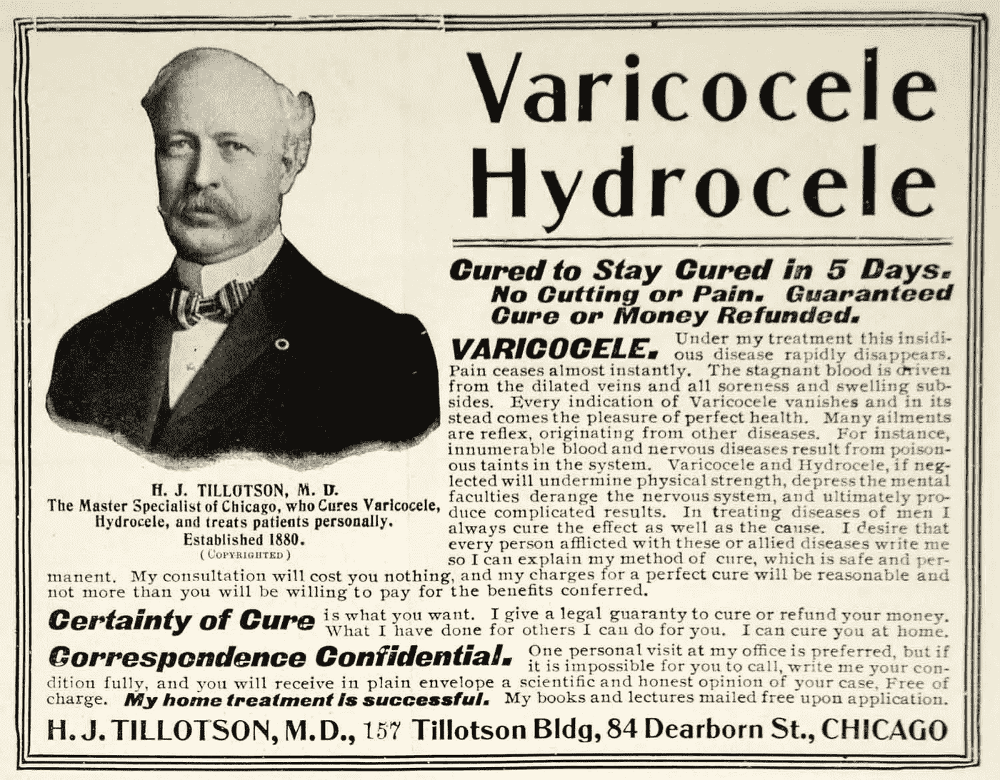

# 显示不告诉

> 原文：<https://medium.com/hackernoon/show-dont-tell-e22d3f3a560>

## 会议宿醉，最佳实践，顽固的同事，以及实际改变一些事情。

参加完一个会议后，你有过类似的经历吗？

> 发布会太棒了。我重返工作岗位，非常渴望分享我从业内精英那里学到的东西，但这就像一头撞上了一堵砖墙。在这里，我提供了很棒的工具和方法——行之有效的东西，在业内完全没有争议——而我的同事完全拒绝了。糟透了。

还是这样？

> 天哪，工作中的经理们是如此反对变革。暗示任何不是他们自己想出来的，他们就当是我编的什么的。他们不在乎吗？他们不想采用最佳实践吗？我在这里感觉如此缺乏挑战和静止。我不再转发博客文章和书籍推荐，也不再建议[某个专家]来这里演讲。

当我参加 DevOps、UX 和敏捷会议时，我发现我遇到的想法很少是在我的舒适区之外的，即使是对我来说是新的想法。我已经准备好点头同意了(嘿，毕竟这些是我的人)。在过去几年参加了 20 多次会议后，我可以报告说我被许多精彩的演讲所震撼。但我不记得有哪一次演讲让我走出了自己的舒适区，让我变得偏执。即使是最尖锐的谈话也往往建立在熟悉的基础上。

这就引出了一个问题…

上一次*你*尝试完全超出你的舒适区的职业智慧是什么时候？一些毫无意义的事情？我说的“舒适区”不是“哦，那真的很难学”，而是“我发现自己不得不克服主要的障碍、偏见、紧张，甚至一点点愤怒和怨恨，但我现在明白了！”

想到了什么？

我会第一个说我很难回答这个问题。这个名单并不长。我在很多领域拓展了自己的知识，但还没有遇到很多重大障碍。

现在考虑*你如何知道你所知道的*。你的信念是建立在多年(甚至几十年)在各种环境中成功使用[一些方法/工具/框架]的基础上的吗？你亲眼见过并让它持续工作了吗？如果不是，你是不是可能在那些*看起来*做得很好的组织中进行模式匹配，并且做了【一些方法/工具/框架】？你是否读过一些作者写的很棒的书，他们似乎采访了许多来自前瞻性公司的聪明人，并有一些第一手经验？或者，也许你从根本上相信这个理论是开明和合理的，这个世界——以及与之相反的变化——只是在追赶。这一切只是“听起来真实”吗？

我将永远记得在酒店的酒吧里把一个著名的会议演讲者逼到墙角，然后听到…

> 我不得不承认，我一方面可以计算出由于我的咨询工作而真正改变的公司的数量。在我的职业生涯中，我能想到一个真正伟大的老板…尽管我是领导的教练。虽然我每天都在谈论伟大的球队，但我一只手也能数出我参加过的伟大球队的数量。会谈让这看起来很容易。但是这太难了。

顺便说一句，她的演讲太棒了。她的博客帖子和书籍也是如此。

概括一下:你怎么知道你知道什么？你上一次走出自己的舒适区是什么时候？

这就是说，你(和我)可能不多/不少于那些似乎抵制我们“非常基本”想法的人。“非常基本”的想法往往比我们愿意表现出来的更有个人抱负。无论对个人、家庭、小团体还是组织来说，改变都很难，而且不管顾问怎么告诉你，改变并不经常“奏效”。当涉及到某些事情时，我们都固执、善变、怀疑。向内看应该是我们的线索。

因此，展示——而不是讲述——的责任在我们身上。

示例:

> 嘿，我知道这可能没有意义，我自己也不太确定，但我真的希望我们能灵活地以这种方式开始我们的下一次努力。同时，这也是我希望在职业生涯中延伸的一种方式。如果成功了，我想我们会观察[一些结果]。如果我们运气好，事情进展顺利，你同意这是一个值得的结果吗？

去做吧。