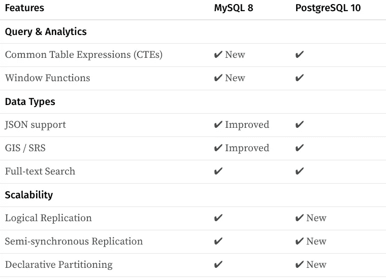
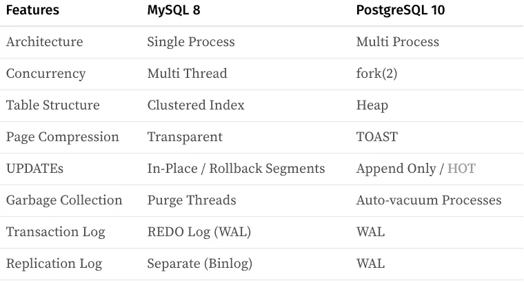
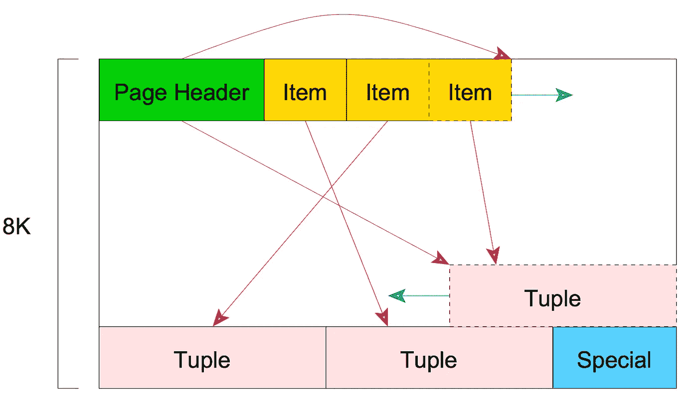
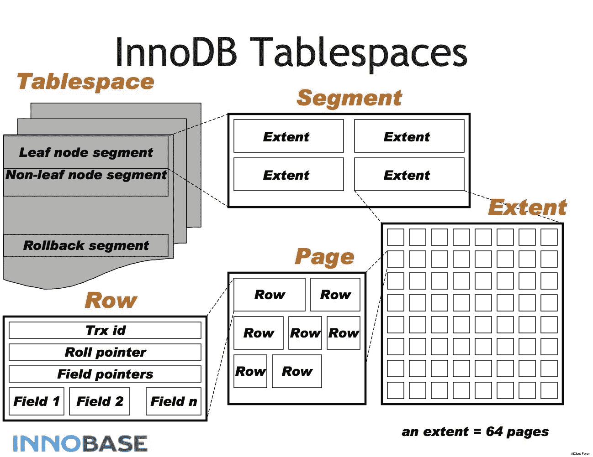
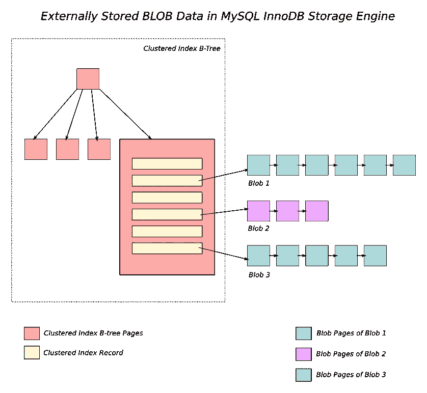

# 摊牌:MySQL 8 vs PostgreSQL 10

> 原文：<https://medium.com/hackernoon/showdown-mysql-8-vs-postgresql-10-3fe23be5c19e>

Photo by [David Marcu](https://unsplash.com/photos/8TJbrQGKFyU)

现在[的 MySQL 8](https://mysqlserverteam.com/whats-new-in-mysql-8-0-generally-available/) 和[的 PostgreSQL 10](https://www.postgresql.org/about/news/1786/) 已经发布，这是一个重新审视这两个主要开源关系数据库如何相互竞争的好时机。

在这些版本之前，普遍的看法是，虽然 Postgres 在功能集和谱系方面更胜一筹，但 MySQL 在大规模并发读/写方面更经得起考验。

但随着最新版本的发布，两者之间的差距已经明显缩小。

# 特征比较

让我们来看看那些我们都爱谈论的“新潮”特征。

过去很容易说 MySQL 最适合在线交易，PostgreSQL 最适合分析过程。但现在不是了。

通用表表达式(cte)和窗口函数是选择 PostgreSQL 的主要原因。但是现在，递归地遍历一个`employees`表并引用同一个表中的`boss_id`，或者在一个排序结果中找到一个中值(或者 50%)在 MySQL 上不再是一个问题。

PostgreSQL 缺乏配置灵活性是[优步转向 MySQL](https://eng.uber.com/mysql-migration/) 的原因。但是现在有了逻辑复制，通过用新版本的 Postgres 创建一个副本并切换到它，零停机升级成为可能。在一个巨大的时序事件表中截断一个陈旧的分区也容易得多。

就功能而言，这两个数据库现在不相上下。

# 区别在哪里？

现在，我们只剩下一个问题——那么，选择一个而不是另一个的理由是什么？

生态系统是其中一个因素。MySQL 有一个充满活力的生态系统，有 MariaDB、Percona、Galera 等变种。以及除 InnoDB 之外的存储引擎，但这也可能令人不知所措。Postgres 的高端选项有限，但随着最新版本推出的新功能，这种情况将会改变。

治理是另一个因素。当甲骨文(或最初的 SUN)收购 MySQL 时，每个人都担心他们会毁了这个产品，但在过去的十年里，情况并非如此。事实上，收购后发展加速了。Postgres 在工作治理和协作社区方面有着坚实的历史。

**架构基础**不会经常改变，值得重温一下，因为这些现在没有被详细讨论。

这里有一个复习:

## 进程与线程

当 [Postgres 派生出一个子进程](https://www.postgresql.org/docs/10/static/tutorial-arch.html)来建立一个连接时，每个连接会占用[10mb。与 MySQL 的每连接线程模型相比，内存压力更大，在 64 位平台上，线程](https://www.citusdata.com/blog/2017/05/10/scaling-connections-in-postgres/)的默认[堆栈大小为 256KB。(当然还有线程本地排序缓冲区等。使这种开销不那么重要，如果不是可以忽略的话，但仍然。)](https://dev.mysql.com/doc/refman/8.0/en/server-system-variables.html#sysvar_thread_stack)

尽管[写时复制](https://en.wikipedia.org/wiki/Copy-on-write)保存了父进程的一些共享的、不可变的内存状态，但是当您有 1000 多个并发连接时，作为基于进程的架构的基本开销是很大的，并且它可能是容量规划的最重要因素之一。

也就是说，假设您在 30 台服务器上运行一个 Rails 应用程序，每台服务器有 16 个 CPU 内核和 32 个 Unicorn workers，那么您就有 960 个连接。可能只有不到 0.1%的应用程序会达到这个规模，但这是需要记住的。

## 聚集索引与堆表

[聚集索引](https://docs.microsoft.com/en-us/sql/relational-databases/indexes/clustered-and-nonclustered-indexes-described?view=sql-server-2017)是一种表结构，其中的行直接嵌入到其主键的 B 树结构中。(非聚集的)堆是一种常规的表结构，由独立于索引的数据行填充。

对于聚集索引，当您通过主键查找记录时，单个 I/O 将检索整行，而非聚集索引总是需要至少两个 I/O 才能进行引用。由于外键引用和连接将触发主键查找，这种影响可能很大，而主键查找占了绝大多数查询。

聚集索引的一个理论上的缺点是，当使用辅助索引进行查询时，它需要两倍的树节点遍历，因为您首先扫描辅助索引，然后遍历聚集索引，聚集索引也是一棵树。

但是考虑到现代的[惯例](https://en.wikipedia.org/wiki/Convention_over_configuration)将自动递增的整数作为主键——它被称为[代理键](https://en.wikipedia.org/wiki/Surrogate_key)—[几乎总是希望拥有聚集索引](https://www.mssqltips.com/sqlservertutorial/3209/make-sure-all-tables-have-a-clustered-index-defined/)。如果您做了大量的`ORDER BY id`来检索最近的(或最老的)N 条记录，情况就更是如此，我相信这适用于大多数记录。

> [1]顺便说一下，将 UUID 作为主键是一个糟糕的想法——密码随机性完全是为了消除引用的局部性而设计的，因此会带来性能损失。

Postgres 不支持聚集索引，而 MySQL (InnoDB)不支持堆。但是不管怎样，如果你有大量的内存，这种差别应该是很小的。

## 页面结构和压缩

Postgres 和 MySQL 都有基于页面的物理存储。(8KB 对 16KB)

From [Introduction to PostgreSQL physical storage](http://rachbelaid.com/introduction-to-postgres-physical-storage/)

在 PostgreSQL 上，页面结构看起来像左边的图像。

它包含了一些我们在这里不打算讨论的标题，但是它们包含了关于页面的元数据。头后面的条目是一个由指向元组或数据行的`(offset, length)` 对组成的数组标识符。请记住，在 Postgres 上，同一记录的多个版本可以以这种方式存储在同一页面中。

MySQL 的表空间结构类似于 Oracle 的表空间结构，它有多个层次，包括段、范围、页和行。

它还有一个单独的撤销段，称为“回滚段”与 Postgres 不同，MySQL 将同一记录的多个版本保存在单独的区域。

一行必须适合两个数据库的单个页面，这意味着一行必须小于 8KB。(在 MySQL 上，一个页面至少要有 2 行，恰好是 16KB / 2 = 8KB)

那么当一个列中有一个大型 JSON 对象时会发生什么呢？

Postgres 使用 [TOAST](https://wiki.postgresql.org/wiki/TOAST) ，一个专用的影子表存储。当且仅当行和列被选择时，大对象被拉出。换句话说，一大块黑盒不会污染你宝贵的缓存内存。它还支持烘烤物体上的压缩。

MySQL 有一个更复杂的功能，称为[透明页面压缩](https://dev.mysql.com/doc/refman/8.0/en/innodb-page-compression.html)，这要感谢高端 SSD 存储供应商 [Fusion-io](https://en.wikipedia.org/wiki/Fusion-io) 的贡献。它是专为更好地与固态硬盘配合使用而设计的，固态硬盘的写入量与设备的寿命直接相关。

MySQL 上的压缩不仅适用于离页大对象，还适用于所有页面。这是通过在一个[稀疏文件](https://en.wikipedia.org/wiki/Sparse_file)中打孔来实现的，现代文件系统如 [ext4](https://en.wikipedia.org/wiki/Ext4) 或 [btrfs](https://en.wikipedia.org/wiki/Btrfs) 都支持这个文件系统。

有关更多详细信息，请参见:[fusion io 上新的 MariaDB 页面压缩带来的显著性能提升](https://mariadb.org/significant-performance-boost-with-new-mariadb-page-compression-on-fusionio/)

## 更新开销

另一个经常被忽略的特性是更新，它对性能有很大的影响，也可能是最有争议的话题。

这是优步放弃 Postgres 的另一个原因，这引起了许多 Postgres 倡导者的反驳。

*   [MySQL 可能适合优步，但不适合你](https://dzone.com/articles/on-ubers-choice-of-databases)
*   [对优步的 PostgreSQL 响应(PDF)](http://thebuild.com/presentations/uber-perconalive-2017.pdf)

两者都是 [MVCC](https://en.wikipedia.org/wiki/Multiversion_concurrency_control) 数据库，为[隔离](https://en.wikipedia.org/wiki/Isolation_(database_systems))保存多个版本的数据。

为此，Postgres 将旧数据保留在堆中，直到清空，而 MySQL 将旧数据移动到一个称为回滚段的独立区域。

在 Postgres 上，当您尝试更新时，必须复制整行，以及指向它的索引条目。这部分是因为 Postgres 不支持聚集索引，从索引引用的行的物理位置不是由逻辑键抽象出来的。

为了解决这个问题，Postgres 使用 [Heap Only Tuples (HOT)](http://www.interdb.jp/pg/pgsql07.html) 在可能的情况下不更新索引。但是如果更新足够频繁(或者如果一个元组很大)，元组的历史可以很容易地流出 8KB 的页面大小，跨越多个页面并限制该特性的有效性。修剪和/或碎片整理的时间取决于试探法。此外，将 [fillfactor](https://www.postgresql.org/docs/10/static/sql-createtable.html#SQL-CREATETABLE-STORAGE-PARAMETERS) 设置为小于 100 会降低空间效率——这是一个艰难的权衡，在创建表时不应该担心。

这种限制甚至更深；因为索引元组没有任何关于事务的信息，所以在 9.2 之前，很久以来都不可能支持[仅索引扫描](https://use-the-index-luke.com/sql/clustering/index-only-scan-covering-index)。这是最古老、最重要的优化方法之一，受到所有主流数据库的支持，包括 MySQL、Oracle、IBM DB2 和 Microsoft SQL Server。但即使是最新版本，当有一堆更新在[可见性映射](http://www.interdb.jp/pg/pgsql06.html#_6.2.)中设置脏位时，Postgres 也无法完全支持仅索引扫描，并且经常在我们不希望的时候选择 Seq Scan。

在 MySQL 上，更新就地进行，旧的行数据存储在一个称为回滚段的独立区域中。结果是您不需要真空，提交非常快，而回滚相对较慢，这对大多数用例来说是一个更好的折衷。

也是[足够聪明](https://www.percona.com/blog/2011/01/12/innodb-undo-segment-siz-and-transaction-isolation/)尽快清洗历史。如果事务的隔离级别设置为 **READ-COMMITTED** 或更低，则当语句完成时，历史将被清除。

交易历史的大小不影响主页。分裂不是问题。因此，MySQL 的整体性能更好、更可预测。

## 碎片帐集

Postgres 上的 VACUUM 是非常昂贵的，因为它在主堆区域中工作，产生了直接的资源争用。这感觉就像编程语言中的垃圾收集——它碍手碍脚，让你随意停顿。

[为拥有数十亿条记录的表配置 autovacuum](https://www.citusdata.com/blog/2016/11/04/autovacuum-not-the-enemy/) 仍然是一个挑战。

MySQL 上的清除也可能很繁重，但是因为它在单独的回滚段中使用专用线程运行，所以不会对读取并发性产生任何负面影响。膨胀的回滚段降低速度的可能性要小得多，即使使用默认设置。

一个拥有数十亿条记录的繁忙的表不会导致 MySQL 上的历史膨胀，并且诸如存储上的文件大小和查询性能之类的事情是非常可预测和稳定的。

## 日志和复制

Postgres 对于交易历史有一个单一的真实来源，称为[提前写日志(WAL)](http://www.interdb.jp/pg/pgsql09.html) 。它还用于复制，名为逻辑复制的新功能可以动态地将二进制内容解码为更容易理解的逻辑语句，从而允许对数据进行细粒度控制。

MySQL 维护两个独立的日志:1。用于崩溃恢复的 InnoDB 特定的[重做日志](https://dev.mysql.com/doc/refman/8.0/en/innodb-redo-log.html)，以及 2 .[用于复制和增量备份的二进制日志](https://dev.mysql.com/doc/refman/8.0/en/binary-log.html)。

与 Oracle 一样，InnoDB 上的重做日志是一个免维护的[循环缓冲区](https://en.wikipedia.org/wiki/Circular_buffer)，不会随着时间的推移而增长，只会在启动时以固定的大小创建。这种设计保证在物理设备上保留连续的区域，从而提高性能。较大的重做日志产生较高的性能，但代价是从崩溃中恢复的时间。

Postgres 增加了新的复制特性，我称之为平局。

# TL；速度三角形定位法(dead reckoning)

令人惊讶的是，事实证明，普遍的看法仍然成立；MySQL 最适用于在线交易，PostgreSQL 最适用于仅附加的分析过程，如数据仓库。

> [2]当我说 Postgres 对分析很有帮助时，我是认真的。如果您不知道 [TimescaleDB](https://blog.timescale.com/timescaledb-vs-6a696248104e) ，它是 PostgreSQL 之上的一个包装器，允许您每秒插入 100 万条记录，每台服务器 1000 多亿行。疯狂的事情。难怪[亚马逊选择 PostgreSQL 作为红移](https://docs.aws.amazon.com/redshift/latest/dg/c_redshift-and-postgres-sql.html)的基础。

正如我们在本文中看到的，Postgres 的大部分复杂性源于其仅附加的、过度冗余的堆架构。

Postgres 的未来版本可能需要对其存储引擎进行重大改进。你不必相信我的话——这实际上是在官方维基上讨论的[，这表明是时候从 InnoDB 带回一些好的想法了。](https://wiki.postgresql.org/wiki/Future_of_storage)

人们一次又一次地说 MySQL 正在追赶 Postgres，但这一次，潮流变了。

*如果你想阅读更多这样的内容，请访问* [*Dumper 博客*](https://blog.dumper.io/) *并订阅邮件列表。也可以在 Twitter 上* [*关注我*](https://twitter.com/@kenn) *。除非您 100%确定您的备份脚本正在运行，否则请查看* [*转储器*](https://dumper.io/) *，异地备份即服务。*