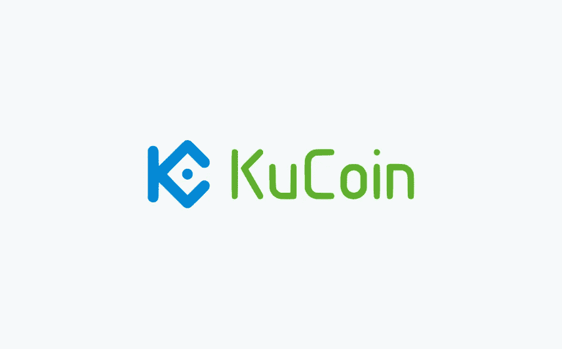
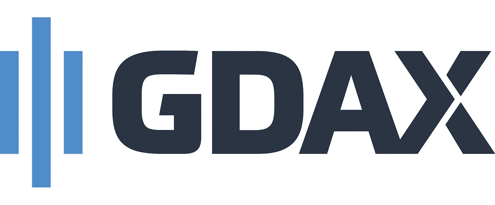
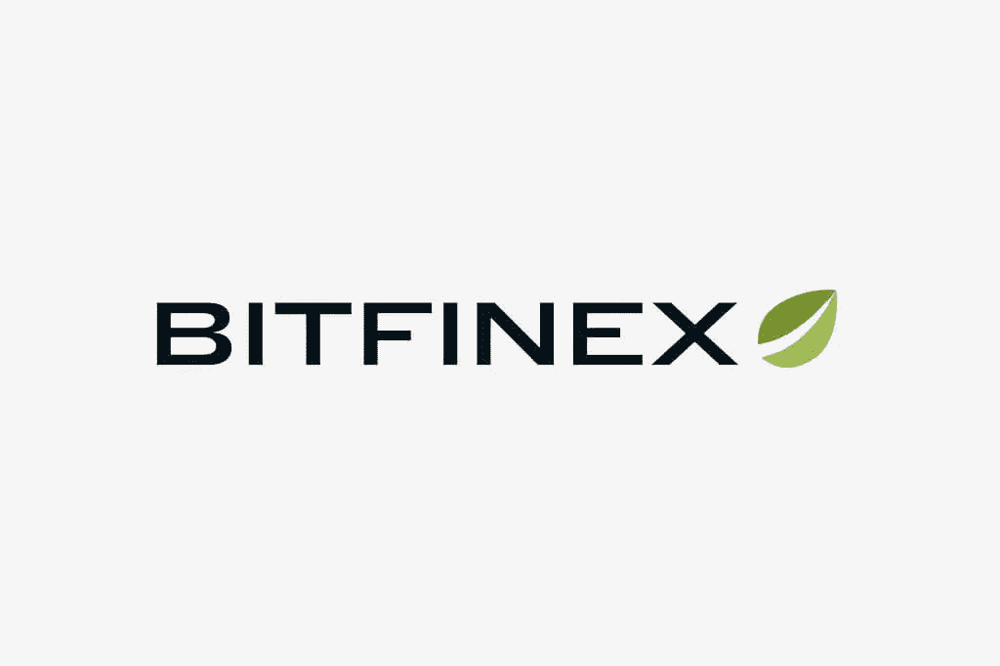

# Shrimpy:发展中的一周[6 月 4 日]

> 原文：<https://medium.com/hackernoon/shrimpy-a-week-in-development-june-3-526549019e59>

欢迎来到 dev 博客的第一期！这将用于详细说明将在每周开发的功能。然后，您可以跟踪我们的进展，并根据我们每周推出的功能提出改进 Shrimpy 的方法。那么，我们开始吧。

# 交换

我们将根据用户的反馈推出一些新的交流方式。我们感谢每一个为他们的选择交换投票的人。有几个脱颖而出成为明显的赢家。

## 库科恩

你们真的想要库科恩。关于这件事，没有什么可说的了。每次求交流建议，都有人喊 Kucoin！他们的大量资产选择和对 NEP 5 令牌的支持将为我们的用户提供更大范围的资产，他们可以将这些资产包括在他们的投资组合中。

## GDAX /比特币基地 Pro

这一点也得到了高度评价。尽管它没有太多资产，但我们相信这对我们来说可能是一个战略选择。比特币基地在美国市场占有很大份额。他们的许多用户可能不会使用像币安或 Bittrex 这样更复杂的交易所。这为我们提供了一个抓住这些喜欢 Shrimpy 应用程序的用户的机会！

## Bitfinex

除了巨大的交易量，Bitfinex 多年来一直是加密领域的重要参与者。他们的声誉、用户基础和产品将它作为 Shrimpy 支持的一个很好的选择。

## 波洛涅克斯

一些用户可能已经注意到了我们在 Poloniex 上的问题。在反复联系支持部门(我们没有收到任何回复)，尝试解决他们的问题，并不断尝试使其工作后，我们决定淘汰 Poloniex。我们理解这对你来说可能很沮丧。这对我们来说无疑是令人沮丧的。我希望你能在与我们的另一次交流中找到一个新家。

# 多重交换

除了增加更多的交易所，我们意识到如果我们的用户想在每个交易所都有 5 个不同的账户是不切实际的。我们知道你喜欢虾，但这可能有点过了。为了解决这个问题，我们将开始在一个账户上推出对多个交易所的支持。这样，你就再也不需要为了在另一个交易所查看你的持有情况而转换账户了。

# 早期访问推荐计划

我们将开始推出一项新计划。我们称之为“早期访问推荐计划”(可能会更改)。它的工作方式很简单。我们将发布新功能，但它们只对该计划中的人员可用。放心吧！一两周之后，每个人都可以使用这些功能。因此，这个程序中的用户可以更早地访问 Shrimpy 上的所有特性。您成为早期访问推荐计划成员的方式是推荐朋友、参与社区和帮助 Shrimpy 团队。

# 用户界面更新

为了支持这些变化与多个交换，部分的 Shrimpy 将得到一个面貌提升。如果你发现有什么不对劲的地方，不要惊慌！它可能在另一个地方，或者我们可能正在为将来更大的检修而调整。

## 设置

设置标签看起来很糟糕。这将被更新，但我们也将移动输入 API 键的能力，并在此选项卡中添加多个交换。这样，设置将成为您所有 exchanges 的全局设置。我们可能会在未来改变这一点，但这是让我们每个账户运行多个交易所的简单的第一步。

## 分配选项卡

我们将从分配选项卡中删除设置 API 键的功能。这将被重新定位到设置选项卡。可能还会对按钮、如何保存分配以及其他小的调整进行小的更新。

## 第一次流动

第一次登录 Shrimpy 应用程序时，这个过程并不好。有一堆空白标签，它可能看起来有点空。我们将改变流程，以便新用户在第一次进入时可以更轻松地浏览应用程序。

# 组

正如我们在[团队帖子](/@ShrimpyApp/shrimpy-team-introduction-c2cd33f81e34)中所讨论的，我们将为 Shrimpy 团队增加两名新的全职成员。这意味着我们将花时间让他们熟悉我们的系统，并确保他们适应。再一次，当你在 Telegram、Discord 或任何其他社交媒体上看到他们帮助人们时，不要忘记欢迎他们。

# 数据收集

我们将从交易所和其他第三方收集更多数据。这对我们的用户来说可能不明显，但从长远来看，这将有助于改善我们的服务。

# 博客

请为下一篇博文留下建议！我们想在本周找到一些新的话题。

不要忘记查看 [Shrimpy 网站](https://www.shrimpy.io/)，关注我们在 [Twitter](https://twitter.com/ShrimpyApp) 和[脸书](https://www.facebook.com/ShrimpyApp)的更新，并向我们在[Telegram](https://t.me/ShrimpyGroup)&[Discord](https://discord.gg/gXyy95y)上的惊人、活跃的社区提出任何问题。

*捕虾队*