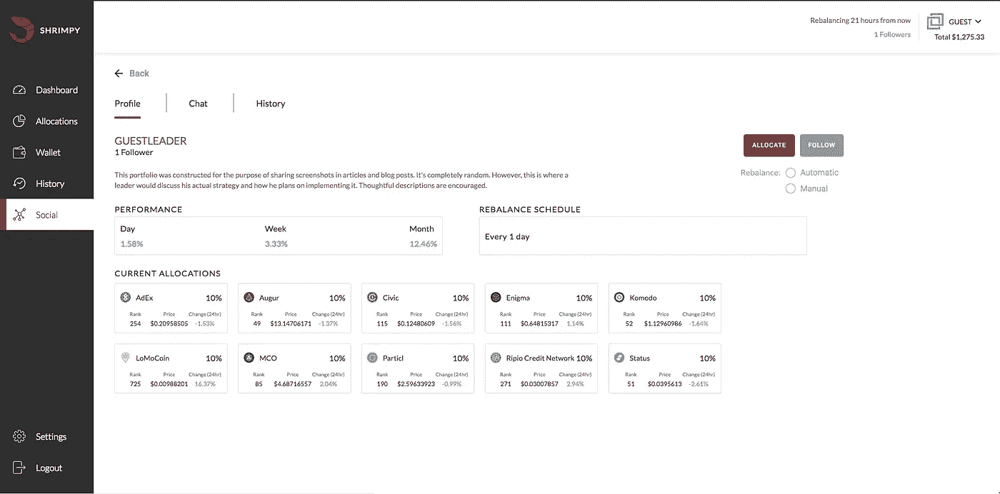
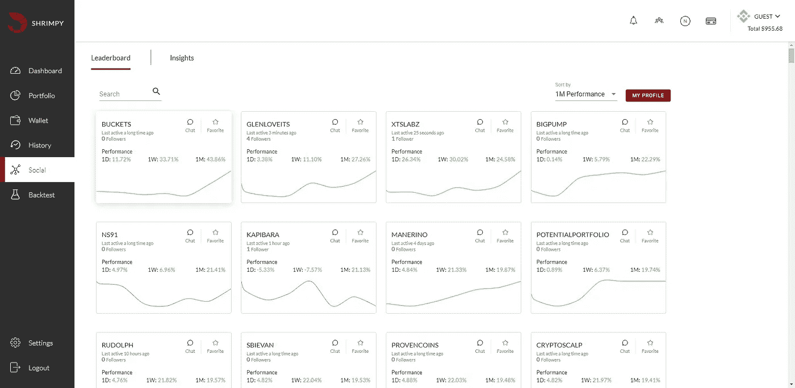

# Shrimpy 为 Crypto 添加社交组合

> 原文：<https://medium.com/hackernoon/shrimpy-adds-social-portfolios-for-crypto-840c4bd0c552>

选择哪些资产应该在您的加密组合中是复杂的。通过 [Shrimpy](https://www.shrimpy.io) ，我们已经创建了最简单的平台来选择资产、分配多样化的投资组合和管理您的加密货币。今天，我们宣布将社交作品集集成到 Shrimpy 应用程序中。查看平台上最受欢迎的分配，关注行业领导者，并通过与社区合作来制定您的战略。挑选资产永远不会是一样的。

This is what you see when you click on a leader in the Shrimpy Social tab. Along with being able to see the leaders allocations and rebalance period, you can also chat with the leader and see the history of changes they have made to their portfolio.

# 引入以下分配

遵循分配是一个简单的想法。类似于你可以跟踪一个人的推文，你最终将能够跟踪你最喜欢的加密用户的分配。然后，只需轻轻一点，你就可以实施与这些领导者相同的策略。这将分配与领导者相同的投资组合，并跟踪他们未来的行动。像行业领导者一样选择资产正被简化为一次点击。

## 追随者

This is a view of the Shrimpy Social tab. Each card is a leader who is on the same exchange as you. You can follow and unfollow any leader at any time.

追随者将可以访问一个强大的门户网站，在那里他们可以浏览使用 Shrimpy 平台的领导者。关注者可以看到这些有经验的用户实施的分配和策略。当他们追随的领导者改变他们的策略时，追随者将能够实时看到这些变化。

## 领袖

Shrimpy 将为领导者提供一个扩大受众、建立信任和实施成功战略的平台。向关注者传达这些策略和更新将比以往更加容易。

# 用 Shrimpy 赚钱

这种领导者和追随者的动态提供了两个世界的最佳状态。由于做出了更好的资产选择，跟随者将能够增加他们的投资组合。作为回报，追随者将每月收取少量费用，这是为这些见解付出的小小代价。

另一方面，领导者将能够通过追随者增加他们的资金。Shrimpy 将为他们留住的每一个追随者支付领导者。增加你的追随者直接转化为你口袋里更多的钱。

不仅领导会拿到钱，推荐人也会拿到钱。通过推荐代码注册的任何用户支付的费用的一部分将在注册后的前 3 个月支付给推荐人。

在下面的文章中阅读更多关于用 Shrimpy 赚钱的内容！

 [## 如何用 Shrimpy 赚钱

### 本文将探讨任何人如何在 Shrimpy 应用程序上赚钱。注册是免费的，很容易获得…

medium.com](/@ShrimpyApp/how-to-earn-money-with-shrimpy-fb21018c664a) 

# 社会投资组合的未来

这些并不是我们为社交平台规划的唯一功能。当涉及到改善资产选择体验时，加密领域有大量未开发的潜力。当我们开始开启社交网络的未来时，我们需要你的帮助。让我们知道哪些方面引起了你的共鸣。分享你希望看到的能让你的体验更好的改变。

# 收入

Shrimpy 终于有机会赚钱了。我们赚的钱越多，我们就可以用更多的钱把 Shrimpy 做得更好。所以，一定要邀请你的朋友！通过成为社交功能的一员来帮助我们，并领导一个您自己的小组。

# 附加阅读

 [## 加密货币的投资组合再平衡

### 投资组合再平衡是投资者使用了几十年的策略。首先，投资者必须确定如何…

hackernoon.com](https://hackernoon.com/portfolio-rebalancing-for-cryptocurrency-7a129a968ff4)  [## 再平衡与 HODL:技术分析

### 这项研究的目的是描绘一幅公平的画面，说明再平衡作为一种策略如何符合霍德林。为了…

hackernoon.com](https://hackernoon.com/rebalance-vs-hodl-a-technical-analysis-6f341b0db9cd) 

别忘了查看一下 [Shrimpy 网站](https://www.shrimpy.io/)，在 [Twitter](https://twitter.com/ShrimpyApp) 和[脸书](https://www.facebook.com/ShrimpyApp)上关注我们的更新，并在[Telegram](https://t.me/ShrimpyGroup)&[Discord](https://discord.gg/gXyy95y)上向我们令人惊叹的活跃社区提问。

*捕虾队*