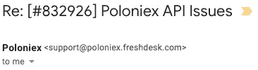

# 史瑞比给了波洛涅克斯第二次机会

> 原文：<https://medium.com/hackernoon/shrimpy-gives-poloniex-a-second-chance-b462b8c41d5a>

当你想到救赎故事时，波洛涅克斯可能不是第一个想到的…

除非你用 Shrimpy。

早期的 [Shrimpy](https://www.shrimpy.io/) 采用者记得 Poloniex 是一个受支持的交易所的时候。这是我们与 Shrimpy 的第一个版本一起发布的第一个交换。有一段时间，一切都很顺利。几个月后，Poloniex APIs 开始出现问题。交易失败，他们的服务器长时间没有响应，数据丢失。[我们别无选择，只能停止支持。](https://hackernoon.com/shrimpy-a-week-in-development-june-3-526549019e59)

> 然后，奇迹出现了。Circle 购买了 Poloniex。

我们开始再次注意到他们 API 的更新。有一次，我们甚至得到了一张支持票的答案！我们起初认为这是海市蜃楼，但结果只是我们自己的怀疑。波洛涅克斯正在取得进展。

这些推动交易所前进的尝试给了我们希望，有一天我们能够再次在 Poloniex 上实现再平衡。

今天就是那一天。

Shrimpy 给了 Poloniex 第二次机会。API 已经重新启用，Shrimpy 用户可以再次开始在 Poloniex 上管理他们的投资组合。

> 和我们一起重温这位老朋友。尝试重新平衡，让我们知道您使用 Poloniex 的体验！

别忘了查看一下 [Shrimpy 网站](https://www.shrimpy.io/)，在 [Twitter](https://twitter.com/ShrimpyApp) 和[脸书](https://www.facebook.com/ShrimpyApp)上关注我们的更新，并在[Telegram](https://t.me/ShrimpyGroup)&[Discord](https://discord.gg/gXyy95y)上向我们令人惊叹的活跃社区提问。

请发表评论，让我们知道您对资产列入黑名单的想法！

捕虾队