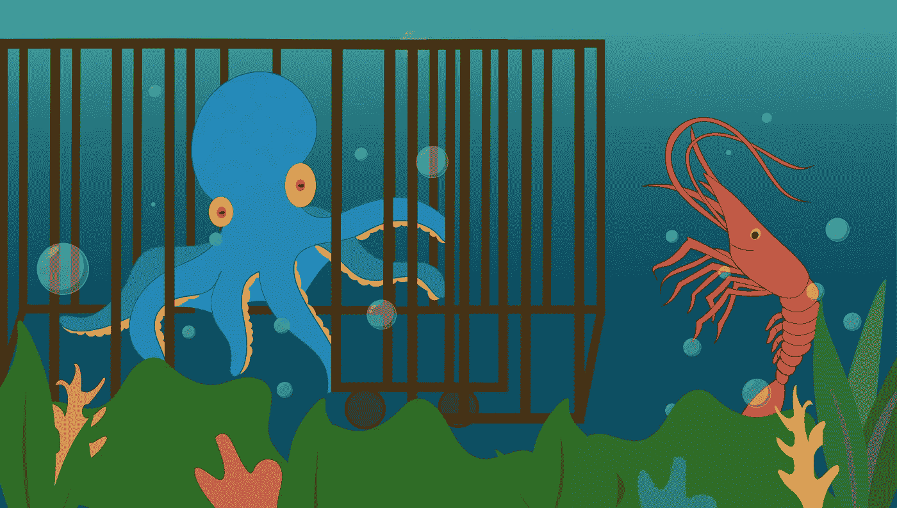

# 史林皮释放了北海巨妖

> 原文：<https://medium.com/hackernoon/shrimpy-releases-the-kraken-b1929cc074ce>

当涟漪扩散到整个海洋时，地面都在震动。空气破裂，像雾号在远处的深渊中咆哮。

> “我做了什么”，一只小虾问自己。

那隆隆声是史莱姆皮释放北海巨妖的声音。

由于我们的主要关注点是美国市场，因此将首批加密交易所之一纳入其中是完全正确的。北海巨妖成立于 2011 年，几乎和比特币市场一样古老。

更不用说，没有 Shrimpy 很难“航行公海”。这显然是天作之合。

除了海平面上的比赛，北海巨妖还提供了许多其他对虾用户群很重要的好处。

*   流动性增加
*   美元/加元/欧元/英镑/日元交易对
*   通过电汇存入美元

Shrimpy 现在已经发布了对北海巨妖交易所的支持！

> 使用北海巨妖的施莱姆皮来管理你的整个投资组合。

# 附加阅读

 [## 加密货币的投资组合再平衡

### 投资组合再平衡是投资者使用了几十年的策略。首先，投资者必须确定如何…

hackernoon.com](https://hackernoon.com/portfolio-rebalancing-for-cryptocurrency-7a129a968ff4)  [## 再平衡与 HODL:技术分析

### 这项研究的目的是描绘一幅公平的画面，说明再平衡作为一种策略如何符合霍德林。为了…

hackernoon.com](https://hackernoon.com/rebalance-vs-hodl-a-technical-analysis-6f341b0db9cd) 

不要忘记在[推特](https://twitter.com/ShrimpyApp)和[脸书](https://www.facebook.com/ShrimpyApp)上关注我们的更新，并在[电报](https://t.me/ShrimpyGroup) & [不和谐](https://discord.gg/gXyy95y)上向我们令人惊叹的活跃社区提问。

*捕虾队*