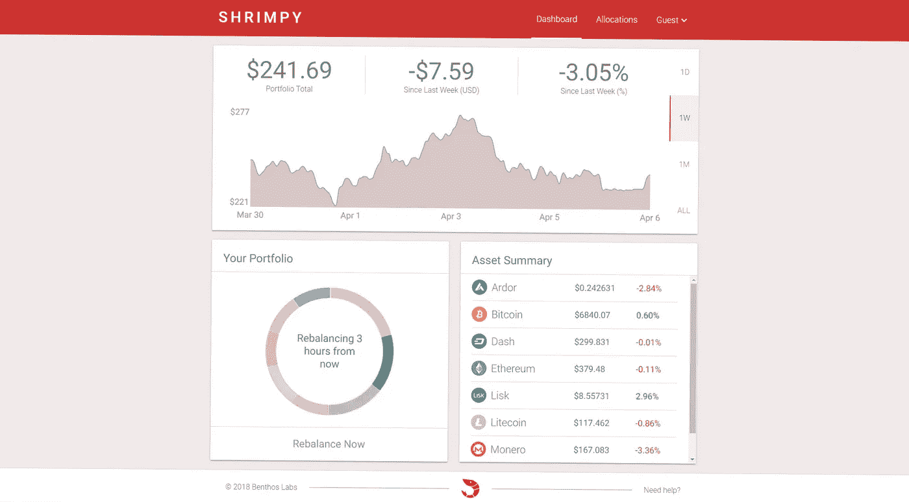
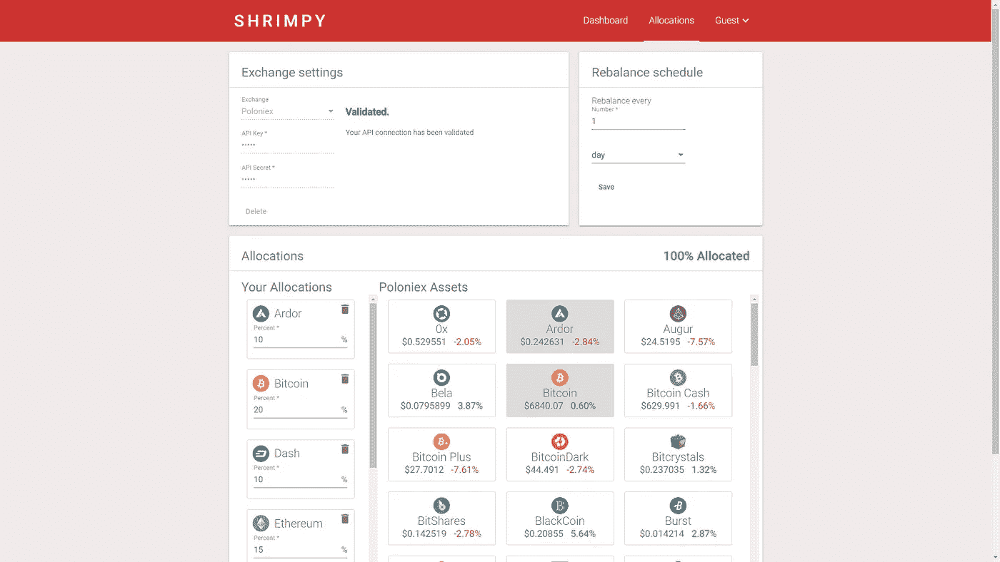

# Shrimpy 的演示展示了加密投资的未来

> 原文：<https://medium.com/hackernoon/shrimpys-demo-shows-the-future-of-crypto-investing-1e7ba772c061>

在 Shrimpy，我们有一个远大的愿景。我们将改变人们投资加密货币的方式。这将通过提供一个免费的平台来实现，在这个平台上你可以轻松地存放、多样化和管理你的加密组合。投资加密货币将不再局限于懂技术的人。每个希望利用这一新兴资产类别的人都将能够在几分钟内轻松创建一个有竞争力的投资组合。然后，使用简单的策略，如再平衡，你的投资组合将能够产生比买入并持有更好的回报。这将通过打破进入加密市场的壁垒来促进加密货币的采用。

从我们的其他博客文章中了解更多关于再平衡的信息:

 [## 加密货币的投资组合再平衡

### 投资组合再平衡是投资者使用了几十年的策略。首先，投资者必须确定如何…

hackernoon.com](https://hackernoon.com/portfolio-rebalancing-for-cryptocurrency-7a129a968ff4)  [## 再平衡与 HODL:技术分析

### 这项研究的目的是描绘一幅公平的画面，说明再平衡作为一种策略如何符合霍德林。为了…

medium.com](/@ShrimpyApp/rebalance-vs-hodl-a-technical-analysis-6f341b0db9cd) 

# 多虾的

Shrimpy 将是投资加密货币最简单的方式。我们可能还没有到那一步，但我们正在接近。目前的网站允许您重新平衡和管理您的投资组合，这些投资组合目前在第三方交易所维护。通过一个简单的点击界面，您可以快速选择投资组合的分配，选择重新平衡期，并监控一段时间内的表现。最棒的是 Shrimpy 可以免费使用！

## 班长

进入 Shrimpy 演示时，您首先会注意到的是干净的仪表板。这是主要的标签页，你大部分时间都在这里监控你的投资组合。最上面的卡片是一段时间内的投资组合价值，可以在卡片的右边选择。左下角的卡片会显示你的投资组合，在鼠标悬停时，会显示你的投资组合中每种资产所占的百分比。当您想要重新平衡时，单击“立即重新平衡”按钮，立即重新平衡您的投资组合。最后，在右下角，您将能够看到您的资产摘要。这只是你投资组合中当前资产的列表，以及它们在过去 24 小时的表现。

## 分配

Shrimpy 应用程序的下一个主要组件是 allocations 选项卡。这提供了一种快速选择投资组合中需要哪些资产的方法。通过访问数百个不同的选项，分配投资组合就像点击资产一样简单。这些选择将在下次重新平衡时根据指定的百分比立即进行分配。目前，左上角的卡是你插入你的交易所和必要的钥匙来代表你进行交易的地方。在右上方，有一张卡片，用于指定您希望重新平衡的频率。最后，底部的卡片显示了你选择的所有配置，以及每种资产在你的投资组合中所占的比例。只需选择垃圾桶从“您的分配”中删除资产，并单击右侧的任何资产即可添加一个资产。请记住保存您的更改！

# 试试吧！

现在您已经了解了文本教程，请亲自尝试一下演示！

 [## Shrimpy 演示

### 今天就用 Shrimpy 重新平衡你的投资组合！

www.shrimpy.io/demo](https://www.shrimpy.io/demo) 

Shrimpy 可以提供很多内容，[注册](https://www.shrimpy.io/)以便您可以了解我们如何改变人们投资加密货币的方式。

不要忘记查看 [Shrimpy 网站](https://www.shrimpy.io/)，关注我们在 [Twitter](https://twitter.com/ShrimpyApp) 和[脸书](https://www.facebook.com/ShrimpyApp)的更新，并向我们在[Telegram](https://t.me/ShrimpyGroup)&[Discord](https://discord.gg/gXyy95y)上的惊人、活跃的社区提出任何问题。

留下你的评论，让我们知道你的平衡经验！

*捕虾队*